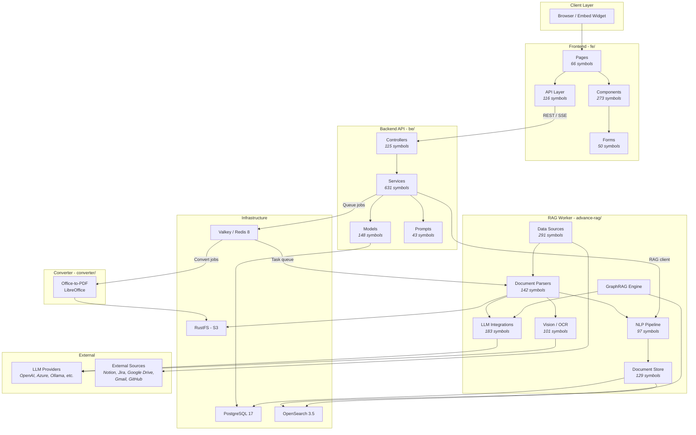
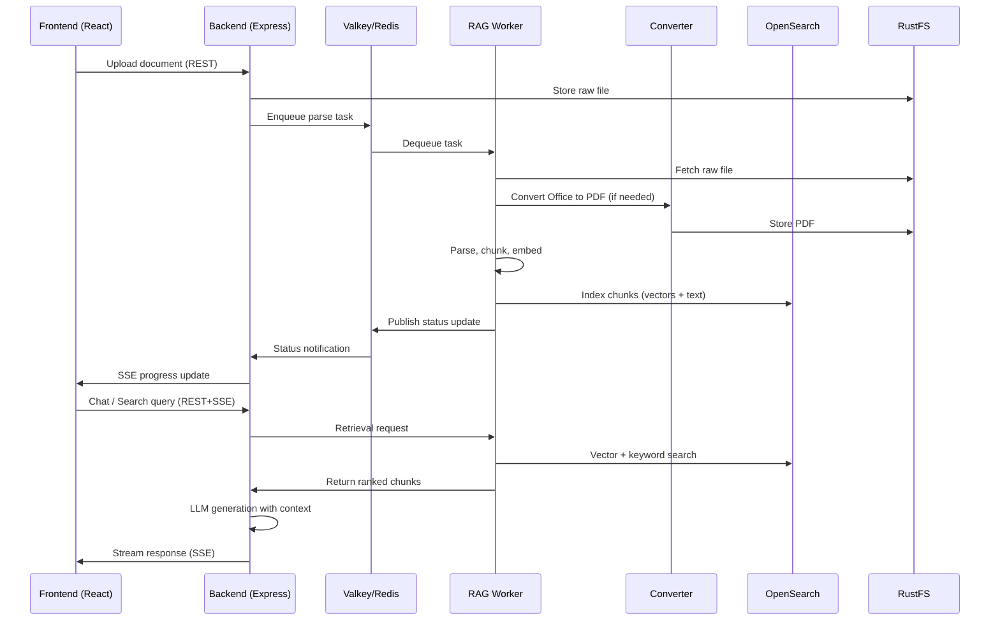

# B-Knowledge Architecture

> Auto-generated from GitNexus knowledge graph (13,896 symbols, 300 execution flows, 59 functional clusters).

## Overview

B-Knowledge is an open-source platform for centralized AI Search, Chat, and Knowledge Base management. It follows an NX-style modular monorepo architecture with four main workspaces communicating through REST APIs, Redis queues, and shared PostgreSQL/OpenSearch infrastructure.

```
Users ──► React SPA (fe/) ──► Express API (be/) ──► PostgreSQL
                                    │                    │
                                    ├──► Valkey/Redis ◄──┤
                                    │         │          │
                                    │    ┌────┴────┐     │
                                    │    ▼         ▼     │
                                    ├──► RAG Worker   ──►│
                                    │   (advance-rag/)   │
                                    │                    │
                                    └──► Converter    ──►│
                                        (converter/)     │
                                                         │
                                    OpenSearch ◄─────────┘
                                    RustFS (S3) ◄────────┘
```

## System Architecture Diagram



## Functional Areas

The codebase is organized into 59 functional clusters. The top 20 by symbol count:

| Cluster | Symbols | Cohesion | Description |
|---------|---------|----------|-------------|
| **Tests** | 1,481 | 78% | Unit, integration, and E2E test suites across all workspaces |
| **Services** | 631 | 77% | Backend business logic: LLM clients, queue, socket, RAG orchestration |
| **Data Source** | 291 | 87% | External connectors: Notion, Jira, Google Drive, Gmail, GitHub |
| **Components** | 273 | 87% | React UI components: navigation, permissions, metadata filters, markdown |
| **LLM** | 183 | 85% | LLM integrations: embedding, reranking, TTS, OCR, sequence-to-text |
| **Models** | 148 | 95% | Database models: Knex factory (BE), Peewee ORM (Python), data source DTOs |
| **Parser** | 142 | 76% | Document parsers: naive, paper, laws, QA, book, table, etc. |
| **Doc Store** | 129 | 64% | OpenSearch and PostgreSQL document storage layer |
| **Svr** | 121 | 73% | Server configuration, middleware, routing bootstrap |
| **API** | 116 | 84% | Frontend API layer: TanStack Query hooks, fetch wrappers |
| **Controllers** | 115 | 76% | Express route handlers: chat, search, RAG, agents, users |
| **App** | 107 | 80% | Application-level orchestration and startup |
| **Vision** | 101 | 71% | Computer vision: OCR, layout detection, figure extraction |
| **NLP** | 97 | 62% | NLP utilities: tokenization, term weighting, search ranking |
| **Google Drive** | 59 | 87% | Google Drive connector and file sync |
| **Pages** | 50 | 88% | React page components: search, projects, system monitor |
| **Forms** | 50 | 100% | Agent canvas node configuration forms |
| **DB** | 48 | 84% | Database utilities, migrations, seeds |
| **Prompts** | 43 | 65% | LLM prompt templates: generation, extraction, summarization |
| **Jira** | 41 | 80% | Jira connector for issue/project sync |

## Key Execution Flows

### 1. Document Parsing Pipeline
**`Run -> _clean_dataframe`** (6 steps)

The core document ingestion flow triggered when documents are uploaded:

```
DocumentService.run()
  -> TaskService.queue_tasks()        # Create parsing tasks in Redis queue
    -> ExcelParser.row_number()       # Parse structured data (Excel example)
      -> _load_excel_to_workbook()    # Load raw file into workbook
        -> _dataframe_to_workbook()   # Convert pandas DataFrame
          -> _clean_dataframe()       # Sanitize data for indexing
```

### 2. Chat Streaming with Vision
**`Async_chat_streamly -> Get_ignored_tokens`** (7 steps)

Handles streaming chat responses with multi-modal (image) support:

```
async_chat_streamly()               # Entry: streaming chat via CV model
  -> _form_history()                 # Build conversation history
    -> _image_prompt()               # Construct image-aware prompt
      -> _normalize_image()          # Resize/format image for LLM
        -> _blob_to_data_url()       # Convert binary to data URL
          -> decode()                # Post-process LLM output
            -> get_ignored_tokens()  # Strip special tokens from response
```

### 3. RAG Retrieval with Table of Contents
**`Retrieval_by_toc -> End`** (6 steps)

Semantic retrieval that leverages document structure (TOC) for better results:

```
retrieval_by_toc()                   # Entry: TOC-aware retrieval
  -> relevant_chunks_with_toc()       # Find chunks matching query + TOC context
    -> gen_json()                     # Format chunks as structured JSON
      -> message_fit_in()            # Ensure prompt fits within token limit
        -> encode()                  # Count tokens via embedding model
          -> end()                   # Finalize and return results
```

### 4. External Data Source Polling
**`Poll_source -> Fetch_notion_data`** (6 steps)

Periodic sync of external data sources (Notion example):

```
poll_source()                        # Entry: check for new/updated content
  -> _recursive_load()               # Walk Notion page hierarchy
    -> _read_pages()                 # Fetch page list from Notion API
      -> _build_page_path()          # Construct hierarchical page path
        -> _fetch_page()             # Download individual page content
          -> fetch_notion_data()     # Extract and normalize page data
```

### 5. Document Description via Vision LLM
**`Describe -> Get_ignored_tokens`** (8 steps)

Uses vision LLM to generate descriptions of images/figures found in documents:

```
describe()                           # Entry: describe image content
  -> describe_with_prompt()           # Add custom prompt instructions
    -> vision_llm_prompt()            # Build vision-specific prompt
      -> _image_prompt()              # Format image for multi-modal LLM
        -> _normalize_image()         # Resize/convert image
          -> _blob_to_data_url()      # Encode as data URL
            -> decode()              # Post-process LLM response
              -> get_ignored_tokens() # Clean special tokens
```

### 6. GraphRAG Knowledge Graph Building
**`Run_graphrag_for_kb -> _thread_pool_executor`** (6 steps)

Builds a knowledge graph from document chunks for enhanced retrieval:

```
run_graphrag_for_kb()                # Entry: build graph for knowledge base
  -> build_one()                      # Process single document
    -> generate_subgraph()            # Extract entities and relationships via LLM
      -> does_graph_contains()        # Check for existing nodes (dedup)
        -> thread_pool_exec()         # Parallelize graph operations
          -> _thread_pool_executor()  # Execute in thread pool
```

### 7. Figure/Image Processing Pipeline
**`Worker -> Merge`** (6 steps)

Processes figures and images extracted from documents during parsing:

```
worker()                             # Figure parser worker entry
  -> open_image_for_processing()      # Lazy-load image from storage
    -> to_pil_detached()              # Convert to PIL without holding file handle
      -> to_pil()                     # Ensure PIL Image format
        -> concat_img()              # Concatenate multi-part images
          -> merge()                 # Merge into final composite image
```

## Module Boundaries

### Backend (be/src/modules/)

Each module is self-contained with controllers, services, models, routes, and schemas:

| Module | Responsibility |
|--------|---------------|
| `chat` | Chat sessions, assistants, message streaming, OpenAI-compatible API |
| `search` | AI-powered search apps, embedding-based retrieval, analytics |
| `rag` | Document upload, chunking, dataset management, connector sync |
| `agents` | Visual agent builder (canvas), tools, execution engine, webhooks |
| `memory` | Long-term memory extraction, storage, and retrieval for agents |
| `projects` | Project/workspace organization, categories, versioning |
| `users` | User management, authentication, permissions |
| `teams` | Team CRUD, membership, access control |
| `dashboard` | Analytics, query insights, system metrics |
| `glossary` | Terminology management and standardization |
| `system` | Health checks, worker status, system configuration |

### Frontend (fe/src/features/)

Feature-based organization mirroring backend modules:

| Feature | Responsibility |
|---------|---------------|
| `chat` | Chat interface, assistant selection, message rendering |
| `search` | Search UI, result display, filters, search app management |
| `datasets` | Dataset CRUD, document upload, chunk viewer, retrieval testing |
| `agents` | Agent canvas editor, node palette, debug panel, run history |
| `memory` | Memory list/detail views, settings, import history |
| `projects` | Project list, detail, category management |
| `users` | User management, permissions UI |
| `teams` | Team management, member assignment |
| `system` | System monitor, service health, worker status |
| `llm-provider` | LLM provider configuration, connection testing |
| `search-widget` | Embeddable search widget for external sites |
| `agent-widget` | Embeddable agent chat widget |

### RAG Worker (advance-rag/)

| Package | Responsibility |
|---------|---------------|
| `rag/app/` | Document parser implementations (naive, paper, laws, QA, book, etc.) |
| `rag/llm/` | LLM provider adapters (chat, embedding, rerank, TTS, OCR, vision) |
| `rag/nlp/` | NLP utilities (tokenization, term weighting, search, ranking) |
| `rag/graphrag/` | Knowledge graph construction and querying |
| `rag/prompts/` | Prompt templates for generation and extraction |
| `rag/agent/` | Agent tool implementations and execution |
| `deepdoc/parser/` | Low-level document parsers (PDF, Excel, Word, HTML) |
| `deepdoc/vision/` | Layout detection, OCR, figure extraction |
| `common/data_source/` | External connectors (Notion, Jira, Google Drive, Gmail) |
| `db/services/` | Database service layer (Peewee ORM) |

## Inter-Service Communication



## Technology Stack

| Layer | Technology | Purpose |
|-------|-----------|---------|
| **Frontend** | React 19, Vite 7.3, TypeScript | Single-page application |
| **State** | TanStack Query, Zustand | Server state + client state |
| **Styling** | Tailwind CSS, shadcn/ui | Design system |
| **Backend** | Node.js 22, Express 4.21, TypeScript | REST API server |
| **ORM (BE)** | Knex.js | SQL query builder + migrations |
| **ORM (Python)** | Peewee | Python data access |
| **Database** | PostgreSQL 17 | Primary relational store |
| **Cache/Queue** | Valkey (Redis) 8 | Caching, sessions, job queues |
| **Search** | OpenSearch 3.5 | Vector + full-text search |
| **Storage** | RustFS (S3-compatible) | File/document storage |
| **RAG** | Python 3.11, FastAPI | Document processing worker |
| **Converter** | Python 3, LibreOffice | Office-to-PDF conversion |
| **Auth** | Session-based + Azure AD | Authentication |
| **Observability** | Langfuse | LLM tracing and analytics |
