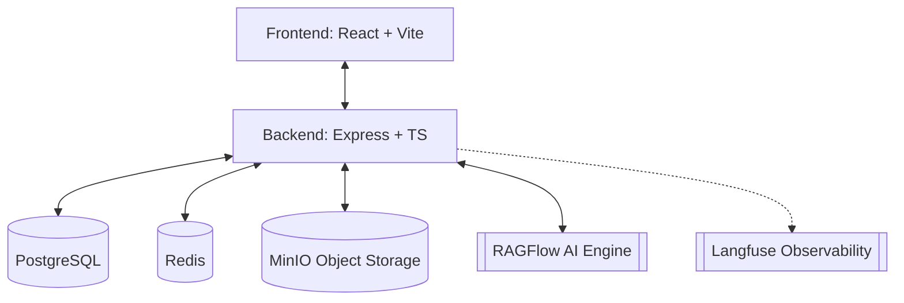

# RAGFlow Simple UI

A high-performance, enterprise-ready Management UI for RAGFlow, designed to bridge the gap between raw AI engines and business workflows. It provides a secure, localized, and feature-rich portal with Azure Entra ID authentication, advanced RBAC, and integrated observability.

## 🚀 Key Features

| Feature | Description |
| :--- | :--- |
| 🤖 **AI Chat & Search** | Refined interfaces for RAGFlow, with session history and full-text search. |
| 📁 **Unified Storage Manager** | Enterprise document management with Multi-Cloud support (MinIO, S3, Azure). |
| 🔐 **Azure Entra AD SSO** | Seamless Microsoft enterprise authentication with avatar synchronization. |
| 👥 **Enterprise RBAC** | Granular multi-tier permissions: Admin, Manager, and User roles. |
| 🏢 **Team Management** | Multi-tenant team structures for isolated document and flow access. |
| 📢 **Broadcast System** | Real-time system-wide announcements for all active users. |
| 🕵️ **Comprehensive Auditing** | Localized audit logs tracking every user action for compliance. |
| 🖥️ **System Monitoring** | Real-time health metrics, resource usage, and diagnostics. |
| 🌍 **Global Localization** | Full support for English, Vietnamese, and Japanese (i18n). |
| 🎨 **Dynamic Theming** | Elegant Light, Dark, and System theme synchronization. |
| 🔢 **AI Tokenizer** | Built-in tool for estimating token counts for various LLM models. |
| 📊 **Observability** | Native Langfuse integration for tracing AI interactions. |

## 🏗️ Architecture



**Tech Stack:**
- **Frontend**: React 19, Vite, Ant Design, Tailwind CSS, React Query, i18next
- **Backend**: Express.js, TypeScript, Winston (Daily Rotate), Node-cron
- **Database**: PostgreSQL (Knex.js migrations & query builder)
- **Session**: Redis (Session persistence & rate limiting)
- **Storage**: Multi-Cloud Provider (MinIO, S3, Azure, GCP ready)
- **Auth**: Azure Entra ID (OAuth2/OpenID Connect)
- **Monitoring**: Langfuse API integration

## 📂 Project Structure

```bash
├── be/                 # Backend Workspace (Express + TypeScript)
│   ├── src/
│   │   ├── config/     # App configuration
│   │   ├── controllers/# Request handlers (MVC pattern)
│   │   ├── db/         # Knex migrations and seeds
│   │   ├── middleware/ # Auth, rate-limit, and audit interceptors
│   │   ├── models/     # Data access layer (BaseModel & Factory)
│   │   ├── routes/     # API route definitions
│   │   ├── services/   # Business logic (Storage Providers, RAGFlow, Audit)
│   │   ├── scripts/    # Database maintenance scripts
│   │   └── utils/      # Helper utilities
├── fe/                 # Frontend Workspace (React + Vite)
│   ├── src/
│   │   ├── assets/     # Static assets
│   │   ├── components/ # Reusable UI components
│   │   ├── context/    # React Context providers
│   │   ├── hooks/      # Custom React hooks
│   │   ├── i18n/       # Localization files (en, vi, ja)
│   │   ├── layouts/    # Page layouts
│   │   ├── lib/        # Core libraries (API client)
│   │   ├── pages/      # Application views
│   │   ├── services/   # API service calls
│   │   └── types/      # TypeScript definitions
├── docker/             # Dockerization & deployment configs
└── docs/               # Detailed technical documentation
```

## 🛠️ Developer Guide

### Prerequisites
- **Node.js**: 22+ (LTS)
- **npm**: 10+
- **PostgreSQL**: 15+
- **MinIO**: High-performance object storage setup
- **Redis**: Required for production session management

### Local Development

```bash
# 1. Install dependencies for all workspaces
npm install

# 2. Setup Environment Variables
# Copy be/.env.example to be/.env and fill in Azure/MinIO/RAGFlow credentials

# 3. Run Database Migrations
npm run db:migrate -w be

# 4. Start Development Servers
npm run dev
```

| Command | Action |
| :--- | :--- |
| `npm run dev` | Spins up both FE (5173) and BE (3001) |
| `npm run build` | Production build for both tiers |
| `npm run build:prod` | Optimized production build without source maps |
| `npm run lint` | Run project-wide ESLint checks |
| `npm run test` | Run tests with Vitest |

## 📖 Documentation

Explore our detailed guides in the `docs/` folder:
- [Configuration Guide](docs/configuration.md)
- [Deployment Strategy](docs/deployment.md)
- [API Reference](docs/api-reference.md)
- [Architecture & RBAC](docs/architecture.md)
- [External Integration](docs/external-trace-integration.md)

## 📄 License

This project is licensed under the MIT License - see the [LICENSE](LICENSE) file for details.
