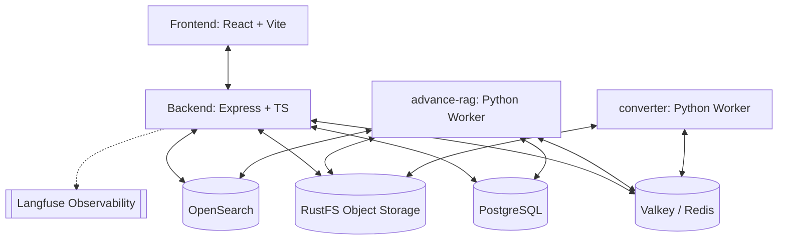

# RAGFlow Simple UI

A high-performance, enterprise-ready Management UI for RAGFlow, designed to bridge the gap between raw AI engines and business workflows. It provides a secure, localized, and feature-rich portal with Azure Entra ID authentication, advanced RBAC, and integrated observability.

## 🚀 Key Features

| Feature | Description |
| :--- | :--- |
| 🤖 **AI Chat & Search** | Refined interfaces for RAGFlow, with session history and full-text search. |
| 📁 **Unified Storage Manager** | Enterprise document management with Multi-Cloud support (MinIO, S3, Azure). |
| 🔐 **Azure Entra AD SSO** | Seamless Microsoft enterprise authentication with avatar synchronization. |
| 👥 **Enterprise RBAC** | Granular multi-tier permissions: Admin, Manager, and User roles. |
| 🏢 **Team Management** | Multi-tenant team structures for isolated document and flow access. |
| 📢 **Broadcast System** | Real-time system-wide announcements for all active users. |
| 🕵️ **Comprehensive Auditing** | Localized audit logs tracking every user action for compliance. |
| 🖥️ **System Monitoring** | Real-time health metrics, resource usage, and diagnostics. |
| 🌍 **Global Localization** | Full support for English, Vietnamese, and Japanese (i18n). |
| 🎨 **Dynamic Theming** | Elegant Light, Dark, and System theme synchronization. |
| 🔢 **AI Tokenizer** | Built-in tool for estimating token counts for various LLM models. |
| 📊 **Observability** | Native Langfuse integration for tracing AI interactions. |

## 🏗️ Architecture


```mermaid
graph TD
    Client[Frontend: React + Vite]
    BE[Backend: Express + TS]
    Worker[advance-rag: Python Worker]
    Converter[converter: Python Worker]
    DB[(PostgreSQL)]
    Valkey[(Valkey / Redis)]
    RustFS[(RustFS Object Storage)]
    OpenSearch[(OpenSearch)]
    Langfuse[[Langfuse Observability]]

    Client <--> BE
    BE <--> DB
    BE <--> Valkey
    BE <--> RustFS
    BE <--> OpenSearch
    BE -.-> Langfuse
    Worker <--> DB
    Worker <--> Valkey
    Worker <--> RustFS
    Worker <--> OpenSearch
    Converter <--> Valkey
    Converter <--> RustFS
```

**Tech Stack:**
- **Frontend**: React 19, Vite, shadcn/ui, Tailwind CSS, TanStack Query, i18next
- **Backend**: Express.js, TypeScript, Winston (Daily Rotate), Node-cron
- **Workers**: Python 3.10+ (advance-rag for RAG pipeline, converter for document conversion)
- **Database**: PostgreSQL 17 (Knex.js migrations & query builder)
- **Cache**: Valkey 8 (Redis-compatible, session persistence & task queues)
- **Search**: OpenSearch 3.x (vector + text search for RAG chunks)
- **Storage**: RustFS (S3-compatible object storage)
- **Auth**: Azure Entra ID (OAuth2/OpenID Connect)
- **Monitoring**: Langfuse API integration

## 📂 Project Structure

```
root/
├── package.json              # Root workspace config (npm workspaces)
├── be/                       # Backend workspace (Express API)
├── fe/                       # Frontend workspace (React + Vite)
├── advance-rag/              # Python worker — RAG pipeline (parsing, chunking, embedding)
├── converter/                # Python worker — document conversion (Office → PDF)
├── docker/                   # Docker Compose configs (base infra + app services)
├── scripts/                  # Setup & dev scripts
├── docs/                     # Project documentation
└── patches/                  # npm patch files
```

## 🛠️ Developer Guide

### Prerequisites

| Tool | Version | Purpose |
| :--- | :--- | :--- |
| **Node.js** | 22+ (LTS) | Backend & frontend runtime |
| **npm** | 10+ | Package manager (workspaces) |
| **Python** | 3.10+ | RAG worker & converter |
| **Docker** | 24+ | Infrastructure services |

### Quick Start (New Team Member)

The fastest way to get everything running:

```bash
# Clone the repository
git clone <repo-url> && cd b-knowledge

# Run the full setup (installs everything + starts Docker infra)
npm run setup
```

This single command will:
1. Check that Node.js, Python, and Docker are installed
2. Copy `.env.example` → `.env` files where needed
3. Install npm dependencies for all workspaces (`be/`, `fe/`)
4. Create a centralized Python `.venv/` at the project root and install `advance-rag` + `converter` in editable mode
5. Start Docker base infrastructure (PostgreSQL, Valkey, OpenSearch, RustFS)

Once setup completes, start development:

```bash
npm run dev
```

### Manual Setup (Step by Step)

If you prefer to set up each part individually:

```bash
# 1. Install npm dependencies
npm install

# 2. Set up environment variables
#    Copy .env.example → .env in root, docker/, be/, advance-rag/ and fill in credentials

# 3. Set up Python virtual environment (centralized at root .venv/)
npm run setup:python

# 4. Start Docker infrastructure
npm run docker:base

# 5. Run database migrations
npm run db:migrate -w be

# 6. Start all services
npm run dev
```

### Python Virtual Environment

The project uses a **centralized virtual environment** (`.venv/` at the project root) shared by all Python modules. Each module keeps its own `pyproject.toml` for independent Docker builds.

```bash
# Set up / reinstall all Python modules
npm run setup:python

# Set up individual modules (legacy, uses centralized .venv)
npm run setup:worker       # advance-rag only
npm run setup:converter    # converter only
```

To activate the venv manually (for IDE or debugging):

```bash
# Linux / macOS
source .venv/bin/activate

# Windows (Git Bash)
source .venv/Scripts/activate

# Windows (PowerShell)
.venv\Scripts\Activate.ps1
```

### Available Commands

| Command | Action |
| :--- | :--- |
| `npm run setup` | Full project setup for new members |
| `npm run dev` | Start all services (BE + FE + Worker + Converter) |
| `npm run dev:be` | Backend only (port 3001) |
| `npm run dev:fe` | Frontend only (port 5173) |
| `npm run dev:worker` | RAG worker only |
| `npm run dev:converter` | Converter worker only |
| `npm run setup:python` | Create/update centralized Python venv |
| `npm run docker:base` | Start infrastructure (PostgreSQL, Valkey, OpenSearch, RustFS) |
| `npm run docker:down` | Stop infrastructure containers |
| `npm run docker:up` | Build & start all app containers |
| `npm run build` | Production build for all workspaces |
| `npm run build:prod` | Optimized production build without source maps |
| `npm run lint` | Run project-wide ESLint checks |
| `npm run test` | Run tests with Vitest |

## 📖 Documentation

Explore our detailed guides in the `docs/` folder:
- [Configuration Guide](docs/configuration.md)
- [Deployment Strategy](docs/deployment.md)
- [API Reference](docs/api-reference.md)
- [Architecture & RBAC](docs/architecture.md)
- [External Integration](docs/external-trace-integration.md)

## 📄 License

This project is licensed under the MIT License - see the [LICENSE](LICENSE) file for details.
