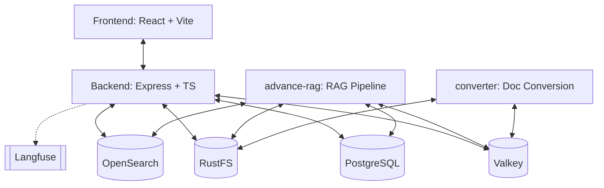

# B-Knowledge

An open-source platform to centralize and manage AI Search, AI Chat, and Knowledge Base for the enterprise. B-Knowledge provides a complete RAG (Retrieval-Augmented Generation) pipeline — from document ingestion and parsing to intelligent search and conversational AI — with built-in team management, RBAC, and observability.

## Key Features

| Feature | Description |
| :--- | :--- |
| **AI Chat** | Multi-turn conversational AI with configurable assistants, session history, and citation-aware responses. |
| **AI Search** | Semantic search across knowledge bases with re-ranking, graph-based retrieval, and hybrid search. |
| **Knowledge Base** | End-to-end document management — upload, parse, chunk, embed, and index documents automatically. |
| **Advanced RAG Engine** | Python-based pipeline with 15+ document parsers (PDF, DOCX, Excel, HTML, Markdown, OCR), hierarchical chunking, RAPTOR, and GraphRAG. |
| **Document Converter** | Background worker for Office-to-PDF conversion via LibreOffice. |
| **Dataset Management** | Version-controlled datasets with granular chunk-level editing and preview. |
| **LLM Provider Config** | Connect multiple LLM providers (OpenAI, Azure OpenAI, Ollama, LiteLLM) with per-assistant model selection. |
| **Team Management** | Multi-tenant team structures with isolated knowledge base and assistant access. |
| **Enterprise RBAC** | Three-tier role system (Admin, Leader, User) with feature-level gating. |
| **Glossary** | Domain terminology management to improve RAG accuracy and consistency. |
| **Audit Logging** | Comprehensive audit trail tracking every user action for compliance. |
| **Broadcast System** | Real-time system-wide announcements for all active users. |
| **System Monitoring** | Health metrics, resource usage, and diagnostics dashboard. |
| **Observability** | Native Langfuse integration for tracing AI interactions and evaluating response quality. |
| **Localization** | Full i18n support for English, Vietnamese, and Japanese. |
| **Theming** | Light, Dark, and System-synced themes. |

## Architecture


```mermaid
graph TD
    Client[Frontend: React + Vite]
    BE[Backend: Express + TS]
    Worker[advance-rag: RAG Pipeline]
    Converter[converter: Doc Conversion]
    DB[(PostgreSQL)]
    Valkey[(Valkey)]
    RustFS[(RustFS)]
    OpenSearch[(OpenSearch)]
    Langfuse[[Langfuse]]

    Client <--> BE
    BE <--> DB
    BE <--> Valkey
    BE <--> RustFS
    BE <--> OpenSearch
    BE -.-> Langfuse
    Worker <--> DB
    Worker <--> Valkey
    Worker <--> RustFS
    Worker <--> OpenSearch
    Converter <--> Valkey
    Converter <--> RustFS
```

**Tech Stack:**

| Layer | Technology |
| :--- | :--- |
| **Frontend** | React 19, Vite, shadcn/ui, Tailwind CSS, TanStack Query, i18next |
| **Backend** | Express.js, TypeScript, Zod, Winston, Node-cron |
| **RAG Worker** | Python 3.10+, Transformers, ONNX Runtime, scikit-learn, OpenAI SDK |
| **Converter** | Python 3.10+, LibreOffice (headless), pypdf, pdfminer |
| **Database** | PostgreSQL 17 (Knex.js ORM) |
| **Cache & Queue** | Valkey 8 (Redis-compatible) |
| **Search & Vectors** | OpenSearch 3.x (BM25 + kNN vector search) |
| **Object Storage** | RustFS (S3-compatible) |
| **Auth** | Azure Entra ID (OAuth2 / OpenID Connect) |
| **Observability** | Langfuse (LLM tracing & evaluation) |

## Project Structure

```
b-knowledge/
├── be/                       # Backend — Express API (Node.js)
├── fe/                       # Frontend — React + Vite
├── advance-rag/              # RAG pipeline worker (Python)
│   ├── deepdoc/              #   Document parsers (PDF, DOCX, OCR, etc.)
│   ├── rag/                  #   Chunking, embedding, retrieval, GraphRAG
│   ├── graphrag/             #   Graph-based RAG (entity resolution, graph search)
│   └── common/               #   Shared config & utilities
├── converter/                # Document converter worker (Python)
├── docker/                   # Docker Compose (base infra + app services)
│   ├── docker-compose-base.yml   # PostgreSQL, Valkey, OpenSearch, RustFS
│   └── docker-compose.yml        # App services (backend, worker, converter)
├── scripts/                  # Setup & dev scripts
├── docs/                     # Project documentation
└── patches/                  # npm patch files
```

## Developer Guide

### Prerequisites

| Tool | Version | Purpose |
| :--- | :--- | :--- |
| **Node.js** | 22+ (LTS) | Backend & frontend runtime |
| **npm** | 10+ | Package manager (workspaces) |
| **Python** | 3.10+ | RAG worker & converter |
| **Docker** | 24+ | Infrastructure services |

### Quick Start (New Team Member)

The fastest way to get everything running:

```bash
# Clone the repository
git clone <repo-url> && cd b-knowledge

# Run the full setup (installs everything + starts Docker infra)
npm run setup
```

This single command will:
1. Check that Node.js, Python, and Docker are installed
2. Copy `.env.example` → `.env` files where needed
3. Install npm dependencies for all workspaces (`be/`, `fe/`)
4. Create a centralized Python `.venv/` at the project root and install `advance-rag` + `converter` in editable mode
5. Start Docker base infrastructure (PostgreSQL, Valkey, OpenSearch, RustFS)

Once setup completes, start development:

```bash
npm run dev
```

### Manual Setup (Step by Step)

If you prefer to set up each part individually:

```bash
# 1. Install npm dependencies
npm install

# 2. Set up environment variables
#    Copy .env.example → .env in root, docker/, be/, advance-rag/ and fill in credentials

# 3. Set up Python virtual environment (centralized at root .venv/)
npm run setup:python

# 4. Start Docker infrastructure
npm run docker:base

# 5. Run database migrations
npm run db:migrate -w be

# 6. Start all services
npm run dev
```

### Python Virtual Environment

The project uses a **centralized virtual environment** (`.venv/` at the project root) shared by all Python modules. Each module keeps its own `pyproject.toml` for independent Docker builds.

```bash
# Set up / reinstall all Python modules
npm run setup:python

# Set up individual modules (legacy, uses centralized .venv)
npm run setup:worker       # advance-rag only
npm run setup:converter    # converter only
```

To activate the venv manually (for IDE or debugging):

```bash
# Linux / macOS
source .venv/bin/activate

# Windows (Git Bash)
source .venv/Scripts/activate

# Windows (PowerShell)
.venv\Scripts\Activate.ps1
```

### Available Commands

| Command | Action |
| :--- | :--- |
| `npm run setup` | Full project setup for new members |
| `npm run dev` | Start all services (BE + FE + Worker + Converter) |
| `npm run dev:be` | Backend only (port 3001) |
| `npm run dev:fe` | Frontend only (port 5173) |
| `npm run dev:worker` | RAG worker only |
| `npm run dev:converter` | Converter worker only |
| `npm run setup:python` | Create/update centralized Python venv |
| `npm run docker:base` | Start infrastructure (PostgreSQL, Valkey, OpenSearch, RustFS) |
| `npm run docker:down` | Stop infrastructure containers |
| `npm run docker:up` | Build & start all app containers |
| `npm run build` | Production build for all workspaces |
| `npm run build:prod` | Optimized production build without source maps |
| `npm run lint` | Run project-wide ESLint checks |
| `npm run test` | Run tests with Vitest |

## Documentation

Explore the detailed guides in the `docs/` folder:
- [Architecture & RBAC](docs/architecture.md)
- [Configuration Guide](docs/configuration.md)
- [Deployment Strategy](docs/deployment.md)
- [API Reference](docs/api-reference.md)
- [External Integration](docs/external-trace-integration.md)
- [Development Guide](docs/development.md)
- [Security Review](docs/security-review.md)
- [Testing](docs/testing.md)

## License

This project is licensed under the MIT License - see the [LICENSE](LICENSE) file for details.
