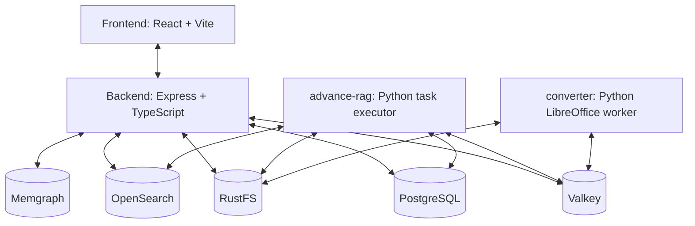

# B-Knowledge

B-Knowledge is an open-source monorepo for enterprise AI search, chat, and knowledge management. The current codebase combines a React SPA, an Express API, a Python RAG worker, and a LibreOffice-based converter, backed by PostgreSQL, Valkey, OpenSearch, RustFS, and Memgraph.

## What the current source code includes

- AI chat, AI search, datasets, and document ingestion
- Agent workflows and agent widgets
- Memory, glossary, projects, teams, and API key management
- Audit logs, broadcast messages, admin/system tooling, and feedback flows
- Code graph support with Memgraph-backed infrastructure
- RAG processing and document conversion workers

## Architecture


```mermaid
graph TD
    FE[Frontend: React + Vite]
    BE[Backend: Express + TypeScript]
    RAG[advance-rag: Python task executor]
    CONV[converter: Python LibreOffice worker]
    PG[(PostgreSQL)]
    VK[(Valkey)]
    OS[(OpenSearch)]
    S3[(RustFS)]
    MG[(Memgraph)]

    FE <--> BE
    BE <--> PG
    BE <--> VK
    BE <--> OS
    BE <--> S3
    BE <--> MG
    RAG <--> PG
    RAG <--> VK
    RAG <--> OS
    RAG <--> S3
    CONV <--> VK
    CONV <--> S3
```

## Tech stack

| Layer | Current stack |
| --- | --- |
| Frontend | React 19, TypeScript, Vite 7.3, TanStack Query 5, Tailwind CSS, shadcn/ui |
| Backend | Node.js, Express 4.21, TypeScript, Knex, Zod, Socket.IO |
| RAG worker | Python, Peewee, OpenSearch, Langfuse, RAGFlow-derived pipeline |
| Converter | Python, LibreOffice, Redis/Valkey queue, pypdf, pdfminer |
| Infra | PostgreSQL 17, Valkey 8, OpenSearch 3.5, RustFS, Memgraph |

## Repository layout

```text
b-knowledge/
├── be/                 # Express backend API
├── fe/                 # React frontend SPA
├── advance-rag/        # Python RAG task executor and parsing pipeline
├── converter/          # Python Office/PDF conversion worker
├── docker/             # Compose files, nginx, config, infra helpers
├── docs/               # VitePress documentation and design docs
├── design-system/      # UI and design-system references
├── scripts/            # Setup and local development scripts
├── patches/            # npm patch-package patches
├── ragflow/            # Upstream reference snapshot used for parity work
├── benchmarks/         # Benchmarks and profiling artifacts
├── samples/            # Sample assets
├── tasks/              # Task planning/support files
├── test-data/          # Local test fixtures
└── package.json        # Root workspace scripts
```

## Main application modules

Current backend modules under `be/src/modules/` include:

`admin`, `agents`, `audit`, `auth`, `broadcast`, `chat`, `code-graph`, `dashboard`, `external`, `feedback`, `glossary`, `llm-provider`, `memory`, `preview`, `projects`, `rag`, `search`, `sync`, `system-tools`, `teams`, `user-history`, `users`

Current frontend features under `fe/src/features/` include:

`agent-widget`, `agents`, `ai`, `api-keys`, `audit`, `auth`, `broadcast`, `chat`, `chat-widget`, `code-graph`, `dashboard`, `datasets`, `glossary`, `guideline`, `histories`, `landing`, `llm-provider`, `memory`, `projects`, `search`, `search-widget`, `system`, `teams`, `users`

## Prerequisites

- Node.js 22+ recommended for local development
- npm 10+
- Python 3.11 recommended
- Docker Desktop or Docker Engine
- LibreOffice only if you run `converter/` outside Docker

Notes:

- Root `package.json` currently declares `node >=18`, but the backend and project docs target Node.js 22+.
- `advance-rag` and `converter` `pyproject.toml` files allow Python 3.10+, but 3.11 is the project baseline.
- Some Python packages in `advance-rag` compile native extensions, so local build tools may be required.

## Setup

### Quick start

```bash
# 1. Install/copy local software dependencies
npm run setup

# 2. Start infrastructure
npm run setup:infra

# 3. Run database migrations and seed sample users
npm run db:setup

# 4. Start the full dev stack
npm run dev
```

### What `npm run setup` actually does

`npm run setup` is a software setup script. It:

1. Checks for `node`, `npm`, and `python`
2. Copies `.env.example` to `.env` where the script manages it
3. Runs `npm install`
4. Creates/updates the shared root `.venv` for Python services

It does not start Docker automatically. Use `npm run setup:infra` or `npm run docker:base` for infrastructure.

### Manual setup

```bash
# Copy env files
cp docker/.env.example docker/.env
cp be/.env.example be/.env
cp fe/.env.example fe/.env
cp advance-rag/.env.example advance-rag/.env
cp converter/.env.example converter/.env

# Install JS dependencies
npm install

# Set up shared Python environment
npm run setup:python

# Start infrastructure
npm run docker:base

# Migrate and seed database
npm run db:setup
```

## Development commands

### Root scripts

```bash
npm run dev
npm run dev:be
npm run dev:fe
npm run dev:worker
npm run dev:converter
npm run dev:https
```

### Build, lint, test

```bash
npm run build
npm run build:prod
npm run build:be
npm run build:fe
npm run lint
npm run test
```

### Database

```bash
npm run db:migrate
npm run db:migrate:make <name>
npm run db:migrate:rollback
npm run db:seed
npm run db:setup
```

### Docker

```bash
npm run docker:base
npm run docker:down
npm run docker:up
npm run docker:litellm
npm run docker:litellm:down
```

### Docs

```bash
npm run docs:dev
npm run docs:build
npm run docs:preview
```

### HTTPS

```bash
npm run generate:cert
```

## Infrastructure services

The current `docker/docker-compose-base.yml` starts:

| Service | Port(s) | Purpose |
| --- | --- | --- |
| PostgreSQL | `5432` | Primary relational database |
| Valkey | `6379` | Cache, queue, pub/sub, sessions |
| OpenSearch | `9201` | Full-text and vector search |
| RustFS | `9000`, `9001` | S3-compatible object storage |
| Memgraph | `7687`, `7444` | Code graph / graph database support |

The main `docker/docker-compose.yml` adds:

- `backend`
- `task-executor`
- `converter`

Additional compose variants:

- `docker/docker-compose-dev.yml`: OpenSearch Dashboards, pgweb, Redis Insight
- `docker/docker-compose-litellm.yml`: LiteLLM proxy for OpenAI-compatible local model access

## Environment files

Local environment files currently used by the repo:

| File | Status |
| --- | --- |
| `docker/.env` | present in repo setup |
| `be/.env` | present in repo setup |
| `fe/.env` | optional locally, `.env.example` exists |
| `advance-rag/.env` | present in repo setup |
| `converter/.env` | present in repo setup |

If you want seeded local-login accounts for browser testing, keep `ENABLE_LOCAL_LOGIN=true` in `be/.env` and run `npm run db:seed`.

Default seeded accounts:

- `admin1@baoda.vn` / `password123`
- `leader1@baoda.vn` / `password123`
- `user1@baoda.vn` / `password123`

## Documentation

Project documentation lives in [`docs/`](docs/) and is served with VitePress. The repo also includes architecture and workflow guidance in:

- [`CLAUDE.md`](CLAUDE.md)
- [`be/CLAUDE.md`](be/CLAUDE.md)
- [`fe/CLAUDE.md`](fe/CLAUDE.md)
- [`advance-rag/CLAUDE.md`](advance-rag/CLAUDE.md)
- [`converter/CLAUDE.md`](converter/CLAUDE.md)

## License

This project is licensed under the Apache License. See [`LICENSE`](LICENSE).
