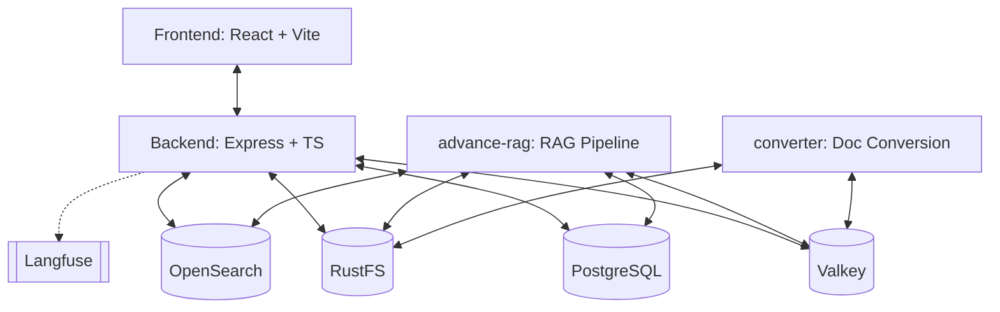

# B-Knowledge

An open-source platform to centralize and manage AI Search, AI Chat, and Knowledge Base for the enterprise. B-Knowledge provides a complete RAG (Retrieval-Augmented Generation) pipeline — from document ingestion and parsing to intelligent search and conversational AI — with built-in team management, RBAC, and observability.

## Key Features

| Feature | Description |
| :--- | :--- |
| **AI Chat** | Multi-turn conversational AI with configurable assistants, session history, and citation-aware responses. |
| **AI Search** | Semantic search across knowledge bases with re-ranking, graph-based retrieval, and hybrid search. |
| **Knowledge Base** | End-to-end document management — upload, parse, chunk, embed, and index documents automatically. |
| **Advanced RAG Engine** | Python-based pipeline with 15+ document parsers (PDF, DOCX, Excel, HTML, Markdown, OCR), hierarchical chunking, RAPTOR, and GraphRAG. |
| **Document Converter** | Background worker for Office-to-PDF conversion via LibreOffice. |
| **Dataset Management** | Version-controlled datasets with granular chunk-level editing and preview. |
| **LLM Provider Config** | Connect multiple LLM providers (OpenAI, Azure OpenAI, Ollama, LiteLLM) with per-assistant model selection. |
| **Team Management** | Multi-tenant team structures with isolated knowledge base and assistant access. |
| **Enterprise RBAC** | Three-tier role system (Admin, Leader, User) with feature-level gating. |
| **Glossary** | Domain terminology management to improve RAG accuracy and consistency. |
| **Audit Logging** | Comprehensive audit trail tracking every user action for compliance. |
| **Broadcast System** | Real-time system-wide announcements for all active users. |
| **System Monitoring** | Health metrics, resource usage, and diagnostics dashboard. |
| **Observability** | Native Langfuse integration for tracing AI interactions and evaluating response quality. |
| **Localization** | Full i18n support for English, Vietnamese, and Japanese. |
| **Theming** | Light, Dark, and System-synced themes. |

## Architecture


```mermaid
graph TD
    Client[Frontend: React + Vite]
    BE[Backend: Express + TS]
    Worker[advance-rag: RAG Pipeline]
    Converter[converter: Doc Conversion]
    DB[(PostgreSQL)]
    Valkey[(Valkey)]
    RustFS[(RustFS)]
    OpenSearch[(OpenSearch)]
    Langfuse[[Langfuse]]

    Client <--> BE
    BE <--> DB
    BE <--> Valkey
    BE <--> RustFS
    BE <--> OpenSearch
    BE -.-> Langfuse
    Worker <--> DB
    Worker <--> Valkey
    Worker <--> RustFS
    Worker <--> OpenSearch
    Converter <--> Valkey
    Converter <--> RustFS
```

**Tech Stack:**

| Layer | Technology |
| :--- | :--- |
| **Frontend** | React 19, Vite 7.3, TypeScript 5.8, shadcn/ui, Tailwind CSS 3.4, TanStack Query 5, i18next, React Router 7, Recharts |
| **Backend** | Express 4.21, TypeScript 5.6, Zod 3, Knex 3, Winston, Node-cron, Socket.IO |
| **RAG Worker** | Python 3.10+, Peewee ORM, Transformers, ONNX Runtime, scikit-learn, OpenAI SDK, Langfuse |
| **Converter** | Python 3.10+, LibreOffice (headless), pypdf, pdfminer |
| **Database** | PostgreSQL 17 (Knex.js ORM on backend, Peewee ORM on worker) |
| **Cache & Queue** | Valkey 8 (Redis-compatible) |
| **Search & Vectors** | OpenSearch 3.5 (BM25 + kNN vector search) |
| **Object Storage** | RustFS (S3-compatible) |
| **Auth** | Azure Entra ID (OAuth2 / OpenID Connect) |
| **Observability** | Langfuse (LLM tracing & evaluation) |

## Project Structure

```
b-knowledge/
├── be/                       # Backend — Express API (Node.js)
├── fe/                       # Frontend — React + Vite SPA
├── advance-rag/              # RAG pipeline worker (Python)
│   ├── deepdoc/              #   Document parsers (PDF, DOCX, OCR, etc.)
│   ├── rag/                  #   Chunking, embedding, retrieval, GraphRAG
│   │   ├── app/              #   Document type parsers (book, email, paper, etc.)
│   │   ├── flow/             #   Pipeline stages (extractor, splitter, tokenizer)
│   │   ├── graphrag/         #   Graph-based RAG (entity resolution, graph search)
│   │   ├── nlp/              #   Query processing, search, tokenizer
│   │   └── llm/              #   LLM + OCR integrations
│   ├── db/                   #   Peewee ORM models & services
│   ├── memory/               #   Cache management
│   └── common/               #   Shared config & utilities
├── converter/                # Document converter worker (Python + LibreOffice)
├── docker/                   # Docker Compose (base infra + app services)
│   ├── docker-compose-base.yml   # PostgreSQL, Valkey, OpenSearch, RustFS
│   └── docker-compose.yml        # App services (backend, worker, converter)
├── scripts/                  # Setup, run, and utility scripts
├── design-system/            # AI-native UI design system docs
├── docs/                     # Project documentation
└── patches/                  # npm patch files
```

## Developer Guide

### Prerequisites

| Tool | Version | Purpose |
| :--- | :--- | :--- |
| **Node.js** | 22+ (LTS) | Backend & frontend runtime |
| **npm** | 10+ | Package manager (workspaces) |
| **Python** | 3.10+ | RAG worker & converter |
| **C/C++ Build Tools** | See below | Compile native Python extensions |
| **Docker** | 24+ | Infrastructure services |
| **LibreOffice** | 7.0+ | Document conversion (converter worker only; included in Docker image) |

#### C/C++ Build Tools

Several advance-rag Python packages (`datrie`, `pyclipper`, `editdistance`, `xxhash`, `cryptography`) contain native C/C++ extensions that must be compiled during installation. The setup script (`npm run setup:python`) will **detect and attempt to auto-install** these tools, but you can also install them manually:

| Platform | Required Tool | Install Command |
| :--- | :--- | :--- |
| **Windows** | Visual Studio Build Tools 2022 (C++ workload) | See below |
| **macOS** | Xcode Command Line Tools | `xcode-select --install` |
| **Ubuntu / Debian** | build-essential + python3-dev | `sudo apt-get install build-essential python3-dev` |
| **Fedora / RHEL** | GCC + python3-devel | `sudo dnf install gcc gcc-c++ make python3-devel` |
| **Arch Linux** | base-devel | `sudo pacman -S base-devel` |

**Windows manual install (2 steps):**

```powershell
# 1. Install Visual Studio Build Tools
winget install --id Microsoft.VisualStudio.2022.BuildTools --silent --accept-source-agreements

# 2. Find the install path, then add C++ workload (elevated terminal)
$installPath = & "C:\Program Files (x86)\Microsoft Visual Studio\Installer\vswhere.exe" -products Microsoft.VisualStudio.Product.BuildTools -latest -property installationPath
& "C:\Program Files (x86)\Microsoft Visual Studio\Installer\setup.exe" modify --installPath $installPath --add Microsoft.VisualStudio.Workload.VCTools --includeRecommended --passive
```

Or download the installer from [Visual C++ Build Tools](https://visualstudio.microsoft.com/visual-cpp-build-tools/) and select the **"Desktop development with C++"** workload.

> **Windows users:** After installing Visual Studio Build Tools, you may need to restart your terminal (or reboot) for the compiler to be detected.

> **Note:** LibreOffice is only required if running the converter worker locally outside Docker. The Docker image includes it automatically.

### Quick Start (New Team Member)

```bash
# Clone the repository
git clone <repo-url> && cd b-knowledge

# 1. Software setup (Node.js deps + Python venv)
npm run setup

# 2. Infrastructure setup (Docker: PostgreSQL, Valkey, OpenSearch, RustFS)
npm run setup:infra

# 3. Start all services
npm run dev
```

**`npm run setup`** handles software only:
1. Checks that Node.js, npm, Python, and C/C++ build tools are installed
2. Copies `.env.example` → `.env` files where needed
3. Installs npm dependencies for all workspaces (`be/`, `fe/`)
4. Checks for C/C++ build tools and attempts auto-install if missing
5. Creates a centralized Python `.venv/` at the project root and installs `advance-rag` + `converter` in editable mode

**`npm run setup:infra`** handles Docker infrastructure:
1. Checks that Docker is installed and running
2. Starts PostgreSQL, Valkey, OpenSearch, and RustFS containers

### Manual Setup (Step by Step)

```bash
# 1. Install npm dependencies
npm install

# 2. Set up environment variables
#    Copy .env.example → .env in: root, docker/, be/, advance-rag/

# 3. Set up Python virtual environment (centralized at root .venv/)
npm run setup:python

# 4. Start Docker infrastructure
npm run docker:base

# 5. Run database migrations
npm run db:migrate -w be

# 6. Start all services
npm run dev
```

### Python Virtual Environment

The project uses a **centralized virtual environment** (`.venv/` at the project root) shared by all Python modules. Each module keeps its own `pyproject.toml` for independent Docker builds.

```bash
# Set up / reinstall all Python modules
npm run setup:python

# Set up individual modules (legacy, uses centralized .venv)
npm run setup:worker       # advance-rag only
npm run setup:converter    # converter only
```

To activate the venv manually (for IDE or debugging):

```bash
# Linux / macOS
source .venv/bin/activate

# Windows (Git Bash)
source .venv/Scripts/activate

# Windows (PowerShell)
.venv\Scripts\Activate.ps1
```

### Available Commands

**Development:**

| Command | Action |
| :--- | :--- |
| `npm run dev` | Start all services (BE + FE + Worker + Converter) |
| `npm run dev:be` | Backend only (port 3001) |
| `npm run dev:fe` | Frontend only (port 5173) |
| `npm run dev:worker` | RAG worker only (waits for backend health) |
| `npm run dev:converter` | Converter worker only (waits for backend health) |
| `npm run dev:https` | Backend + Frontend with HTTPS |

**Setup:**

| Command | Action |
| :--- | :--- |
| `npm run setup` | Full software setup (Node.js + Python, no Docker) |
| `npm run setup:infra` | Start Docker infrastructure (PostgreSQL, Valkey, OpenSearch, RustFS) |
| `npm run setup:python` | Create/update centralized Python venv |
| `npm run setup:worker` | Set up advance-rag Python module only |
| `npm run setup:converter` | Set up converter Python module only |

**Build & Test:**

| Command | Action |
| :--- | :--- |
| `npm run build` | Build all workspaces |
| `npm run build:prod` | Production build (no source maps) |
| `npm run build:be` | Build backend only |
| `npm run build:fe` | Build frontend only |
| `npm run lint` | Run ESLint across all workspaces |
| `npm run test` | Run Vitest across all workspaces |

**Database:**

| Command | Action |
| :--- | :--- |
| `npm run db:migrate -w be` | Run pending migrations |
| `npm run db:migrate:make -w be <name>` | Create new migration |
| `npm run db:migrate:rollback -w be` | Rollback last batch |
| `npm run db:seed -w be` | Seed database |

**Docker:**

| Command | Action |
| :--- | :--- |
| `npm run docker:base` | Start infrastructure containers |
| `npm run docker:down` | Stop infrastructure containers |
| `npm run docker:up` | Build & start all app containers |

**HTTPS (Local Dev):**

| Command | Action |
| :--- | :--- |
| `npm run generate:cert` | Generate self-signed SSL certs in `certs/` |

## Infrastructure Services

| Service | Image | Port | Purpose |
| :--- | :--- | :--- | :--- |
| PostgreSQL | `postgres:17-alpine` | 5432 | Primary database |
| Valkey | `valkey/valkey:8-alpine` | 6379 | Cache, sessions, queues |
| OpenSearch | `opensearchproject/opensearch:3.5.0` | 9201 | Vector + text search |
| RustFS | `rustfs/rustfs:latest` | 9000 / 9001 | S3-compatible file storage |

## Environment Files

Each workspace has `.env.example` — copy to `.env` and fill in credentials:

| File | Purpose |
| :--- | :--- |
| `docker/.env` | Infrastructure + deployment config |
| `be/.env` | Backend server, DB, Redis, session, CORS |
| `fe/.env` | API URL, feature flags, Azure AD |
| `advance-rag/.env` | DB, Redis, OpenSearch, S3, model defaults |

**Production checklist:** Change all default passwords, set `ENABLE_ROOT_LOGIN=false`, generate a strong `SESSION_SECRET`, configure SSL.

## Documentation

Detailed guides in the `docs/` folder:

- [Architecture & RBAC](docs/architecture.md)
- [Configuration Guide](docs/configuration.md)
- [Deployment Strategy](docs/deployment.md)
- [Development Guide](docs/development.md)
- [API Reference](docs/api-reference.md)
- [External Trace Integration](docs/external-trace-integration.md)
- [External History Integration](docs/external-history-integration.md)
- [External History API](docs/external-history-api.md)
- [Security Review](docs/security-review.md)
- [Testing](docs/testing.md)
- [WebSocket](docs/websocket/WEBSOCKET.md)

## License

This project is licensed under the MIT License - see the [LICENSE](LICENSE) file for details.
