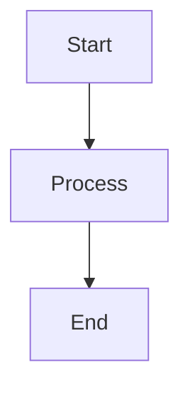

# Documentation Workspace — Claude Code Instructions

This is the B-Knowledge documentation site built with **VitePress**. All documentation lives in this `docs/` directory and is organized into category-based subfolders.

## Tech Stack

| Component | Tech |
|-----------|------|
| Static site generator | VitePress 1.6 |
| Diagrams | Mermaid (via vitepress-plugin-mermaid) |
| Language | Markdown (`.md`) |
| Config | `docs/.vitepress/config.ts` |

## Commands

```bash
cd docs
npm run docs:dev       # Start dev server (hot reload)
npm run docs:build     # Production build (use to verify changes)
npm run docs:preview   # Preview production build
```

## Directory Structure

All documentation is organized into **category subfolders** — never place `.md` files flat at the section root (except `index.md`).

```
docs/
├── .vitepress/config.ts          # VitePress config (nav + sidebar)
├── index.md                      # Home page
│
├── srs/                          # Software Requirements Specification
│   ├── index.md                  # SRS overview & scope
│   ├── nfr.md                    # Non-functional requirements
│   ├── core-platform/            # Auth, RAG, Users, Datasets, Documents
│   ├── ai-features/              # Chat, Search, Agents, Memory
│   ├── management/               # Projects, Glossary, LLM, Admin, Audit
│   └── integrations/             # Embed Widgets, Sync, Converter
│
├── basic-design/                 # Basic (high-level) Design
│   ├── system-infra/             # System arch, Infrastructure, Security
│   ├── database/                 # All database design docs
│   ├── component/                # Backend, Frontend, API design
│   ├── rag-pipeline/             # RAG pipeline steps & advanced
│   ├── agent-memory/             # Agent + Memory architecture
│   └── converter/                # Converter pipeline
│
├── detail-design/                # Detail Design
│   ├── auth/                     # Authentication & Authorization
│   ├── user-team/                # User & Team Management
│   ├── dataset-document/         # Dataset & Document processing
│   ├── chat/                     # AI Chat (14-step pipeline)
│   ├── search/                   # AI Search
│   ├── project/                  # Project Management
│   ├── agent/                    # Agent Workflows
│   ├── memory/                   # AI Memory
│   ├── supporting/               # Supporting features (20 docs)
│   └── rag-pipeline/             # RAG parser detail designs
│       ├── overview.md
│       ├── document-parsing/     # Naive, Book, Paper, Manual, Laws, Presentation, One
│       ├── structured-data/      # Table, QA, Tag
│       ├── media-processing/     # Picture, Audio
│       ├── communication/        # Email
│       ├── developer-tools/      # Code, OpenAPI, ADR, SDLC Checklist
│       └── specialized/          # Resume, Clinical
│
├── adr/                          # Architecture Decision Records
└── legacy/                       # Deprecated docs (excluded from build)
```

## Rules for Adding / Editing Documentation

### 1. Always use category subfolders

**NEVER** place new `.md` files directly in `srs/`, `basic-design/`, or `detail-design/`. Always place them inside the appropriate category subfolder.

```
# WRONG
docs/detail-design/new-feature-detail.md

# CORRECT
docs/detail-design/chat/new-feature-detail.md
```

### 2. Always update VitePress sidebar config

After adding, moving, or renaming any `.md` file, you **MUST** update `docs/.vitepress/config.ts`:

1. Add the new page to the correct sidebar section
2. Use the full path from the docs root (e.g., `/detail-design/chat/new-feature`)
3. Each category subfolder has its own sidebar key (e.g., `'/detail-design/chat/'`)

### 3. Sidebar routing convention

Each category subfolder gets its **own sidebar key** in the config. This means when a user navigates into a subfolder, they see only that category's docs in the sidebar:

```typescript
// Each subfolder = separate sidebar
'/detail-design/auth/': [ ... ],
'/detail-design/chat/': [ ... ],
'/basic-design/database/': [ ... ],
```

The parent-level keys (e.g., `'/srs/'`) show the full table of contents with all categories.

### 4. Always verify build

After any documentation change, run:

```bash
cd docs && npm run docs:build
```

Fix any build errors before committing.

### 5. Creating a new category

If you need a new category subfolder:

1. Create the directory: `docs/<section>/<new-category>/`
2. Add files into it
3. Add a new sidebar key in `.vitepress/config.ts`:
   ```typescript
   '/detail-design/<new-category>/': [
     {
       text: 'Category Display Name',
       items: [
         { text: 'Page Title', link: '/detail-design/<new-category>/filename' },
       ],
     },
   ],
   ```
4. Also add the items to the parent-level sidebar key if one exists (e.g., add to `'/srs/'`)

### 6. File naming conventions

| Convention | Example |
|-----------|---------|
| Lowercase with hyphens | `user-management-detail.md` |
| No spaces or underscores | `auth-overview.md` (not `auth_overview.md`) |
| Descriptive names | `completion-retrieval.md` (not `cr.md`) |
| `index.md` for section landing pages | `srs/index.md` |

### 7. Markdown conventions

- Use `#` (H1) for the page title — only one H1 per page
- Use `##` (H2) and `###` (H3) for sections — these appear in the right-side outline
- Use Mermaid fenced blocks for diagrams: ` ```mermaid `
- Use standard Markdown tables, not HTML tables
- Cross-link between docs using VitePress relative links: `[link text](/detail-design/chat/overview)`

### 8. Document structure template

Every design document should follow this structure:

```markdown
# Page Title

> Brief one-line description of the document

## 1. Overview
What this document covers and why it exists.

## 2. [Main content sections]
Detailed content with diagrams, tables, and code examples.

## N. Dependencies / Related Docs
Links to related documents in other sections.
```

### 9. Do NOT edit legacy docs

The `legacy/` directory is excluded from the VitePress build (`srcExclude: ['legacy/**']`). Do not add new files there or update existing ones.

### 10. Diagram support

Use Mermaid for all diagrams. The VitePress Mermaid plugin renders them automatically:

````markdown

````

For ASCII diagrams in code blocks, use standard fenced code blocks with no language tag.

## Category Mapping Reference

When creating new docs, use this table to find the correct subfolder:

### SRS

| Topic | Subfolder |
|-------|-----------|
| Authentication, Users, Teams, Datasets, Documents, RAG | `srs/core-platform/` |
| AI Chat, AI Search, Agents, Memory | `srs/ai-features/` |
| Projects, Glossary, LLM Provider, Admin, Audit | `srs/management/` |
| Embed Widgets, Sync Connectors, Converter | `srs/integrations/` |

### Basic Design

| Topic | Subfolder |
|-------|-----------|
| System architecture, Infrastructure, Security | `basic-design/system-infra/` |
| Database schemas, ERDs, table designs | `basic-design/database/` |
| Backend, Frontend, API design | `basic-design/component/` |
| RAG pipeline steps, GraphRAG, Search | `basic-design/rag-pipeline/` |
| Agent architecture, Memory architecture | `basic-design/agent-memory/` |
| Document converter pipeline | `basic-design/converter/` |

### Detail Design

| Topic | Subfolder |
|-------|-----------|
| Auth, Azure AD, RBAC/ABAC | `detail-design/auth/` |
| User management, Team management | `detail-design/user-team/` |
| Datasets, Documents, Chunks, Parsing | `detail-design/dataset-document/` |
| Chat pipeline, Assistants, Embed | `detail-design/chat/` |
| Search pipeline, Ask, Features | `detail-design/search/` |
| Projects, Categories | `detail-design/project/` |
| Agent workflows, Canvas, Sandbox | `detail-design/agent/` |
| Memory extraction, Chat integration | `detail-design/memory/` |
| All other features (20 docs) | `detail-design/supporting/` |
| RAG parser designs (20 parsers) | `detail-design/rag-pipeline/<category>/` |
