# Search Feature — Architecture & Detail Design

## 1. Executive Summary

### 1.1 Purpose

The Search feature provides a stateless, single-query information retrieval experience backed by RAG (Retrieval-Augmented Generation). Unlike the Chat feature, which maintains multi-turn conversational sessions with message history, Search is designed for one-shot queries: the user submits a question, the system retrieves relevant document chunks from OpenSearch, and optionally generates an AI-powered summary answer with inline citations.

Key characteristics that distinguish Search from Chat:

| Aspect | Search | Chat |
|--------|--------|------|
| State model | Stateless (no sessions, no history) | Stateful (sessions, message history) |
| Query model | Single query per request | Multi-turn conversation |
| Primary output | Ranked document chunks + optional AI summary | Conversational AI response |
| Additional outputs | Related questions, mind map, document preview | Follow-up conversation |
| Persistence | Search app config only (no query history) | Session + message persistence |
| Embedding/sharing | Embed widget + OpenAI-compatible API | Embed widget |

### 1.2 Business Logic Differences from RAGFlow

B-Knowledge re-implements RAGFlow's search feature with several architectural and business-logic differences:

- **Decoupled data model**: B-Knowledge stores `search_apps` in PostgreSQL with a JSONB `search_config`, whereas RAGFlow stores a `search` table with `search_config` embedding `kb_ids` inside the config. B-Knowledge promotes `dataset_ids` to a first-class column.
- **RBAC access control**: B-Knowledge adds a `search_app_access` junction table and `is_public` flag for fine-grained user/team-based access control. RAGFlow relies on `tenant_id` ownership only.
- **Embed tokens**: B-Knowledge has a dedicated `search_embed_tokens` table with 64-char hex tokens, expiration, and revocation. RAGFlow uses its `APIToken` table with `beta` field.
- **OpenAI-compatible API**: B-Knowledge provides a `POST /api/v1/search/completions` endpoint that accepts OpenAI-format requests and returns OpenAI-format responses (both streaming and non-streaming). RAGFlow does not have this.
- **Pipeline observability**: B-Knowledge integrates Langfuse tracing with spans for each pipeline step (cross-language expansion, keyword extraction, chunk search, main completion). RAGFlow does not have equivalent tracing.
- **Node.js Express backend**: The entire search pipeline runs in Node.js/TypeScript, calling OpenSearch directly, rather than RAGFlow's Python/Quart backend.

---

## 2. RAGFlow Search Architecture (Reference)

### 2.1 Data Model

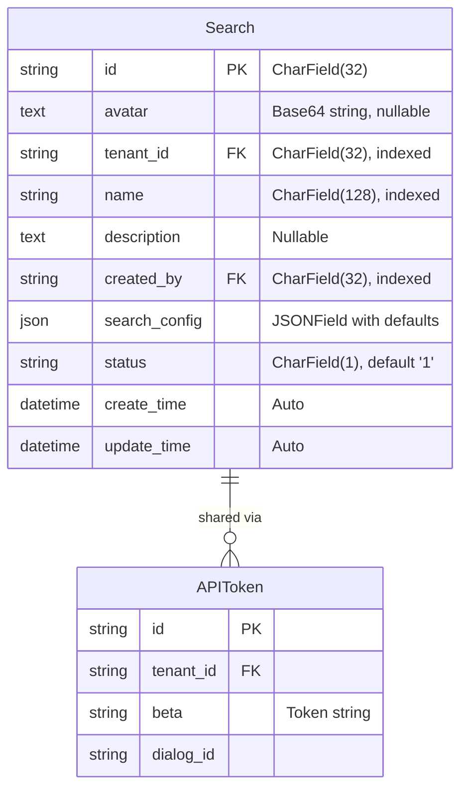
```mermaid
erDiagram
    Search {
        string id PK "CharField(32)"
        text avatar "Base64 string, nullable"
        string tenant_id FK "CharField(32), indexed"
        string name "CharField(128), indexed"
        text description "Nullable"
        string created_by FK "CharField(32), indexed"
        json search_config "JSONField with defaults"
        string status "CharField(1), default '1'"
        datetime create_time "Auto"
        datetime update_time "Auto"
    }
    APIToken {
        string id PK
        string tenant_id FK
        string beta "Token string"
        string dialog_id
    }
    Search ||--o{ APIToken : "shared via"
```

The `search_config` JSON field embeds all configuration, including `kb_ids` (dataset references), search parameters, LLM settings, and feature toggles.

### 2.2 API Endpoints

| Method | Endpoint | Description | Auth |
|--------|----------|-------------|------|
| POST | `/search/create` | Create a new search app | Session (login_required) |
| POST | `/search/update` | Update search app config | Session (login_required) |
| GET | `/search/detail?search_id=` | Get search app detail | Session (login_required) |
| POST | `/search/list` | List search apps with pagination | Session (login_required) |
| POST | `/search/rm` | Delete a search app | Session (login_required) |
| POST | `/sessions/ask` | Ask question (SSE streaming) | API Token (token_required) |
| POST | `/searchbots/ask` | Ask via embedded search bot | API Token (Bearer) |
| POST | `/sessions/related_questions` | Generate related questions | API Token (token_required) |
| POST | `/searchbots/related_questions` | Related questions (embedded) | API Token (Bearer) |
| POST | `/searchbots/retrieval_test` | Retrieval test (embedded) | API Token (Bearer) |
| GET | `/searchbots/detail` | Get shared search detail | API Token (Bearer) |
| POST | `/searchbots/mindmap` | Generate mind map | API Token (Bearer) |

### 2.3 Search Pipeline

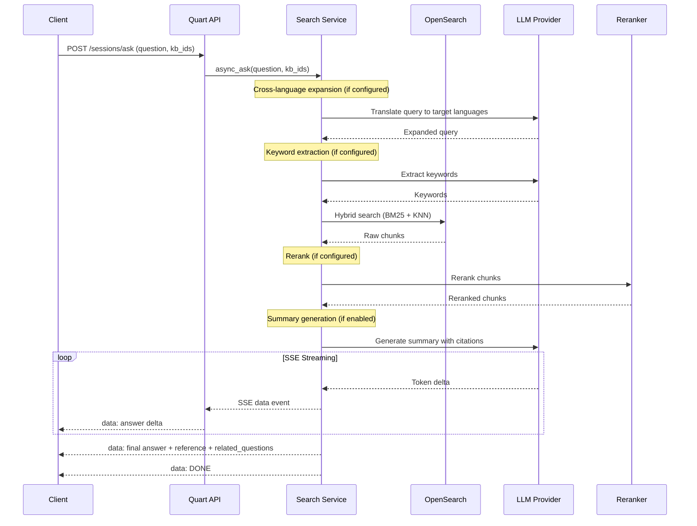
```mermaid
sequenceDiagram
    participant Client
    participant QuartAPI as Quart API
    participant SearchService as Search Service
    participant OpenSearch
    participant LLM as LLM Provider
    participant Reranker

    Client->>QuartAPI: POST /sessions/ask (question, kb_ids)
    QuartAPI->>SearchService: async_ask(question, kb_ids)

    Note over SearchService: Cross-language expansion (if configured)
    SearchService->>LLM: Translate query to target languages
    LLM-->>SearchService: Expanded query

    Note over SearchService: Keyword extraction (if configured)
    SearchService->>LLM: Extract keywords
    LLM-->>SearchService: Keywords

    SearchService->>OpenSearch: Hybrid search (BM25 + KNN)
    OpenSearch-->>SearchService: Raw chunks

    Note over SearchService: Rerank (if configured)
    SearchService->>Reranker: Rerank chunks
    Reranker-->>SearchService: Reranked chunks

    Note over SearchService: Summary generation (if enabled)
    SearchService->>LLM: Generate summary with citations

    loop SSE Streaming
        LLM-->>SearchService: Token delta
        SearchService-->>QuartAPI: SSE data event
        QuartAPI-->>Client: data: answer delta
    end

    SearchService-->>Client: data: final answer + reference + related_questions
    SearchService-->>Client: data: DONE
```

### 2.4 Configuration Model (search_config fields)

| Field | Type | Default | Description |
|-------|------|---------|-------------|
| `kb_ids` | string[] | `[]` | Knowledge base (dataset) IDs to search |
| `doc_ids` | string[] | `[]` | Specific document ID filter |
| `similarity_threshold` | float | `0.2` | Minimum similarity score |
| `vector_similarity_weight` | float | `0.3` | Weight for vector vs keyword in hybrid |
| `use_kg` | bool | `false` | Enable knowledge graph retrieval |
| `rerank_id` | string | `""` | Rerank model identifier |
| `top_k` | int | `1024` | Maximum chunks to retrieve |
| `summary` | bool | `false` | Enable AI summary generation |
| `chat_id` | string | `""` | LLM model identifier |
| `llm_setting` | object | `{}` | LLM parameters (temperature, top_p, etc.) |
| `cross_languages` | string[] | `[]` | Target languages for cross-language expansion |
| `highlight` | bool | `false` | Highlight matching terms |
| `keyword` | bool | `false` | Enable keyword extraction |
| `web_search` | bool | `false` | Enable web search augmentation |
| `related_search` | bool | `false` | Enable related question generation |
| `query_mindmap` | bool | `false` | Enable mind map generation |

### 2.5 Related Features

- **Mind Map**: Generates a hierarchical JSON tree structure from search results via LLM. Rendered as an interactive tree visualization in the frontend.
- **Related Questions**: Uses LLM to generate 5-10 related search terms from the user's query. Displayed as clickable suggestions below search results.

### 2.6 Sharing and Embedding

RAGFlow shares search apps via `APIToken` records with a `beta` field. External consumers authenticate with `Authorization: Bearer <token>` headers. The shared endpoints (`/searchbots/*`) provide ask, retrieval test, related questions, detail, and mind map functionality without requiring session authentication.

### 2.7 Feature List

| Feature | Description |
|---------|-------------|
| Search app CRUD | Create, update, detail, list, delete search configurations |
| Multi-dataset search | Search across multiple knowledge bases simultaneously |
| Hybrid search | Combine BM25 full-text and KNN vector search |
| AI summary | LLM-generated answer from retrieved chunks (SSE streaming) |
| Cross-language | Query expansion into multiple languages |
| Keyword extraction | LLM-based keyword extraction for broader retrieval |
| Reranking | Post-retrieval reranking with dedicated rerank models |
| Web search | Augment results with web search via external API |
| Knowledge graph | Graph-based retrieval for entity relationships |
| Related questions | LLM-generated follow-up question suggestions |
| Mind map | Hierarchical topic visualization from search results |
| Metadata filtering | Filter results by document metadata conditions |
| Retrieval test | Dry-run search without LLM for tuning parameters |
| Sharing/embedding | Token-based access for external consumers |
| Highlight | Matching term highlighting in results |

---

## 3. B-Knowledge Search Architecture (Current)

### 3.1 Data Model

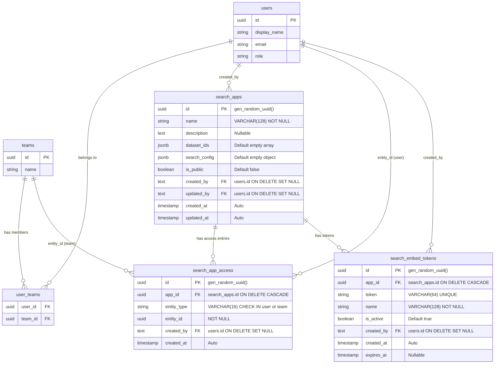
```mermaid
erDiagram
    users {
        uuid id PK
        string display_name
        string email
        string role
    }
    teams {
        uuid id PK
        string name
    }
    user_teams {
        uuid user_id FK
        uuid team_id FK
    }
    search_apps {
        uuid id PK "gen_random_uuid()"
        string name "VARCHAR(128) NOT NULL"
        text description "Nullable"
        jsonb dataset_ids "Default empty array"
        jsonb search_config "Default empty object"
        boolean is_public "Default false"
        text created_by FK "users.id ON DELETE SET NULL"
        text updated_by FK "users.id ON DELETE SET NULL"
        timestamp created_at "Auto"
        timestamp updated_at "Auto"
    }
    search_app_access {
        uuid id PK "gen_random_uuid()"
        uuid app_id FK "search_apps.id ON DELETE CASCADE"
        string entity_type "VARCHAR(16) CHECK IN user or team"
        uuid entity_id "NOT NULL"
        text created_by FK "users.id ON DELETE SET NULL"
        timestamp created_at "Auto"
    }
    search_embed_tokens {
        uuid id PK "gen_random_uuid()"
        uuid app_id FK "search_apps.id ON DELETE CASCADE"
        string token "VARCHAR(64) UNIQUE"
        string name "VARCHAR(128) NOT NULL"
        boolean is_active "Default true"
        text created_by FK "users.id ON DELETE SET NULL"
        timestamp created_at "Auto"
        timestamp expires_at "Nullable"
    }

    users ||--o{ user_teams : "belongs to"
    teams ||--o{ user_teams : "has members"
    users ||--o{ search_apps : "created_by"
    search_apps ||--o{ search_app_access : "has access entries"
    users ||--o{ search_app_access : "entity_id (user)"
    teams ||--o{ search_app_access : "entity_id (team)"
    search_apps ||--o{ search_embed_tokens : "has tokens"
    users ||--o{ search_embed_tokens : "created_by"
```

**Indexes:**
- `search_app_access`: unique constraint on `(app_id, entity_type, entity_id)`; indexes on `app_id` and `(entity_type, entity_id)`
- `search_embed_tokens`: unique constraint on `token`; indexes on `app_id` and `token`

### 3.2 API Endpoints

#### Search App Management (Admin)

| Method | Route | Description | Auth | Permission |
|--------|-------|-------------|------|------------|
| POST | `/api/search/apps` | Create search app | Session | `manage_users` |
| GET | `/api/search/apps` | List search apps (RBAC-filtered, paginated) | Session | Any |
| GET | `/api/search/apps/:id` | Get search app by ID | Session | Any |
| PUT | `/api/search/apps/:id` | Update search app | Session | `manage_users` |
| DELETE | `/api/search/apps/:id` | Delete search app | Session | `manage_users` |

#### Access Control (Admin)

| Method | Route | Description | Auth | Permission |
|--------|-------|-------------|------|------------|
| GET | `/api/search/apps/:id/access` | Get access entries | Session | `manage_users` |
| PUT | `/api/search/apps/:id/access` | Set access entries (bulk replace) | Session | `manage_users` |

#### Search Execution (Authenticated Users)

| Method | Route | Description | Auth | Permission |
|--------|-------|-------------|------|------------|
| POST | `/api/search/apps/:id/search` | Execute search with pagination | Session | Any |
| POST | `/api/search/apps/:id/ask` | SSE streaming AI summary | Session | Any |
| POST | `/api/search/apps/:id/related-questions` | Generate related questions | Session | Any |
| POST | `/api/search/apps/:id/mindmap` | Generate mind map JSON | Session | Any |
| POST | `/api/search/apps/:id/retrieval-test` | Dry-run retrieval test | Session | Any |

#### Embed Token Management (Admin)

| Method | Route | Description | Auth | Permission |
|--------|-------|-------------|------|------------|
| POST | `/api/search/apps/:id/embed-tokens` | Create embed token | Session | `manage_users` |
| GET | `/api/search/apps/:id/embed-tokens` | List embed tokens (masked) | Session | `manage_users` |
| DELETE | `/api/search/embed-tokens/:tokenId` | Revoke embed token | Session | `manage_users` |

#### Public Embed Endpoints (Token-based)

| Method | Route | Description | Auth |
|--------|-------|-------------|------|
| GET | `/api/search/embed/:token/info` | Get app name/description | Token (64-char hex) |
| POST | `/api/search/embed/:token/ask` | SSE streaming search | Token (64-char hex) |

#### OpenAI-Compatible API (Bearer Token)

| Method | Route | Description | Auth |
|--------|-------|-------------|------|
| POST | `/api/v1/search/completions` | OpenAI-format search completion | Bearer token (embed token) |

### 3.3 Search Pipeline (askSearch SSE Flow)

#### Sequence Diagram

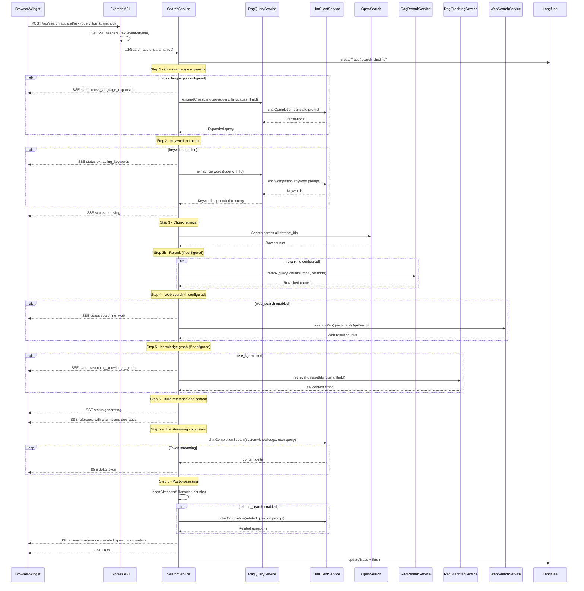
```mermaid
sequenceDiagram
    participant Client as Browser/Widget
    participant Express as Express API
    participant SearchSvc as SearchService
    participant RagQuery as RagQueryService
    participant LLMClient as LlmClientService
    participant OpenSearch
    participant RerankSvc as RagRerankService
    participant GraphRAG as RagGraphragService
    participant WebSearch as WebSearchService
    participant Langfuse

    Client->>Express: POST /api/search/apps/:id/ask (query, top_k, method)
    Express->>Express: Set SSE headers (text/event-stream)
    Express->>SearchSvc: askSearch(appId, params, res)

    SearchSvc->>Langfuse: createTrace('search-pipeline')

    Note over SearchSvc: Step 1 - Cross-language expansion
    alt cross_languages configured
        SearchSvc-->>Client: SSE status cross_language_expansion
        SearchSvc->>RagQuery: expandCrossLanguage(query, languages, llmId)
        RagQuery->>LLMClient: chatCompletion(translate prompt)
        LLMClient-->>RagQuery: Translations
        RagQuery-->>SearchSvc: Expanded query
    end

    Note over SearchSvc: Step 2 - Keyword extraction
    alt keyword enabled
        SearchSvc-->>Client: SSE status extracting_keywords
        SearchSvc->>RagQuery: extractKeywords(query, llmId)
        RagQuery->>LLMClient: chatCompletion(keyword prompt)
        LLMClient-->>RagQuery: Keywords
        RagQuery-->>SearchSvc: Keywords appended to query
    end

    SearchSvc-->>Client: SSE status retrieving

    Note over SearchSvc: Step 3 - Chunk retrieval
    SearchSvc->>OpenSearch: Search across all dataset_ids
    OpenSearch-->>SearchSvc: Raw chunks

    Note over SearchSvc: Step 3b - Rerank (if configured)
    alt rerank_id configured
        SearchSvc->>RerankSvc: rerank(query, chunks, topK, rerankId)
        RerankSvc-->>SearchSvc: Reranked chunks
    end

    Note over SearchSvc: Step 4 - Web search (if configured)
    alt web_search enabled
        SearchSvc-->>Client: SSE status searching_web
        SearchSvc->>WebSearch: searchWeb(query, tavilyApiKey, 3)
        WebSearch-->>SearchSvc: Web result chunks
    end

    Note over SearchSvc: Step 5 - Knowledge graph (if configured)
    alt use_kg enabled
        SearchSvc-->>Client: SSE status searching_knowledge_graph
        SearchSvc->>GraphRAG: retrieval(datasetIds, query, llmId)
        GraphRAG-->>SearchSvc: KG context string
    end

    Note over SearchSvc: Step 6 - Build reference and context
    SearchSvc-->>Client: SSE status generating
    SearchSvc-->>Client: SSE reference with chunks and doc_aggs

    Note over SearchSvc: Step 7 - LLM streaming completion
    SearchSvc->>LLMClient: chatCompletionStream(system+knowledge, user query)

    loop Token streaming
        LLMClient-->>SearchSvc: content delta
        SearchSvc-->>Client: SSE delta token
    end

    Note over SearchSvc: Step 8 - Post-processing
    SearchSvc->>SearchSvc: insertCitations(fullAnswer, chunks)

    alt related_search enabled
        SearchSvc->>LLMClient: chatCompletion(related question prompt)
        LLMClient-->>SearchSvc: Related questions
    end

    SearchSvc-->>Client: SSE answer + reference + related_questions + metrics
    SearchSvc-->>Client: SSE DONE
    SearchSvc->>Langfuse: updateTrace + flush
```

#### Conditional Pipeline Steps Flowchart

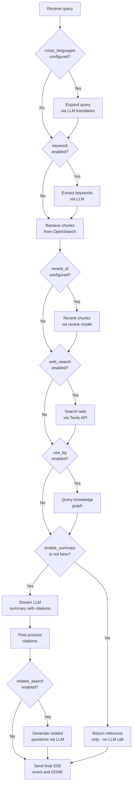
```mermaid
flowchart TD
    A[Receive query] --> B{cross_languages<br>configured?}
    B -->|Yes| C[Expand query<br>via LLM translation]
    B -->|No| D{keyword<br>enabled?}
    C --> D
    D -->|Yes| E[Extract keywords<br>via LLM]
    D -->|No| F[Retrieve chunks<br>from OpenSearch]
    E --> F
    F --> G{rerank_id<br>configured?}
    G -->|Yes| H[Rerank chunks<br>via rerank model]
    G -->|No| I{web_search<br>enabled?}
    H --> I
    I -->|Yes| J[Search web<br>via Tavily API]
    I -->|No| K{use_kg<br>enabled?}
    J --> K
    K -->|Yes| L[Query knowledge<br>graph]
    K -->|No| M{enable_summary<br>is not false?}
    L --> M
    M -->|No| N[Return reference<br>only - no LLM call]
    M -->|Yes| O[Stream LLM<br>summary with citations]
    O --> P[Post-process<br>citations]
    P --> Q{related_search<br>enabled?}
    Q -->|Yes| R[Generate related<br>questions via LLM]
    Q -->|No| S[Send final SSE<br>event and DONE]
    R --> S
    N --> S
```

### 3.4 Configuration Model

#### SearchAppConfig Fields

| Field | Type | Default | Description |
|-------|------|---------|-------------|
| `llm_id` | string | `undefined` | LLM provider ID for summary generation |
| `llm_setting` | SearchLlmSetting | `undefined` | LLM parameter overrides |
| `llm_setting.temperature` | number (0-2) | `0.7` | Response randomness |
| `llm_setting.top_p` | number (0-1) | `undefined` | Nucleus sampling |
| `llm_setting.max_tokens` | number (1-128000) | `undefined` | Max response tokens |
| `enable_summary` | boolean | `true` | Toggle AI summary on/off |
| `cross_languages` | string | `undefined` | Comma-separated target languages |
| `rerank_id` | string | `undefined` | Rerank model ID |
| `keyword` | boolean | `false` | Enable keyword extraction |
| `use_kg` | boolean | `false` | Enable knowledge graph retrieval |
| `web_search` | boolean | `false` | Enable Tavily web search |
| `tavily_api_key` | string | `undefined` | Tavily API key |
| `metadata_filter` | MetadataFilter | `undefined` | Default metadata filter conditions |
| `similarity_threshold` | number (0-1) | `0` | Minimum similarity score |
| `top_k` | number | `10` | Maximum results to retrieve |
| `search_method` | enum | `'hybrid'` | `full_text`, `semantic`, or `hybrid` |
| `vector_similarity_weight` | number (0-1) | `0.3` | Vector vs keyword weight |
| `highlight` | boolean | `false` | Highlight matching terms |
| `enable_related_questions` | boolean | `undefined` | Enable related question suggestions |
| `enable_mindmap` | boolean | `undefined` | Enable mind map generation |

#### Type Hierarchy

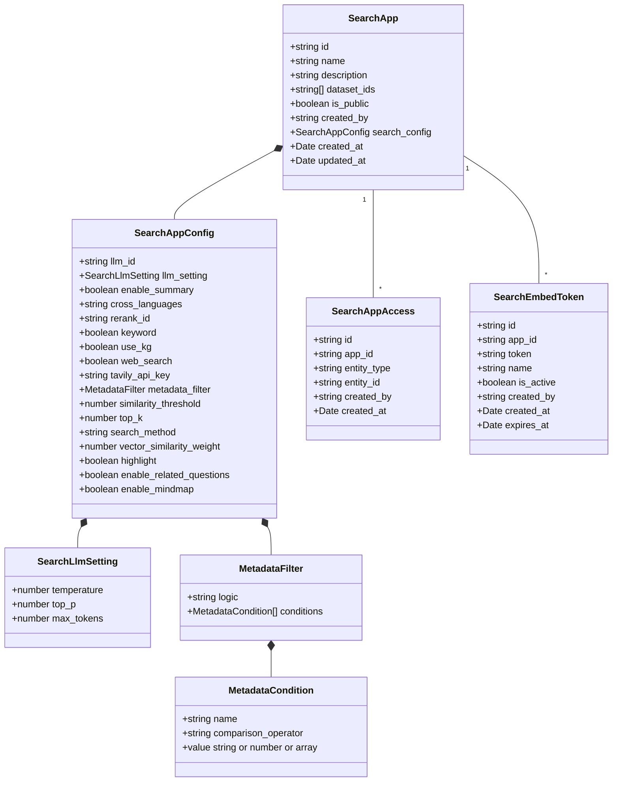
```mermaid
classDiagram
    class SearchApp {
        +string id
        +string name
        +string description
        +string[] dataset_ids
        +boolean is_public
        +string created_by
        +SearchAppConfig search_config
        +Date created_at
        +Date updated_at
    }

    class SearchAppConfig {
        +string llm_id
        +SearchLlmSetting llm_setting
        +boolean enable_summary
        +string cross_languages
        +string rerank_id
        +boolean keyword
        +boolean use_kg
        +boolean web_search
        +string tavily_api_key
        +MetadataFilter metadata_filter
        +number similarity_threshold
        +number top_k
        +string search_method
        +number vector_similarity_weight
        +boolean highlight
        +boolean enable_related_questions
        +boolean enable_mindmap
    }

    class SearchLlmSetting {
        +number temperature
        +number top_p
        +number max_tokens
    }

    class MetadataFilter {
        +string logic
        +MetadataCondition[] conditions
    }

    class MetadataCondition {
        +string name
        +string comparison_operator
        +value string or number or array
    }

    class SearchAppAccess {
        +string id
        +string app_id
        +string entity_type
        +string entity_id
        +string created_by
        +Date created_at
    }

    class SearchEmbedToken {
        +string id
        +string app_id
        +string token
        +string name
        +boolean is_active
        +string created_by
        +Date created_at
        +Date expires_at
    }

    SearchApp *-- SearchAppConfig
    SearchAppConfig *-- SearchLlmSetting
    SearchAppConfig *-- MetadataFilter
    MetadataFilter *-- MetadataCondition
    SearchApp "1" -- "*" SearchAppAccess
    SearchApp "1" -- "*" SearchEmbedToken
```

### 3.5 Access Control (RBAC)

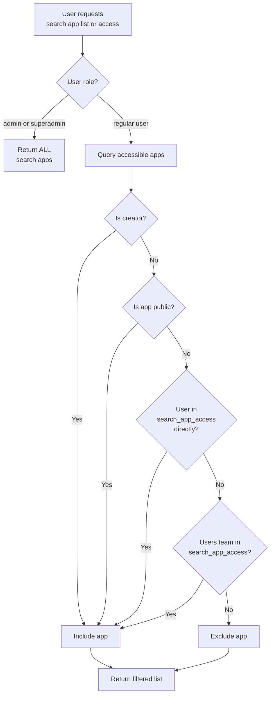
```mermaid
flowchart TD
    A[User requests<br>search app list or access] --> B{User role?}
    B -->|admin or superadmin| C[Return ALL<br>search apps]
    B -->|regular user| D[Query accessible apps]
    D --> E{Is creator?}
    E -->|Yes| F[Include app]
    E -->|No| G{Is app public?}
    G -->|Yes| F
    G -->|No| H{User in<br>search_app_access<br>directly?}
    H -->|Yes| F
    H -->|No| I{Users team in<br>search_app_access?}
    I -->|Yes| F
    I -->|No| J[Exclude app]
    F --> K[Return filtered list]
    J --> K
```

#### Access Matrix

| Role | Own apps | Public apps | Team-shared apps | User-shared apps | All apps |
|------|----------|-------------|------------------|------------------|----------|
| superadmin | Yes | Yes | Yes | Yes | Yes |
| admin | Yes | Yes | Yes | Yes | Yes |
| user | Yes | Yes | Yes | Yes | No |

#### Admin-only Operations

| Operation | Permission Required |
|-----------|-------------------|
| Create search app | `manage_users` |
| Update search app | `manage_users` |
| Delete search app | `manage_users` |
| Get/set access control | `manage_users` |
| Create/list/revoke embed tokens | `manage_users` |

### 3.6 Retrieval Testing

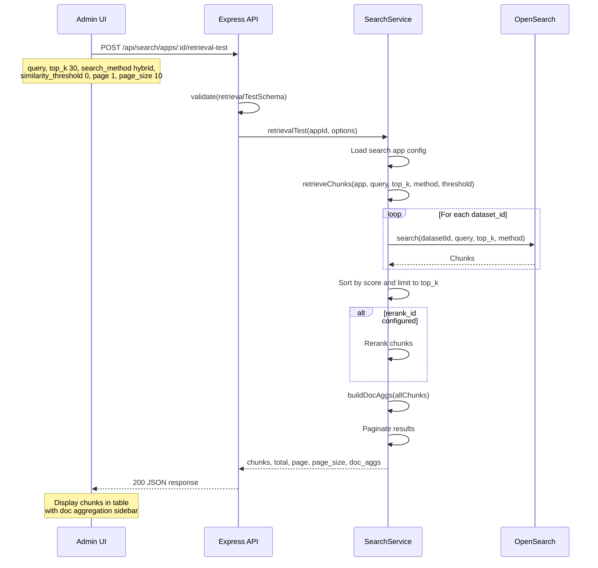
```mermaid
sequenceDiagram
    participant Admin as Admin UI
    participant Express as Express API
    participant SearchSvc as SearchService
    participant OpenSearch

    Admin->>Express: POST /api/search/apps/:id/retrieval-test
    Note over Admin: query, top_k 30, search_method hybrid,<br>similarity_threshold 0, page 1, page_size 10
    Express->>Express: validate(retrievalTestSchema)
    Express->>SearchSvc: retrievalTest(appId, options)

    SearchSvc->>SearchSvc: Load search app config
    SearchSvc->>SearchSvc: retrieveChunks(app, query, top_k, method, threshold)

    loop For each dataset_id
        SearchSvc->>OpenSearch: search(datasetId, query, top_k, method)
        OpenSearch-->>SearchSvc: Chunks
    end

    SearchSvc->>SearchSvc: Sort by score and limit to top_k

    alt rerank_id configured
        SearchSvc->>SearchSvc: Rerank chunks
    end

    SearchSvc->>SearchSvc: buildDocAggs(allChunks)
    SearchSvc->>SearchSvc: Paginate results

    SearchSvc-->>Express: chunks, total, page, page_size, doc_aggs
    Express-->>Admin: 200 JSON response

    Note over Admin: Display chunks in table<br>with doc aggregation sidebar
```

### 3.7 Embed Widget (Dual-Mode)

#### Internal vs External Auth Flow

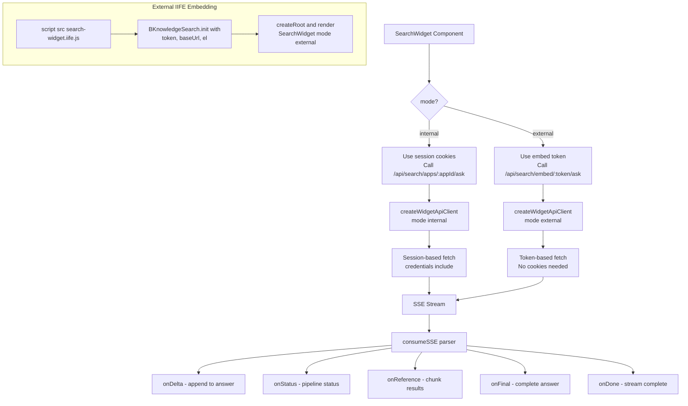
```mermaid
flowchart TD
    A[SearchWidget Component] --> B{mode?}
    B -->|internal| C[Use session cookies<br>Call /api/search/apps/:appId/ask]
    B -->|external| D[Use embed token<br>Call /api/search/embed/:token/ask]

    C --> E[createWidgetApiClient<br>mode internal]
    D --> F[createWidgetApiClient<br>mode external]

    E --> G[Session-based fetch<br>credentials include]
    F --> H[Token-based fetch<br>No cookies needed]

    G --> I[SSE Stream]
    H --> I

    I --> J[consumeSSE parser]
    J --> K[onDelta - append to answer]
    J --> L[onStatus - pipeline status]
    J --> M[onReference - chunk results]
    J --> N[onFinal - complete answer]
    J --> O[onDone - stream complete]

    subgraph "External IIFE Embedding"
        P["script src search-widget.iife.js"] --> Q["BKnowledgeSearch.init with<br>token, baseUrl, el"]
        Q --> R[createRoot and render<br>SearchWidget mode external]
    end
```

#### External Widget Search Flow

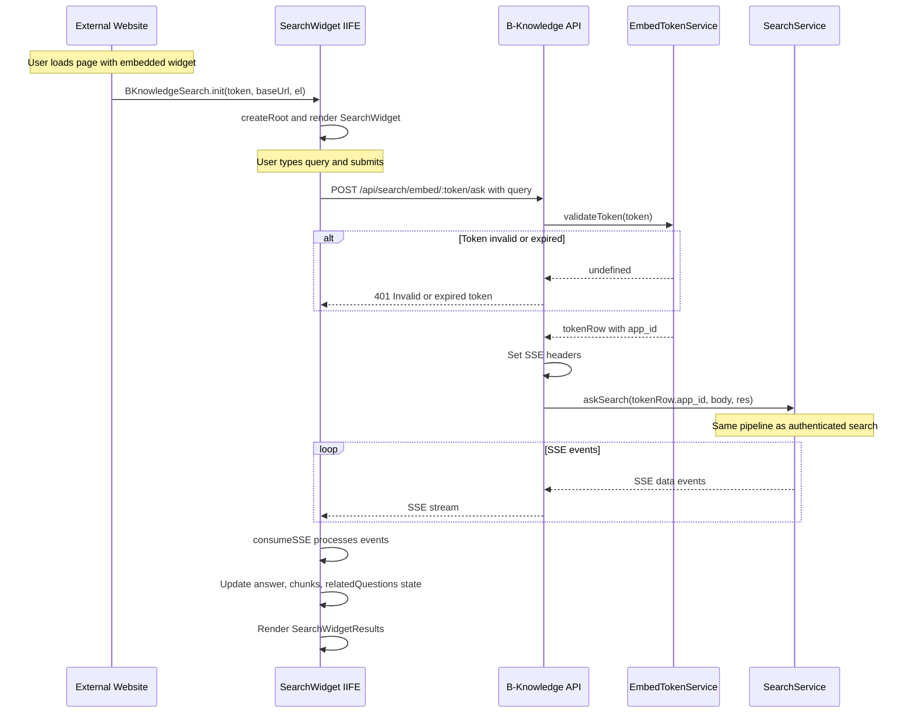
```mermaid
sequenceDiagram
    participant ExtSite as External Website
    participant Widget as SearchWidget IIFE
    participant API as B-Knowledge API
    participant EmbedSvc as EmbedTokenService
    participant SearchSvc as SearchService

    Note over ExtSite: User loads page with embedded widget
    ExtSite->>Widget: BKnowledgeSearch.init(token, baseUrl, el)
    Widget->>Widget: createRoot and render SearchWidget

    Note over Widget: User types query and submits
    Widget->>API: POST /api/search/embed/:token/ask with query
    API->>EmbedSvc: validateToken(token)

    alt Token invalid or expired
        EmbedSvc-->>API: undefined
        API-->>Widget: 401 Invalid or expired token
    end

    EmbedSvc-->>API: tokenRow with app_id
    API->>API: Set SSE headers
    API->>SearchSvc: askSearch(tokenRow.app_id, body, res)

    Note over SearchSvc: Same pipeline as authenticated search

    loop SSE events
        SearchSvc-->>API: SSE data events
        API-->>Widget: SSE stream
    end

    Widget->>Widget: consumeSSE processes events
    Widget->>Widget: Update answer, chunks, relatedQuestions state
    Widget->>Widget: Render SearchWidgetResults
```

### 3.8 OpenAI-Compatible API

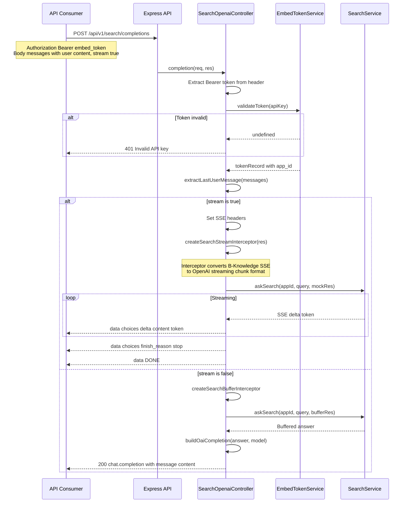
```mermaid
sequenceDiagram
    participant Consumer as API Consumer
    participant Express as Express API
    participant OaiCtrl as SearchOpenaiController
    participant EmbedSvc as EmbedTokenService
    participant SearchSvc as SearchService

    Consumer->>Express: POST /api/v1/search/completions
    Note over Consumer: Authorization Bearer embed_token<br>Body messages with user content, stream true

    Express->>OaiCtrl: completion(req, res)
    OaiCtrl->>OaiCtrl: Extract Bearer token from header
    OaiCtrl->>EmbedSvc: validateToken(apiKey)

    alt Token invalid
        EmbedSvc-->>OaiCtrl: undefined
        OaiCtrl-->>Consumer: 401 Invalid API key
    end

    EmbedSvc-->>OaiCtrl: tokenRecord with app_id
    OaiCtrl->>OaiCtrl: extractLastUserMessage(messages)

    alt stream is true
        OaiCtrl->>OaiCtrl: Set SSE headers
        OaiCtrl->>OaiCtrl: createSearchStreamInterceptor(res)
        Note over OaiCtrl: Interceptor converts B-Knowledge SSE<br>to OpenAI streaming chunk format
        OaiCtrl->>SearchSvc: askSearch(appId, query, mockRes)

        loop Streaming
            SearchSvc-->>OaiCtrl: SSE delta token
            OaiCtrl-->>Consumer: data choices delta content token
        end

        OaiCtrl-->>Consumer: data choices finish_reason stop
        OaiCtrl-->>Consumer: data DONE
    else stream is false
        OaiCtrl->>OaiCtrl: createSearchBufferInterceptor
        OaiCtrl->>SearchSvc: askSearch(appId, query, bufferRes)
        SearchSvc-->>OaiCtrl: Buffered answer
        OaiCtrl->>OaiCtrl: buildOaiCompletion(answer, model)
        OaiCtrl-->>Consumer: 200 chat.completion with message content
    end
```

---

## 4. Frontend Architecture

### 4.1 Component Tree

```mermaid
flowchart TD
    subgraph SearchPage["SearchPage (DatasetSearchPage)"]
        SB[SearchBar]
        SF[SearchFilters]
        SR[SearchResults]
        SDPD[SearchDocumentPreviewDrawer]
        SMMD[SearchMindMapDrawer]
        GD[GuidelineDialog]
    end

    SR --> SRC[SearchResultCard]
    SR --> RSQ[RelatedSearchQuestions]
    SR --> DFP[DocumentFilterPopover]
    SR --> CI[CitationInline]
    SR --> PAG[Pagination]
    SR --> PSI[PipelineStatusIndicator]
    CI --> MR[MarkdownRenderer]
    CI --> CB[CitationBadge with Popover]
    SMMD --> MMT[MindMapTree]
    SDPD --> IL[ImageLightbox]
    SRC --> SH[SearchHighlight]

    subgraph SearchAppManagementPage["SearchAppManagementPage (Admin)"]
        SAMP_Search[Input Search]
        SAMP_Table[Table of Search Apps]
        SAMP_Pag[Pagination]
        SAC[SearchAppConfig Dialog]
        SAAD[SearchAppAccessDialog]
    end

    SAC --> SCL[SearchCrossLanguage]
    SAC --> SRT[SearchRetrievalTest]
    SAC --> MFB[MetadataFilterBuilder]
```

### 4.2 State Management

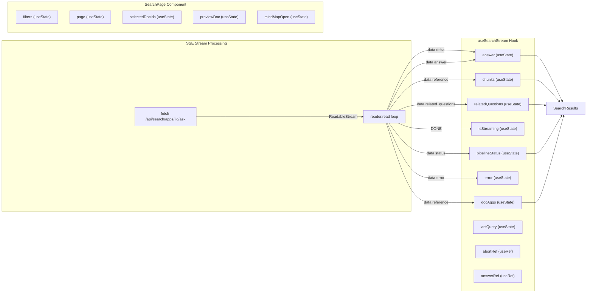
```mermaid
flowchart LR
    subgraph "useSearchStream Hook"
        SS_answer["answer (useState)"]
        SS_chunks["chunks (useState)"]
        SS_related["relatedQuestions (useState)"]
        SS_streaming["isStreaming (useState)"]
        SS_status["pipelineStatus (useState)"]
        SS_error["error (useState)"]
        SS_docAggs["docAggs (useState)"]
        SS_lastQuery["lastQuery (useState)"]
        SS_abortRef["abortRef (useRef)"]
        SS_answerRef["answerRef (useRef)"]
    end

    subgraph "SSE Stream Processing"
        SSE["fetch /api/search/apps/:id/ask"]
        SSE -->|ReadableStream| Reader[reader.read loop]
        Reader -->|data delta| SS_answer
        Reader -->|data status| SS_status
        Reader -->|data reference| SS_chunks
        Reader -->|data reference| SS_docAggs
        Reader -->|data answer| SS_answer
        Reader -->|data related_questions| SS_related
        Reader -->|data error| SS_error
        Reader -->|DONE| SS_streaming
    end

    subgraph "SearchPage Component"
        SP_filters["filters (useState)"]
        SP_page["page (useState)"]
        SP_selectedDocs["selectedDocIds (useState)"]
        SP_previewDoc["previewDoc (useState)"]
        SP_mindMap["mindMapOpen (useState)"]
    end

    SS_answer --> SearchResults
    SS_chunks --> SearchResults
    SS_related --> SearchResults
    SS_status --> SearchResults
    SS_docAggs --> SearchResults
```

### 4.3 Key Components

#### SearchBar

| Prop | Type | Description |
|------|------|-------------|
| `onSearch` | `(query: string) => void` | Callback on submit |
| `isSearching` | `boolean` | Disable input during search |
| `defaultValue` | `string` | Pre-filled query text |
| `className` | `string` | CSS class override |
| `onStop` | `() => void` | Stop streaming callback |
| `isStreaming` | `boolean` | Show stop button |

#### SearchResults

| Prop | Type | Description |
|------|------|-------------|
| `results` | `SearchResult[]` | Chunk results array |
| `isSearching` | `boolean` | Loading indicator |
| `summary` | `string` | Non-streaming summary |
| `totalResults` | `number` | Total result count |
| `query` | `string` | Query for highlighting |
| `onResultClick` | `(result) => void` | Open document preview |
| `streamingAnswer` | `string` | Accumulated streaming answer |
| `relatedQuestions` | `string[]` | Follow-up suggestions |
| `onRelatedQuestionClick` | `(q: string) => void` | Re-run search |
| `isStreamingAnswer` | `boolean` | Show cursor animation |
| `docAggs` | `DocAgg[]` | Document aggregation data |
| `pipelineStatus` | `string` | Current pipeline stage |
| `onStopStream` | `() => void` | Abort stream |
| `page` / `pageSize` / `onPageChange` | `number` / `number` / `(n) => void` | Pagination controls |
| `reference` | `ChatReference` | Citation data for CitationInline |
| `onCitationClick` | `(chunk) => void` | Open doc preview from citation |

#### SearchWidget

| Prop | Type | Description |
|------|------|-------------|
| `mode` | `'internal' or 'external'` | Auth mode |
| `appId` | `string` | Search app ID (internal mode) |
| `token` | `string` | Embed token (external mode) |
| `baseUrl` | `string` | API base URL (external mode) |
| `placeholder` | `string` | Input placeholder text |

#### SearchAppConfig (Dialog)

| Prop | Type | Description |
|------|------|-------------|
| `open` | `boolean` | Dialog visibility |
| `onClose` | `() => void` | Close callback |
| `onSave` | `(data) => void` | Save callback |
| `app` | `SearchApp or null` | Existing app for edit mode |

### 4.4 Admin Pages

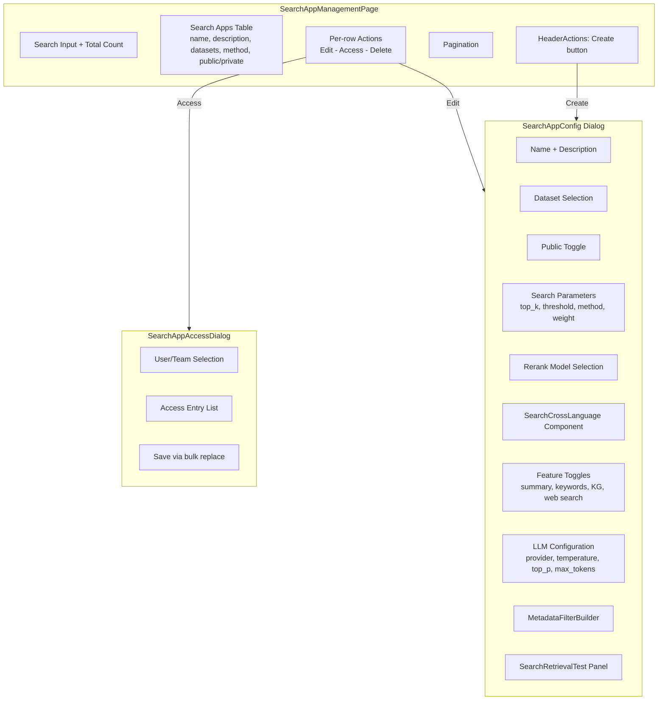
```mermaid
flowchart TD
    subgraph SearchAppManagementPage
        Header["Search Input + Total Count"]
        Table["Search Apps Table<br>name, description, datasets, method, public/private"]
        Actions["Per-row Actions<br>Edit - Access - Delete"]
        Pag["Pagination"]
        HAct["HeaderActions: Create button"]
    end

    Actions -->|Edit| ConfigDialog["SearchAppConfig Dialog"]
    Actions -->|Access| AccessDialog["SearchAppAccessDialog"]
    HAct -->|Create| ConfigDialog

    subgraph ConfigDialog["SearchAppConfig Dialog"]
        CD_Name["Name + Description"]
        CD_Datasets["Dataset Selection"]
        CD_Public["Public Toggle"]
        CD_Params["Search Parameters<br>top_k, threshold, method, weight"]
        CD_Rerank["Rerank Model Selection"]
        CD_CrossLang["SearchCrossLanguage Component"]
        CD_Features["Feature Toggles<br>summary, keywords, KG, web search"]
        CD_LLM["LLM Configuration<br>provider, temperature, top_p, max_tokens"]
        CD_Meta["MetadataFilterBuilder"]
        CD_Test["SearchRetrievalTest Panel"]
    end

    subgraph AccessDialog["SearchAppAccessDialog"]
        AD_Users["User/Team Selection"]
        AD_Entries["Access Entry List"]
        AD_Save["Save via bulk replace"]
    end
```

---

## 5. Comparison: RAGFlow vs B-Knowledge

| Feature | RAGFlow | B-Knowledge |
|---------|---------|-------------|
| **Language / Framework** | Python / Quart (async) | Node.js / Express (TypeScript) |
| **Database** | MySQL (Peewee ORM) | PostgreSQL (Knex ORM) |
| **Search config storage** | `search_config` JSON embeds `kb_ids` | `dataset_ids` is a top-level JSONB column; `search_config` is separate |
| **Access control** | `tenant_id`-based ownership only | RBAC with `search_app_access` junction table (user/team grants + public flag) |
| **Embed tokens** | `APIToken.beta` field shared with chat | Dedicated `search_embed_tokens` table with expiration and revocation |
| **Token format** | Variable-length API token | 64-char cryptographic hex token |
| **Token caching** | None | 30-second in-memory validation cache |
| **OpenAI-compatible API** | Not available for search | `POST /api/v1/search/completions` with streaming and non-streaming modes |
| **SSE format** | `data: {code, message, data}` | `data: {delta, status, reference, answer, related_questions, metrics}` |
| **Streaming granularity** | Full answer in data.answer per event | Token-level deltas for real-time streaming |
| **Pipeline observability** | None | Langfuse tracing with per-step spans |
| **Citation format** | Backend citation insertion | `##ID:n$` markers with interactive popover badges |
| **Mind map** | `gen_mindmap()` via dialog_service | Direct LLM call with JSON output parsing |
| **Related questions** | LLM prompt, parse numbered list | LLM prompt, parse line-separated output |
| **Web search** | Supported in config | Tavily integration with `tavily_api_key` in config |
| **Knowledge graph** | `use_kg` in config | `use_kg` with `ragGraphragService.retrieval()` |
| **Metadata filtering** | `meta_data_filter` with auto/semi_auto/manual modes | `metadata_filter` with logic/conditions DSL translated to OpenSearch bool queries |
| **Frontend framework** | React (Ant Design) | React 19 (shadcn/ui + Tailwind) |
| **Embed widget** | iframe-based sharing | Dual-mode React component (internal session + external IIFE bundle) |
| **Search list page** | Card grid with pagination | Admin table with server-side search/pagination/sorting |
| **Retrieval test** | Via `/searchbots/retrieval_test` | Integrated into config dialog with `SearchRetrievalTest` component |

---

## 6. Use Cases

### UC-01: Admin Creates Search App

- **Actor**: Admin user
- **Precondition**: User has `manage_users` permission and at least one dataset exists
- **Flow**:
  1. Admin navigates to Search App Management page
  2. Clicks "Create" button, opening SearchAppConfig dialog
  3. Enters name, optional description
  4. Selects one or more datasets from the dataset list
  5. Optionally configures search parameters, LLM, and feature toggles
  6. Clicks Save
  7. Frontend calls `POST /api/search/apps` with `CreateSearchAppPayload`
  8. Backend validates name uniqueness (case-insensitive), creates record
  9. Returns 201 with created search app
  10. Frontend invalidates query cache, app appears in table
- **Postcondition**: New search app exists in `search_apps` table
- **Alternative flows**:
  - **A1**: Duplicate name returns 409 error
  - **A2**: No datasets selected fails Zod validation (min 1)

### UC-02: Admin Configures Search Pipeline

- **Actor**: Admin user
- **Precondition**: Search app exists
- **Flow**:
  1. Admin clicks Edit on a search app row
  2. SearchAppConfig dialog opens pre-populated with current config
  3. Admin adjusts: similarity threshold, top_k, search method, vector weight
  4. Enables/disables features: summary, keyword extraction, KG, web search, cross-language
  5. Configures LLM: selects provider, adjusts temperature/top_p/max_tokens
  6. Optionally sets metadata filter conditions
  7. Clicks Save
  8. Frontend calls `PUT /api/search/apps/:id` with updated payload
  9. Backend updates record
- **Postcondition**: Search app config updated, subsequent searches use new config
- **Alternative flows**:
  - **A1**: Admin runs retrieval test within the dialog to verify parameter tuning

### UC-03: Admin Grants Access

- **Actor**: Admin user
- **Precondition**: Search app exists, users and/or teams exist
- **Flow**:
  1. Admin clicks Access (shield icon) on a search app row
  2. SearchAppAccessDialog opens showing current access entries
  3. Admin adds users and/or teams
  4. Clicks Save
  5. Frontend calls `PUT /api/search/apps/:id/access` with entries array
  6. Backend bulk-replaces all access entries in a transaction
- **Postcondition**: Only specified users/teams (plus creator, admins, and if public) can access the app
- **Alternative flows**:
  - **A1**: Admin toggles `is_public` to grant access to all authenticated users

### UC-04: Admin Manages Embed Tokens

- **Actor**: Admin user
- **Precondition**: Search app exists
- **Flow**:
  1. Admin opens embed token management for a search app
  2. Clicks "Create Token", enters name and optional expiration
  3. Frontend calls `POST /api/search/apps/:id/embed-tokens`
  4. Backend generates 64-char hex token, stores record
  5. Returns full token value (only shown once)
  6. Admin copies token for external use
- **Postcondition**: New embed token active in `search_embed_tokens` table
- **Alternative flows**:
  - **A1**: Admin revokes token via `DELETE /api/search/embed-tokens/:tokenId`
  - **A2**: Token expires and is rejected on next validation

### UC-05: Admin Runs Retrieval Test

- **Actor**: Admin user
- **Precondition**: Search app configured with datasets containing parsed documents

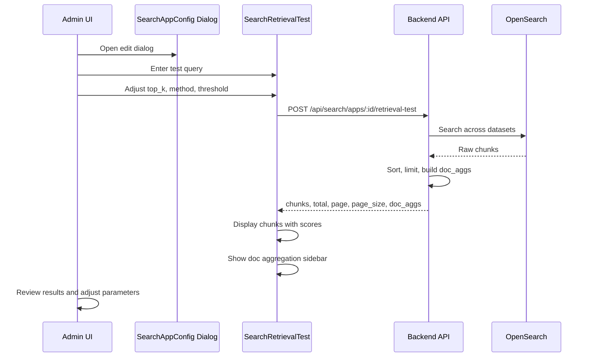
```mermaid
sequenceDiagram
    participant Admin as Admin UI
    participant Config as SearchAppConfig Dialog
    participant RT as SearchRetrievalTest
    participant API as Backend API
    participant OS as OpenSearch

    Admin->>Config: Open edit dialog
    Admin->>RT: Enter test query
    Admin->>RT: Adjust top_k, method, threshold
    RT->>API: POST /api/search/apps/:id/retrieval-test
    API->>OS: Search across datasets
    OS-->>API: Raw chunks
    API->>API: Sort, limit, build doc_aggs
    API-->>RT: chunks, total, page, page_size, doc_aggs
    RT->>RT: Display chunks with scores
    RT->>RT: Show doc aggregation sidebar
    Admin->>Admin: Review results and adjust parameters
```

- **Flow**:
  1. Within SearchAppConfig dialog, admin enters a test query
  2. Selects search method, adjusts top_k and threshold
  3. Clicks "Test" to trigger retrieval
  4. Backend returns paginated chunks with doc aggregations
  5. Admin reviews results, adjusts parameters, re-tests
- **Postcondition**: No data modified; admin has validated search quality
- **Alternative flows**:
  - **A1**: Filter by specific document IDs using `doc_ids` parameter

### UC-06: User Performs Search with AI Summary

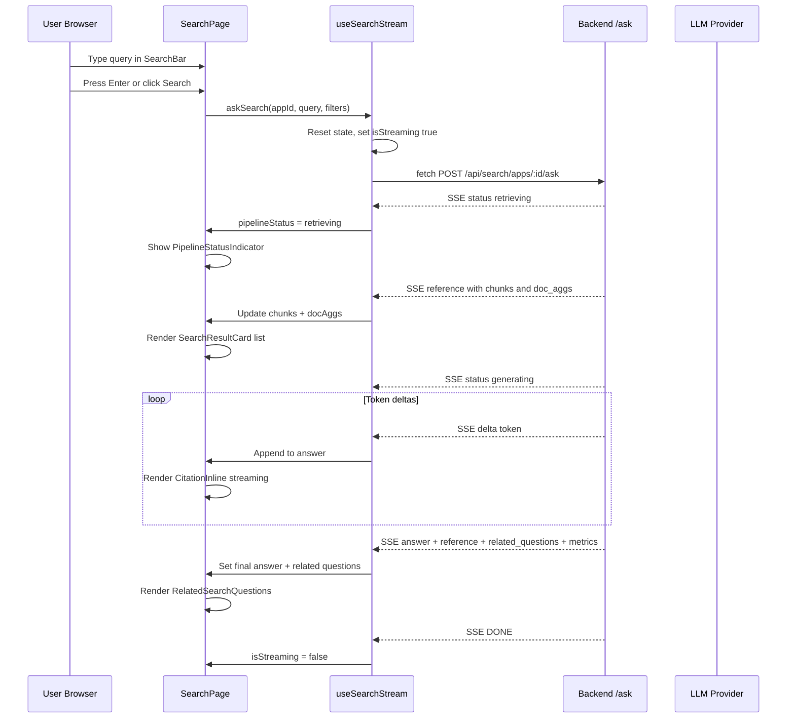
```mermaid
sequenceDiagram
    participant User as User Browser
    participant SP as SearchPage
    participant Hook as useSearchStream
    participant API as Backend /ask
    participant LLM as LLM Provider

    User->>SP: Type query in SearchBar
    User->>SP: Press Enter or click Search
    SP->>Hook: askSearch(appId, query, filters)
    Hook->>Hook: Reset state, set isStreaming true
    Hook->>API: fetch POST /api/search/apps/:id/ask

    API-->>Hook: SSE status retrieving
    Hook->>SP: pipelineStatus = retrieving
    SP->>SP: Show PipelineStatusIndicator

    API-->>Hook: SSE reference with chunks and doc_aggs
    Hook->>SP: Update chunks + docAggs
    SP->>SP: Render SearchResultCard list

    API-->>Hook: SSE status generating

    loop Token deltas
        API-->>Hook: SSE delta token
        Hook->>SP: Append to answer
        SP->>SP: Render CitationInline streaming
    end

    API-->>Hook: SSE answer + reference + related_questions + metrics
    Hook->>SP: Set final answer + related questions
    SP->>SP: Render RelatedSearchQuestions

    API-->>Hook: SSE DONE
    Hook->>SP: isStreaming = false
```

- **Flow**:
  1. User navigates to Search page (landing state with centered search bar)
  2. Types query and presses Enter
  3. Page transitions to results layout (search bar moves to top)
  4. Pipeline status indicator shows stages: "Searching knowledge base...", "Generating answer..."
  5. Document chunks appear as SearchResultCards
  6. AI summary streams token-by-token with cursor animation
  7. Final answer includes inline citation badges (`##ID:n$` markers)
  8. Related questions appear below results
- **Postcondition**: User sees ranked results with AI summary
- **Alternative flows**:
  - **A1**: User clicks Stop to abort streaming
  - **A2**: Summary disabled returns results without LLM call

### UC-07: User Views Citation in Document Preview

- **Actor**: Authenticated user
- **Precondition**: Search completed with results containing citations
- **Flow**:
  1. User hovers over a citation badge [n] in the AI summary
  2. Popover shows chunk content, document name, page number, relevance score
  3. User clicks the citation badge
  4. SearchDocumentPreviewDrawer opens with the source document
  5. Document scrolls to the relevant page/position
- **Postcondition**: User can verify the source of the cited information
- **Alternative flows**:
  - **A1**: User clicks a SearchResultCard directly to open preview

### UC-08: User Clicks Related Question

- **Actor**: Authenticated user
- **Precondition**: Search completed with related questions generated
- **Flow**:
  1. Related questions appear below the AI summary
  2. User clicks a question
  3. `handleRelatedQuestionClick` triggers new search with selected question
  4. Page resets pagination and runs full pipeline
  5. New results and summary appear
- **Postcondition**: New search executed with the related question

### UC-09: User Views Mind Map

- **Actor**: Authenticated user
- **Precondition**: Search completed
- **Flow**:
  1. User clicks "Mind Map" button in the search bar area
  2. SearchMindMapDrawer opens
  3. Frontend calls `POST /api/search/apps/:id/mindmap` with current query
  4. Backend retrieves chunks and generates hierarchical JSON via LLM
  5. MindMapTree component renders the interactive tree visualization
- **Postcondition**: User sees hierarchical topic visualization
- **Alternative flows**:
  - **A1**: LLM returns malformed JSON; backend returns fallback structure with raw text

### UC-10: User Filters Search Results

- **Actor**: Authenticated user
- **Precondition**: Search completed with results from multiple documents
- **Flow**:
  1. User toggles filter sidebar visibility
  2. Adjusts filters (search method, similarity threshold, etc.)
  3. `handleFiltersChange` re-runs search with updated filters
  4. Uses DocumentFilterPopover to filter by specific documents from doc_aggs
- **Postcondition**: Results filtered according to selected criteria

### UC-11: External Widget User Searches via Embed

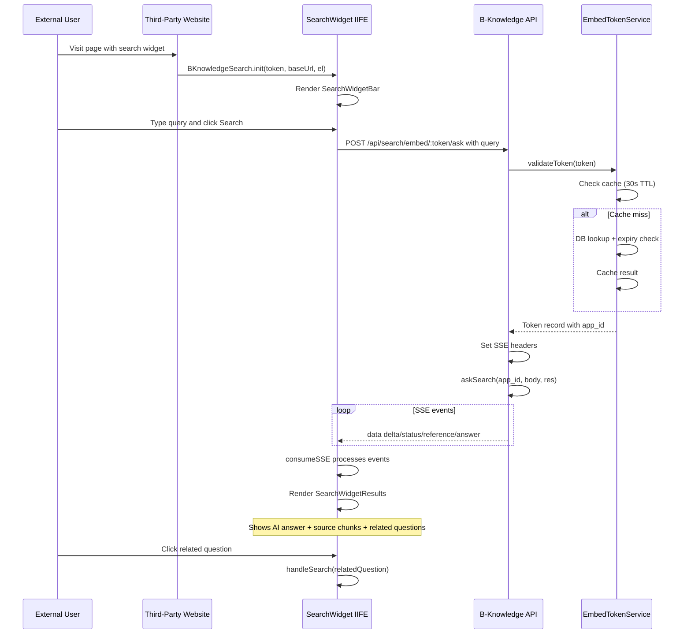
```mermaid
sequenceDiagram
    participant User as External User
    participant Site as Third-Party Website
    participant Widget as SearchWidget IIFE
    participant API as B-Knowledge API
    participant Embed as EmbedTokenService

    User->>Site: Visit page with search widget
    Site->>Widget: BKnowledgeSearch.init(token, baseUrl, el)
    Widget->>Widget: Render SearchWidgetBar

    User->>Widget: Type query and click Search
    Widget->>API: POST /api/search/embed/:token/ask with query
    API->>Embed: validateToken(token)
    Embed->>Embed: Check cache (30s TTL)

    alt Cache miss
        Embed->>Embed: DB lookup + expiry check
        Embed->>Embed: Cache result
    end

    Embed-->>API: Token record with app_id
    API->>API: Set SSE headers
    API->>API: askSearch(app_id, body, res)

    loop SSE events
        API-->>Widget: data delta/status/reference/answer
    end

    Widget->>Widget: consumeSSE processes events
    Widget->>Widget: Render SearchWidgetResults
    Note over Widget: Shows AI answer + source chunks + related questions

    User->>Widget: Click related question
    Widget->>Widget: handleSearch(relatedQuestion)
```

- **Flow**:
  1. External website includes IIFE script bundle
  2. Calls `BKnowledgeSearch.init()` with token, baseUrl, and container selector
  3. Widget renders SearchWidgetBar in the container
  4. User enters query and submits
  5. Widget calls public embed endpoint with token authentication
  6. Token validated (30s cache), mapped to search app
  7. Same search pipeline executes as authenticated search
  8. SSE events processed by `consumeSSE()` parser
  9. Results displayed: AI summary, source chunk cards (max 5), related questions
  10. User can click related questions for follow-up searches
- **Postcondition**: External user receives search results without B-Knowledge account
- **Alternative flows**:
  - **A1**: Expired/revoked token returns 401
  - **A2**: Internal mode uses session cookies instead of token

### UC-12: API Consumer Uses OpenAI-Compatible Endpoint

- **Actor**: External API consumer (SDK, CLI tool, custom integration)
- **Precondition**: Valid embed token exists for a search app
- **Flow**:
  1. Consumer sends request to `POST /api/v1/search/completions` with `Authorization: Bearer <embed_token>` and body containing `messages` array with user content and `stream: true`
  2. Controller extracts Bearer token, validates via `EmbedTokenService`
  3. Extracts last user message from messages array
  4. Creates stream interceptor that converts B-Knowledge SSE to OpenAI format
  5. Delegates to `searchService.askSearch()`
  6. Interceptor converts `{delta: "token"}` to `{choices: [{delta: {content: "token"}}]}`
  7. Final chunk includes `finish_reason: "stop"` followed by `[DONE]`
- **Postcondition**: Consumer receives OpenAI-compatible streaming/non-streaming response
- **Alternative flows**:
  - **A1**: `stream: false` buffers full answer and returns single JSON response
  - **A2**: Missing/invalid Bearer token returns 401 in OpenAI error format

---

## 7. Feature List (Complete)

| # | Feature | Description | Status | Location |
|---|---------|-------------|--------|----------|
| 1 | Search app CRUD | Create, read, update, delete search app configurations | Implemented | `be/src/modules/search/services/search.service.ts`, `be/src/modules/search/controllers/search.controller.ts` |
| 2 | Search app listing (RBAC) | Paginated list with access control filtering | Implemented | `SearchService.listAccessibleApps()` in `be/src/modules/search/services/search.service.ts` |
| 3 | Access control (user/team) | RBAC junction table with bulk replace | Implemented | `be/src/modules/search/models/search-app-access.model.ts`, `SearchService.getAppAccess/setAppAccess()` |
| 4 | Public search apps | `is_public` flag for universal access | Implemented | `search_apps.is_public` column, checked in `listAccessibleApps()` |
| 5 | Multi-dataset search | Search across multiple datasets, merge and rank results | Implemented | `SearchService.retrieveChunks()` loops over `dataset_ids` |
| 6 | Full-text search | BM25-based text search via OpenSearch | Implemented | `RagSearchService.fullTextSearch()` in `be/src/modules/rag/services/rag-search.service.ts` |
| 7 | Semantic search | KNN vector search via OpenSearch | Implemented | `RagSearchService.semanticSearch()` |
| 8 | Hybrid search | Combined full-text + semantic with deduplication | Implemented | `RagSearchService.hybridSearch()` |
| 9 | AI summary (SSE streaming) | LLM-generated answer with token-level delta streaming | Implemented | `SearchService.askSearch()` |
| 10 | Inline citations | `##ID:n$` markers rendered as interactive popover badges | Implemented | `fe/src/components/CitationInline.tsx`, `ragCitationService.insertCitations()` |
| 11 | Cross-language expansion | Query translation to target languages for multilingual retrieval | Implemented | `expandCrossLanguage()` in `be/src/shared/services/rag-query.service.ts` |
| 12 | Keyword extraction | LLM-based keyword extraction appended to query | Implemented | `extractKeywords()` in `be/src/shared/services/rag-query.service.ts` |
| 13 | Reranking | Post-retrieval reranking with configurable rerank model | Implemented | `ragRerankService.rerank()` called in `retrieveChunks()` |
| 14 | Web search (Tavily) | Augment KB results with web search results | Implemented | `searchWeb()` in `be/src/shared/services/web-search.service.ts` |
| 15 | Knowledge graph | Graph-based entity retrieval | Implemented | `ragGraphragService.retrieval()` |
| 16 | Related questions | LLM-generated follow-up question suggestions | Implemented | `SearchService.relatedQuestions()`, `fe/src/features/search/components/RelatedSearchQuestions.tsx` |
| 17 | Mind map | Hierarchical JSON tree visualization from search results | Implemented | `SearchService.mindmap()`, `fe/src/features/search/components/SearchMindMapDrawer.tsx`, `MindMapTree.tsx` |
| 18 | Metadata filtering | Structured filter conditions (is, is_not, contains, gt, lt, range) | Implemented | `RagSearchService.buildMetadataFilter()`, `fe/src/components/MetadataFilterBuilder.tsx` |
| 19 | Retrieval test | Dry-run search returning raw chunks with pagination and doc aggregation | Implemented | `SearchService.retrievalTest()`, `fe/src/features/search/components/SearchRetrievalTest.tsx` |
| 20 | Document preview | Side drawer with document rendering and position highlighting | Implemented | `fe/src/features/search/components/SearchDocumentPreviewDrawer.tsx` |
| 21 | Document filter | Filter results by document from doc_aggs | Implemented | `fe/src/features/search/components/DocumentFilterPopover.tsx` |
| 22 | Pipeline status indicator | Real-time SSE pipeline stage display | Implemented | `fe/src/components/PipelineStatusIndicator.tsx` |
| 23 | Embed tokens | Create, list (masked), revoke tokens with expiration | Implemented | `be/src/shared/services/embed-token.service.ts`, `be/src/modules/search/controllers/search-embed.controller.ts` |
| 24 | Token validation cache | 30-second in-memory cache for token lookups | Implemented | `EmbedTokenService.validationCache` |
| 25 | Embed widget (internal) | React component with session-based auth | Implemented | `fe/src/features/search-widget/SearchWidget.tsx` (mode='internal') |
| 26 | Embed widget (external) | IIFE bundle with token-based auth for third-party sites | Implemented | `fe/src/features/search-widget/index.ts` (IIFE init) |
| 27 | OpenAI-compatible API | `POST /api/v1/search/completions` with streaming/non-streaming | Implemented | `be/src/modules/search/controllers/search-openai.controller.ts`, `be/src/modules/search/routes/search-openai.routes.ts` |
| 28 | Langfuse tracing | Pipeline observability with trace and span tracking | Implemented | Langfuse spans in `SearchService.askSearch()` |
| 29 | Summary toggle | Disable AI summary to return only retrieval results | Implemented | `enable_summary` config field, short-circuit in `askSearch()` |
| 30 | Search highlight | Client-side term highlighting in result cards | Implemented | `fe/src/features/search/components/SearchHighlight.tsx` |
| 31 | Cross-language UI | UI component for configuring target languages | Implemented | `fe/src/features/search/components/SearchCrossLanguage.tsx` |
| 32 | Image lightbox | Image chunk preview with zoom | Implemented | `fe/src/features/search/components/ImageLightbox.tsx` |
| 33 | Admin management page | Table with search/pagination/CRUD/access for search apps | Implemented | `fe/src/features/search/pages/SearchAppManagementPage.tsx` |
| 34 | Config dialog | Dataset selection, parameter tuning, feature toggles, LLM config | Implemented | `fe/src/features/search/components/SearchAppConfig.tsx` |
| 35 | Access dialog | User/team access management per search app | Implemented | `fe/src/features/search/components/SearchAppAccessDialog.tsx` |
| 36 | First-visit guide | Guideline dialog for new users on search page | Implemented | `GuidelineDialog` integration in `SearchPage` |
| 37 | Zod validation | All mutation endpoints validated with Zod schemas | Implemented | `be/src/modules/search/schemas/search.schemas.ts`, `search-embed.schemas.ts` |
| 38 | Name uniqueness | Case-insensitive duplicate name check on create | Implemented | `SearchService.createSearchApp()` |
| 39 | URL state management | Page and search term stored in URL search params (admin page) | Implemented | `useSearchParams` in `SearchAppManagementPage` |
| 40 | Abort stream | User can stop streaming mid-response | Implemented | `useSearchStream.stopStream()` with AbortController |
