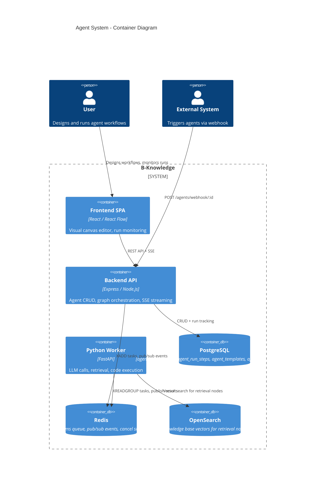
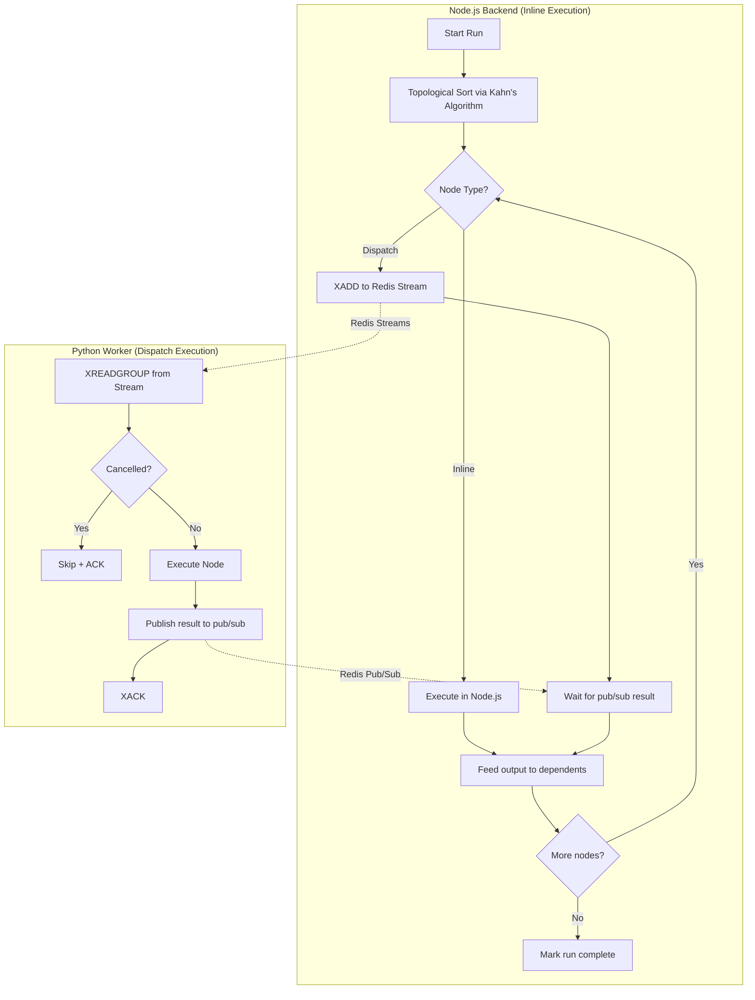
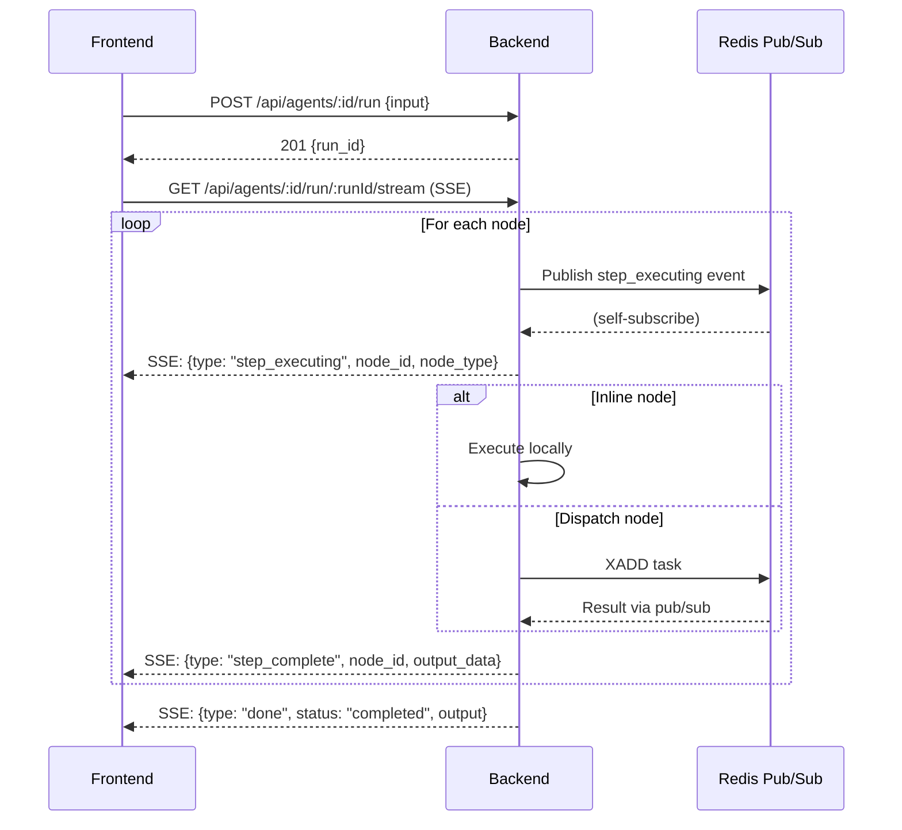

# Agent Architecture

## System Overview

The Agent system provides a visual workflow builder and execution engine for orchestrating multi-step AI tasks. It follows a hybrid architecture where lightweight operations run inline in Node.js while compute-heavy operations (LLM, retrieval, code execution) are dispatched to Python workers via Redis Streams.



## Execution Architecture

### Graph Orchestration

The execution engine uses Kahn's algorithm for topological sort, splitting nodes into two categories:



### Node Classification

| Category | Nodes | Execution |
|----------|-------|-----------|
| **Inline** | begin, answer, message, switch, condition, merge, note, concentrator, variable_assigner, variable_aggregator | Synchronous in Node.js — pure logic, no external I/O |
| **Dispatch** | generate, categorize, rewrite, relevant, retrieval, code, api, email, sql, all search/finance/tool nodes | Queued to Python via Redis Streams — LLM, network, or sandbox I/O |

### SSE Streaming Protocol



## Data Model

### Version-as-Row Pattern

Agents use a single-table versioning pattern where root agents and version snapshots coexist:

```mermaid
erDiagram
    AGENTS {
        text id PK
        text name
        text description
        enum mode "agent | pipeline"
        enum status "draft | published"
        jsonb dsl "Workflow graph"
        jsonb policy_rules "ABAC rules"
        text parent_id FK "NULL for root, root_id for versions"
        int version_number "0 for root, 1+ for snapshots"
        varchar version_label "Human-readable label"
        text tenant_id
        text project_id FK
        text created_by
    }

    AGENT_RUNS {
        text id PK
        text agent_id FK
        enum status "pending | running | completed | failed | cancelled"
        enum mode "agent | pipeline"
        text input
        text output
        text error
        int total_nodes
        int completed_nodes
        int duration_ms
        enum trigger_type "manual | webhook | embed"
        text triggered_by FK
        text tenant_id
    }

    AGENT_RUN_STEPS {
        text id PK
        text run_id FK
        text node_id
        text node_type
        text node_label
        enum status "pending | running | completed | failed | skipped"
        jsonb input_data
        jsonb output_data
        int execution_order
        int duration_ms
    }

    AGENT_TEMPLATES {
        text id PK
        text name
        text category
        enum mode "agent | pipeline"
        jsonb dsl
        boolean is_system
        text tenant_id "NULL for global"
    }

    AGENT_TOOL_CREDENTIALS {
        text id PK
        text tenant_id
        text agent_id FK "NULL for tenant defaults"
        varchar tool_type
        text encrypted_credentials "AES-256-CBC"
    }

    AGENTS ||--o{ AGENT_RUNS : "has"
    AGENT_RUNS ||--o{ AGENT_RUN_STEPS : "contains"
    AGENTS ||--o{ AGENTS : "parent_id versions"
```



### Version Queries

| Query | SQL Filter |
|-------|-----------|
| List root agents | `WHERE parent_id IS NULL` |
| List versions of agent X | `WHERE parent_id = 'X' ORDER BY version_number` |
| Restore version | Copy DSL from version row to root row |

## DSL Schema

The DSL (Domain-Specific Language) defines the workflow graph stored as JSONB:

```typescript
interface AgentDSL {
  nodes: Record<string, AgentNodeDef>
  edges: AgentEdgeDef[]
  variables: Record<string, AgentVariable>
  settings: {
    mode: 'agent' | 'pipeline'
    max_execution_time: number
    retry_on_failure: boolean
  }
}

interface AgentNodeDef {
  id: string
  type: OperatorType  // 60+ supported types
  position: { x: number; y: number }
  config: Record<string, unknown>
  label: string
}

interface AgentEdgeDef {
  source: string
  target: string
  sourceHandle?: string
  condition?: string
}
```

## Operator Categories

| Category | Color | Count | Examples |
|----------|-------|-------|---------|
| Input/Output | Blue | 4 | begin, answer, message, fillup |
| LLM/AI | Purple | 5 | generate, categorize, rewrite, relevant, agent_with_tools |
| Retrieval | Green | 6 | retrieval, wikipedia, tavily, pubmed, arxiv, google_scholar |
| Logic Flow | Amber | 10 | switch, condition, loop, loop_item, iteration, merge, note |
| Code/Tool | Pink | 6 | code, github, sql, api, email, invoke |
| Data | Cyan | 20+ | template, keyword_extract, web search, finance APIs, data ops |

## Security Architecture

### Multi-Tenant Isolation

- All agent queries filtered by `tenant_id` via Knex WHERE clause
- Tool credentials scoped to tenant with optional agent override
- No cross-tenant data leakage possible

### Authentication Layers

| Trigger Type | Auth Method | Rate Limit |
|-------------|-------------|-----------|
| Manual (UI) | Session cookie + CASL ability | Standard API limits |
| Webhook | None (public) | 100 req / 15 min per IP |
| Embed Widget | Token-based | Standard API limits |

### Tool Credential Security

- Encrypted with AES-256-CBC before storage
- Decrypted only at dispatch time (never returned to frontend)
- Unique constraint: `(tenant_id, COALESCE(agent_id, '00...'), tool_type)`

### Code Execution Sandboxing

- Python code nodes execute in ephemeral Docker containers
- API nodes use HTTP client with timeout and size limits
- SQL nodes execute within connection pool limits

## Backend Module Structure

```
be/src/modules/agents/
├── routes/
│   ├── agent.routes.ts           — Main CRUD + execution
│   ├── agent-webhook.routes.ts   — Public webhook trigger
│   └── agent-embed.routes.ts     — Token-based embed endpoints
├── controllers/
│   ├── agent.controller.ts       — HTTP handlers
│   ├── agent-debug.controller.ts — Debug mode controls
│   ├── agent-tool.controller.ts  — Tool credential CRUD
│   └── agent-embed.controller.ts — Embed widget handlers
├── services/
│   ├── agent.service.ts              — CRUD, versioning, duplication
│   ├── agent-executor.service.ts     — Graph orchestration engine
│   ├── agent-redis.service.ts        — Redis Streams + pub/sub
│   ├── agent-debug.service.ts        — Breakpoint management
│   ├── agent-mcp.service.ts          — MCP server client
│   ├── agent-webhook.service.ts      — Webhook validation
│   ├── agent-sandbox.service.ts      — Docker sandbox execution
│   ├── agent-tool-credential.service.ts — Encrypted credential management
│   └── agent-embed.service.ts        — Embed token + SSE
├── models/
│   ├── agent.model.ts
│   ├── agent-run.model.ts
│   ├── agent-run-step.model.ts
│   ├── agent-template.model.ts
│   └── agent-tool-credential.model.ts
├── schemas/
│   └── agent.schemas.ts          — Zod validation schemas
└── index.ts
```

## Frontend Module Structure

```
fe/src/features/agents/
├── api/
│   ├── agentApi.ts               — Raw HTTP calls
│   └── agentQueries.ts           — TanStack Query hooks
├── components/
│   ├── AgentCanvas.tsx           — Main React Flow editor
│   ├── AgentCard.tsx             — List card display
│   ├── AgentToolbar.tsx          — Publish, run, debug controls
│   ├── RunHistorySheet.tsx       — Execution history sidebar
│   ├── TemplateGallery.tsx       — Template selection dialog
│   ├── VersionDialog.tsx         — Version management
│   ├── WebhookSheet.tsx          — Webhook URL copy
│   ├── canvas/
│   │   ├── CanvasNode.tsx        — Node renderer
│   │   ├── NodeConfigPanel.tsx   — Node property editor
│   │   ├── NodePalette.tsx       — Categorized operator palette
│   │   ├── SmartEdge.tsx         — Animated edge renderer
│   │   └── forms/               — 35+ node-specific config forms
│   └── debug/
│       └── DebugPanel.tsx        — Step-by-step execution UI
├── hooks/
│   ├── useAgentCanvas.ts         — Canvas state management
│   ├── useAgentStream.ts         — SSE subscription
│   └── useAgentDebug.ts          — Debug mode state
├── pages/
│   ├── AgentListPage.tsx         — Agent list/search/create
│   └── AgentCanvasPage.tsx       — Main editor page
├── store/
│   └── canvasStore.ts            — Zustand for canvas UI state
├── types/
│   └── agent.types.ts            — 60+ type definitions
└── index.ts
```

## API Endpoints

| Method | Path | Auth | Purpose |
|--------|------|------|---------|
| GET | `/api/agents` | requireAuth + read Agent | List root agents |
| POST | `/api/agents` | requireAuth + manage Agent | Create agent |
| GET | `/api/agents/:id` | requireAuth + read Agent | Get agent detail |
| PUT | `/api/agents/:id` | requireAuth + manage Agent | Update agent |
| DELETE | `/api/agents/:id` | requireAuth + manage Agent | Delete agent |
| POST | `/api/agents/:id/duplicate` | requireAuth + manage Agent | Clone agent |
| GET | `/api/agents/:id/export` | requireAuth + read Agent | Export as JSON |
| GET | `/api/agents/:id/versions` | requireAuth + read Agent | List versions |
| POST | `/api/agents/:id/versions` | requireAuth + manage Agent | Save version |
| POST | `/api/agents/:id/versions/:vid/restore` | requireAuth + manage Agent | Restore version |
| POST | `/api/agents/:id/run` | requireAuth + read Agent | Start run |
| GET | `/api/agents/:id/run/:rid/stream` | requireAuth + read Agent | SSE stream |
| POST | `/api/agents/:id/run/:rid/cancel` | requireAuth + manage Agent | Cancel run |
| GET | `/api/agents/:id/runs` | requireAuth + read Agent | List run history |
| POST | `/api/agents/:id/debug` | requireAuth + manage Agent | Start debug |
| POST | `/agents/webhook/:agentId` | Public (rate-limited) | Webhook trigger |
| GET/POST | `/api/agents/embed/:token/:id/*` | Token-based | Embed widget |
| GET | `/api/agents/tools/credentials` | requireAuth + manage Agent | List credentials |
| POST | `/api/agents/tools/credentials` | requireAuth + manage Agent | Create credential |
