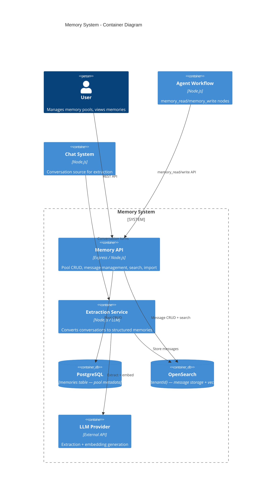
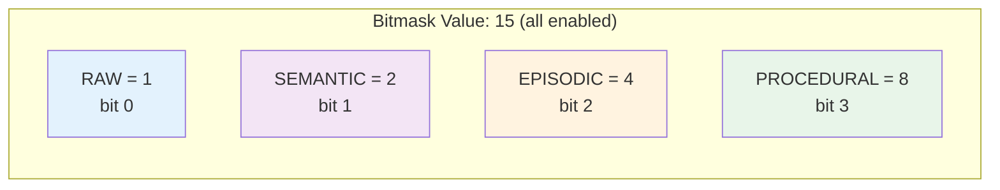
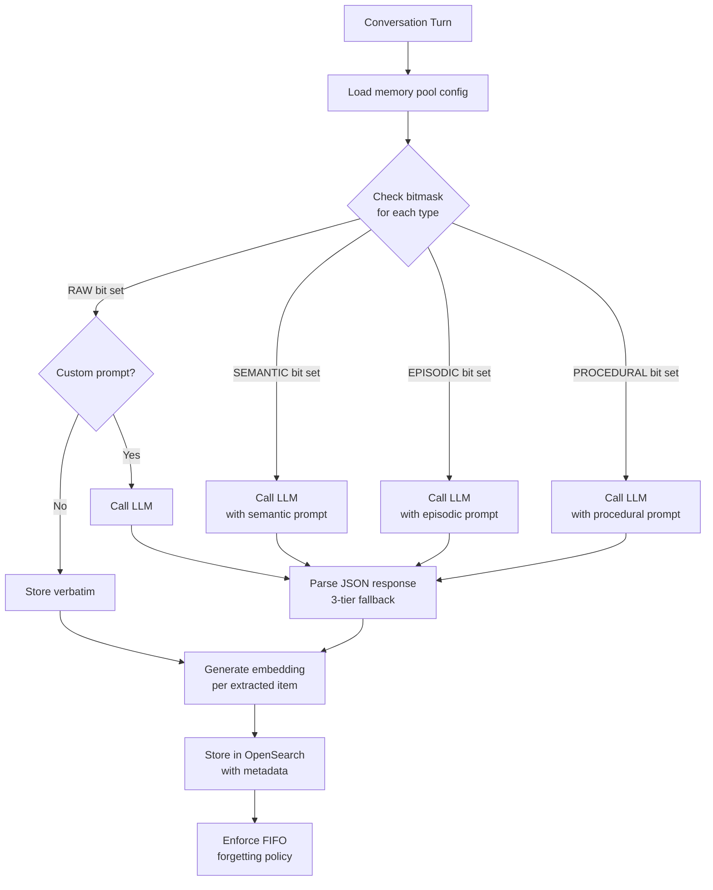
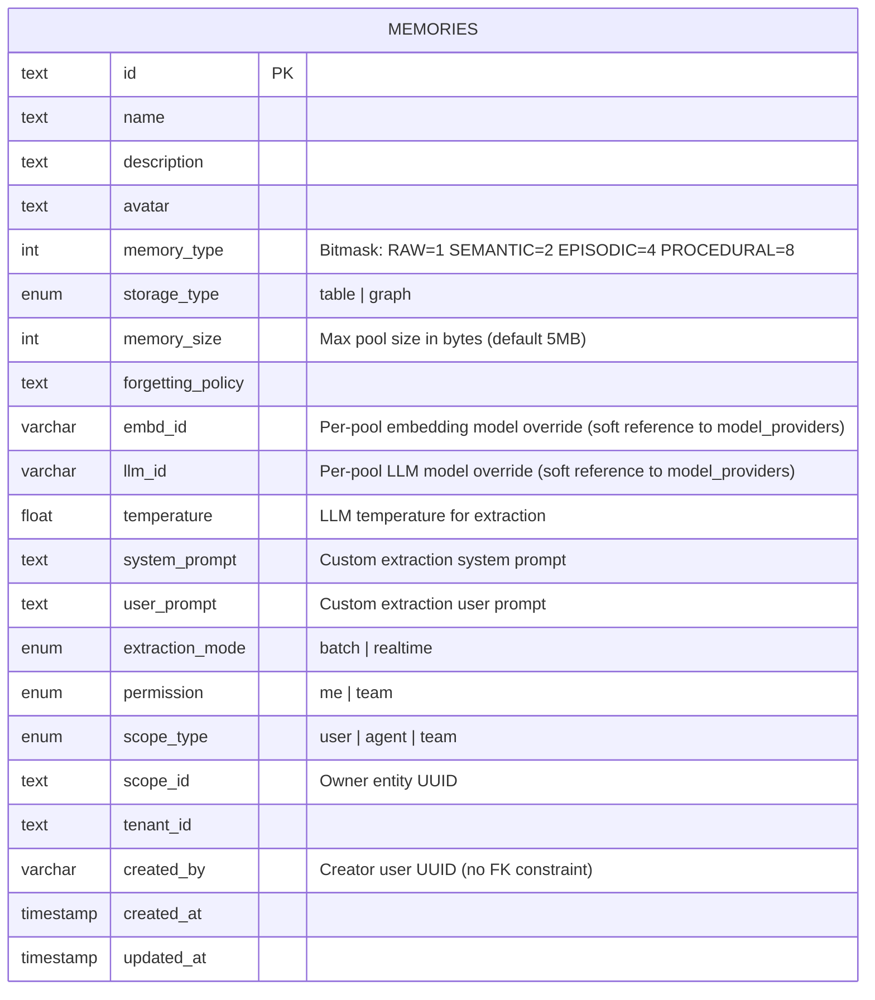
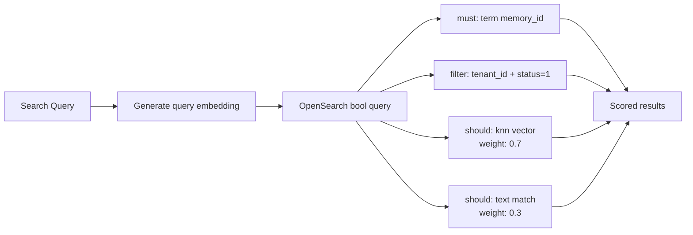
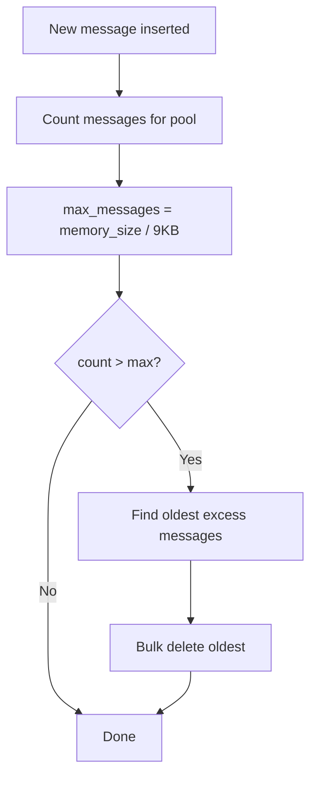

# Memory Architecture

## System Overview

The Memory system provides persistent, searchable knowledge pools that store extracted memories from conversations and agent interactions. It uses an LLM-powered extraction pipeline to convert raw conversations into four structured memory types, stored in OpenSearch with hybrid vector+text search capabilities.



## Memory Type System

### Bitmask Design

Memory types are combined using a bitmask integer stored in the `memory_type` column:



| Type | Bit | Description | Extraction Method |
|------|-----|-------------|-------------------|
| **Raw** | 1 | Verbatim conversation content | Direct copy (no LLM unless custom prompt) |
| **Semantic** | 2 | Facts, definitions, concepts, relationships | LLM extraction with structured prompt |
| **Episodic** | 4 | Events, experiences, temporal references | LLM extraction with event-focused prompt |
| **Procedural** | 8 | Procedures, workflows, how-to instructions | LLM extraction with process-focused prompt |

Common bitmask values:
- `15` = All types enabled (default)
- `6` = Semantic + Episodic only
- `2` = Semantic only
- `1` = Raw only (archive mode)

## Extraction Pipeline



### JSON Response Parsing (3-Tier Fallback)

1. **Direct parse**: `JSON.parse(response)` → expect array
2. **Regex extraction**: Find `[...]` in response text → parse extracted JSON
3. **Raw fallback**: Treat entire response as single memory item

### Extraction Modes

| Mode | Trigger | Use Case |
|------|---------|----------|
| **Realtime** | Per conversation turn | Live memory building during chat |
| **Batch** | End of session | Full session analysis, higher quality extraction |

## Data Model

### PostgreSQL: Memory Pools



### OpenSearch: Memory Messages

Index name: `memory_{tenantId}` (per-tenant isolation)

```json
{
  "settings": { "index": { "knn": true } },
  "mappings": {
    "properties": {
      "message_id":    { "type": "keyword" },
      "memory_id":     { "type": "keyword" },
      "content":       { "type": "text", "analyzer": "standard" },
      "content_embed": { "type": "knn_vector", "dimension": 1024,
                         "method": { "name": "hnsw", "space_type": "cosinesimil", "engine": "nmslib" } },
      "message_type":  { "type": "integer" },
      "status":        { "type": "integer" },
      "tenant_id":     { "type": "keyword" },
      "source_id":     { "type": "keyword" },
      "user_id":       { "type": "keyword" },
      "valid_at":      { "type": "date" },
      "invalid_at":    { "type": "date" },
      "created_at":    { "type": "date" }
    }
  }
}
```

## Hybrid Search Architecture



Search combines:
- **Vector similarity** (knn_vector, cosine, weight=0.7): Semantic relevance
- **Text match** (BM25, weight=0.3): Keyword relevance
- **Mandatory filters**: memory_id, tenant_id, status=active

## FIFO Forgetting Policy



- Approximate message size: 9KB
- Default pool size: 5MB (~582 messages)
- FIFO enforcement is non-blocking (failures logged, not thrown)

## Access Control Model

### Pool-Level Permissions

| Field | Values | Description |
|-------|--------|-------------|
| `permission` | `me`, `team` | Visibility scope |
| `scope_type` | `user`, `agent`, `team` | Ownership entity type |
| `scope_id` | UUID | Owning entity identifier |

### Visibility Query Logic

```sql
WHERE tenant_id = :tenantId
  AND (
    permission = 'team'
    OR (permission = 'me' AND created_by = :userId)
  )
```

### CASL Integration

All memory routes require: `requireAuth` + `requireTenant` + `requireAbility('manage', 'Memory')`

## Backend Module Structure

```
be/src/modules/memory/
├── routes/memory.routes.ts           — All endpoints (auth + tenant + ABAC)
├── controllers/memory.controller.ts  — HTTP handlers
├── services/
│   ├── memory.service.ts             — Pool CRUD (PostgreSQL)
│   ├── memory-message.service.ts     — Message CRUD + search (OpenSearch)
│   └── memory-extraction.service.ts  — LLM-powered extraction pipeline
├── models/memory.model.ts            — BaseModel<Memory> for memories table
├── schemas/memory.schemas.ts         — Zod validation schemas
├── prompts/extraction.prompts.ts     — Default prompt templates per type
└── index.ts
```

## Frontend Module Structure

```
fe/src/features/memory/
├── api/
│   ├── memoryApi.ts                  — Raw HTTP calls
│   └── memoryQueries.ts             — TanStack Query hooks
├── components/
│   ├── MemoryCard.tsx               — Pool card in list view
│   ├── MemoryMessageTable.tsx       — Paginated message table
│   ├── MemorySettingsPanel.tsx      — Pool configuration form
│   └── ImportHistoryDialog.tsx      — Chat history import dialog
├── pages/
│   ├── MemoryListPage.tsx           — Pool list/search/create
│   └── MemoryDetailPage.tsx         — Pool detail + messages
├── types/
│   └── memory.types.ts              — Types, bitmask constants, helpers
└── index.ts
```

## API Endpoints

| Method | Path | Auth | Purpose |
|--------|------|------|---------|
| POST | `/api/memory` | manage Memory | Create pool |
| GET | `/api/memory` | manage Memory | List visible pools |
| GET | `/api/memory/:id` | manage Memory | Get pool detail |
| PUT | `/api/memory/:id` | manage Memory | Update pool |
| DELETE | `/api/memory/:id` | manage Memory | Delete pool + messages |
| GET | `/api/memory/:id/messages` | manage Memory | List messages (paginated) |
| DELETE | `/api/memory/:id/messages/:mid` | manage Memory | Delete message |
| POST | `/api/memory/:id/search` | manage Memory | Hybrid vector+text search |
| PUT | `/api/memory/:id/messages/:mid/forget` | manage Memory | Mark message as forgotten |
| POST | `/api/memory/:id/import` | manage Memory | Import chat history |
| POST | `/api/memory/:id/messages` | manage Memory | Direct message insert |

## Integration Points

### Agent Workflow Integration

Agent DSL includes two memory-specific node types:
- **memory_read**: Searches a memory pool and injects results into the workflow context
- **memory_write**: Stores extracted content into a memory pool during execution

### Chat Integration

- Chat completion pipeline can trigger realtime memory extraction after each turn
- Chat sessions can be imported into memory pools via the import API
- Memory search results can be injected into chat context for personalized responses

## Current Limitations

| Limitation | Description | Status |
|-----------|-------------|--------|
| **Vector search stub** | Search endpoint currently passes empty vector `[]`; relies on text-only search fallback | Planned for full embedding wiring |
| **Forget is one-way** | No restore/unforgot endpoint; forgotten messages (status=0) cannot be reactivated via API | By design |
| **Realtime extraction** | Schema supports `realtime` mode but chat pipeline currently only uses `batch` mode | Future enhancement |
| **Knowledge graph storage** | Schema supports `storage_type: 'graph'` but only `table` is implemented | Future enhancement |
