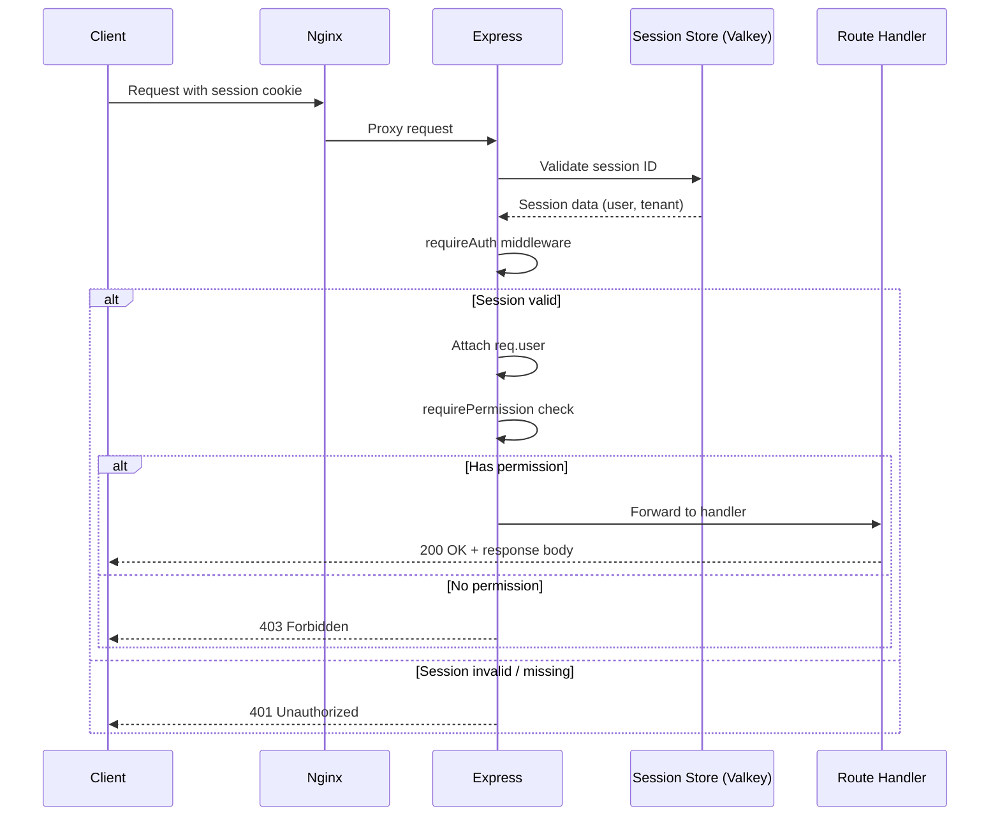
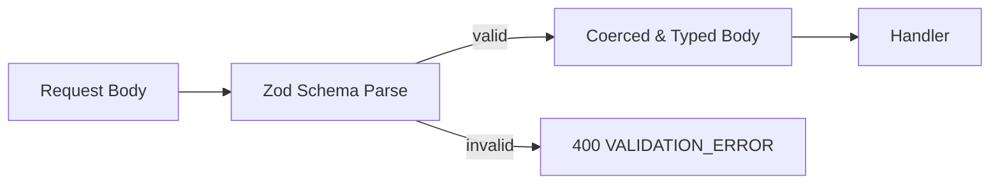
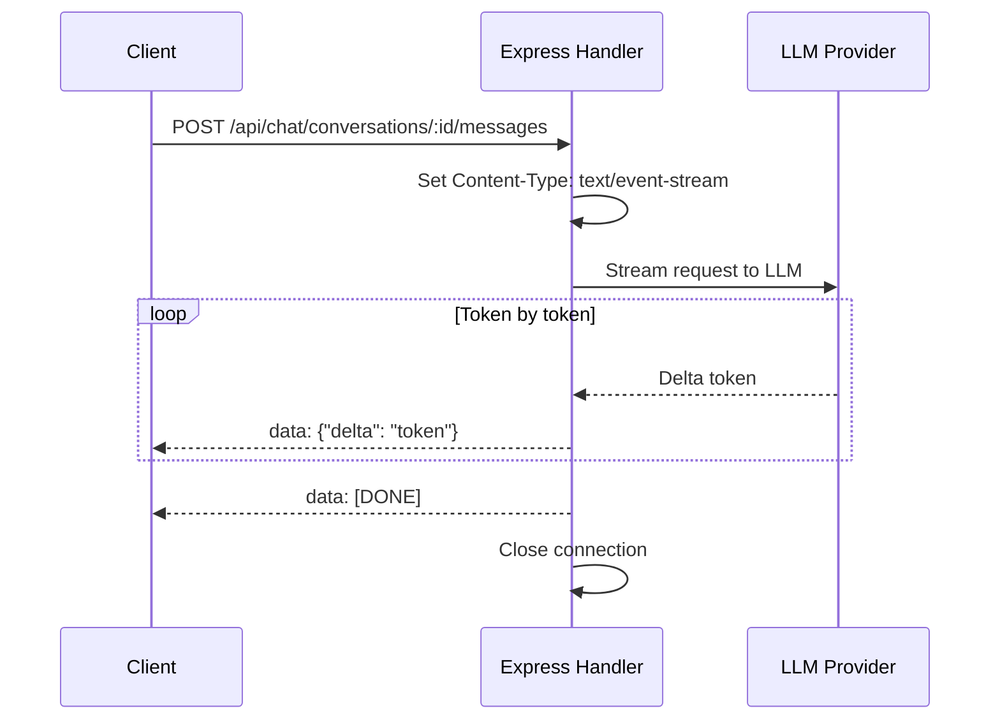

# API Design Overview

## Overview

The B-Knowledge API follows RESTful conventions with session-based authentication, Zod request validation, structured error responses, pagination, rate limiting, and SSE streaming for real-time chat and search.

## Request Lifecycle

```mermaid
graph LR
    Client([Client]) --> Nginx
    Nginx -->|proxy_pass| Express[Express Server]
    Express --> Helmet
    Helmet --> CORS
    CORS --> Cookie[Cookie Parser]
    Cookie --> Session[Session Check]
    Session --> RateLimit[Rate Limiter]
    RateLimit --> AuthMW[requireAuth]
    AuthMW --> PermMW[requirePermission]
    PermMW --> Validate[validate schema]
    Validate --> Handler[Route Handler]
    Handler --> Response([JSON Response])
```



## REST Conventions

| Convention | Rule |
|-----------|------|
| Base path | `/api/{module}/{resource}` |
| Resource names | Plural nouns (`/users`, `/datasets`, `/conversations`) |
| HTTP verbs | `GET` read, `POST` create, `PUT` update, `DELETE` remove |
| ID parameters | UUID in path (`/api/users/:id`) |
| Nested resources | `/api/rag/datasets/:datasetId/documents/:docId` |

## Authentication Flow



## Error Response Format

All errors follow a consistent structure:

```json
{
  "error": {
    "code": "VALIDATION_ERROR",
    "message": "Invalid input data",
    "details": [
      { "field": "email", "message": "Must be a valid email address" }
    ]
  }
}
```

| HTTP Status | Error Code | Usage |
|-------------|-----------|-------|
| 400 | `VALIDATION_ERROR` | Zod schema validation failure |
| 401 | `UNAUTHORIZED` | Missing or invalid session |
| 403 | `FORBIDDEN` | Insufficient permissions |
| 404 | `NOT_FOUND` | Resource does not exist |
| 409 | `CONFLICT` | Duplicate resource |
| 429 | `RATE_LIMITED` | Too many requests |
| 500 | `INTERNAL_ERROR` | Unhandled server error |

## Pagination

Paginated endpoints return data with pagination metadata:

```json
{
  "data": [ ... ],
  "pagination": {
    "page": 1,
    "pageSize": 20,
    "total": 142
  }
}
```

**Query parameters:** `?page=1&pageSize=20&sortBy=createdAt&sortOrder=desc`

## Rate Limiting

| Scope | Limit | Window |
|-------|-------|--------|
| General API | 1000 requests | 15 minutes |
| Auth endpoints | 20 requests | 15 minutes |

Rate limit headers are included in responses:

- `X-RateLimit-Limit` -- maximum requests allowed
- `X-RateLimit-Remaining` -- requests remaining
- `X-RateLimit-Reset` -- UTC epoch when window resets

## Zod Validation

The `validate(schema)` middleware intercepts requests before the handler executes:



- Schemas are defined per-module in `schemas/` directories
- Validation coerces types (string to number, etc.)
- All mutation endpoints (`POST`, `PUT`, `DELETE`) require validation
- `GET` endpoints validate query parameters when filtering is complex

## SSE Streaming (Chat and Search)

Real-time responses use Server-Sent Events for token-by-token streaming.



**SSE message format:**

```
data: {"delta": "Hello"}

data: {"delta": " world"}

data: {"delta": "!"}

data: [DONE]
```

| Header | Value |
|--------|-------|
| `Content-Type` | `text/event-stream` |
| `Cache-Control` | `no-cache` |
| `Connection` | `keep-alive` |

The client reads the stream using the `EventSource` API or `fetch` with a `ReadableStream` reader. The `[DONE]` sentinel signals that the response is complete and the connection should be closed.
