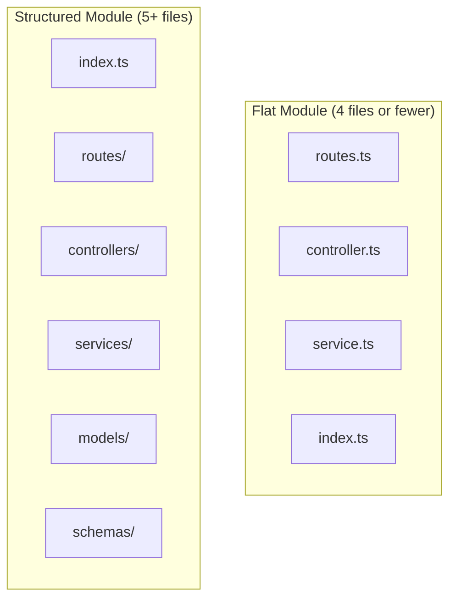
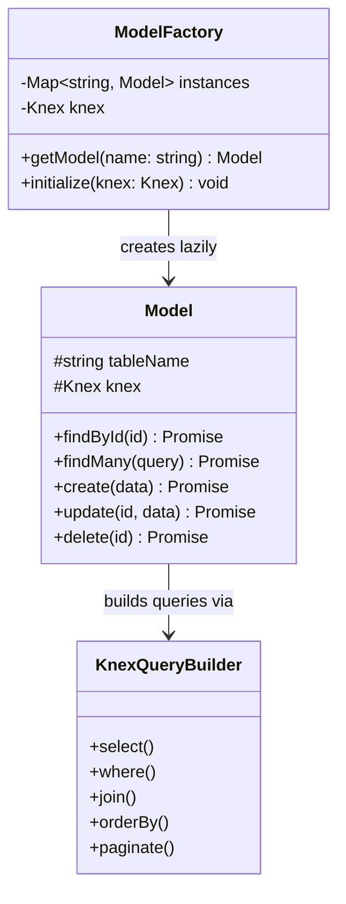
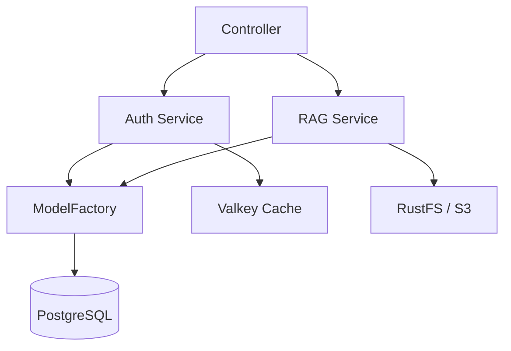
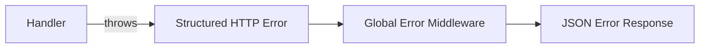

# Backend Architecture

## Overview

The B-Knowledge backend is a Node.js 22+ / Express 4.21 / TypeScript application using Knex ORM with PostgreSQL. It follows NX-style modular architecture with 18 domain modules, strict module boundaries, and singleton/factory patterns.

## Request Flow

```mermaid
graph LR
    Client --> Nginx
    Nginx --> Express[Express App]
    Express --> Helmet
    Helmet --> CORS
    CORS --> CP[Cookie Parser]
    CP --> Session[Session Middleware]
    Session --> RL[Rate Limiter]
    RL --> Auth[Auth Middleware]
    Auth --> Validate[Zod Validate]
    Validate --> Router[Module Router]
    Router --> Controller
    Controller --> Service
    Service --> Model[Model / Knex]
    Model --> PostgreSQL
```



## Middleware Stack Order

| Order | Middleware | Purpose |
|-------|-----------|---------|
| 1 | Helmet | Security headers |
| 2 | CORS | Cross-origin configuration |
| 3 | Cookie Parser | Parse signed cookies |
| 4 | Session | Valkey-backed session management |
| 5 | Rate Limiter | 1000/15min general, 20/15min auth |
| 6 | Auth (`requireAuth`) | Verify session, attach `req.user` |
| 7 | Validate (`validate(schema)`) | Zod schema coercion of `req.body` |
| 8 | Route Handler | Controller method execution |

## Module Structure



### Flat Module Example (`be/src/modules/audit/`)

```
audit/
  index.ts          # Barrel export (public API)
  routes.ts         # Express router
  controller.ts     # Request handlers
  service.ts        # Business logic
```

### Structured Module Example (`be/src/modules/rag/`)

```
rag/
  index.ts          # Barrel export (public API)
  routes/           # Route definitions per sub-resource
  controllers/      # Request handlers
  services/         # Business logic
  models/           # Knex model definitions
  schemas/          # Zod validation schemas
```

## ModelFactory Pattern



The `ModelFactory` is a singleton that lazily initializes and caches Knex model instances. It manages 60+ models and ensures each model is instantiated only once.

```
// Access pattern
const userModel = ModelFactory.getModel('user')
const users = await userModel.findMany({ tenantId })
```

## Service Singleton Pattern

All services are instantiated once and exported as singletons from their module barrel files. Services encapsulate business logic and coordinate between models, external APIs, and other services via shared interfaces.



## Error Handling

Structured HTTP errors are thrown within services and controllers, then caught by the global error middleware.



**Error response format:**

```json
{
  "error": {
    "code": "VALIDATION_ERROR",
    "message": "Invalid input",
    "details": [{ "field": "email", "message": "Required" }]
  }
}
```

## Key Conventions

| Convention | Rule |
|-----------|------|
| Module boundaries | No cross-module imports; use shared services |
| Public API | Every module exposes only `index.ts` barrel |
| Deep imports | Forbidden: never import internal files directly |
| Config access | Only via `config` object, never `process.env` |
| Validation | All mutations use `validate(zodSchema)` middleware |
| ORM | Knex for all queries; raw SQL only when Knex cannot |
| Migrations | `YYYYMMDDhhmmss_<name>.ts` via Knex, even for Peewee tables |
| Shared code | `shared/models/`, `shared/services/`, `shared/utils/` |

## Module List (18 Modules)

| Module | Domain |
|--------|--------|
| `auth` | Authentication and sessions |
| `users` | User management |
| `teams` | Team and membership |
| `chat` | Conversations and assistants |
| `search` | Search apps and queries |
| `rag` | Datasets, documents, chunks |
| `sync` | Connectors and sync logs |
| `projects` | Project management |
| `glossary` | Glossary tasks and keywords |
| `llm-provider` | LLM model configuration |
| `admin` | Admin dashboard |
| `audit` | Audit logging |
| `broadcast` | Notifications |
| `user-history` | User activity history |
| `system-tools` | System utilities |
| `feedback` | User feedback |
| `dashboard` | Analytics dashboard |
| `tenant` | Multi-tenancy |
