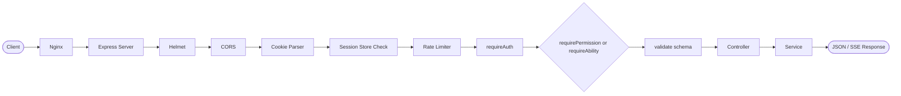
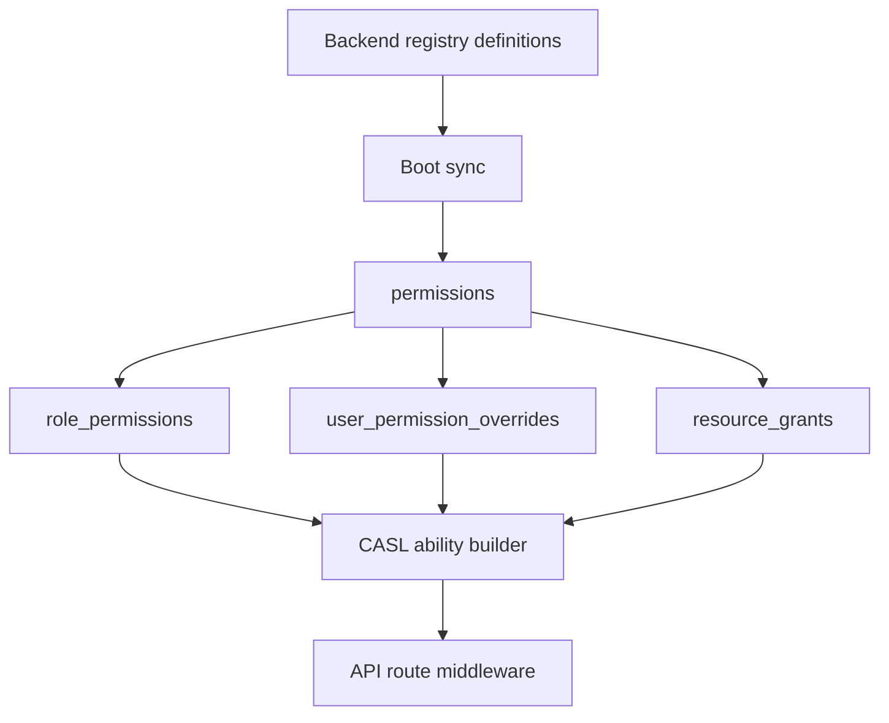
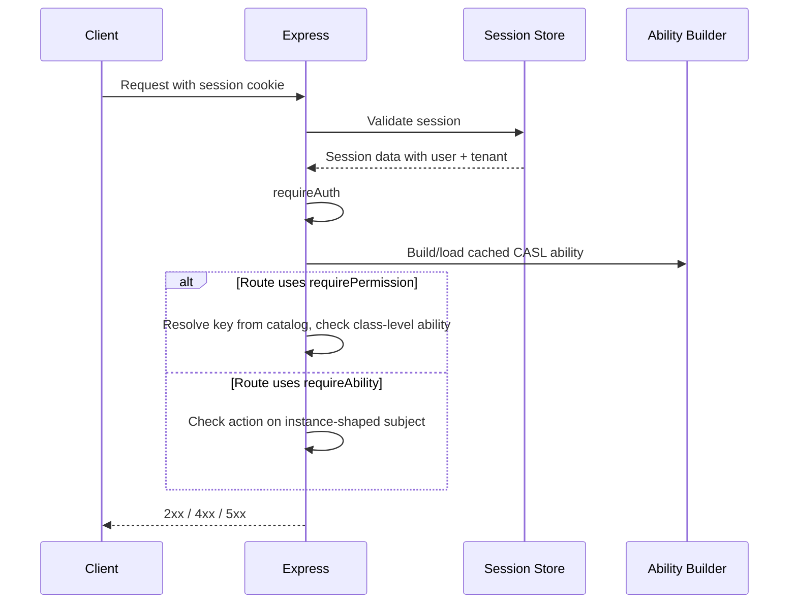
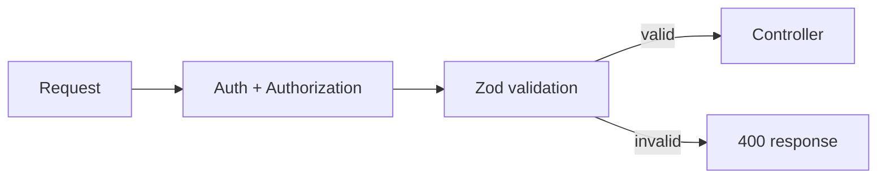

# API Design Overview

> Request lifecycle, auth pipeline, and authorization behavior for the current backend API.

## 1. Overview

The B-Knowledge API is a session-backed REST API with Zod validation, rate limiting, and SSE for streaming features. The permission-system milestone changed the authorization layer from static role-first route descriptions to a registry-backed permission and CASL ability pipeline.

Current API authorization has two distinct enforcement modes:

- `requirePermission(key)` for flat feature capabilities backed by the permission catalog
- `requireAbility(action, subject, idParam?)` for row-scoped CASL checks against a specific resource instance

The permissions catalog itself is exposed through `/api/permissions/*`, while runtime CASL rules are still fetched through `/api/auth/abilities`.

## 2. Request Lifecycle



## 3. Authorization Pipeline

### 3.1 Boot and runtime inputs



The API layer does not hardcode authorization truth in route files. Routes refer to permission keys or subject/action pairs, and middleware resolves them through the shared ability builder.

### 3.2 Middleware contract

| Step | Purpose |
|------|---------|
| `requireAuth` | Requires a valid session and attaches `req.user` |
| `requirePermission(key)` | Resolves a permission key to `(action, subject)` and checks the current CASL ability |
| `requireAbility(action, subject, idParam?)` | Checks a row-scoped action on a concrete resource instance |
| `validate(...)` | Runs Zod validation for body/query/params before controller logic |

### 3.3 Flat vs row-scoped decisions

| API pattern | Recommended guard | Example |
|-------------|-------------------|---------|
| Tenant-wide admin capability | `requirePermission` | `/api/permissions/catalog` requires `permissions.view` |
| Role/override/grant management | `requirePermission` | `/api/permissions/grants` requires `permissions.manage` for mutations |
| Editing a specific record | `requireAbility` | Route checks whether a user can update the specific `KnowledgeBase`, `Document`, or `User` instance |
| Read access inherited from `resource_grants` | `requireAbility` | CASL evaluates row-scoped rules or grant-derived conditions |

The practical distinction is that `requirePermission` is key-centric, while `requireAbility` is instance-centric.

## 4. Authentication and Ability Retrieval



The frontend pulls:

- `GET /api/auth/abilities` for serialized CASL rules
- `GET /api/permissions/catalog` for the live permission key catalog

This split allows the FE to support both `<Can>`-style subject checks and key-based gating through `useHasPermission()`.

## 5. Error Response Expectations

The backend does **not** expose one single universal error envelope across every module. The current source uses a few families of responses:

- most internal routes return flat payloads such as `{ error: 'Unauthorized' }`
- Zod validation middleware returns `{ error: 'Validation Error', details: [...] }`
- permission middleware returns targeted flat payloads such as `{ error: 'permission_denied', key }`
- selected external/OpenAI-compatible routes return nested error objects

```json
{
  "error": "Validation Error",
  "details": [
    { "target": "body", "field": "email", "message": "Must be a valid email address" }
  ]
}
```

| HTTP Status | Typical cause |
|-------------|---------------|
| `400` | Zod validation failure |
| `401` | Missing or invalid session |
| `403` | Permission or ability check denied |
| `404` | Resource not found |
| `409` | Conflict such as duplicate resource |
| `429` | Rate limit exceeded |
| `500` | Internal server error or permission misconfiguration |

Authorization-specific behavior:

- Unknown permission keys are treated as server misconfiguration, not as an ordinary deny
- Permission and ability middleware both fail closed in production when the ability build cannot complete

When documenting or extending a route, do not assume a nested `{ error: { code, message } }` contract unless the source file actually implements it.

## 6. Validation and Mutation Rules



- All mutating routes use `validate(...)`
- Query validation is applied where filter or lookup parameters are structured
- Validation runs after authentication and authorization guards, so only authorized callers reach controller logic

## 7. Streaming Endpoints

Chat, search, and agent completions use SSE for streaming responses. The permission overhaul did not change the transport, but it changed who may reach those handlers because dataset, knowledge-base, and category access can now be enforced through the shared ability and grant pipeline.

| Header | Value |
|--------|-------|
| `Content-Type` | `text/event-stream` |
| `Cache-Control` | `no-cache` |
| `Connection` | `keep-alive` |

## 7.1 WebSocket (Socket.IO)

Socket.IO provides real-time push notifications for permission catalog updates, agent debug events, and general system notifications. The Nginx reverse proxy upgrades `/socket.io/*` connections to WebSocket.

## 7.2 OpenAI-Compatible Endpoints

The backend exposes OpenAI-compatible API endpoints under `/api/v1/` for chat completions and search, authenticated via API key bearer tokens. These allow external tools to interact with B-Knowledge using the OpenAI SDK format.

## 7.3 Public Embed Endpoints

Embed widgets use token-based public access without session authentication:

| Base Path | Purpose |
|-----------|---------|
| `/api/chat/embed/*` | Public chat embed widget endpoints |
| `/api/search/embed/*` | Public search embed widget endpoints |
| `/api/agents/embed/*` | Public agent embed widget endpoints |

## 8. Compatibility Notes

- Do not describe API access as a fixed admin-versus-basic-user route split in new documentation
- Do not treat `rbac.ts` as the API’s source of truth; it is only a compatibility layer
- Permissions APIs under `/api/permissions/*` are the current admin contract for catalog, role, override, grant, and effective-access operations

## 9. Related Docs

- [Security Architecture](/basic-design/system-infra/security-architecture)
- [API Endpoint Reference](/basic-design/component/api-design-endpoints)
- [Database Design: Core Tables](/basic-design/database/database-design-core)
