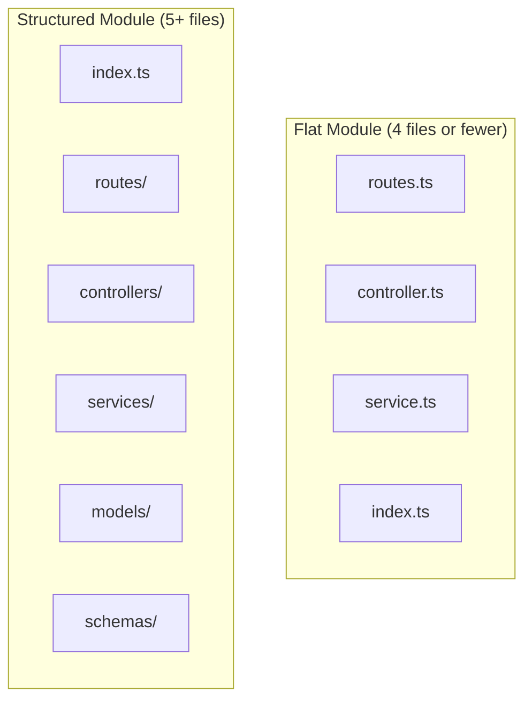
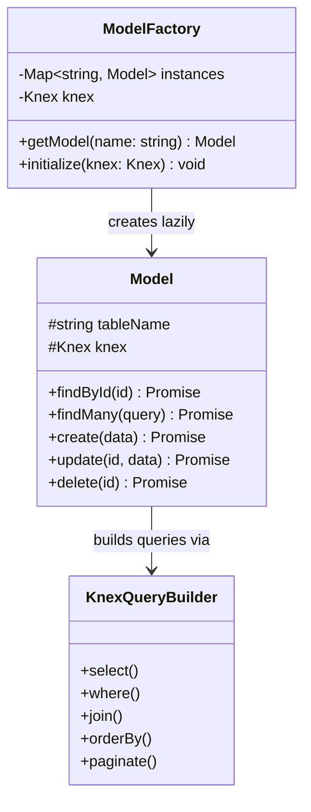
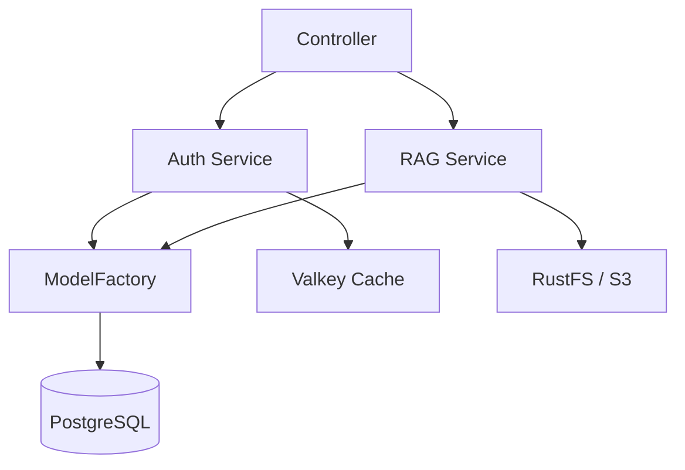
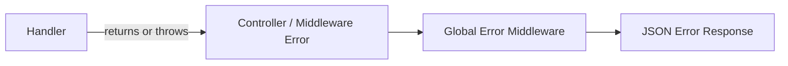
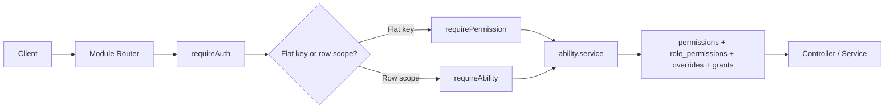

# Backend Architecture

## Overview

The B-Knowledge backend is a Node.js 22+ / Express 4.21 / TypeScript application using Knex with PostgreSQL. It currently mounts 23 feature modules under `/api`, with strict module boundaries, singleton services, and shared infrastructure such as `ModelFactory`, auth middleware, rate limiting, and a registry-backed permission system.

## Request Flow

```mermaid
graph LR
    Client --> Nginx
    Nginx --> Express[Express App]
    Express --> Helmet
    Helmet --> CORS
    CORS --> CP[Cookie Parser]
    CP --> Session[Session Middleware]
    Session --> RL[Rate Limiter]
    RL --> Auth[Auth Middleware]
    Auth --> Validate[Zod Validate]
    Validate --> Router[Module Router]
    Router --> Controller
    Controller --> Service
    Service --> Model[Model / Knex]
    Model --> PostgreSQL
```



## Middleware Stack Order

| Order | Middleware | Purpose |
|-------|-----------|---------|
| 1 | Helmet | Security headers |
| 2 | CORS | Cross-origin configuration |
| 3 | Cookie Parser | Parse signed cookies |
| 4 | Session | Valkey-backed session management |
| 5 | Rate Limiter | 1000/15min general, 20/15min auth |
| 6 | Auth (`requireAuth`) | Verify session, attach `req.user` |
| 7 | Validate (`validate(schema)`) | Zod schema coercion of `req.body` |
| 8 | Route Handler | Controller method execution |

## Module Structure



### Flat Module Example (`be/src/modules/audit/`)

```
audit/
  index.ts          # Barrel export (public API)
  routes.ts         # Express router
  controller.ts     # Request handlers
  service.ts        # Business logic
```

### Structured Module Example (`be/src/modules/rag/`)

```
rag/
  index.ts          # Barrel export (public API)
  routes/           # Route definitions per sub-resource
  controllers/      # Request handlers
  services/         # Business logic
  models/           # Knex model definitions
  schemas/          # Zod validation schemas
```

## ModelFactory Pattern



The `ModelFactory` is a singleton that lazily initializes and caches Knex model instances. It manages 60+ models and ensures each model is instantiated only once.

```
// Access pattern
const userModel = ModelFactory.getModel('user')
const users = await userModel.findMany({ tenantId })
```

## Service Singleton Pattern

All services are instantiated once and exported as singletons from their module barrel files. Services encapsulate business logic and coordinate between models, external APIs, and other services via shared interfaces.



## Error Handling

The backend uses a mixed but still understandable error model. Controllers frequently return flat `{ error: '...' }` payloads directly, while shared middleware adds its own specialized shapes such as validation `details` arrays and permission-denied payloads.



Representative internal response shapes:

```json
{
  "error": "Validation Error",
  "details": [{ "target": "body", "field": "email", "message": "Required" }]
}
```

```json
{
  "error": "permission_denied",
  "key": "permissions.manage"
}
```

```json
{
  "error": "Unauthorized"
}
```

## Key Conventions

| Convention | Rule |
|-----------|------|
| Module boundaries | No cross-module imports; use shared services |
| Public API | Every module exposes only `index.ts` barrel |
| Deep imports | Forbidden: never import internal files directly |
| Config access | Only via `config` object, never `process.env` |
| Validation | All mutations use `validate(zodSchema)` middleware |
| ORM | Knex for all queries; raw SQL only when Knex cannot |
| Migrations | `YYYYMMDDhhmmss_<name>.ts` via Knex, even for Peewee tables |
| Shared code | `shared/models/`, `shared/services/`, `shared/utils/` |

## Module List (23 Modules)

| Module | Domain |
|--------|--------|
| `auth` | Authentication, sessions, ability bootstrap |
| `agents` | Agent workflows, runs, templates, embeds |
| `audit` | Audit logging |
| `broadcast` | Broadcast messages |
| `chat` | Assistants, conversations, files, embeds, OpenAI API |
| `code-graph` | Code graph endpoints |
| `dashboard` | Dashboard analytics |
| `external` | API keys and external APIs |
| `feedback` | Generic feedback endpoints |
| `glossary` | Glossary features |
| `knowledge-base` | Knowledge base CRUD, memberships, entity permissions |
| `llm-provider` | Model/provider management |
| `memory` | Memory pools and memory message search |
| `permissions` | Catalog, role matrix, overrides, grants, effective access |
| `preview` | Document/file preview serving |
| `rag` | Datasets, documents, chunks, enrichment, graph tasks |
| `search` | Search apps, search embed/share, OpenAI search API |
| `sync` | Sync connectors and jobs |
| `system` | Core system info and history endpoints |
| `system-tools` | Diagnostics and system actions |
| `teams` | Team management |
| `user-history` | Chat and search history |
| `users` | User management |

## Authorization-Specific Request Flow



The main maintainer takeaway is that authorization is data-driven. New backend work should extend the registry/catalog pipeline instead of adding new role-string checks.
