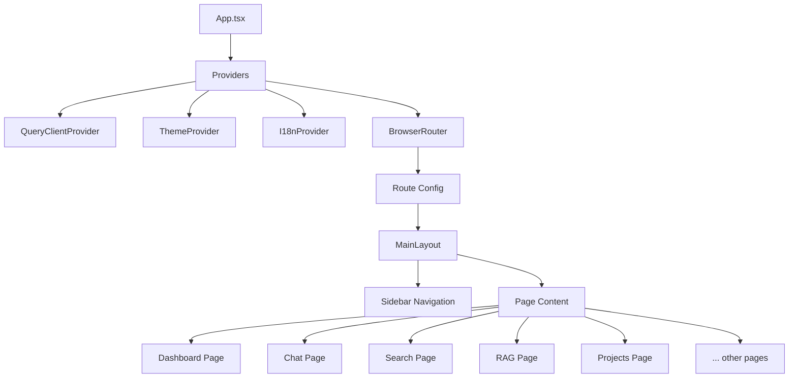
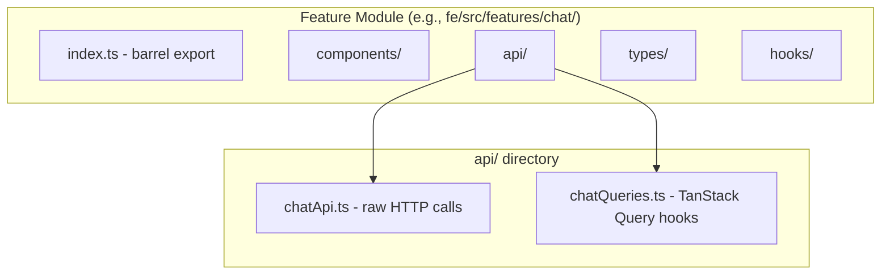
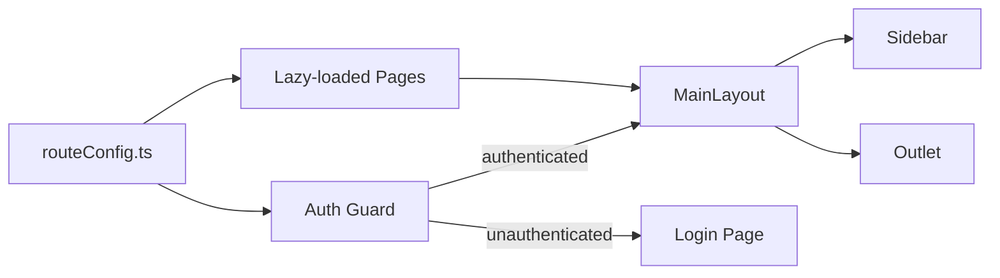
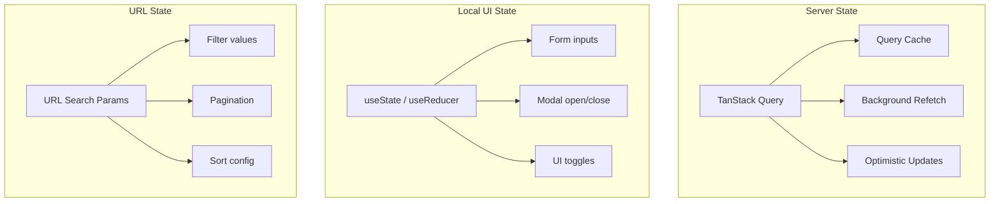
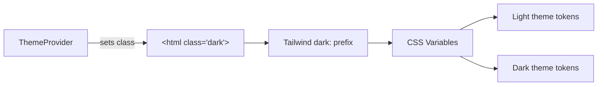

# Frontend Architecture

## Overview

The B-Knowledge frontend is a React 19 SPA built with TypeScript, Vite 7.3, TanStack Query, Tailwind CSS, and shadcn/ui. It follows a feature-module architecture with 25 top-level feature areas, central route metadata in `routeConfig.ts`, and i18n support for three locales.

## Application Component Tree

## Feature Module Structure

Each feature module follows a consistent internal layout:

### API Layer Split Pattern

| File | Responsibility | Example |
|------|---------------|---------|
| `chatApi.ts` | Raw HTTP calls via `api.get()` / `api.post()` | `fetchConversations()`, `sendMessage()` |
| `chatQueries.ts` | TanStack Query hooks wrapping API calls | `useConversations()`, `useSendMessage()` |

This split ensures HTTP logic is testable independently from caching and state management.

## Routing

Pages are lazy-loaded via `React.lazy()` and defined in a central `routeConfig.ts` file. The `MainLayout` component provides the sidebar navigation and renders child routes via `<Outlet />`. Route constants are centralized in `adminRoutes.ts`.

### Route Map

**User-facing routes:**

| Route | Purpose |
|-------|---------|
| `/chat` | AI Chat conversation page |
| `/search` | AI Search page |
| `/search/apps/:appId` | Search app-specific page |
| `/search/share/:token` | Public shared search page |

**Admin Data Studio:**

| Route | Purpose |
|-------|---------|
| `/admin/data-studio/knowledge-base` | Knowledge base list (admin home) |
| `/admin/data-studio/datasets` | Dataset list |
| `/admin/data-studio/datasets/:id` | Dataset detail |
| `/admin/data-studio/datasets/:id/documents/:docId/chunks` | Document chunk detail |
| `/admin/code-graph/:kbId` | Code graph for a knowledge base |

**Admin Agent Studio:**

| Route | Purpose |
|-------|---------|
| `/admin/agent-studio/agents` | Agent list |
| `/admin/agent-studio/agents/:id` | Agent canvas (create/edit) |
| `/admin/agent-studio/memory` | Memory pool list |
| `/admin/agent-studio/memory/:id` | Memory pool detail |
| `/admin/agent-studio/chat-assistants` | Chat assistant management |
| `/admin/agent-studio/search-apps` | Search app management |
| `/admin/agent-studio/histories` | Global histories browser |

**Admin IAM:**

| Route | Purpose |
|-------|---------|
| `/admin/iam/users` | User management |
| `/admin/iam/users/:id` | User detail |
| `/admin/iam/teams` | Team management |
| `/admin/iam/permissions` | Permission matrix |
| `/admin/iam/effective-access` | Effective access inspector |

**Admin System:**

| Route | Purpose |
|-------|---------|
| `/admin/system/dashboard` | Dashboard analytics |
| `/admin/system/audit-log` | Audit log |
| `/admin/system/system-tools` | System tools |
| `/admin/system/system-monitor` | System monitor |
| `/admin/system/tokenizer` | Tokenizer tool |
| `/admin/system/broadcast-messages` | Broadcast messages |
| `/admin/system/llm-providers` | LLM provider management |

## State Management Strategy

| State Type | Tool | When to Use |
|-----------|------|-------------|
| Server state | TanStack Query | API data, caching, background sync |
| Local UI state | `useState` | Form inputs, modals, toggles |
| URL state | URL search params | Filterable/sortable views (bookmarkable) |
| App-wide client state | React Context | Auth, theme, settings, guidelines |
| Real-time | Socket.IO | Permission catalog updates, notifications, agent debug events |

> No form libraries are used. Forms rely on native `useState` for simplicity.

## Permission Gating

The frontend implements two complementary permission-gating approaches:

| Approach | Component/Hook | When to Use |
|----------|---------------|-------------|
| CASL subject checks | `<Can I="action" a="Subject">` / `useAppAbility()` | Instance-aware or class-level subject checks |
| Flat catalog keys | `useHasPermission(PERMISSION_KEYS.X)` | Feature capability gates with no instance reasoning |

Permission data is loaded from two backend endpoints:
- `GET /api/auth/abilities` provides serialized CASL rules for `<Can>` checks
- `GET /api/permissions/catalog` provides the key catalog for `useHasPermission()`

## i18n (Internationalization)

Three locales are supported via `i18next`:

| Locale | Language |
|--------|----------|
| `en` | English |
| `vi` | Vietnamese |
| `ja` | Japanese |

All UI strings must be defined in all three locale files. Translation keys are organized by feature module.

## Dark Mode

Dark mode uses the **class-based** approach:

- A `dark` class is toggled on the `<html>` element
- Tailwind `dark:` prefix applies dark variants
- CSS variables define color tokens for both themes
- The `ThemeProvider` manages preference (system / manual) and persists to `localStorage`

## React Compiler -- No Manual Memoization

React 19 with the React Compiler handles memoization automatically. The following are **not used**:

- `React.memo()`
- `useMemo()`
- `useCallback()`

The compiler determines optimal re-render boundaries at build time.

## Shared Code

| Directory | Contents |
|-----------|----------|
| `components/ui/` | shadcn/ui primitives (Button, Dialog, Table, etc.) |
| `hooks/` | UI-only custom hooks (not query hooks) |
| `lib/` | Shared utilities (api client, auth helpers) |
| `utils/` | Pure utility functions (formatting, validation) |

## Feature Module List (25 Feature Areas)

| Module | Domain |
|--------|--------|
| `agent-widget` | Public agent embed UI |
| `agents` | Agent studio, canvas, debug, runs |
| `ai` | Shared AI-facing pages/hooks |
| `api-keys` | External API key management |
| `audit` | Audit log pages |
| `auth` | Login and session flows |
| `broadcast` | Broadcast message UI |
| `chat` | Conversations, assistants |
| `chat-widget` | Public chat embed UI |
| `code-graph` | Code graph exploration UI |
| `dashboard` | Dashboard pages |
| `datasets` | Dataset, document, chunk, parser settings UI |
| `glossary` | Glossary UI |
| `guideline` | Product guideline/help system |
| `histories` | History browsing |
| `knowledge-base` | Knowledge base management UI |
| `landing` | Landing pages |
| `llm-provider` | LLM configuration |
| `memory` | Memory pool management |
| `permissions` | Permission matrix, overrides, grants, effective access |
| `search` | Search apps, queries |
| `search-widget` | Public search embed UI |
| `system` | System monitor and tools UI |
| `teams` | Team management |
| `users` | User management |
