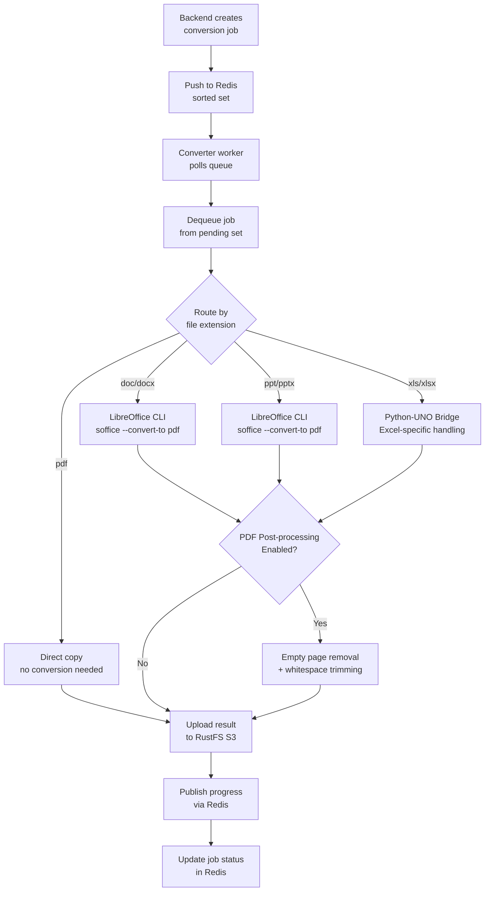
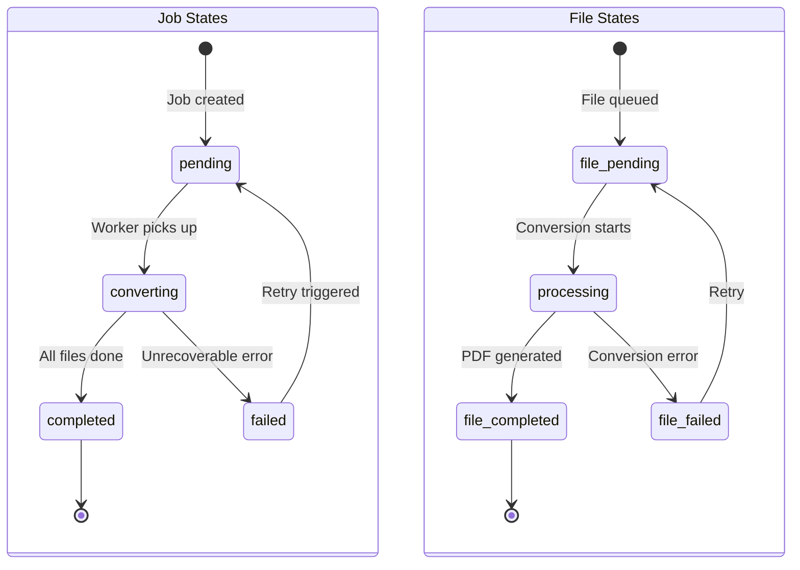
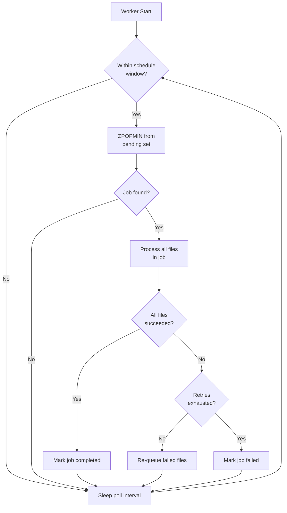

# Converter Pipeline

## Overview

The converter pipeline transforms uploaded office documents (Word, PowerPoint, Excel) into PDF format for downstream processing. It uses a Redis-based job queue, LibreOffice CLI for most conversions, and Python-UNO bridge for Excel files. Converted PDFs undergo optional post-processing to remove empty pages and trim whitespace.

## Conversion Pipeline Flow



## Conversion Routes

| Input Format | Extension | Converter | Method |
|-------------|-----------|-----------|--------|
| Word | `.doc`, `.docx` | LibreOffice | `soffice --headless --convert-to pdf` |
| PowerPoint | `.ppt`, `.pptx` | LibreOffice | `soffice --headless --convert-to pdf` |
| Excel | `.xls`, `.xlsx` | Python-UNO | UNO bridge with sheet iteration and fit-to-page |
| PDF | `.pdf` | None | Direct copy (optional post-processing only) |

### LibreOffice CLI

LibreOffice runs in headless mode as a subprocess:

```
soffice --headless --convert-to pdf --outdir /tmp/output /tmp/input/file.docx
```

- Headless mode requires no display server (Xvfb not needed)
- Process timeout prevents hung conversions
- One conversion at a time to avoid LibreOffice lock conflicts

### Python-UNO Bridge (Excel)

Excel files require special handling for multi-sheet workbooks:

1. Open workbook via UNO interface
2. Iterate all visible sheets
3. Apply fit-to-page scaling per sheet
4. Export as single PDF with all sheets
5. Handle merged cells and embedded charts

## Redis Key Layout

| Key Pattern | Type | Description |
|------------|------|-------------|
| `converter:vjob:{jobId}` | Hash | Job metadata (status, file list, timestamps) |
| `converter:vjob:pending` | Sorted Set | Pending jobs, scored by priority/timestamp |
| `converter:files:{jobId}` | List | File IDs belonging to a job |
| `converter:file:{fileId}` | Hash | Per-file status and result path |

### Job Lifecycle in Redis

```
# Create job
HSET converter:vjob:{jobId} status pending created_at {timestamp}
ZADD converter:vjob:pending {score} {jobId}

# Dequeue
ZPOPMIN converter:vjob:pending

# Update progress
HSET converter:vjob:{jobId} status converting progress 0.5

# Complete
HSET converter:vjob:{jobId} status completed completed_at {timestamp}
```

## PDF Post-Processing

### Empty Page Removal

Uses pdfminer to analyze each page:

1. Extract all text content from each page
2. Check for any rendered elements (images, drawings)
3. If page has no text and no visual elements, mark for removal
4. Reconstruct PDF without empty pages

### Whitespace Trimming

Adjusts CropBox to remove excessive margins:

1. Analyze content bounding box on each page via pdfminer
2. Calculate minimal bounding box that contains all content
3. Add configurable padding (default: 10pt)
4. Update page CropBox to trimmed dimensions

## Job and File State Machines



## Worker Loop

The converter worker runs a continuous polling loop:

| Parameter | Default | Description |
|-----------|---------|-------------|
| Poll interval | 5 seconds | Time between queue checks when idle |
| Schedule window | `null` (always active) | Optional time window for processing (e.g., off-peak hours) |
| Max retries | 3 | Per-file retry attempts |
| Process timeout | 300 seconds | Maximum time per file conversion |
| Manual trigger | Supported | Backend can push immediate conversion via Redis pub/sub |

### Worker Loop Flow



## Configuration

### PostProcessingConfig

| Field | Type | Default | Description |
|-------|------|---------|-------------|
| `remove_empty_pages` | `boolean` | `true` | Remove pages with no content |
| `trim_whitespace` | `boolean` | `true` | Trim excessive margins |
| `trim_padding` | `number` | `10` | Padding in points after trim |

### SuffixConfig

| Field | Type | Default | Description |
|-------|------|---------|-------------|
| `supported_input` | `string[]` | `[doc,docx,ppt,pptx,xls,xlsx,pdf]` | Accepted file extensions |
| `output_format` | `string` | `pdf` | Output format for all conversions |

### ExcelConfig

| Field | Type | Default | Description |
|-------|------|---------|-------------|
| `fit_to_page` | `boolean` | `true` | Scale sheets to fit page width |
| `landscape` | `boolean` | `true` | Use landscape orientation for wide sheets |
| `include_hidden_sheets` | `boolean` | `false` | Convert hidden sheets |
