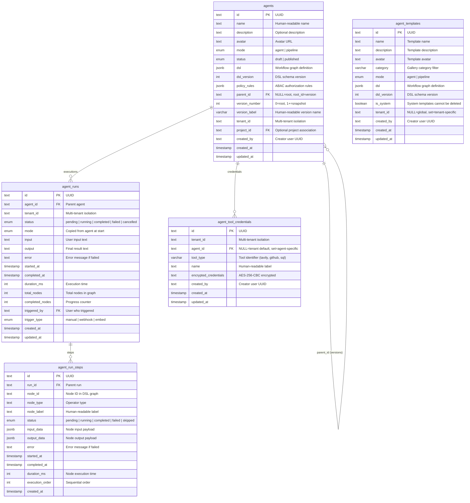
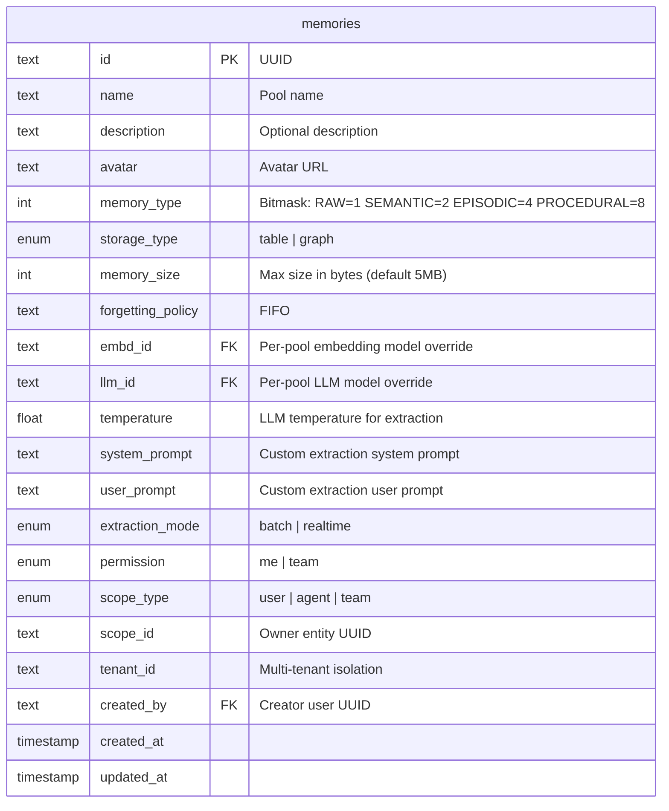
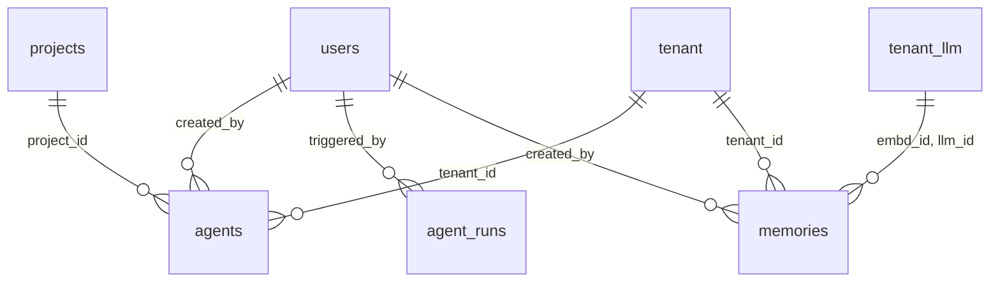

# Agent & Memory Tables ER Diagram

## Overview

Agent and Memory tables support the visual workflow builder (agents) and persistent AI memory system (memories). These tables were introduced in the initial schema migration and extend the platform with orchestration and knowledge retention capabilities.

## Agent Tables ER Diagram

## Memory Tables ER Diagram

> **Note**: Memory messages are stored in OpenSearch (not PostgreSQL). See [Memory Architecture](/basic-design/memory-architecture) for the OpenSearch index mapping.

## Agent Table Indexes

| Table | Index | Columns | Purpose |
|-------|-------|---------|---------|
| agents | idx_agents_tenant_parent | `(tenant_id, parent_id)` | Fast version listing within tenant |
| agents | idx_agents_tenant_status | `(tenant_id, status)` | Filter by status within tenant |
| agents | idx_agents_project | `(project_id)` | Project association lookup |
| agent_runs | idx_runs_agent | `(agent_id)` | Execution history per agent |
| agent_runs | idx_runs_tenant_status | `(tenant_id, status)` | Filter runs by status |
| agent_run_steps | idx_steps_run | `(run_id)` | All steps for a run |
| agent_run_steps | idx_steps_run_node | `(run_id, node_id)` | Specific step lookup |
| agent_templates | idx_templates_tenant | `(tenant_id)` | Template discovery |
| agent_templates | idx_templates_category | `(category)` | Category filtering |
| agent_tool_credentials | idx_creds_tenant | `(tenant_id)` | Credential listing |
| agent_tool_credentials | idx_creds_agent | `(agent_id)` | Agent-specific credentials |
| agent_tool_credentials | UNIQUE | `(tenant_id, COALESCE(agent_id, '00...'), tool_type)` | One credential per scope+type |

## Agent Version-as-Row Pattern

Agents use a single-table versioning pattern where root agents and version snapshots coexist in the same table:

| `parent_id` | `version_number` | Meaning |
|-------------|-----------------|---------|
| `NULL` | `0` | Root agent (current working copy) |
| `<root_id>` | `1` | First version snapshot |
| `<root_id>` | `2` | Second version snapshot |
| `<root_id>` | `N` | Nth version snapshot |

**Key queries:**
- List root agents: `WHERE parent_id IS NULL AND tenant_id = ?`
- List versions: `WHERE parent_id = ? ORDER BY version_number`
- Restore version: Copy DSL from version row to root row

## Memory Type Bitmask Reference

| Type | Bit Value | Combined Example |
|------|-----------|-----------------|
| Raw | 1 | `1` = Raw only |
| Semantic | 2 | `3` = Raw + Semantic |
| Episodic | 4 | `6` = Semantic + Episodic |
| Procedural | 8 | `15` = All four types |

Check enabled: `(memory_type & BIT_VALUE) !== 0`

## Memory OpenSearch Index

Memory messages are stored in per-tenant OpenSearch indices:

- **Index pattern**: `memory_{tenantId}`
- **Vector field**: `content_embed` (knn_vector, dim=1024, HNSW cosine)
- **Text field**: `content` (standard analyzer)
- **Key filters**: `memory_id`, `tenant_id`, `status`

See [Memory Architecture](/basic-design/memory-architecture) for the full index mapping.

## Relationships to Existing Tables

| Relationship | FK Column | Target Table | Notes |
|-------------|-----------|-------------|-------|
| Agent → User | `created_by` | `users` | Creator tracking |
| Agent → Project | `project_id` | `projects` | Optional project scope |
| Agent → Tenant | `tenant_id` | `tenant` | Multi-tenant isolation |
| Agent Run → User | `triggered_by` | `users` | Who started the run |
| Memory → User | `created_by` | `users` | Pool creator |
| Memory → Tenant | `tenant_id` | `tenant` | Multi-tenant isolation |
| Memory → LLM | `embd_id`, `llm_id` | `tenant_llm` | Model overrides |
