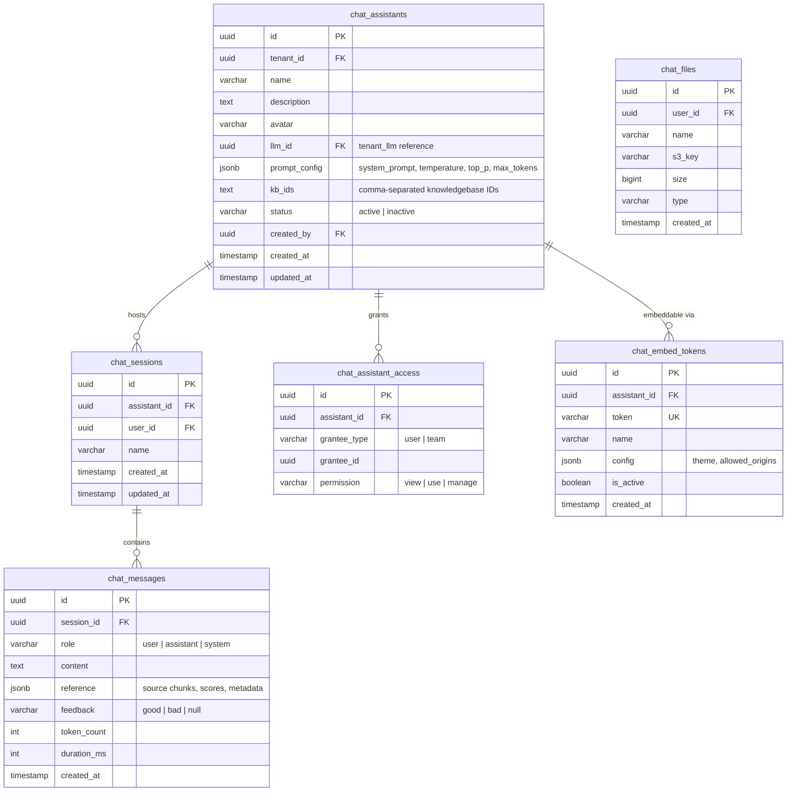
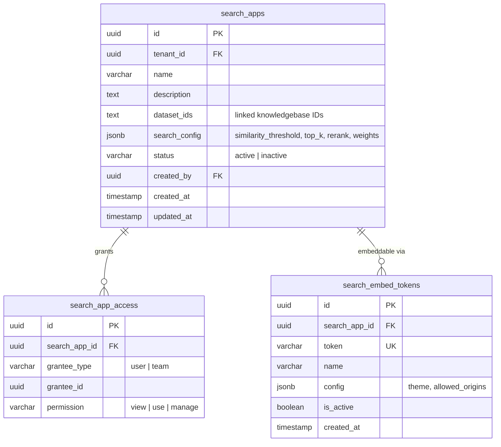
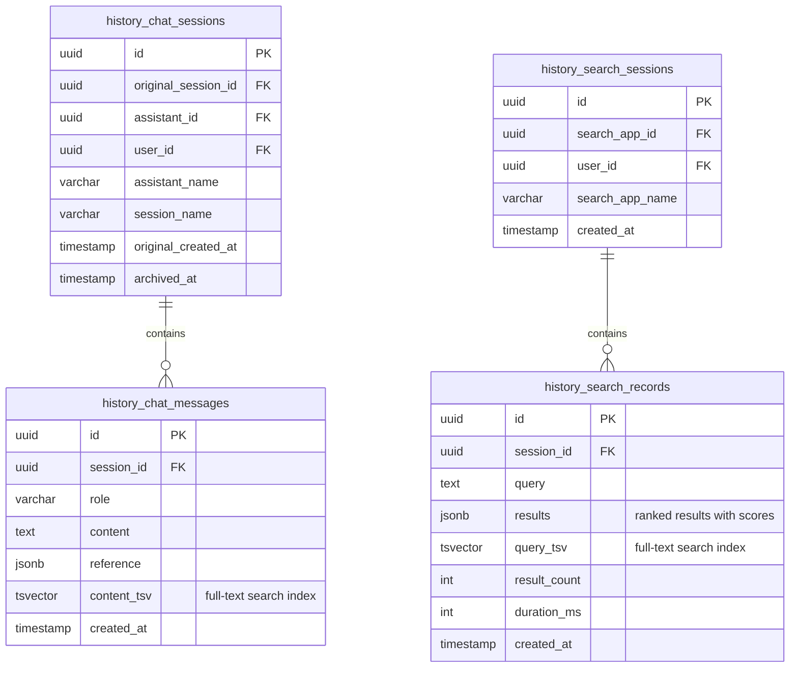
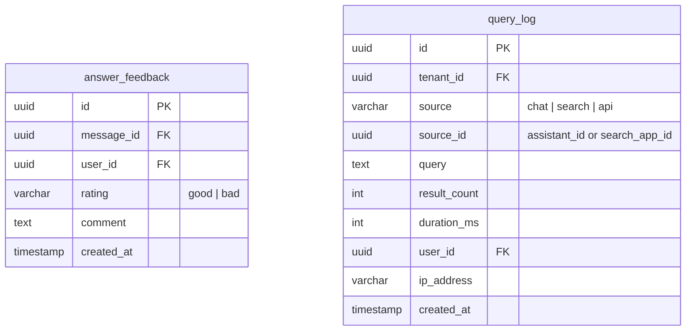

# Database Design: Chat & Search Tables

## Chat Tables ER Diagram

## Search Tables ER Diagram

## History Tables ER Diagram

## Feedback & Analytics

## Table Descriptions

### Chat Assistants

A chat assistant is an AI conversation agent configured with an LLM model, system prompt, and linked knowledge bases. The `prompt_config` JSONB stores the system prompt template, temperature, top_p, max_tokens, and other generation parameters. `kb_ids` links the assistant to knowledge bases for RAG retrieval.

### Chat Sessions & Messages

Sessions group messages into conversations. Each message records the role (user/assistant/system), content, and source references from RAG. The `reference` JSONB stores retrieved chunks with relevance scores and document metadata for citation display.

### Chat Files

User-uploaded files within chat context (e.g., images, documents for analysis). Stored in RustFS with S3 keys for retrieval.

### Access Control (chat_assistant_access, search_app_access)

ABAC permission grants follow the shared grantee pattern. Both user-level and team-level grants are supported. Permission levels: `view` (see metadata), `use` (interact), `manage` (edit config, grant access).

### Embed Tokens (chat_embed_tokens, search_embed_tokens)

Enable embedding chat or search widgets in external websites. Each token has a unique string for URL-based authentication, optional origin restrictions, and theme configuration. Tokens can be deactivated without deletion.

### History Tables

Archived sessions and messages for long-term retention and analytics. History tables include `tsvector` columns for PostgreSQL full-text search, enabling users to search across their conversation and query history.

### answer_feedback

Detailed feedback on individual AI responses, beyond the inline good/bad toggle on messages. Supports free-text comments for qualitative feedback collection.

### query_log

Centralized query analytics across chat and search. Tracks query volume, latency, and result counts per source for monitoring and optimization.

## Indexing Strategy

| Table | Index | Type | Purpose |
|-------|-------|------|---------|
| `chat_sessions` | `user_id, updated_at` | Composite | User's recent conversations |
| `chat_messages` | `session_id, created_at` | Composite | Message timeline |
| `chat_assistant_access` | `grantee_type, grantee_id` | Composite | Permission lookup |
| `history_chat_messages` | `content_tsv` | GIN | Full-text search on history |
| `history_search_records` | `query_tsv` | GIN | Full-text search on queries |
| `query_log` | `tenant_id, created_at` | Composite | Analytics time range |
| `query_log` | `source, source_id` | Composite | Per-app analytics |
| `chat_embed_tokens` | `token` | Unique | Token authentication lookup |
