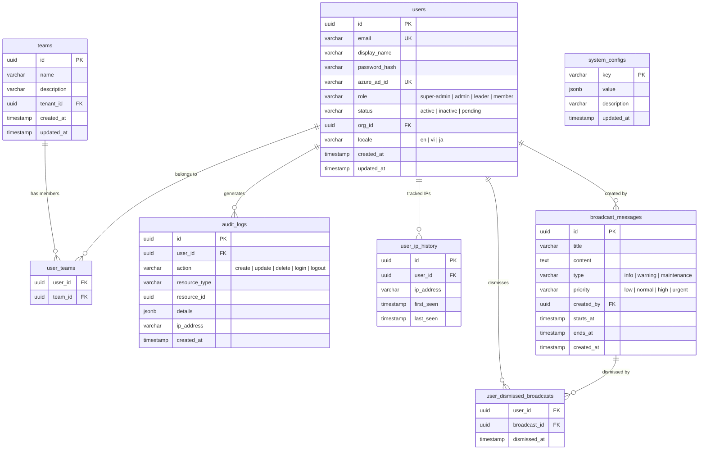

# Database Design: Core Tables

## ER Diagram

## Table Descriptions

### users

Central user table supporting both local and Azure AD authentication. The `role` column determines RBAC permissions via the CASL ability hierarchy. The `org_id` field scopes users to tenants in multi-tenant deployments. Users with `azure_ad_id` are provisioned automatically on first SSO login.

### teams

Organizational grouping for users within a tenant. Teams are the primary grantee unit for ABAC permissions on datasets, chat assistants, and search apps. A user can belong to multiple teams.

### user_teams

Join table for the many-to-many relationship between users and teams. Composite primary key on `(user_id, team_id)`.

### system_configs

Key-value store for runtime system configuration. The `value` column uses JSONB for flexible typed storage (strings, numbers, arrays, objects). Used for feature flags, default settings, and system-wide parameters.

### audit_logs

Append-only log of all significant user actions. The `details` JSONB column captures action-specific context (old/new values for updates, metadata for creates). Used by the audit module for compliance and debugging.

### user_ip_history

Tracks IP addresses associated with each user session. Used for security monitoring, detecting account sharing, and geographic access patterns.

### broadcast_messages

System-wide announcements displayed to users. Supports scheduled visibility windows via `starts_at` / `ends_at` and priority-based rendering. Types control visual styling in the frontend.

### user_dismissed_broadcasts

Tracks which users have dismissed which broadcasts, preventing re-display after acknowledgment.

## Indexing Strategy

| Table | Index | Type | Purpose |
|-------|-------|------|---------|
| `users` | `email` | Unique | Login lookup |
| `users` | `azure_ad_id` | Unique (partial, non-null) | SSO lookup |
| `users` | `org_id, status` | Composite | Tenant user listing |
| `audit_logs` | `user_id, created_at` | Composite | User activity timeline |
| `audit_logs` | `resource_type, resource_id` | Composite | Resource audit trail |
| `audit_logs` | `created_at` | B-tree | Date range queries |
| `user_ip_history` | `user_id, ip_address` | Unique | Dedup IP tracking |
| `broadcast_messages` | `starts_at, ends_at` | Composite | Active broadcast queries |
| `user_dismissed_broadcasts` | `user_id, broadcast_id` | Unique (PK) | Dismiss lookup |

## Notes

- All `id` columns use UUID v4 generated at the application layer.
- Timestamps use `timestamptz` (UTC) throughout.
- Soft deletes are not used; `status` field controls visibility where needed.
- Migrations are managed exclusively through Knex (`npm run db:migrate`).
