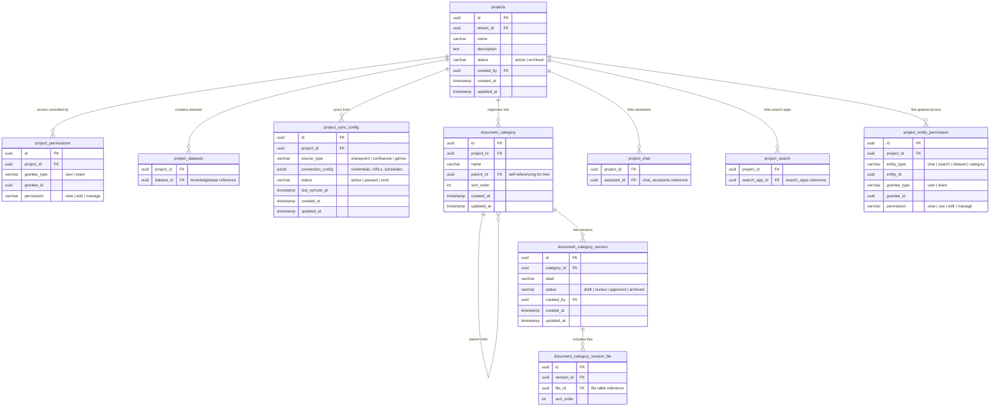
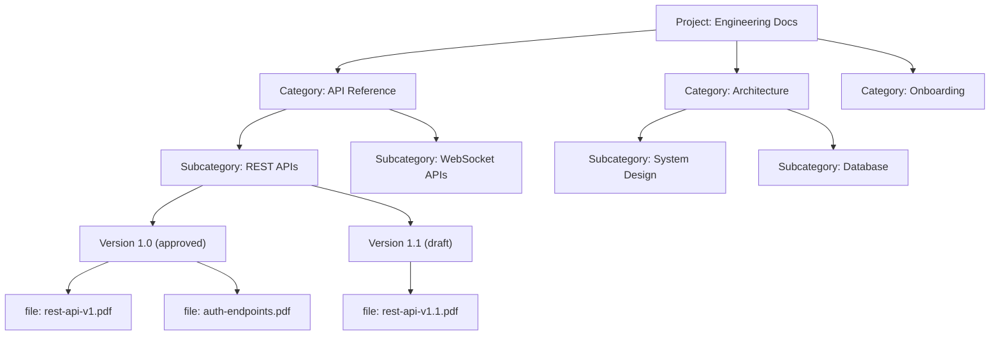
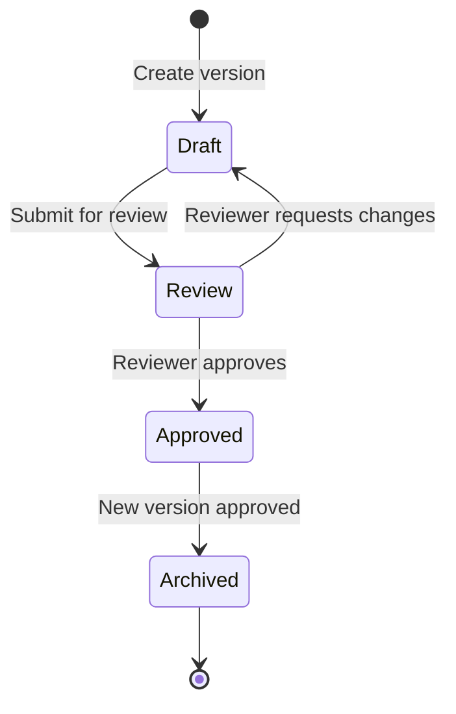
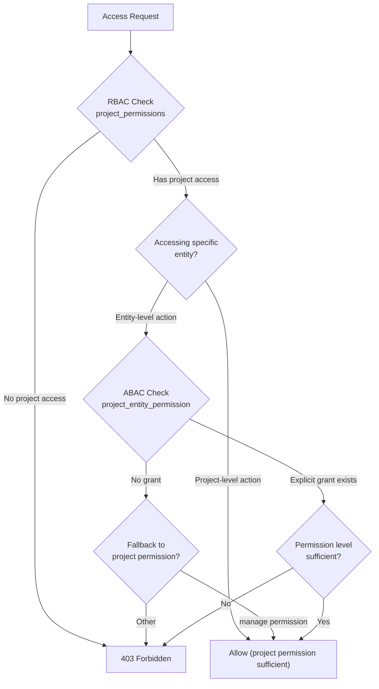

# Database Design: Project Tables

## ER Diagram

## Hierarchical Category Structure

The `document_category` table uses a self-referencing `parent_id` to build an unlimited-depth tree. Categories are scoped to a project and ordered via `sort_order`. Each category can have multiple versions, enabling a review/approval workflow before content goes live.

### Category Version Lifecycle

## Table Descriptions

### projects

Top-level organizational container that groups datasets, chat assistants, search apps, and document categories. Projects enable cross-functional teams to manage related knowledge resources as a unit.

### project_permissions

Project-level RBAC grants. Controls who can access the project itself. Users with `manage` permission can modify project settings and grant access to others.

### project_datasets

Many-to-many link between projects and knowledge bases. A single dataset can be shared across multiple projects. Documents within linked datasets are searchable through the project's chat and search apps.

### project_sync_config

External data source synchronization configuration. Supports pulling documents from SharePoint, Confluence, Google Drive, and other sources. The `connection_config` JSONB stores source-specific credentials, folder paths, file filters, and sync schedules.

### document_category / document_category_version / document_category_version_file

Three-tier structure for organizing documents within a project:
1. **Category** -- tree node with optional parent for hierarchy
2. **Version** -- snapshot of category content with approval workflow
3. **Version File** -- ordered list of files in a version

### project_chat / project_search

Join tables linking chat assistants and search apps to projects. Enables a project to aggregate multiple AI interfaces for different use cases (e.g., general Q&A assistant, technical search).

### project_entity_permission

Fine-grained ABAC permissions for individual entities within a project. While `project_permissions` controls project-level access, this table controls access to specific chat assistants, search apps, datasets, or categories within the project scope.

## RBAC + ABAC Dual Authorization Model

Authorization resolves in two layers:

1. **Project-level (RBAC)**: Does the user/team have a `project_permissions` grant? This gates all access to the project.
2. **Entity-level (ABAC)**: For specific resources within the project, `project_entity_permission` provides fine-grained control. Users with project `manage` permission bypass entity-level checks.

## Indexing Strategy

| Table | Index | Type | Purpose |
|-------|-------|------|---------|
| `projects` | `tenant_id, status` | Composite | Tenant project listing |
| `project_permissions` | `grantee_type, grantee_id` | Composite | User/team access lookup |
| `project_datasets` | `project_id` | B-tree | Project dataset listing |
| `project_datasets` | `dataset_id` | B-tree | Dataset project membership |
| `document_category` | `project_id, parent_id` | Composite | Category tree traversal |
| `document_category_version` | `category_id, status` | Composite | Active version lookup |
| `project_entity_permission` | `project_id, entity_type, grantee_type, grantee_id` | Composite | Permission resolution |
