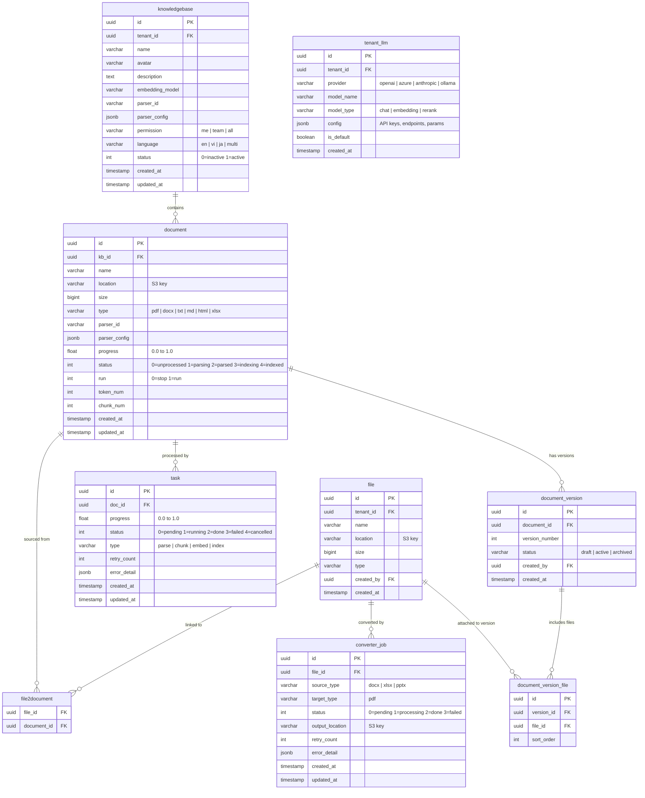
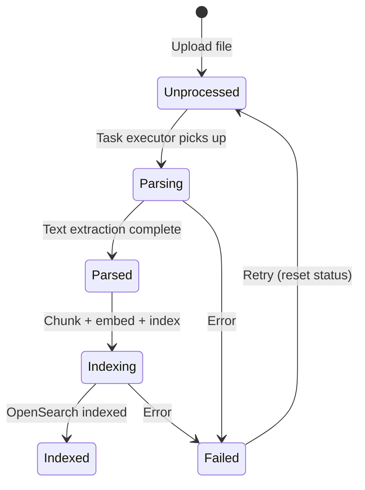

# Database Design: RAG Tables

## ER Diagram

## Document Processing Pipeline

## Document Status Enum

| Value | Status | Description |
|-------|--------|-------------|
| 0 | Unprocessed | File uploaded but not yet processed |
| 1 | Parsing | Text extraction in progress (PDF/Office parsing) |
| 2 | Parsed | Text extracted, ready for chunking and embedding |
| 3 | Indexing | Chunking, embedding, and OpenSearch indexing in progress |
| 4 | Indexed | Fully processed and searchable |

## Task Status Enum

| Value | Status | Description |
|-------|--------|-------------|
| 0 | Pending | Queued for processing |
| 1 | Running | Actively being processed by worker |
| 2 | Done | Completed successfully |
| 3 | Failed | Failed after retries; see `error_detail` |
| 4 | Cancelled | Manually cancelled by user |

## Table Descriptions

### knowledgebase

A dataset (knowledge base) is a collection of documents with shared embedding and parser configuration. The `parser_config` JSONB stores chunking strategy, overlap size, separators, and other parsing parameters. Permission controls visibility: `me` (creator only), `team` (team members), `all` (tenant-wide).

### document

Represents a single file within a knowledge base. Tracks processing progress and status through the RAG pipeline. The `run` flag controls whether the document should be actively processed (allows pause/resume). `token_num` and `chunk_num` are populated after parsing.

### file

Tenant-scoped file registry pointing to S3 objects in RustFS. Files are decoupled from documents via `file2document` to support file reuse across knowledge bases.

### task

Granular processing tasks for the RAG pipeline. Each document may generate multiple tasks (parse, chunk, embed, index). Retry logic with `retry_count` and `error_detail` for debugging failed operations.

### document_version / document_version_file

Version control for documents. Each version can reference multiple files with ordering. Supports draft/active/archived lifecycle for content review workflows.

### converter_job

Tracks Office-to-PDF conversion jobs processed by the Converter service via Redis queue. Source files are fetched from RustFS, converted using LibreOffice, and output written back to RustFS.

### tenant_llm

Tenant-specific LLM provider configuration. Supports multiple providers and model types (chat, embedding, rerank). The `config` JSONB stores API keys, endpoints, and model parameters. One model per type can be marked `is_default`.

## ORM Management Note

These tables are managed by two ORMs with distinct responsibilities:

| Concern | Owner | Tool |
|---------|-------|------|
| Schema migrations | Backend (Node.js) | Knex |
| Data read/write (Python) | Task Executor / Converter | Peewee |
| Data read/write (Node.js) | Backend API | Knex |

All schema changes (CREATE TABLE, ALTER, indexes) go through Knex migrations. Peewee models mirror the schema for Python data access. Never use Peewee migrators.
