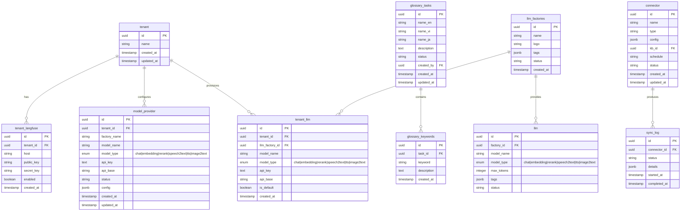
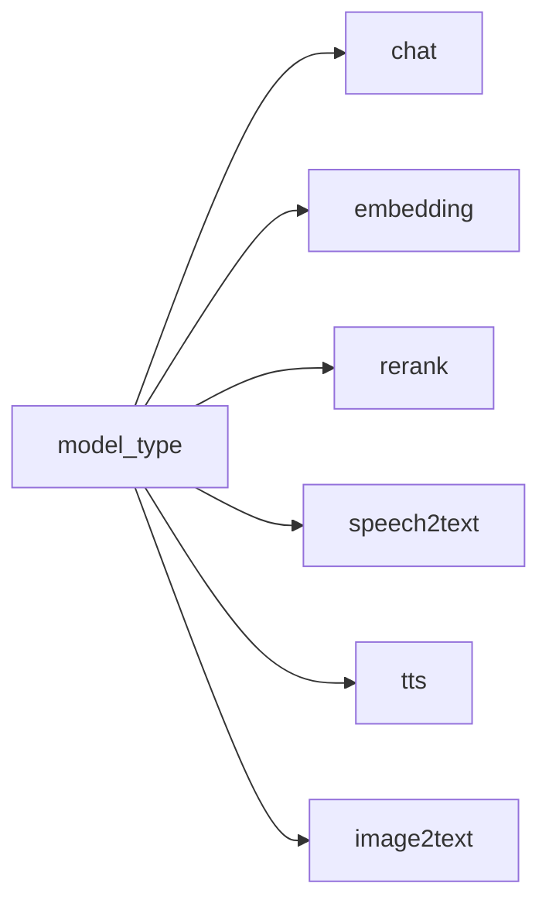
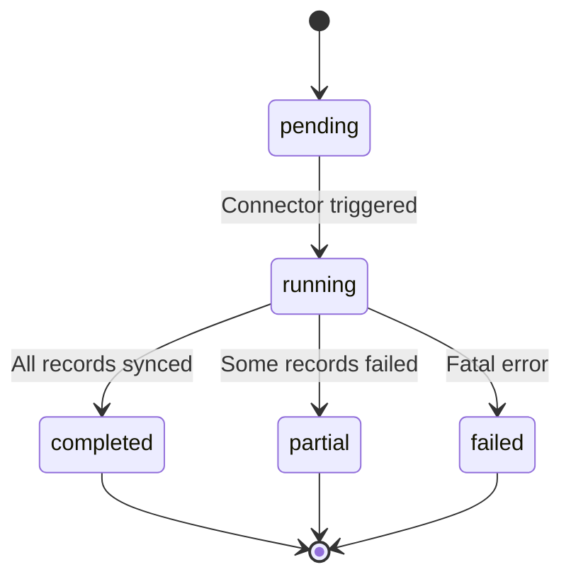

# Support Tables ER Diagram

## Overview

Support tables provide glossary management, LLM provider configuration, data connectors, and tenant multi-tenancy for the B-Knowledge platform.

## ER Diagram

## LLM Model Type Enum

| Value | Purpose | Example Models |
|-------|---------|----------------|
| `chat` | Conversational LLM | GPT-4o, Claude 3.5, Qwen |
| `embedding` | Text to vector | text-embedding-3-large, BGE-M3 |
| `rerank` | Re-rank search results | BGE-Reranker, Cohere Rerank |
| `speech2text` | Audio transcription | Whisper |
| `tts` | Text to speech | Azure TTS, OpenAI TTS |
| `image2text` | Vision / OCR | GPT-4o Vision, Qwen-VL |

## Table Ownership

| Table | Managed By | Migrations |
|-------|-----------|------------|
| `glossary_tasks` | Knex (Backend) | Knex migrations |
| `glossary_keywords` | Knex (Backend) | Knex migrations |
| `model_provider` | Knex (Backend) | Knex migrations |
| `llm_factories` | Peewee (RAG Worker) | Knex migrations |
| `llm` | Peewee (RAG Worker) | Knex migrations |
| `tenant_llm` | Peewee (RAG Worker) | Knex migrations |
| `connector` | Knex (Backend) | Knex migrations |
| `sync_log` | Knex (Backend) | Knex migrations |
| `tenant` | Knex (Backend) | Knex migrations |
| `tenant_langfuse` | Knex (Backend) | Knex migrations |

> **Convention:** All schema migrations go through Knex, even for Peewee-managed tables. The Python RAG worker only reads/writes data via its ORM and never modifies the schema.

## Connector Types

| Type | Config Fields | Schedule |
|------|--------------|----------|
| `web_crawl` | `url`, `depth`, `selectors` | Cron expression |
| `s3` | `bucket`, `prefix`, `credentials` | Cron expression |
| `database` | `connection_string`, `query` | Cron expression |
| `api` | `endpoint`, `headers`, `auth` | Cron expression |

## Sync Log Status Flow

