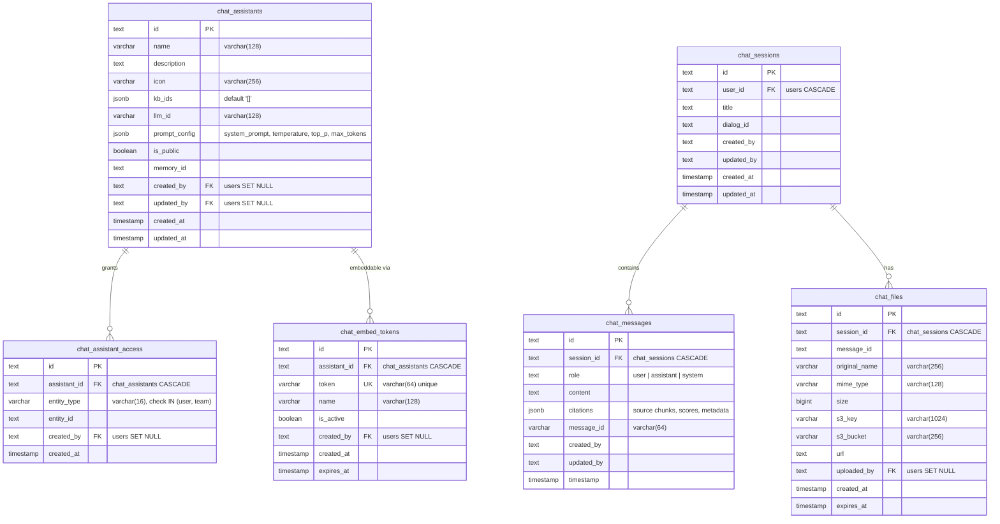
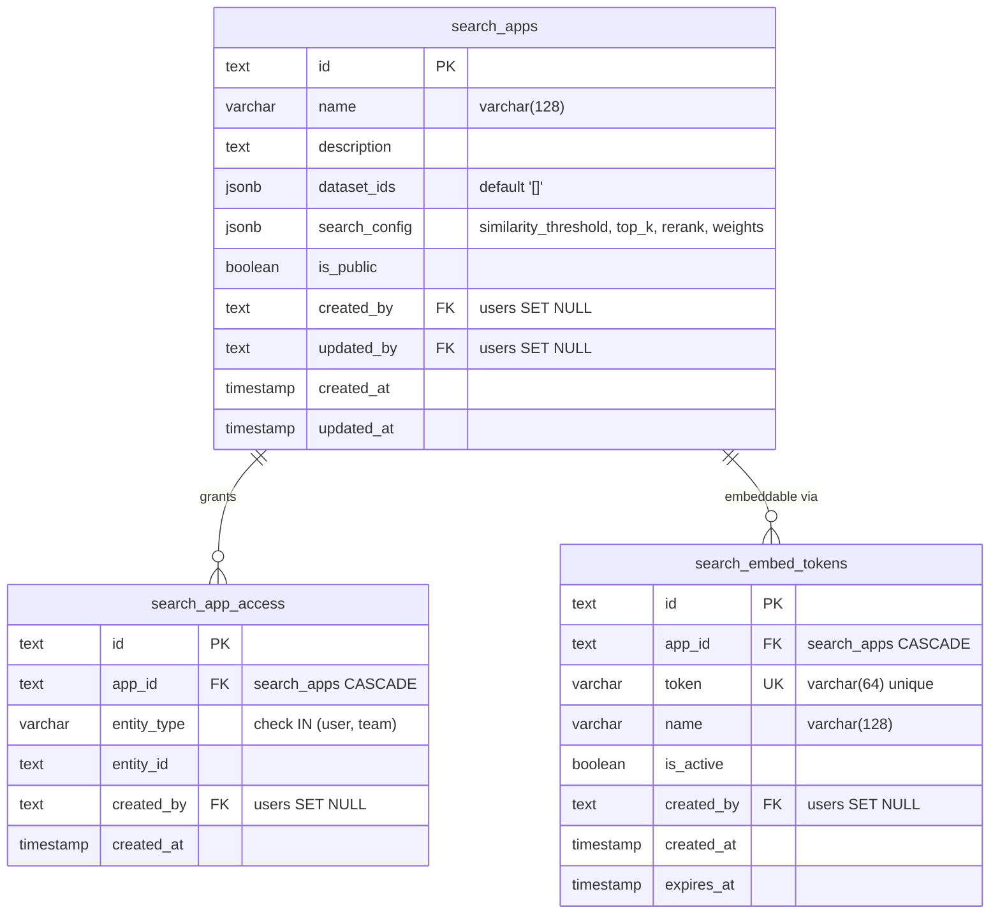
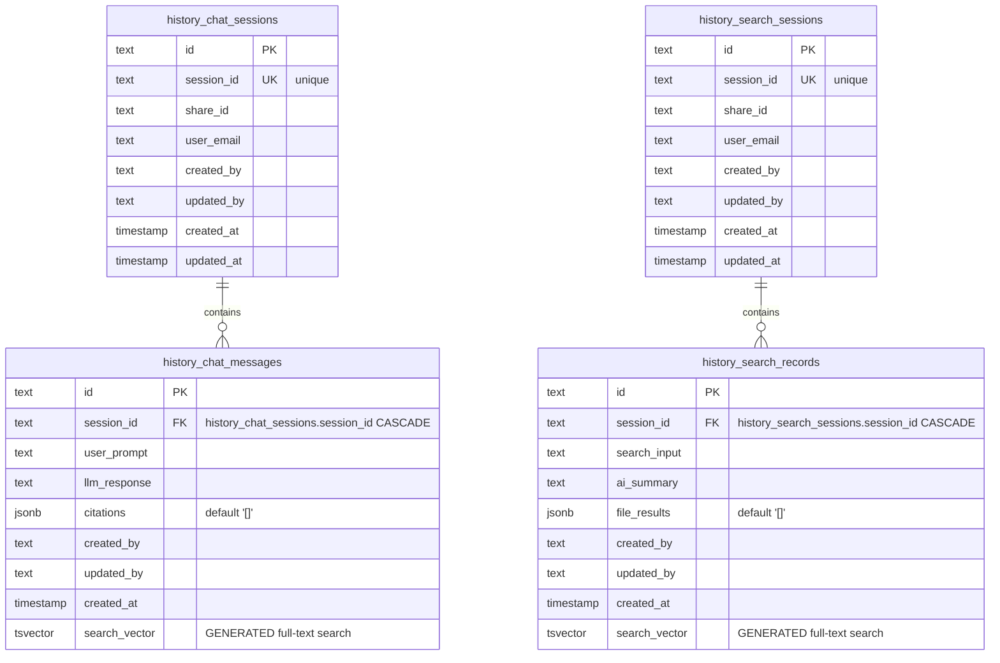
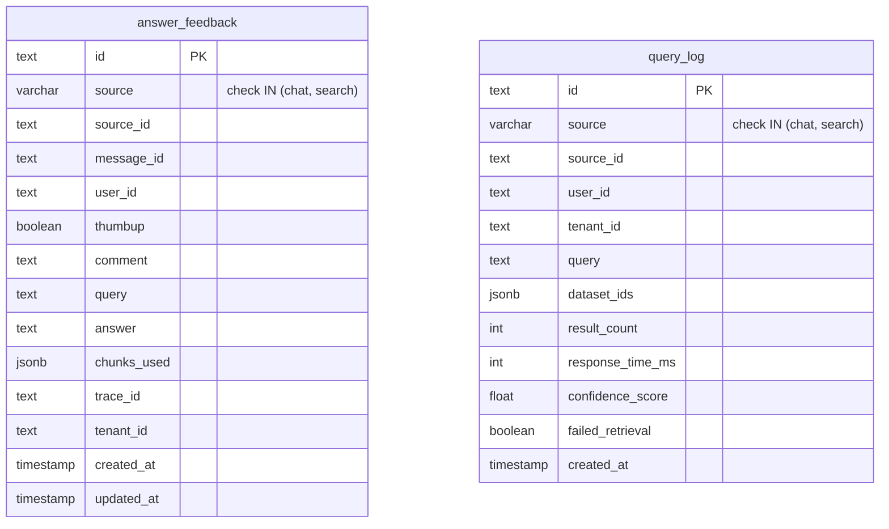

# Database Design: Chat & Search Tables

## Chat Tables ER Diagram

## Search Tables ER Diagram

## History Tables ER Diagram

## Feedback & Analytics

## Table Descriptions

### Chat Assistants

A chat assistant is an AI conversation agent configured with an LLM model, system prompt, and linked knowledge bases. The `prompt_config` JSONB stores the system prompt template, temperature, top_p, max_tokens, and other generation parameters. `kb_ids` is a JSONB array linking the assistant to knowledge bases for RAG retrieval. The `icon` column stores the assistant's display icon path. The `is_public` boolean controls whether the assistant is visible to all users. The `memory_id` links to an optional memory configuration for context retention across sessions.

### Chat Sessions & Messages

Sessions group messages into conversations. Each session has a `title` and belongs to a `user_id`. Messages record the `role` (user/assistant/system), `content`, and `citations` JSONB storing retrieved chunks with relevance scores and document metadata for citation display. The `message_id` (varchar 64) provides an additional identifier for message correlation.

### Chat Files

Files uploaded within chat sessions (e.g., images, documents for analysis). Each file is linked to a `session_id` and optionally a `message_id`. Files are stored in RustFS with `s3_key` and `s3_bucket` for retrieval. The `original_name` preserves the user's filename, and `expires_at` supports automatic cleanup of temporary files.

### Access Control (chat_assistant_access, search_app_access)

Entity-based access grants using `entity_type` (user or team) and `entity_id`. A unique constraint on `(assistant_id, entity_type, entity_id)` or `(app_id, entity_type, entity_id)` prevents duplicate grants. No permission levels are stored — access is binary (granted or not).

### Embed Tokens (chat_embed_tokens, search_embed_tokens)

Enable embedding chat or search widgets in external websites. Each token has a unique varchar(64) string for URL-based authentication. Tokens can be deactivated via `is_active` without deletion, and `expires_at` supports automatic expiration.

### History Tables

History tables store shared or archived session data. Each history session has a unique `session_id` referencing the original session, a `share_id` for public sharing links, and a `user_email` for attribution. History chat messages store `user_prompt` and `llm_response` as separate columns rather than using the role/content pattern. Both `history_chat_messages` and `history_search_records` include a `search_vector` tsvector column (GENERATED) for PostgreSQL full-text search across conversation and query history.

### answer_feedback

Tracks user feedback on AI responses across both chat and search. The `source` column (chat or search) and `source_id` identify the originating assistant or search app. Stores the original `query`, `answer`, and `chunks_used` JSONB for analysis. The `thumbup` boolean captures positive/negative sentiment, with an optional free-text `comment`. The `trace_id` links to observability traces for debugging.

### query_log

Centralized query analytics across chat and search. The `source` column differentiates between chat and search origins. Tracks `dataset_ids` (JSONB) used for retrieval, `result_count`, `response_time_ms`, and `confidence_score` (float) per query. The `failed_retrieval` boolean flags queries where retrieval returned no useful results for monitoring and optimization.

## Indexing Strategy

| Table | Index | Type | Purpose |
|-------|-------|------|---------|
| `chat_sessions` | `user_id, updated_at` | Composite | User's recent conversations |
| `chat_messages` | `session_id, timestamp` | Composite | Message timeline |
| `chat_assistant_access` | `assistant_id, entity_type, entity_id` | Unique | Permission lookup, prevent duplicates |
| `search_app_access` | `app_id, entity_type, entity_id` | Unique | Permission lookup, prevent duplicates |
| `history_chat_messages` | `search_vector` | GIN | Full-text search on chat history |
| `history_search_records` | `search_vector` | GIN | Full-text search on search history |
| `history_chat_sessions` | `session_id` | Unique | Session lookup |
| `history_search_sessions` | `session_id` | Unique | Session lookup |
| `query_log` | `source, source_id` | Composite | Per-app analytics |
| `query_log` | `tenant_id, created_at` | Composite | Analytics time range |
| `chat_embed_tokens` | `token` | Unique | Token authentication lookup |
| `search_embed_tokens` | `token` | Unique | Token authentication lookup |
