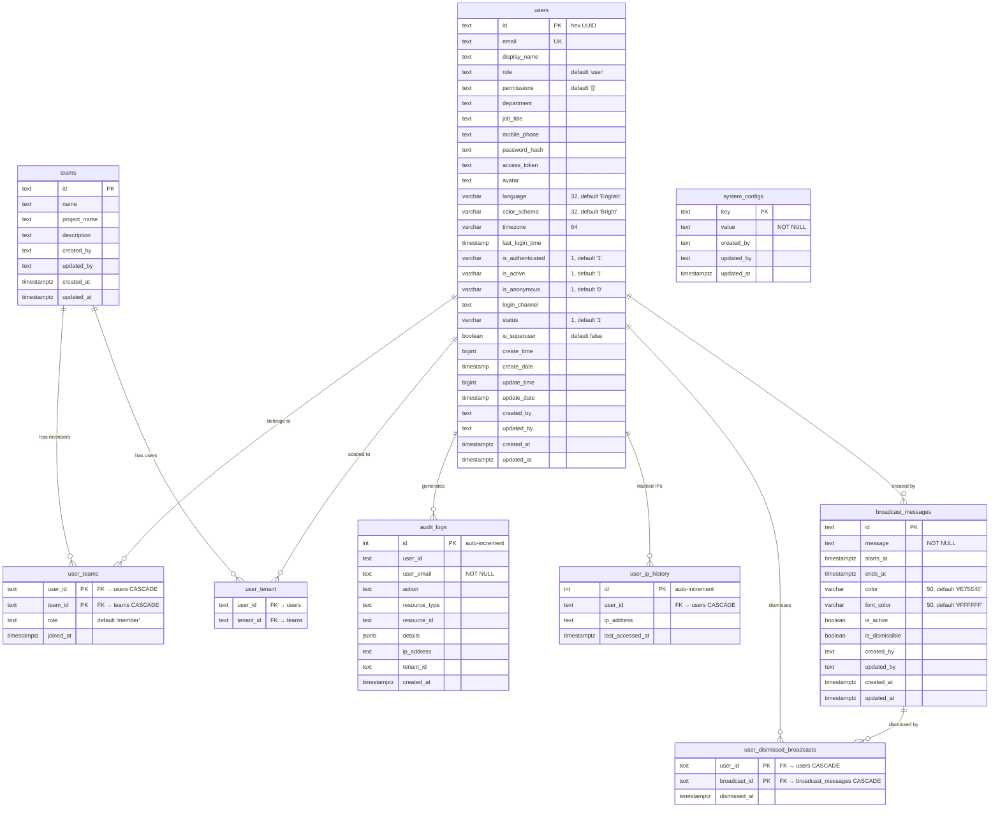

# Database Design: Core Tables

## ER Diagram

## Table Descriptions

### users

Central user table supporting both local and SSO authentication. The `id` column is a hex-formatted UUID stored as text. The `role` column (default `'user'`) determines RBAC permissions. Legacy columns from the upstream RAGFlow project (`create_time`, `update_time`, `is_authenticated`, `is_active`, `is_anonymous`, `status`) coexist alongside Knex-managed timestamps (`created_at`, `updated_at`). The `permissions` column stores a JSON-encoded array as text. The `is_superuser` boolean flag grants full system access.

### teams

Organizational grouping for users. Teams are the primary grantee unit for ABAC permissions on datasets, chat assistants, and search apps. A user can belong to multiple teams via the `user_teams` junction table. The `project_name` field associates teams with projects.

### user_teams

Join table for the many-to-many relationship between users and teams. Composite primary key on `(user_id, team_id)`. The `role` column (default `'member'`) controls the user's permissions within the team. Both foreign keys cascade on delete.

### user_tenant

Peewee-managed junction table for multi-tenant user scoping. Links users to tenants (teams acting as tenant containers). This table is managed by the Python RAG worker's Peewee ORM, but schema migrations are still handled through Knex.

### system_configs

Key-value store for runtime system configuration. The `value` column is plain `TEXT` (not JSONB), so structured values must be serialized by the application layer. Used for feature flags, default settings, and system-wide parameters. The `key` column serves as the primary key.

### audit_logs

Append-only log of all significant user actions. Uses an auto-incrementing integer primary key (not UUID). The `user_email` column is stored directly for queryability even if the user is later deleted. The `details` JSONB column captures action-specific context (old/new values for updates, metadata for creates). Indexed on `user_id`, `action`, `resource_type`, `created_at`, and `tenant_id` for efficient querying.

### user_ip_history

Tracks IP addresses associated with each user. Uses an auto-incrementing integer primary key. A unique constraint on `(user_id, ip_address)` prevents duplicate entries; the `last_accessed_at` timestamp is updated on subsequent accesses. The `user_id` foreign key cascades on delete.

### broadcast_messages

System-wide announcements displayed to users. The `message` column holds the full announcement text. Supports scheduled visibility windows via `starts_at` / `ends_at`, configurable banner colors via `color` and `font_color`, and toggleable `is_active` and `is_dismissible` flags.

### user_dismissed_broadcasts

Tracks which users have dismissed which broadcasts, preventing re-display after acknowledgment. Composite primary key on `(user_id, broadcast_id)`. Both foreign keys cascade on delete.

## Indexing Strategy

| Table | Index | Type | Purpose |
|-------|-------|------|---------|
| `users` | `email` | Unique | Login lookup |
| `audit_logs` | `user_id` | B-tree | User activity queries |
| `audit_logs` | `action` | B-tree | Action-based filtering |
| `audit_logs` | `resource_type` | B-tree | Resource audit trail |
| `audit_logs` | `created_at` | B-tree | Date range queries |
| `audit_logs` | `tenant_id` | B-tree | Tenant-scoped queries |
| `user_ip_history` | `(user_id, ip_address)` | Unique | Dedup IP tracking |
| `user_dismissed_broadcasts` | `(user_id, broadcast_id)` | Unique (PK) | Dismiss lookup |

## Notes

- The `users.id` column uses a hex-formatted UUID generated at the application layer, stored as `text`.
- Other table IDs vary: `text` for `teams`, `broadcast_messages`; auto-increment `int` for `audit_logs`, `user_ip_history`.
- Knex-managed tables use `timestamptz` (UTC) for `created_at` / `updated_at`.
- Legacy columns inherited from upstream RAGFlow use `timestamp` (without timezone) or `bigint` epoch values.
- Soft deletes are not used; `status` and `is_active` fields control visibility where needed.
- Migrations are managed exclusively through Knex (`npm run db:migrate`), including tables read/written by Peewee.
