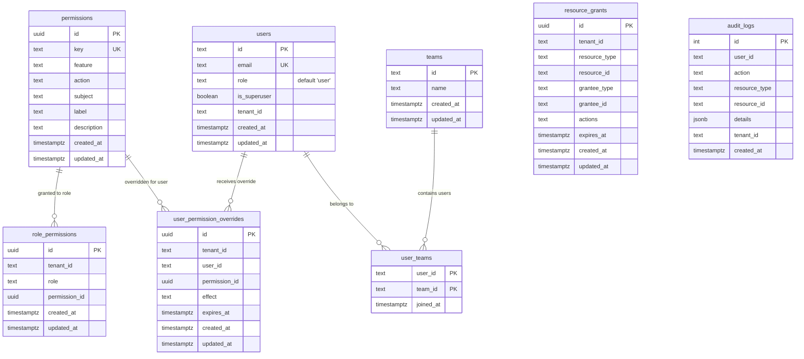

# Database Design: Core Tables

> Core tenant, identity, and authorization tables used by the current permission system.

## 1. Overview

The permission-system milestone moved authorization state into explicit catalog and assignment tables. The core database design is no longer centered on legacy user-row permission payloads or ad hoc role-only rules. Instead, the live control surfaces are:

- `permissions`
- `role_permissions`
- `user_permission_overrides`
- `resource_grants`

These tables work alongside the existing `users`, `teams`, tenant-scoping, and audit tables.

## 2. Core Authorization ER Diagram

## 3. Authorization Table Roles

### 3.1 `permissions`

Registry-backed permission catalog synchronized at backend boot.

| Column | Purpose |
|--------|---------|
| `key` | Stable permission identifier such as `permissions.manage` |
| `feature` | Feature namespace used for grouping |
| `action` | CASL action emitted by the registry definition |
| `subject` | CASL subject associated with the key |
| `label` / `description` | Human-readable admin and documentation metadata |

This table is the database reflection of backend code definitions. Maintainers add new permission definitions in backend registry files, and startup sync upserts them here.

### 3.2 `role_permissions`

Tenant-scoped role defaults. Each row assigns one catalog permission to one role inside one tenant.

This table now represents the default capability matrix for:

- `super-admin`
- `admin`
- `leader`
- `user`

The ability service joins `role_permissions` with `permissions` to emit class-level CASL rules.

### 3.3 `user_permission_overrides`

Per-user allow or deny exceptions layered on top of role defaults.

| Column | Meaning |
|--------|---------|
| `effect` | `allow` or `deny` |
| `expires_at` | Optional expiration for temporary access changes |

The ability builder applies allow rules before ABAC compatibility overlays and applies deny rules last so deny wins.

### 3.4 `resource_grants`

Row-scoped access grants used by the current milestone for `KnowledgeBase` and `DocumentCategory`.

Each row identifies:

- which resource is being granted (`resource_type`, `resource_id`)
- who receives the grant (`grantee_type`, `grantee_id`)
- which actions are granted (`actions[]`)
- whether the grant expires (`expires_at`)

`resource_grants` is part of the active authorization core even though some granted resources are RAG-facing. It participates directly in ability construction and search/retrieval filtering.

## 4. Identity and Tenant Context Tables

### 4.1 `users`

The user table still carries the tenant role field and super-admin flag, but it is no longer the place where maintainers should look for the live permission matrix.

Important notes:

- `role` selects the base role whose defaults are loaded from `role_permissions`
- `is_superuser` enables the super-admin shortcut in the ability builder
- any legacy `permissions` column should be treated as historical baggage, not as the active permission source

### 4.2 `teams` and `user_teams`

Teams remain relevant because grant resolution can target team principals in `resource_grants`, even though the current phase’s main documentation focus is on catalog and grant tables rather than on older team-specific permission storage.

## 5. Audit and Operational Tables

### 5.1 `audit_logs`

Permission and grant changes must remain observable. The audit log records actor, action, resource type, resource id, tenant id, and structured details. This supports:

- reviewing authorization changes
- investigating access issues
- correlating permission admin actions with effective-access results

## 6. Indexing Guidance

Authorization-sensitive lookups should remain indexed around their live access patterns:

| Table | Important lookup shape |
|-------|------------------------|
| `permissions` | by `key` |
| `role_permissions` | by `(tenant_id, role)` and permission join columns |
| `user_permission_overrides` | by `(tenant_id, user_id)` and active-expiration filters |
| `resource_grants` | by `(tenant_id, resource_type, resource_id)` and grantee lookup columns |
| `audit_logs` | by `tenant_id`, `user_id`, `resource_type`, `created_at` |

## 7. Design Notes

- The canonical permission schema is catalog-backed and tenant-scoped
- `rbac.ts` compatibility code must not be mistaken for the database source of truth
- The active role vocabulary is `super-admin`, `admin`, `leader`, `user`
- Legacy references to user-row permission payloads as the control surface should be treated as historical only

## 8. Related Docs

- [Security Architecture](/basic-design/system-infra/security-architecture)
- [Database Design: RAG Tables](/basic-design/database/database-design-rag)
- [API Endpoint Reference](/basic-design/component/api-design-endpoints)
