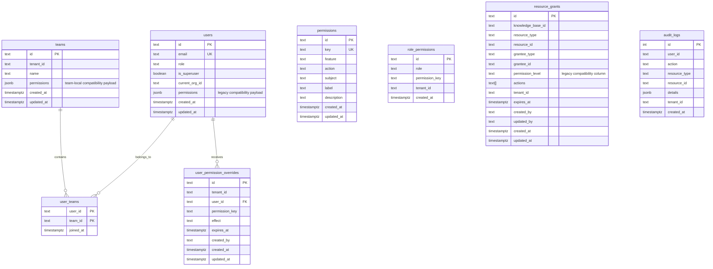
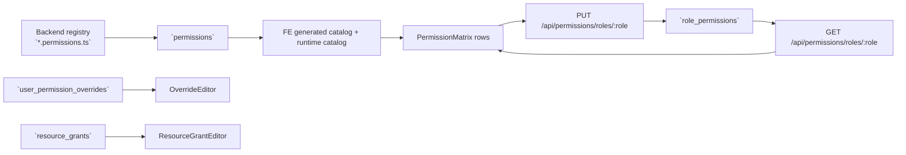

# Database Design: Core Tables

> Current tenant, identity, and authorization schema aligned with the live permission-system implementation.

## 1. Overview

The core database design for B-Knowledge is centered on tenant-scoped identity plus a registry-backed permission system. The important point for maintainers is that the permission matrix is **not** driven by a hardcoded role map in the frontend and **not** by a `permission_id` foreign-key chain. The active schema uses canonical permission keys and composes access from:

- `permissions`
- `role_permissions`
- `user_permission_overrides`
- `resource_grants`
- `users`, `teams`, and `user_teams`

This document focuses on the schema and lookup patterns that new contributors need to understand before changing auth, IAM, or row-level sharing behavior.

## 2. Core Authorization ER Diagram

## 3. Canonical Authorization Tables

### 3.1 `permissions`

This is the registry mirror table. It is populated by backend boot sync from `definePermissions(...)` registrations.

| Column | Meaning |
|--------|---------|
| `id` | Hex UUID text primary key generated by the database |
| `key` | Canonical permission key such as `permissions.manage` |
| `feature` | Feature grouping used by admin UI sections |
| `action` | Canonical CASL action such as `read`, `create`, `update`, `delete`, `manage` |
| `subject` | Canonical CASL subject such as `User`, `KnowledgeBase`, `SystemTool` |
| `label` / `description` | Human-readable metadata consumed by admin docs and UI |

Important design rule:

- `permissions.key` is the stable join/input value used across the admin APIs and frontend permission matrix
- maintainers should not introduce parallel frontend-only permission lists

### 3.2 `role_permissions`

This table defines the baseline permission matrix per role.

| Column | Meaning |
|--------|---------|
| `role` | Role name such as `super-admin`, `admin`, `leader`, `user` |
| `permission_key` | Canonical key from the registry, for example `users.view` |
| `tenant_id` | Nullable. `NULL` means global default; non-null means tenant-specific overlay |

Key implementation detail:

- there is **no foreign key** from `role_permissions.permission_key` to `permissions.key`
- boot sync and registry discipline keep the catalog aligned without blocking deploy-time drift

This choice is intentional. The code-side registry is the source of truth, and the boot process reconciles it into the database.

### 3.3 `user_permission_overrides`

This table stores one-user exceptions layered on top of role defaults.

| Column | Meaning |
|--------|---------|
| `tenant_id` | Tenant scope |
| `user_id` | Target user |
| `permission_key` | Canonical permission key |
| `effect` | `allow` or `deny` |
| `expires_at` | Optional expiration timestamp |
| `created_by` | Actor who issued the override |

Operational rule:

- allow and deny rows can both exist for the same `(tenant_id, user_id, permission_key)` as long as the `effect` differs
- CASL precedence is implemented by emitting deny rules last, so deny wins

### 3.4 `resource_grants`

This is the row-scoped sharing table used by the permission engine.

| Column | Meaning |
|--------|---------|
| `knowledge_base_id` | Optional owning KB for KB/category-sharing flows |
| `resource_type` | CASL subject-like target, currently including `KnowledgeBase` and `DocumentCategory` |
| `resource_id` | Specific row id being shared |
| `grantee_type` | `user`, `team`, or reserved `role` |
| `grantee_id` | User id, team id, or role identifier |
| `actions` | Canonical `text[]` of CASL actions. This is the active source for grant evaluation |
| `permission_level` | Legacy compatibility column retained for older rows and compatibility paths |
| `tenant_id` | Tenant scope |
| `expires_at` | Optional expiry evaluated in SQL |

Important design rule:

- `actions[]` is the canonical grant payload
- `permission_level` exists for backward compatibility and migration carry-over, not as the primary design surface for new work

## 4. Identity and Membership Tables

### 4.1 `users`

The `users` table still contains legacy compatibility fields, but its live meaning in the permission system is narrower than older docs implied.

| Column | Live purpose |
|--------|--------------|
| `role` | Selects the baseline role whose defaults are loaded from `role_permissions` |
| `is_superuser` | Platform-level bypass used by the ability service |
| `current_org_id` | Current active tenant/org used for tenant-scoped ability evaluation |
| `permissions` | Legacy JSON payload that still exists in surrounding code paths; not the canonical permission matrix source |

### 4.2 `teams` and `user_teams`

Teams now participate in two different ways:

- `user_teams` supplies team membership so `resource_grants` can target a team principal
- `teams.permissions` exists as a compatibility/local team-management field after the 2026-04-13 migration, but it is **not** the canonical permission matrix engine

For new permission-system work:

- use `role_permissions`, `user_permission_overrides`, and `resource_grants`
- treat `teams.permissions` as a local compatibility feature until its longer-term role is clarified

## 5. How the Permission Matrix Reads This Schema

The admin permission matrix page does not infer access from role names alone. Its current source chain is:

That means the matrix is:

- catalog-driven for rows
- role-permission-table-driven for checked cells
- full-replacement on save for each role

## 6. Hot-Path Indexing and Query Shapes

These are the important lookup patterns to preserve when extending the schema:

| Table | Hot path |
|-------|----------|
| `permissions` | `key` lookup, ordered catalog scans, `(action, subject)` queries for `whoCanDo` |
| `role_permissions` | `(role, tenant_id)` for ability construction and matrix reads |
| `user_permission_overrides` | `(tenant_id, user_id)` plus SQL expiry filter |
| `resource_grants` | `(tenant_id, resource_type, resource_id)` and tenant-first user/team grant scans |
| `user_teams` | user-to-team membership lookup for team-targeted grants |
| `audit_logs` | tenant/user/resource/time correlation for IAM audit trails |

## 7. Schema Rules for Maintainers

1. New permissions start in backend registry files, not by inserting rows manually.
2. New role defaults belong in `role_permissions`.
3. One-user exceptions belong in `user_permission_overrides`.
4. Row-scoped sharing belongs in `resource_grants`.
5. New work should prefer `permission_key` and `actions[]` over legacy JSON permission payloads or `permission_level`.
6. Knex owns the schema lifecycle for these tables even when Python workers read related records.

## 8. Related Docs

- [Security Architecture](/basic-design/system-infra/security-architecture)
- [Database Design: RAG Tables](/basic-design/database/database-design-rag)
- [SRS: User & Team Management](/srs/core-platform/fr-user-team-management)
- [Permission Matrix System](/detail-design/auth/permission-matrix-system)
