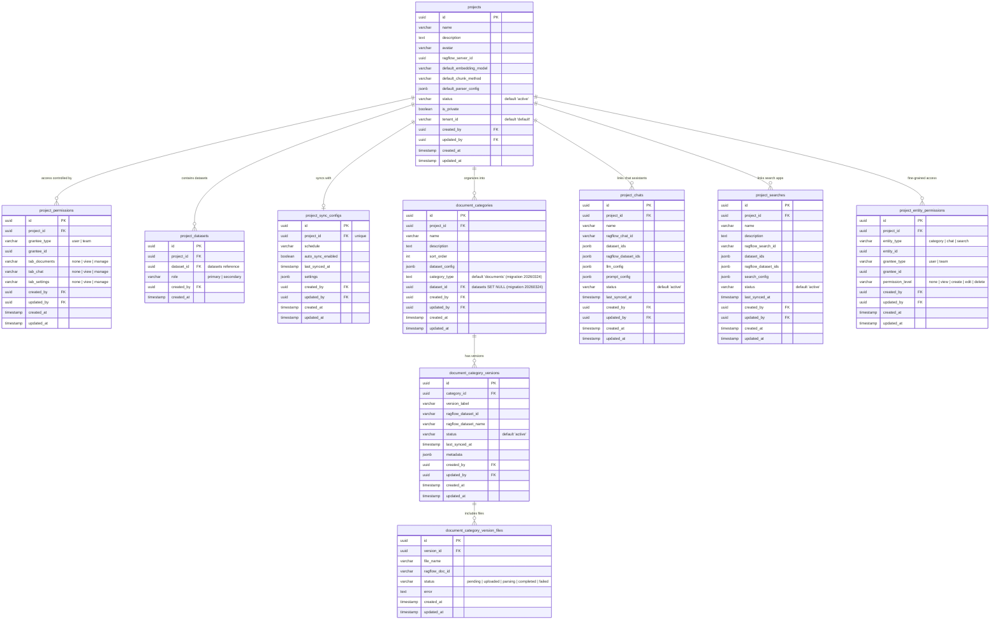
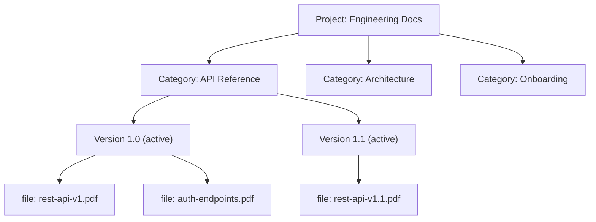
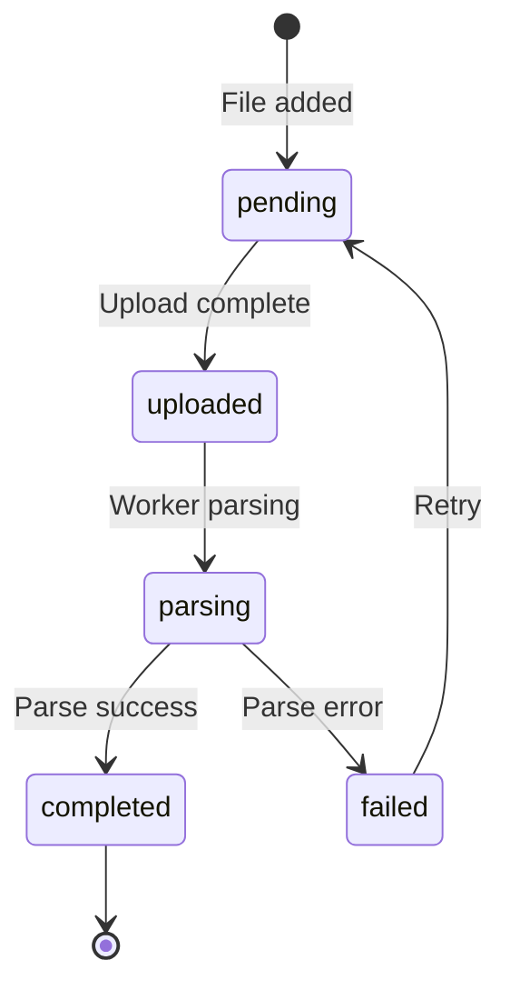
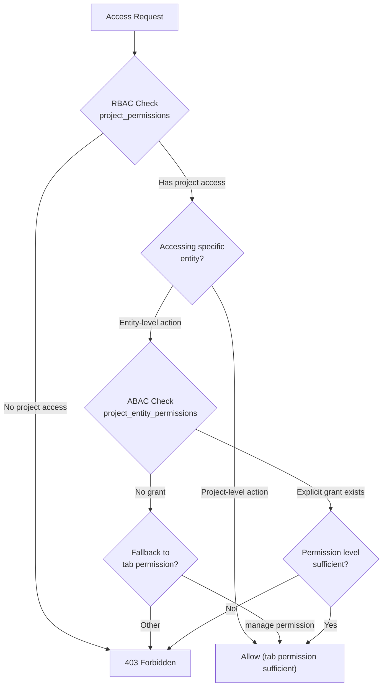

# Database Design: Project Tables

> Compatibility note: several columns keep `ragflow_*` names because they were introduced as external-sync identifiers in the initial schema. In the current source they remain compatibility/external-reference fields inside the B-Knowledge project module.

## ER Diagram

## Hierarchical Category Structure

The `document_categories` table organizes project knowledge into category rows. Categories are scoped to a project and ordered via `sort_order`. Each category can have multiple versions via `document_category_versions`, while `category_type` and `dataset_id` also allow direct-dataset categories that do not require version snapshots.

### Category Version File Lifecycle

## Table Descriptions

### projects

Top-level organizational container that groups datasets, chat assistants, search apps, sync configuration, and document categories. Projects enable teams to manage related knowledge resources as a unit. Each project can carry default embedding, chunking, and parser settings for downstream project assets.

### project_permissions

Project-level access control with tab-granular permissions. Instead of a single permission level, access is controlled per tab: `tab_documents`, `tab_chat`, and `tab_settings`, each accepting `none`, `view`, or `manage`. Unique constraint on `(project_id, grantee_type, grantee_id)`.

### project_datasets

Many-to-many link between projects and datasets. Each association has a `role` of either `primary` or `secondary`. Unique constraint on `(project_id, dataset_id)`. Cascades on project deletion; cascades on dataset deletion.

### project_sync_configs

Per-project synchronization configuration. Each project has at most one sync config (unique on `project_id`). Stores a `schedule`, `auto_sync_enabled` toggle, `last_synced_at`, and a `settings` JSONB blob for connector-specific sync options.

### document_categories / document_category_versions / document_category_version_files

Three-tier structure for organizing documents within a project:
1. **Category** — flat list per project (no parent hierarchy), with `dataset_config` JSONB for category-level dataset settings. `category_type` classifies the category, and optional `dataset_id` links it to a direct dataset.
2. **Version** — content snapshot with optional compatibility-named external dataset identifiers (`ragflow_dataset_id`, `ragflow_dataset_name`). Unique constraint on `(category_id, version_label)`.
3. **Version File** — individual files within a version, tracked by per-file status plus optional compatibility-named external document identifier `ragflow_doc_id`. Unique constraint on `(version_id, file_name)`.

### project_chats

Chat assistant configurations within a project. Each row stores local dataset links (`dataset_ids`), optional compatibility-named synced dataset IDs (`ragflow_dataset_ids`), prompt/LLM configuration, and status metadata. Cascades on project deletion.

### project_searches

Search app configurations within a project. Each row stores local dataset links (`dataset_ids`), optional compatibility-named synced dataset IDs (`ragflow_dataset_ids`), search configuration, and status metadata. Cascades on project deletion.

### project_entity_permissions

Fine-grained permissions for individual entities within a project. While `project_permissions` controls project-level tab access, this table controls access to specific categories, chats, or searches. The `permission_level` supports `none`, `view`, `create`, `edit`, and `delete`. Unique constraint on `(project_id, entity_type, entity_id, grantee_type, grantee_id)`.

## RBAC + ABAC Dual Authorization Model

Authorization resolves in two layers:

1. **Project-level (RBAC)**: Does the user/team have a `project_permissions` grant? Tab-level permissions (`tab_documents`, `tab_chat`, `tab_settings`) gate access to each section of the project.
2. **Entity-level (ABAC)**: For specific resources within the project, `project_entity_permissions` provides fine-grained control. Users with tab `manage` permission bypass entity-level checks for that tab's entities.

## Unique Constraints

| Table | Columns | Purpose |
|-------|---------|---------|
| `project_permissions` | `(project_id, grantee_type, grantee_id)` | One grant per grantee per project |
| `project_datasets` | `(project_id, dataset_id)` | No duplicate dataset links |
| `project_sync_configs` | `(project_id)` | One sync config per project |
| `document_category_versions` | `(category_id, version_label)` | Unique version labels per category |
| `document_category_version_files` | `(version_id, file_name)` | No duplicate files per version |
| `project_entity_permissions` | `(project_id, entity_type, entity_id, grantee_type, grantee_id)` | One permission per entity-grantee pair |
