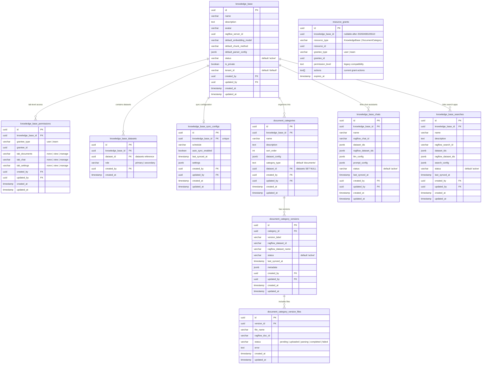
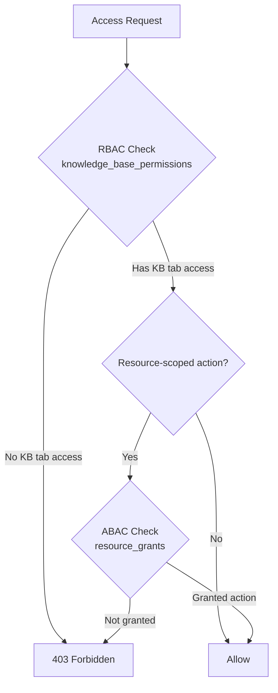

# Database Design: Knowledge Base Tables

> Migration note: `projects*` tables were renamed to `knowledge_base*` in migration `20260402000000_rename_projects_to_knowledge_base.ts`. This page documents the current table names used by the backend.

## ER Diagram

## Table Descriptions

### knowledge_base

Top-level organizational container that groups datasets, chat assistants, search apps, sync configuration, and document categories.

### knowledge_base_permissions

Knowledge-base-level tab permissions for user/team principals.

### knowledge_base_datasets

Many-to-many link between knowledge bases and datasets with a `role` of `primary` or `secondary`.

### knowledge_base_sync_configs

Per-knowledge-base synchronization schedule and connector settings.

### document_categories / document_category_versions / document_category_version_files

Three-tier structure for content organization:
1. Category rows per knowledge base.
2. Version snapshots per category.
3. File rows per version with parser lifecycle status.

### knowledge_base_chats / knowledge_base_searches

Knowledge-base-scoped chat/search app configuration rows with local and external sync metadata.

### resource_grants

Row-scoped ABAC grants used by the current permission system. This table replaced `knowledge_base_entity_permissions` in migration `20260407052129_phase1_rename_entity_permissions_to_resource_grants.ts`.

## Current Access Model (RBAC + ABAC)

## Unique Constraints

| Table | Columns | Purpose |
|-------|---------|---------|
| `knowledge_base_permissions` | `(knowledge_base_id, grantee_type, grantee_id)` | One tab-grant row per grantee in one KB |
| `knowledge_base_datasets` | `(knowledge_base_id, dataset_id)` | No duplicate dataset links |
| `knowledge_base_sync_configs` | `(knowledge_base_id)` | One sync config per knowledge base |
| `document_category_versions` | `(category_id, version_label)` | Unique version labels per category |
| `document_category_version_files` | `(version_id, file_name)` | No duplicate files per version |
| `resource_grants` | `(resource_type, resource_id, grantee_type, grantee_id)` | One row-scoped grant per resource/principal |
