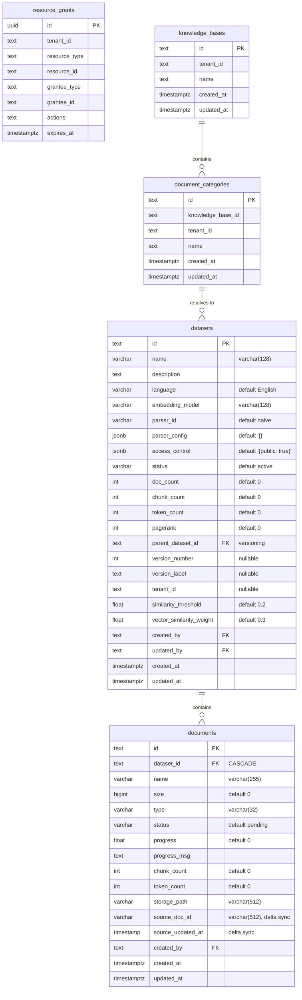

# Database Design: RAG Tables

> RAG-side storage surfaces that interact with the current permission and resource-grant model.
> Updated: 2026-04-14

## 1. Overview

The RAG layer still spans Knex-managed application tables and legacy Peewee-managed worker tables, but access control now depends on the shared permission system rather than on standalone per-dataset or per-entity permission tables.

For the current milestone, the important authorization link is:

1. `resource_grants` can grant access to `KnowledgeBase` and `DocumentCategory`
2. the ability service resolves those grants into tenant-scoped CASL rules
3. grant-aware retrieval resolves the permitted knowledge-base/category scope into dataset ids
4. search and chat retrieval operate only on those accessible datasets

This means RAG data access is now partly shaped by core permission tables outside the legacy RAG schema itself.

## 2. Authorization-Aware RAG ER View



## 3. Active Permission Surfaces For RAG

### 3.1 `resource_grants`

This table is the live row-scoped authorization input for the RAG side of the product.

Current supported resource types:

| `resource_type` | Meaning |
|-----------------|---------|
| `KnowledgeBase` | Grant actions on a specific knowledge base |
| `DocumentCategory` | Grant actions on a specific category inside a knowledge base |

Important behavior:

- grant rows carry explicit `actions[]` instead of relying only on legacy permission-level shorthand
- `expires_at` supports time-bounded access
- ability construction reads active grants and emits row-scoped CASL rules

### 3.2 Knowledge base and category mapping

Knowledge-base and category grants are not isolated UI metadata. They influence the backend retrieval path:

- a `KnowledgeBase` grant can open access to all categories and datasets resolved under that KB
- a `DocumentCategory` grant narrows access to datasets attached to that specific category
- dataset resolution is then used by retrieval/search services so only accessible data is searched

This is why documentation should describe grant resolution, not just UI sharing dialogs.

## 4. Knex and Legacy Worker Tables

### 4.1 Knex-managed application tables

Application-facing RAG entities are primarily managed through the backend and commonly include:

- knowledge-base metadata and category tables
- dataset and document tables used by the API layer
- related settings, logs, and task references

These tables are where tenant-scoped services join resource identities back to grants and ability checks.

### 4.2 Legacy worker tables

The Python worker still uses inherited tables such as `knowledgebase`, `document`, `file`, `file2document`, `task`, and `pipeline_operation_log`. These remain important for document processing, but they are no longer the place to define the authorization model.

The Node.js backend still owns schema migration lifecycle for these tables even when the worker reads or writes them through Peewee.

## 5. Retrieval and Search Impact

### 5.1 Dataset-resolution path

The current grant-aware retrieval path expands access like this:

```mermaid
flowchart TD
    grant["`resource_grants` row"] --> type{"resource_type"}
    type -->|"KnowledgeBase"| kb["Resolve KB to datasets"]
    type -->|"DocumentCategory"| category["Resolve category to datasets"]
    kb --> datasets["Accessible dataset ids"]
    category --> datasets
    datasets --> retrieval["Chat/search retrieval services"]
    retrieval --> results["Only granted content participates"]
```

This is the critical operational consequence of the new model. Access is no longer documented correctly if a page only mentions old per-entity tables or a generic “private/public dataset” story.

### 5.2 `DocumentCategory` importance

`DocumentCategory` is now part of the live authorization vocabulary, not just an organizational UI label. It matters because:

- permissions can be granted directly at category scope
- category grants resolve into dataset visibility
- category-aware access shapes downstream RAG search results

## 6. What Is No Longer Canonical

Do not describe these as the primary active control surfaces:

- older team-specific permission storage
- legacy user-row permission payloads
- legacy `permission` columns on worker tables as the main access model
- the historical basic-user role alias from pre-cleanup docs as the baseline RAG access concept

Those concepts may exist as legacy fields or historical context, but the live RAG authorization path is the shared grant and ability pipeline.

## 7. Design Notes

- `resource_grants` is shared authorization infrastructure, not a RAG-only table
- RAG services depend on grant-to-dataset resolution to respect access boundaries
- `KnowledgeBase` and `DocumentCategory` are the current row-scoped resource types that matter for retrieval
- future maintainers should reason about RAG access through the shared permission system first, then through worker-processing tables

## 8. Related Docs

- [Database Design: Core Tables](/basic-design/database/database-design-core)
- [Security Architecture](/basic-design/system-infra/security-architecture)
- [API Design Overview](/basic-design/component/api-design-overview)
