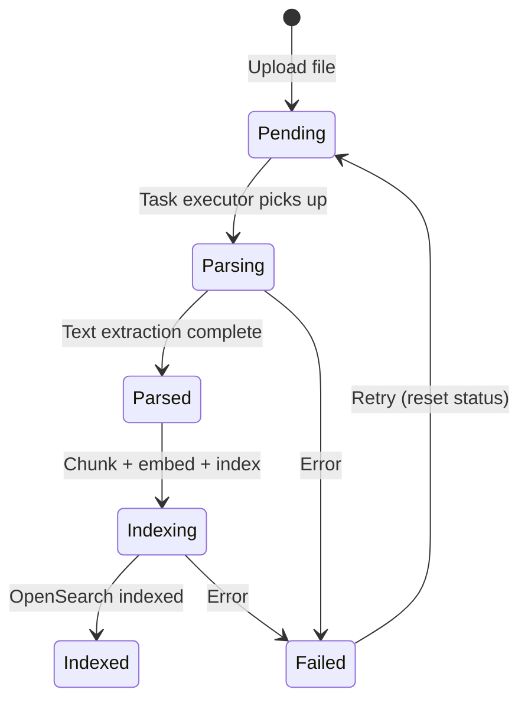

# Database Design: RAG Tables

## Overview

The RAG pipeline uses two sets of tables managed by different ORMs:

- **Knex-managed (primary):** `datasets`, `documents`, `model_providers` — used by the Node.js backend for all CRUD operations.
- **Peewee-managed (legacy):** `knowledgebase`, `document`, `file`, `file2document`, `task`, `pipeline_operation_log` — inherited from RAGFlow, used by the Python advance-rag worker for data read/write. Schema migrations for these tables are still owned by Knex.

Both sets coexist in the same PostgreSQL database. The Knex tables are the canonical source for the Node.js backend; the Peewee tables are used by the Python RAG worker.

## ER Diagram

```mermaid
erDiagram
    datasets {
        text id PK
        varchar name "128 chars"
        text description
        varchar language "32 chars, default English"
        varchar embedding_model "128 chars"
        varchar parser_id "32 chars, default naive"
        jsonb parser_config
        jsonb access_control "default public true"
        varchar status "16 chars, default active"
        int doc_count
        int chunk_count
        int token_count
        int pagerank
        text parent_dataset_id FK "self-referencing"
        int version_number
        text change_summary
        text version_created_by FK "users.id"
        jsonb metadata_config
        text version_label
        text tenant_id
        float similarity_threshold "default 0.2"
        float vector_similarity_weight "default 0.3"
        text graphrag_task_id
        text raptor_task_id
        text mindmap_task_id
        text pipeline_id
        text tenant_embd_id
        text created_by FK "users.id"
        text updated_by FK "users.id"
        timestamp created_at
        timestamp updated_at
    }

    documents {
        text id PK
        text dataset_id FK "datasets.id CASCADE"
        varchar name "255 chars"
        bigint size
        varchar type "32 chars"
        varchar status "16 chars, default pending"
        float progress
        text progress_msg
        int chunk_count
        int token_count
        varchar storage_path "512 chars"
        text created_by FK "users.id"
        timestamp created_at
        timestamp updated_at
    }

    model_providers {
        text id PK
        varchar factory_name "128 chars"
        varchar model_type "128 chars"
        varchar model_name "128 chars"
        text api_key "encrypted at rest"
        varchar api_base "512 chars"
        int max_tokens
        boolean vision "default false"
        varchar status "16 chars, default active"
        boolean is_default "default false"
        varchar tenant_id "32 chars"
        int used_tokens "default 0"
        text created_by FK "users.id"
        text updated_by FK "users.id"
        timestamp created_at
        timestamp updated_at
        bigint create_time "Peewee legacy"
        bigint update_time "Peewee legacy"
    }

    knowledgebase {
        varchar id PK "32 chars"
        text avatar
        varchar tenant_id "32 chars"
        varchar name "128 chars"
        varchar language "32 chars, default English"
        text description
        varchar embd_id "128 chars"
        text tenant_embd_id
        varchar permission "me | team | all"
        varchar created_by "32 chars"
        int doc_num
        int token_num
        int chunk_num
        float similarity_threshold "default 0.2"
        float vector_similarity_weight "default 0.3"
        varchar parser_id "32 chars, default naive"
        varchar pipeline_id "32 chars"
        jsonb parser_config
        int pagerank
        varchar graphrag_task_id "32 chars"
        varchar raptor_task_id "32 chars"
        varchar mindmap_task_id "32 chars"
        jsonb policy_rules "ABAC rules"
        varchar status "1 char, default 1"
        bigint create_time
        bigint update_time
    }

    document {
        varchar id PK "32 chars"
        text thumbnail
        varchar kb_id "256 chars"
        varchar parser_id "32 chars"
        varchar pipeline_id "32 chars"
        jsonb parser_config
        varchar source_type "128 chars, default local"
        varchar type "32 chars"
        varchar created_by "32 chars"
        varchar name "255 chars"
        varchar location "S3 key, 255 chars"
        int size
        int token_num
        int chunk_num
        float progress "0.0 to 1.0"
        text progress_msg
        float process_duration
        varchar run "1 char, 0=stop 1=run"
        varchar status "1 char"
        varchar source_url "2048 chars"
        jsonb policy_overrides "ABAC overrides"
        bigint create_time
        bigint update_time
    }

    file {
        varchar id PK "32 chars"
        varchar parent_id "32 chars"
        varchar tenant_id "32 chars"
        varchar created_by "32 chars"
        varchar name "255 chars"
        varchar location "S3 key, 255 chars"
        int size
        varchar type "32 chars"
        varchar source_type "128 chars"
        bigint create_time
        bigint update_time
    }

    file2document {
        varchar id PK "32 chars"
        varchar file_id "32 chars"
        varchar document_id "32 chars"
        bigint create_time
        bigint update_time
    }

    task {
        varchar id PK "32 chars"
        varchar doc_id "32 chars"
        int from_page "default 0"
        int to_page "default 100000000"
        varchar task_type "32 chars"
        int priority "default 0"
        timestamp begin_at
        float process_duration
        float progress "0.0 to 1.0"
        text progress_msg
        int retry_count
        text digest
        text chunk_ids
        bigint create_time
        bigint update_time
    }

    pipeline_operation_log {
        varchar id PK "32 chars"
        varchar document_id "32 chars"
        varchar tenant_id "32 chars"
        varchar kb_id "32 chars"
        varchar pipeline_id "32 chars"
        varchar pipeline_title "32 chars"
        varchar parser_id "32 chars"
        varchar document_name "255 chars"
        varchar document_suffix "255 chars"
        varchar document_type "255 chars"
        varchar source_from "255 chars"
        float progress
        text progress_msg
        float process_duration
        text dsl
        varchar task_type "32 chars"
        varchar operation_status "32 chars"
        text avatar
        varchar status "1 char, default 1"
        bigint create_time
        bigint update_time
    }

    datasets ||--o{ documents : "contains"
    knowledgebase ||--o{ document : "contains (legacy)"
    document ||--o{ task : "processed by"
    file ||--o{ file2document : "linked to"
    document ||--o{ file2document : "sourced from"
    document ||--o{ pipeline_operation_log : "logs"
```

## Document Processing Pipeline

## Document Status Values

### `documents` (Knex-managed)

String-based status values:

| Value | Description |
|-------|-------------|
| `pending` | File uploaded but not yet processed (default) |
| `parsing` | Text extraction in progress |
| `parsed` | Text extracted, ready for chunking |
| `indexing` | Chunking, embedding, and OpenSearch indexing in progress |
| `indexed` | Fully processed and searchable |
| `failed` | Processing failed |

### `document` (Peewee legacy)

Single-character status and run flags:

| Column | Value | Description |
|--------|-------|-------------|
| `status` | `1` | Active (default) |
| `status` | `0` | Inactive/deleted |
| `run` | `0` | Stopped (default) |
| `run` | `1` | Running/processing |

Progress is tracked via `progress` (0.0-1.0) and `progress_msg` (text description of current step).

## Dataset Status Values

### `datasets` (Knex-managed)

| Value | Description |
|-------|-------------|
| `active` | Dataset is active and searchable (default) |
| `deleted` | Soft-deleted, excluded from queries and unique name constraint |

### `knowledgebase` (Peewee legacy)

| Value | Description |
|-------|-------------|
| `1` | Active (default) |
| `0` | Inactive |

## Model Provider Status Values

| Value | Description |
|-------|-------------|
| `active` | Provider is active and available for use (default) |
| `inactive` | Provider is disabled |

## Table Descriptions

### datasets (Knex-managed, primary)

The primary dataset table used by the Node.js backend. A dataset is a collection of documents with shared embedding model, parser configuration, and access control. Supports versioning via `parent_dataset_id`, `version_number`, and `version_label`. The `access_control` JSONB stores IAM-style permissions (default: public). Advanced RAG features are tracked via `graphrag_task_id`, `raptor_task_id`, and `mindmap_task_id`. A partial unique index enforces unique names among non-deleted datasets.

### documents (Knex-managed, primary)

The primary document table used by the Node.js backend. Represents a single file within a dataset. Tracks processing status (`pending` through `indexed`), progress percentage, chunk/token counts, and S3 storage path. Cascades on dataset deletion.

### model_providers (Knex-managed)

System-wide LLM model provider configuration, replacing the legacy `tenant_llm` pattern. Stores API keys (encrypted at rest), endpoints, token limits, and vision capability flags. Each provider is scoped to a tenant and can be marked as default. A partial unique index prevents duplicate active entries for the same tenant/factory/model/type combination. Includes Peewee legacy timestamp columns (`create_time`, `update_time`) for compatibility with the advance-rag worker.

### knowledgebase (Peewee legacy)

Legacy dataset container inherited from RAGFlow. Used by the Python advance-rag worker for RAG processing. Contains parser configuration, embedding model reference (`embd_id`), permission level (`me`/`team`/`all`), and ABAC policy rules. The `parser_config` JSONB stores chunking strategy, page ranges, and context sizes.

### document (Peewee legacy)

Legacy document table used by the Python advance-rag worker. Tracks RAG processing state including progress, page ranges, content hashing, and S3 location. The `run` flag controls whether the document should be actively processed (pause/resume). `token_num` and `chunk_num` are populated after parsing. Supports ABAC permission overrides via `policy_overrides` JSONB.

### file (Peewee legacy)

Tenant-scoped file registry pointing to S3 objects in RustFS. Files are decoupled from documents via `file2document` to support file reuse across knowledge bases. Organized in a tree structure via `parent_id`.

### file2document (Peewee legacy)

Junction table linking files to documents. Enables many-to-many relationships between S3 files and RAG documents, supporting file reuse across multiple knowledge bases.

### task (Peewee legacy)

RAG processing task queue used by the advance-rag worker. Each document may generate multiple tasks for different page ranges (`from_page`/`to_page`). Tracks processing progress, retry count, and stores chunk IDs and digest after completion. Tasks are prioritized via the `priority` field.

### pipeline_operation_log (Peewee legacy)

Tracks pipeline execution history for RAG processing operations. Records document processing metadata including parser used, pipeline configuration (DSL), timing, and operation status. Used for debugging and auditing RAG pipeline runs.

## ORM Management

These tables are managed by two ORMs with distinct responsibilities:

| Concern | Owner | Tool |
|---------|-------|------|
| Schema migrations (all tables) | Backend (Node.js) | Knex |
| Data read/write (Python) | advance-rag worker | Peewee |
| Data read/write (Node.js) | Backend API | Knex |

**All schema changes** (CREATE TABLE, ALTER, indexes) go through Knex migrations — including schema changes to Peewee-managed tables (`knowledgebase`, `document`, `task`, `file`, etc.). Never use Peewee migrators. The backend owns the migration lifecycle; Python workers only read/write data via their ORM.

### Dual Table Pattern

Both `datasets`/`documents` (Knex) and `knowledgebase`/`document` (Peewee) coexist:

| Knex Table | Peewee Table | Used By |
|------------|-------------|---------|
| `datasets` | `knowledgebase` | Node.js backend uses `datasets`; Python worker uses `knowledgebase` |
| `documents` | `document` | Node.js backend uses `documents`; Python worker uses `document` |
| `model_providers` | _(reads via Peewee BaseModel)_ | Both Node.js and Python access `model_providers` |

The Knex tables (`datasets`, `documents`) are the primary tables for the Node.js backend API. The Peewee tables (`knowledgebase`, `document`) are legacy tables used by the Python advance-rag worker inherited from RAGFlow.
