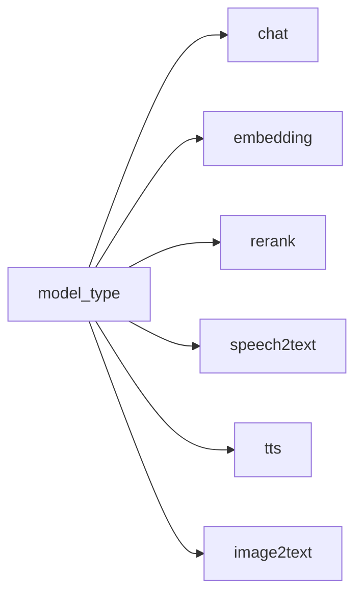
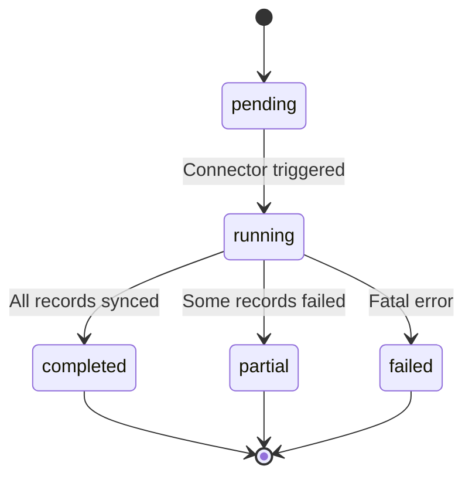

# Support Tables ER Diagram

## Overview

Support tables provide glossary management, LLM provider configuration, data connectors, sync logging, API key management, platform policies, and tenant multi-tenancy for the B-Knowledge platform. Tables are split between Knex-managed (Node.js backend owns schema and data) and Peewee-managed (schema created by Knex migrations, data read/written by the Python RAG worker ORM).

## ER Diagram

```mermaid
erDiagram
    tenant {
        string id PK "varchar(32)"
        string name "varchar(100), nullable"
        string public_key "varchar(255), nullable"
        string llm_id "varchar(128), default ''"
        text tenant_llm_id "nullable, FK model_providers"
        string embd_id "varchar(128), default ''"
        text tenant_embd_id "nullable, FK model_providers"
        string asr_id "varchar(128), default ''"
        text tenant_asr_id "nullable, FK model_providers"
        string img2txt_id "varchar(128), default ''"
        text tenant_img2txt_id "nullable, FK model_providers"
        string rerank_id "varchar(128), default ''"
        text tenant_rerank_id "nullable, FK model_providers"
        string tts_id "varchar(256), nullable"
        text tenant_tts_id "nullable, FK model_providers"
        string parser_ids "varchar(256), default ''"
        integer credit "default 512"
        string status "varchar(1), default '1'"
        text display_name "nullable"
        text description "nullable"
        jsonb settings "default '{}'"
        text created_by "nullable"
        text updated_by "nullable"
        bigint create_time "nullable"
        timestamp create_date "nullable"
        bigint update_time "nullable"
        timestamp update_date "nullable"
    }

    tenant_langfuse {
        string tenant_id PK "varchar(32)"
        string secret_key "varchar(2048)"
        string public_key "varchar(2048)"
        string host "varchar(128)"
        bigint create_time "nullable"
        timestamp create_date "nullable"
        bigint update_time "nullable"
        timestamp update_date "nullable"
    }

    glossary_tasks {
        text id PK "hex UUID"
        text name "unique, not null"
        text description "nullable"
        text task_instruction_en "not null"
        text task_instruction_ja "nullable"
        text task_instruction_vi "nullable"
        text context_template "not null"
        integer sort_order "default 0"
        boolean is_active "default true"
        text created_by "nullable"
        text updated_by "nullable"
        timestamp created_at "default now()"
        timestamp updated_at "default now()"
    }

    glossary_keywords {
        text id PK "hex UUID"
        text name "unique, not null"
        text en_keyword "nullable"
        text description "nullable"
        integer sort_order "default 0"
        boolean is_active "default true"
        text created_by "nullable"
        text updated_by "nullable"
        timestamp created_at "default now()"
        timestamp updated_at "default now()"
    }

    model_providers {
        text id PK "hex UUID"
        string factory_name "varchar(128), not null"
        string model_type "varchar(128), not null"
        string model_name "varchar(128), not null"
        text api_key "encrypted, nullable"
        string api_base "varchar(512), nullable"
        integer max_tokens "nullable"
        boolean vision "default false"
        string status "varchar(16), default 'active'"
        boolean is_default "default false"
        string tenant_id "varchar(32), not null"
        integer used_tokens "default 0"
        text created_by "FK users"
        text updated_by "FK users"
        timestamp created_at "default now()"
        timestamp updated_at "default now()"
        bigint create_time "nullable, legacy"
        timestamp create_date "nullable, legacy"
        bigint update_time "nullable, legacy"
        timestamp update_date "nullable, legacy"
    }

    llm_factories {
        string name PK "varchar(128)"
        text logo "nullable"
        string tags "varchar(255)"
        integer rank "default 0"
        string status "varchar(1), default '1'"
        bigint create_time "nullable"
        timestamp create_date "nullable"
        bigint update_time "nullable"
        timestamp update_date "nullable"
    }

    llm {
        string fid "varchar(128), composite PK"
        string llm_name "varchar(128), composite PK"
        string model_type "varchar(128)"
        integer max_tokens "default 0"
        string tags "varchar(255)"
        boolean is_tools "default false"
        string status "varchar(1), default '1'"
        bigint create_time "nullable"
        timestamp create_date "nullable"
        bigint update_time "nullable"
        timestamp update_date "nullable"
    }

    connectors {
        text id PK "hex UUID"
        string name "varchar(255), not null"
        string source_type "varchar(64), not null"
        string kb_id "varchar(255), not null"
        jsonb config "default '{}'"
        text description "nullable"
        string schedule "varchar(128), nullable"
        string status "varchar(16), default 'active'"
        timestamp last_synced_at "nullable"
        text created_by "FK users"
        text updated_by "FK users"
        timestamp created_at "default now()"
        timestamp updated_at "default now()"
    }

    sync_logs {
        text id PK "hex UUID"
        text connector_id "FK connectors CASCADE"
        string kb_id "varchar(255), not null"
        string status "varchar(16), default 'pending'"
        integer docs_synced "default 0"
        integer docs_failed "default 0"
        integer progress "default 0"
        text message "nullable"
        timestamp started_at "nullable"
        timestamp finished_at "nullable"
        timestamp created_at "default now()"
        timestamp updated_at "default now()"
    }

    api_keys {
        text id PK "hex UUID"
        text user_id "FK users CASCADE, not null"
        text name "not null"
        text key_prefix "not null"
        text key_hash "not null"
        jsonb scopes "default ['chat','search','retrieval']"
        boolean is_active "default true"
        timestamp last_used_at "nullable"
        timestamp expires_at "nullable"
        timestamp created_at "not null, default now()"
        timestamp updated_at "not null, default now()"
    }

    platform_policies {
        text id PK "hex UUID"
        text name "not null"
        text description "nullable"
        jsonb rules "not null, default '[]'"
        boolean is_active "default true"
        text created_by "nullable"
        text updated_by "nullable"
        timestamp created_at "default now()"
        timestamp updated_at "default now()"
    }

    connector {
        string id PK "varchar(32)"
        string tenant_id "varchar(32), not null"
        string name "varchar(128), not null"
        string source "varchar(128), not null"
        string input_type "varchar(128), not null"
        text config "default '{}'"
        integer refresh_freq "default 0"
        integer prune_freq "default 0"
        integer timeout_secs "default 3600"
        timestamp indexing_start "nullable"
        string status "varchar(16), default 'schedule'"
        bigint create_time "nullable"
        timestamp create_date "nullable"
        bigint update_time "nullable"
        timestamp update_date "nullable"
    }

    connector2kb {
        string id PK "varchar(32)"
        string connector_id "varchar(32), not null"
        string kb_id "varchar(32), not null"
        string auto_parse "varchar(1), default '1'"
        bigint create_time "nullable"
        timestamp create_date "nullable"
        bigint update_time "nullable"
        timestamp update_date "nullable"
    }

    mcp_server {
        string id PK "varchar(32)"
        string name "varchar(255), not null"
        string tenant_id "varchar(32), not null"
        string url "varchar(2048), not null"
        string server_type "varchar(32), not null"
        text description "nullable"
        text variables "nullable"
        text headers "nullable"
        bigint create_time "nullable"
        timestamp create_date "nullable"
        bigint update_time "nullable"
        timestamp update_date "nullable"
    }

    canvas_template {
        string id PK "varchar(32)"
        text avatar "nullable"
        text title "nullable"
        text description "nullable"
        string canvas_type "varchar(32), nullable"
        string canvas_category "varchar(32), default 'agent_canvas'"
        text dsl "nullable"
        bigint create_time "nullable"
        timestamp create_date "nullable"
        bigint update_time "nullable"
        timestamp update_date "nullable"
    }

    user_canvas {
        string id PK "varchar(32)"
        text avatar "nullable"
        string user_id "varchar(255), not null"
        string title "varchar(255), nullable"
        string permission "varchar(16), default 'me'"
        boolean release "default false"
        text description "nullable"
        string canvas_type "varchar(32), nullable"
        string canvas_category "varchar(32), default 'agent_canvas'"
        text dsl "nullable"
        bigint create_time "nullable"
        timestamp create_date "nullable"
        bigint update_time "nullable"
        timestamp update_date "nullable"
    }

    user_canvas_version {
        string id PK "varchar(32)"
        string user_canvas_id "varchar(255), not null"
        string title "varchar(255), nullable"
        text description "nullable"
        boolean release "default false"
        text dsl "nullable"
        bigint create_time "nullable"
        timestamp create_date "nullable"
        bigint update_time "nullable"
        timestamp update_date "nullable"
    }

    api_4_conversation {
        string id PK "varchar(32)"
        string name "varchar(255), nullable"
        string dialog_id "varchar(32), not null"
        string user_id "varchar(255), not null"
        string exp_user_id "varchar(255), nullable"
        jsonb message "nullable"
        jsonb reference "nullable"
        integer tokens "default 0"
        string source "varchar(16), nullable"
        text dsl "nullable"
        float duration "default 0"
        integer round "default 0"
        integer thumb_up "default 0"
        text errors "nullable"
        string version_title "varchar(255), nullable"
        bigint create_time "nullable"
        timestamp create_date "nullable"
        bigint update_time "nullable"
        timestamp update_date "nullable"
    }

    tenant ||--o{ tenant_langfuse : "has"
    tenant ||--o{ model_providers : "configures"
    tenant ||--o{ mcp_server : "registers"
    tenant ||--o{ connector : "owns (legacy)"
    llm_factories ||--o{ llm : "provides"
    connectors ||--o{ sync_logs : "produces"
    connector ||--o{ connector2kb : "links"
    user_canvas ||--o{ user_canvas_version : "versions"
```

## LLM Model Type Enum

| Value | Purpose | Example Models |
|-------|---------|----------------|
| `chat` | Conversational LLM | GPT-4o, Claude 3.5, Qwen |
| `embedding` | Text to vector | text-embedding-3-large, BGE-M3 |
| `rerank` | Re-rank search results | BGE-Reranker, Cohere Rerank |
| `speech2text` | Audio transcription | Whisper |
| `tts` | Text to speech | Azure TTS, OpenAI TTS |
| `image2text` | Vision / OCR | GPT-4o Vision, Qwen-VL |

## Knex-Managed Tables

These tables are fully managed by the Node.js backend -- both schema (via Knex migrations) and data (via Knex ORM / ModelFactory).

### `model_providers`

LLM provider configuration per tenant. The Python RAG worker accesses this table via its `TenantLLM` Peewee model (mapped to `model_providers` via `db_table`).

- **Partial unique index:** `(tenant_id, factory_name, model_name, model_type) WHERE status = 'active'`
- **Encrypted column:** `api_key` is encrypted at rest via application-level encryption
- **Legacy columns:** `create_time`, `create_date`, `update_time`, `update_date` exist for Peewee compatibility

### `connectors`

External data source connection configurations for syncing content into knowledge bases.

- **`kb_id`** references the Peewee-managed `knowledgebase` table (no FK constraint since schema is cross-ORM)
- **`created_by` / `updated_by`** reference `users.id` with `ON DELETE SET NULL`

### `sync_logs`

Tracks individual sync task executions for each connector.

- **`connector_id`** references `connectors.id` with `ON DELETE CASCADE`
- **`progress`** integer (0-100) for tracking sync completion

### `glossary_tasks`

Glossary task definitions with multilingual instruction templates.

- **`name`** has a unique constraint
- **`task_instruction_en`** is required; `task_instruction_ja` and `task_instruction_vi` are optional
- **`context_template`** defines the prompt template for glossary extraction

### `glossary_keywords`

Standalone glossary keyword entities (not linked to tasks via FK).

- **`name`** has a unique constraint
- **`en_keyword`** stores the English translation of the keyword

### `api_keys`

Hashed API keys for external API authentication (chat, search, retrieval).

- **`user_id`** references `users.id` with `ON DELETE CASCADE`
- **`key_hash`** stores a one-way hash; the raw key is shown only once at creation
- **`key_prefix`** stores the first few characters for identification (e.g., `bk_abc...`)
- **`scopes`** JSONB array defaults to `["chat","search","retrieval"]`

### `platform_policies`

Platform-wide policy rules for access control and governance.

- **`rules`** JSONB array containing policy rule definitions
- **`is_active`** boolean toggle for enabling/disabling policies

## Peewee-Managed Legacy Tables

These tables have their schema created by Knex migrations (the backend owns all DDL), but data is read and written by the Python RAG worker via Peewee ORM. The Node.js backend should treat these as read-only or use caution when writing.

> **Convention:** All schema migrations go through Knex, even for Peewee-managed tables. The Python RAG worker only reads/writes data via its ORM and never modifies the schema.

All Peewee-managed tables share the legacy timestamp pattern: `create_time` (bigint epoch ms), `create_date` (timestamp), `update_time` (bigint epoch ms), `update_date` (timestamp).

### `tenant`

System tenant record. Single-tenant by default, multi-org ready. Stores default model references (`llm_id`, `embd_id`, `asr_id`, etc.) and their corresponding `model_providers` row IDs (`tenant_llm_id`, `tenant_embd_id`, etc.).

### `tenant_langfuse`

Langfuse observability configuration per tenant. Primary key is `tenant_id` (one config per tenant).

### `llm_factories`

LLM provider factory registry. Primary key is `name` (varchar 128). Stores provider logos, tags, and rank for UI ordering.

### `llm`

LLM model dictionary. Composite primary key on `(fid, llm_name)`. Each row represents a specific model offered by a factory, including `max_tokens`, `tags`, and `is_tools` (function calling support).

### `connector`

Legacy data source connector configs (separate from the Knex-managed `connectors` table). Scoped by `tenant_id` with fields for `source`, `input_type`, refresh/prune frequencies, and timeout.

### `connector2kb`

Junction table linking legacy `connector` rows to `knowledgebase` rows. Includes `auto_parse` flag (varchar '0'/'1').

### `mcp_server`

MCP (Model Context Protocol) server registry per tenant. Stores server URL, type, description, variables, and headers for external tool integration.

### `canvas_template`

Predefined agent canvas templates. Stores DSL definitions, avatar, title, description, and categorization (`canvas_type`, `canvas_category`).

### `user_canvas`

User-created workflow canvas definitions. Scoped by `user_id` with permission control (`me`/`team`), release flag, and DSL content.

### `user_canvas_version`

Immutable snapshots of canvas DSL for versioning. References `user_canvas` via `user_canvas_id`. Each version captures `title`, `description`, `release` status, and `dsl`.

### `api_4_conversation`

Agent chat conversation sessions. Linked to dialogs via `dialog_id` and users via `user_id`. Stores message history, references, token counts, duration, round number, and feedback (`thumb_up`).

## Table Ownership Summary

| Table | Schema Managed By | Data Managed By | Notes |
|-------|------------------|-----------------|-------|
| `glossary_tasks` | Knex | Knex (Backend) | Unique name, multilingual instructions |
| `glossary_keywords` | Knex | Knex (Backend) | Standalone keywords, unique name |
| `model_providers` | Knex | Knex + Peewee | Python reads/writes via `TenantLLM` model |
| `connectors` | Knex | Knex (Backend) | External data source configs |
| `sync_logs` | Knex | Knex (Backend) | Sync execution tracking |
| `api_keys` | Knex | Knex (Backend) | Hashed API keys with scopes |
| `platform_policies` | Knex | Knex (Backend) | ABAC policy rules |
| `tenant` | Knex | Peewee (RAG Worker) | System tenant, model defaults |
| `tenant_langfuse` | Knex | Peewee (RAG Worker) | Langfuse config per tenant |
| `llm_factories` | Knex | Peewee (RAG Worker) | LLM provider registry |
| `llm` | Knex | Peewee (RAG Worker) | Model dictionary |
| `connector` | Knex | Peewee (RAG Worker) | Legacy connector configs |
| `connector2kb` | Knex | Peewee (RAG Worker) | Legacy connector-to-KB junction |
| `mcp_server` | Knex | Peewee (RAG Worker) | MCP server registry |
| `canvas_template` | Knex | Peewee (RAG Worker) | Predefined canvas templates |
| `user_canvas` | Knex | Peewee (RAG Worker) | User workflow canvases |
| `user_canvas_version` | Knex | Peewee (RAG Worker) | Canvas version snapshots |
| `api_4_conversation` | Knex | Peewee (RAG Worker) | Agent conversation sessions |

## Connector Types

| Type | Config Fields | Schedule |
|------|--------------|----------|
| `web_crawl` | `url`, `depth`, `selectors` | Cron expression |
| `s3` | `bucket`, `prefix`, `credentials` | Cron expression |
| `database` | `connection_string`, `query` | Cron expression |
| `api` | `endpoint`, `headers`, `auth` | Cron expression |

## Sync Log Status Flow

