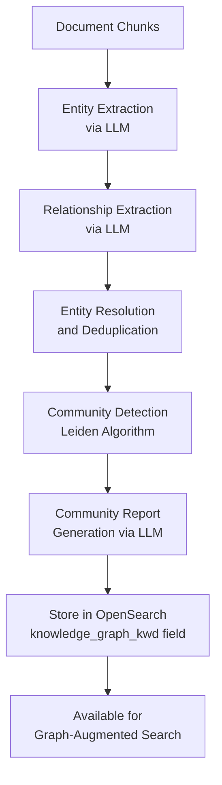
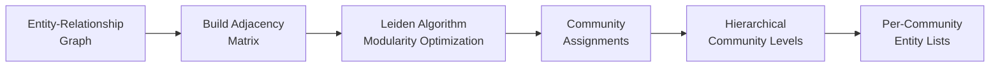
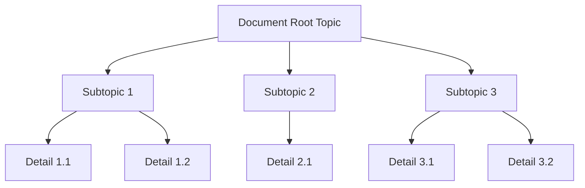
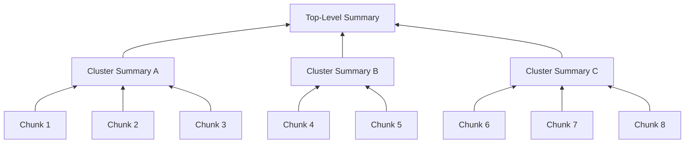

# Advanced: GraphRAG

## Overview

GraphRAG extends the standard RAG pipeline by building a knowledge graph from document chunks. Entities and relationships are extracted via LLM, organized into communities, and summarized to provide structured context during search and chat.

## GraphRAG Pipeline



## Processing Modes

| Mode | Description | LLM Calls | Use Case |
|------|-------------|-----------|----------|
| **General** | Full extraction with detailed entity/relation types and community reports | High | Deep knowledge bases, complex domains |
| **Light** | Simplified extraction with basic entity types and minimal reports | Low | Large document sets, cost-sensitive |

## Entity Extraction

The LLM processes each chunk to identify named entities:

| Entity Type | Examples | Description |
|-------------|----------|-------------|
| Person | Names, roles, titles | People mentioned in content |
| Organization | Companies, teams, departments | Organizational entities |
| Location | Cities, countries, addresses | Geographic references |
| Technology | Software, frameworks, protocols | Technical concepts |
| Event | Dates, milestones, incidents | Time-bound occurrences |
| Concept | Theories, methods, standards | Abstract domain concepts |
| Custom | User-defined via `entity_types` | Dataset-specific entity types |

Each entity includes: `name`, `type`, `description`, `source_chunk_ids`.

## Relationship Extraction

For each pair of entities found within the same chunk or adjacent chunks, the LLM identifies relationships:

```
Relationship {
  source_entity: string      // Entity name
  target_entity: string      // Entity name
  relationship_type: string  // e.g., "works_at", "depends_on", "located_in"
  description: string        // Natural language description
  weight: number             // Strength/confidence (0-1)
  source_chunk_ids: string[] // Provenance
}
```

## Entity Resolution

After extraction, duplicate entities are merged:

1. **Exact match** -- identical names merged automatically
2. **Fuzzy match** -- similar names (e.g., "AWS" and "Amazon Web Services") resolved via LLM
3. **Type consistency** -- merged entities must share compatible types
4. **Description merge** -- descriptions combined, deduplicated

## Community Detection (Leiden Algorithm)



The Leiden algorithm partitions the graph into communities of densely connected entities:

- **Modularity-based** -- optimizes for dense intra-community and sparse inter-community connections
- **Hierarchical** -- produces multi-level community structure (fine to coarse)
- **Deterministic** -- reproducible results with fixed random seed

## Community Reports

For each detected community, an LLM generates a summary report:

| Report Field | Description |
|-------------|-------------|
| Title | Community topic summary |
| Summary | 2-3 sentence overview |
| Key entities | Most important entities in the community |
| Key relationships | Most significant connections |
| Findings | Insights derived from the community structure |

Reports are stored in OpenSearch and injected into search/chat context when relevant.

## Mind Map Extraction

GraphRAG also produces a hierarchical mind map:



The mind map provides a navigable topic hierarchy extracted by the LLM, useful for document exploration in the UI.

## RAPTOR: Hierarchical Summarization

RAPTOR (Recursive Abstractive Processing for Tree-Organized Retrieval) builds a summary tree:



### RAPTOR Processing Steps

1. **Embed all leaf chunks** using the configured embedding model
2. **Cluster similar chunks** using Gaussian Mixture Models (GMM)
3. **Summarize each cluster** via LLM to produce intermediate summaries
4. **Recurse** -- treat summaries as new chunks, repeat clustering and summarization
5. **Index all levels** -- leaf chunks and summaries are all searchable

| Level | Content | Purpose |
|-------|---------|---------|
| Leaf | Original document chunks | Detail-level retrieval |
| Intermediate | Cluster summaries | Section-level context |
| Top | Root summary | Document-level overview |

### RAPTOR Configuration

| Parameter | Default | Description |
|-----------|---------|-------------|
| `max_clusters` | 10 | Maximum clusters per level |
| `max_depth` | 3 | Maximum tree depth |
| `summary_model` | tenant default LLM | Model for summarization |

## Query Integration

During search or chat, graph context is merged into the system prompt:

1. **Query entity matching** -- extract entities from user query
2. **Graph lookup** -- find matching entities and their communities in the graph
3. **Community report retrieval** -- fetch relevant community reports
4. **Context injection** -- prepend graph context to the LLM system prompt alongside retrieved chunks

This provides the LLM with both specific chunk-level detail and broader structural understanding of the knowledge base.
