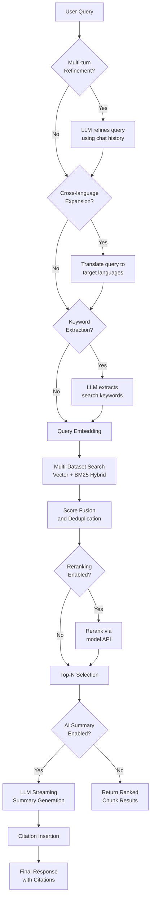
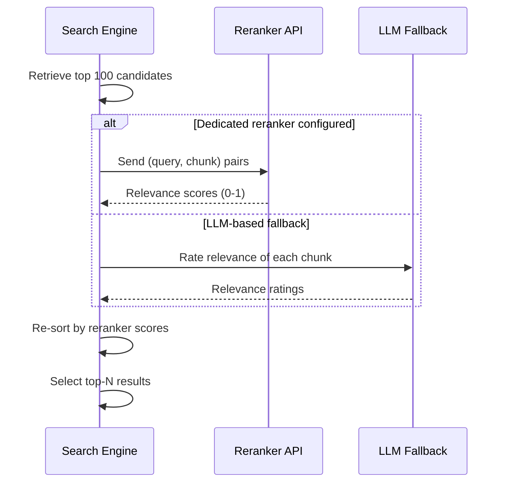

# Advanced: Search Execution Pipeline

## Overview

The search pipeline transforms a user query into a ranked, cited response. It supports multi-turn refinement, cross-language expansion, hybrid scoring (vector + BM25), reranking, and LLM-generated summaries with inline citations.

## Search Pipeline Flow



## Hybrid Scoring

Each chunk receives both a vector similarity score and a BM25 text relevance score. These are fused using a weighted formula:

```
weightedScore = (1 - vectorWeight) * textScore + vectorWeight * semanticScore
```

Default `vectorWeight` is configurable per dataset (typically 0.3-0.7).

### BM25 Boost Factors

Certain fields receive multiplicative boosts during BM25 scoring:

| Field | Boost Factor | Source |
|-------|-------------|--------|
| `title_tks` | 10x | Document/heading titles |
| `important_kwd` | 30x | LLM-extracted keywords |
| `question_tks` | 20x | LLM-generated questions |
| `content_ltks` | 2x | Standard content tokens |
| `content_with_weight` | 1x | Base content (no boost) |

A chunk matching on `important_kwd` scores 30 times higher on the BM25 component than the same match on plain content.

## Multi-Dataset Search

When a chat assistant is connected to multiple knowledge bases, the search fans out:

1. Query is sent to each dataset's OpenSearch index in parallel
2. Results from all datasets are collected
3. Scores are normalized per-dataset to account for different scale ranges
4. Results are merged, deduplicated by content hash, and sorted by fused score

## Reranking

After initial retrieval, an optional reranking step re-scores the top candidates using a cross-encoder model:



### Reranker Options

| Provider | Model | Description |
|----------|-------|-------------|
| **Jina** | jina-reranker-v2 | Fast, cost-effective cross-encoder |
| **Cohere** | rerank-v3.5 | High-quality multilingual reranking |
| **BAAI** | bge-reranker-v2 | Open-source, self-hostable |
| **NVIDIA** | nv-rerankqa | GPU-accelerated reranking |
| **Generic** | OpenAI-compatible endpoint | Any compatible reranker API |
| **LLM fallback** | Configured chat LLM | Uses prompt-based relevance rating |

## Citation Algorithm

When the LLM generates a summary, citations link answer sentences back to source chunks:

### Citation Process

1. **Segment answer** -- split LLM response into sentences
2. **Embed sentences** -- generate embeddings for each answer sentence
3. **Hybrid similarity** -- compare each sentence against all retrieved chunks:
   ```
   similarity = 0.9 * cosineSimilarity(sentenceVec, chunkVec)
              + 0.1 * jaccardSimilarity(sentenceKeywords, chunkKeywords)
   ```
4. **Adaptive threshold** -- start at 0.63, gradually lower to 0.3 if no matches found
5. **Insert markers** -- append `##ID:n$$` markers referencing matched chunk indices

### Citation Example

```
The system uses vector search for semantic matching ##ID:3$$.
Results are reranked using cross-encoder models ##ID:7$$.
```

Where `##ID:3$$` and `##ID:7$$` reference the 3rd and 7th retrieved chunks respectively. The frontend renders these as clickable citation badges linking to the source document and page.

## Query Pre-Processing

### Multi-Turn Refinement

For follow-up questions in a conversation, the LLM rewrites the query to be self-contained:

| User says | Refined query |
|-----------|---------------|
| "What about the cost?" | "What is the cost of the RAG pipeline processing?" |
| "How does that compare?" | "How does vector search compare to keyword search in accuracy?" |

### Cross-Language Expansion

When enabled, queries are translated to additional languages configured on the dataset, enabling cross-lingual retrieval from multilingual knowledge bases.

### Keyword Extraction

The LLM extracts key search terms from natural language queries to improve BM25 matching:

| Query | Extracted keywords |
|-------|-------------------|
| "How do I configure SSL certificates?" | `SSL`, `certificates`, `configure`, `TLS` |
| "What causes high memory usage?" | `memory`, `usage`, `high`, `leak`, `OOM` |

## Response Modes

| Mode | Description | LLM Used |
|------|-------------|----------|
| **Chunks only** | Return ranked chunks without summary | No |
| **AI summary** | Stream an LLM-generated answer with citations | Yes |
| **Hybrid** | Return both chunks and AI summary | Yes |
