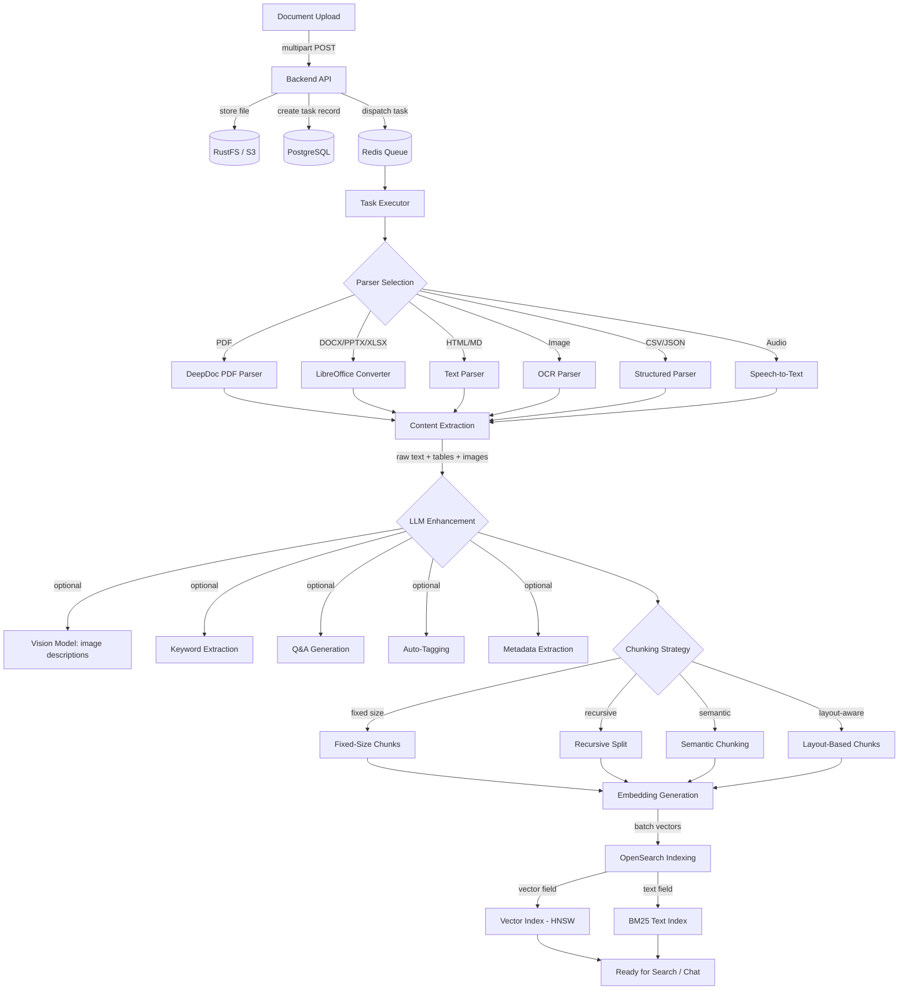
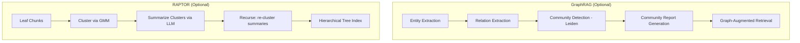
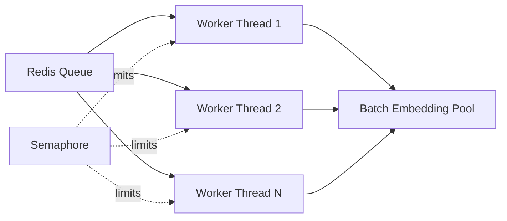
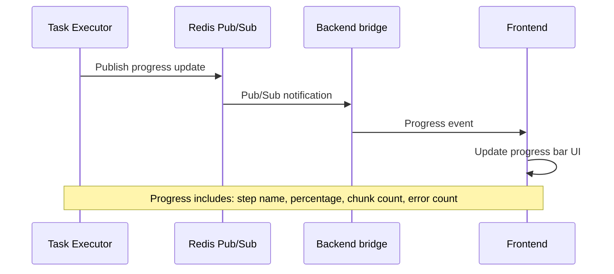

# RAG Pipeline Overview

## Overview

The B-Knowledge RAG pipeline transforms uploaded documents into searchable, embeddable knowledge. The pipeline is orchestrated by `task_executor.py` (80KB), which manages the full lifecycle: upload, parse, extract, enhance, chunk, embed, and index.

## Complete Pipeline Flowchart

## Step Details

| Step | Input | Output | Technology | Configurable Options |
|------|-------|--------|-----------|---------------------|
| Upload | File (multipart) | S3 object + DB record | Express, RustFS | Max file size, allowed types |
| Parser Selection | File MIME type | Selected parser | Python mimetypes | Per-dataset parser override |
| Content Extraction | Raw file bytes | Text + tables + images | DeepDoc, Tesseract, LibreOffice | OCR language, layout model |
| LLM Enhancement | Extracted content | Enriched content | GPT-4o, Qwen-VL, etc. | Enable/disable each enhancement |
| Chunking | Full text | Chunk array | LangChain splitters | Method, size, overlap, separators |
| Embedding | Chunk text | Float vectors | BGE-M3, text-embedding-3 | Model selection, batch size |
| Indexing | Vectors + text | OpenSearch docs | OpenSearch 3.5 | Index settings, similarity metric |

## Supported Parsers (20)

The `FACTORY` mapping in `task_executor.py` registers all 20 parser types:

| Parser ID | File Types | Method |
|-----------|-----------|--------|
| `naive` / `general` | pdf, docx, txt, html, md, xml | General-purpose text extraction (DeepDoc, MinerU, Docling, PaddleOCR, or PlainText layout engines) |
| `paper` | pdf | Academic/research paper extraction |
| `book` | pdf, docx, epub | Long-form book content with chapter detection |
| `presentation` | pptx, ppt | Slide-by-slide extraction with speaker notes |
| `manual` | pdf, docx | Technical manual/guide parsing |
| `laws` | pdf, docx | Legal/regulatory document parsing |
| `qa` | txt, md, json | Question-answer pair detection |
| `table` | xlsx, xls, csv, tsv | Tabular data with sheet iteration |
| `resume` | pdf, docx | Resume/CV section detection |
| `picture` | png, jpg, jpeg, tiff, bmp | OCR text extraction + vision model description |
| `one` | any | Single-chunk mode (entire document as one chunk) |
| `audio` | mp3, wav, flac, ogg | Speech-to-text transcription |
| `email` | eml, msg | Email header parsing + attachment extraction |
| `knowledge_graph` | any (maps to naive) | GraphRAG entity/relation extraction |
| `tag` | txt, md | Tag-delimited content splitting |
| `code` | py, js, ts, java, go, rs, c, cpp, rb | Syntax-aware source code splitting |
| `openapi` | json, yaml | OpenAPI/Swagger spec extraction |
| `adr` | json, yaml, md | Architecture Decision Record parsing |
| `clinical` | pdf | Clinical/medical document parsing |
| `sdlc_checklist` | md, json | SDLC checklist extraction |

## Advanced RAG Features (Optional Steps)

Beyond the core 7-step pipeline, two optional advanced steps can be enabled per dataset:

Both are configured via `parser_config.graphrag` and `parser_config.raptor` on the dataset record. The task executor dispatches them as separate pipeline task types (`PipelineTaskType.GRAPH_RAG` and `PipelineTaskType.RAPTOR`).

## Concurrency Model

- **Task-level concurrency:** Semaphore limits concurrent tasks (configurable, default 3)
- **Batch embedding:** Chunks are batched (default 32) for efficient GPU/API utilization
- **Queue priority:** Tasks are processed FIFO with priority support for re-parse operations

## Progress Tracking

## Error Handling

| Scenario | Behavior |
|----------|----------|
| Parser failure | Retry up to 3 times, then mark task as failed |
| Embedding API timeout | Exponential backoff retry (1s, 2s, 4s) |
| S3 unavailable | Task paused, retried on next queue poll |
| OOM during parsing | Graceful failure, task marked failed with error details |
| Partial success | Completed chunks indexed; failed chunks logged for retry |

Task status is updated in PostgreSQL and broadcast via Redis pub/sub at each stage, ensuring the frontend always reflects the current pipeline state.
