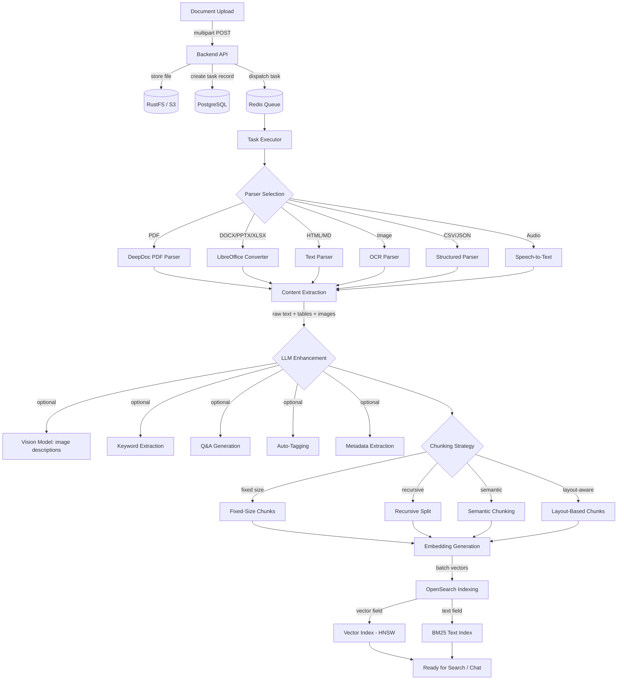
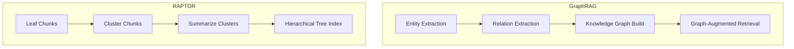
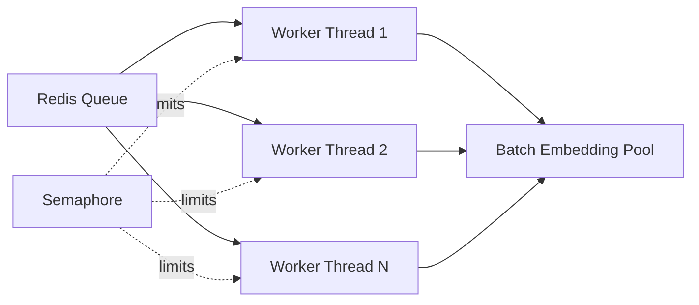
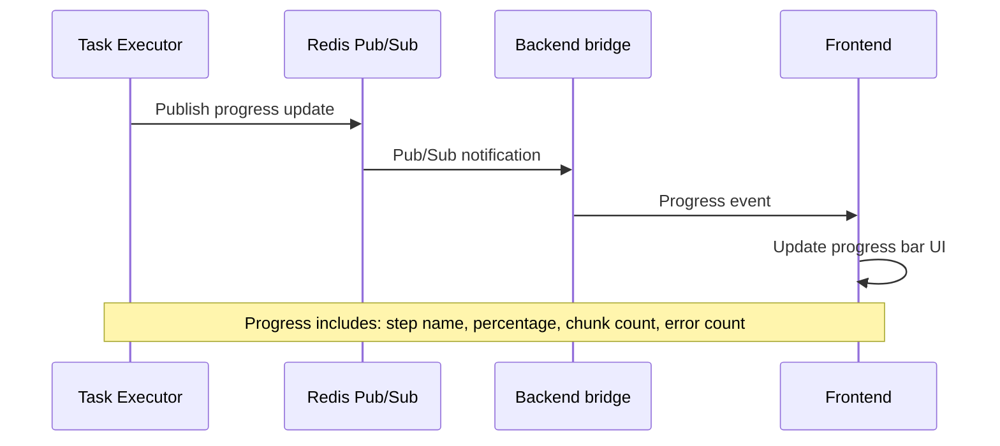

# RAG Pipeline Overview

## Overview

The B-Knowledge RAG pipeline transforms uploaded documents into searchable, embeddable knowledge. The pipeline is orchestrated by `task_executor.py` (80KB), which manages the full lifecycle: upload, parse, extract, enhance, chunk, embed, and index.

## Complete Pipeline Flowchart

## Step Details

| Step | Input | Output | Technology | Configurable Options |
|------|-------|--------|-----------|---------------------|
| Upload | File (multipart) | S3 object + DB record | Express, RustFS | Max file size, allowed types |
| Parser Selection | File MIME type | Selected parser | Python mimetypes | Per-dataset parser override |
| Content Extraction | Raw file bytes | Text + tables + images | DeepDoc, Tesseract, LibreOffice | OCR language, layout model |
| LLM Enhancement | Extracted content | Enriched content | GPT-4o, Qwen-VL, etc. | Enable/disable each enhancement |
| Chunking | Full text | Chunk array | LangChain splitters | Method, size, overlap, separators |
| Embedding | Chunk text | Float vectors | BGE-M3, text-embedding-3 | Model selection, batch size |
| Indexing | Vectors + text | OpenSearch docs | OpenSearch 3.5 | Index settings, similarity metric |

## Supported Parsers (18)

| Parser | File Types | Method |
|--------|-----------|--------|
| PDF (DeepDoc) | `.pdf` | Layout analysis + OCR |
| PDF (Basic) | `.pdf` | PyMuPDF text extraction |
| DOCX | `.docx` | python-docx |
| PPTX | `.pptx` | python-pptx |
| XLSX/CSV | `.xlsx`, `.csv` | openpyxl / pandas |
| HTML | `.html`, `.htm` | BeautifulSoup |
| Markdown | `.md` | markdown-it |
| Plain Text | `.txt`, `.log` | Direct read |
| Image | `.png`, `.jpg`, `.tiff` | Tesseract OCR |
| Audio | `.mp3`, `.wav` | Whisper STT |
| JSON | `.json` | Structured parse |
| XML | `.xml` | ElementTree |
| Email | `.eml` | email parser |
| Code | `.py`, `.js`, `.ts` | Syntax-aware split |
| LaTeX | `.tex` | LaTeX parser |
| EPUB | `.epub` | EPUB reader |
| RTF | `.rtf` | RTF parser |
| ODT | `.odt` | LibreOffice |

## Advanced RAG Features

## Concurrency Model

- **Task-level concurrency:** Semaphore limits concurrent tasks (configurable, default 3)
- **Batch embedding:** Chunks are batched (default 32) for efficient GPU/API utilization
- **Queue priority:** Tasks are processed FIFO with priority support for re-parse operations

## Progress Tracking

## Error Handling

| Scenario | Behavior |
|----------|----------|
| Parser failure | Retry up to 3 times, then mark task as failed |
| Embedding API timeout | Exponential backoff retry (1s, 2s, 4s) |
| S3 unavailable | Task paused, retried on next queue poll |
| OOM during parsing | Graceful failure, task marked failed with error details |
| Partial success | Completed chunks indexed; failed chunks logged for retry |

Task status is updated in PostgreSQL and broadcast via Redis pub/sub at each stage, ensuring the frontend always reflects the current pipeline state.
