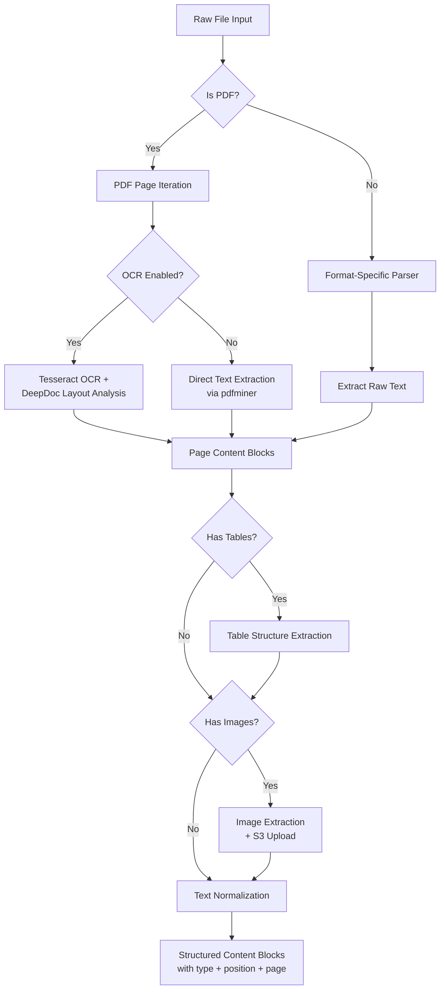
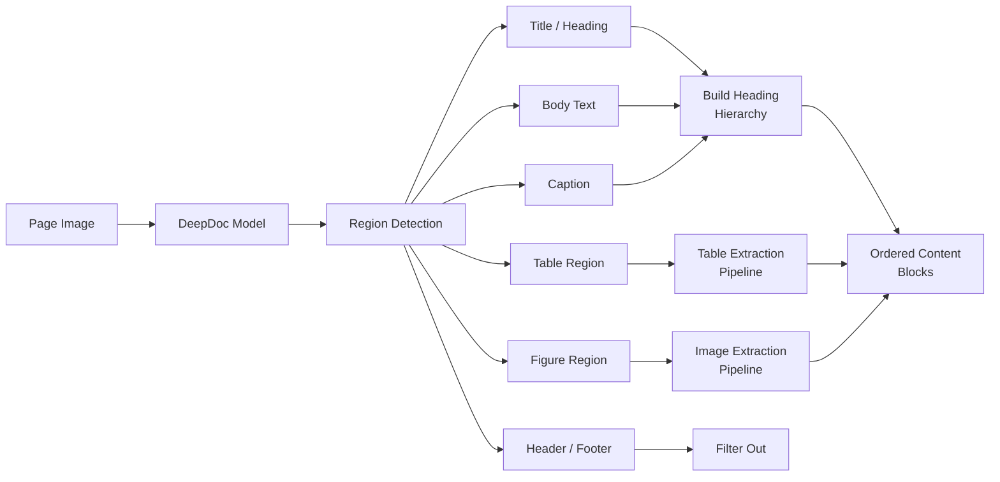

# RAG Step 3: Content Extraction

## Overview

Content extraction transforms raw uploaded files into structured content blocks. The pipeline handles OCR for scanned documents, layout analysis for complex page structures, table and image extraction, and text normalization.

## Extraction Activity Flow



## OCR Processing

The OCR pipeline combines two complementary engines:

| Engine | Role | Strengths |
|--------|------|-----------|
| **Tesseract** | Character recognition | Multi-language support (100+ languages), configurable via `ocr_language` |
| **DeepDoc** | Layout analysis | Deep-learning page structure detection, reading order inference |

### OCR Pipeline Steps

1. **Page rendering** -- convert PDF page to image at 300 DPI
2. **Layout detection** -- DeepDoc identifies regions: text blocks, tables, figures, headers, footers
3. **Reading order** -- regions sorted by spatial position (top-to-bottom, left-to-right)
4. **Text recognition** -- Tesseract runs on each text region with language-specific model
5. **Confidence filtering** -- low-confidence OCR results flagged for review

## Layout Analysis

Layout analysis detects the structural hierarchy of each page:



| Detection Type | Description |
|---------------|-------------|
| **Headings** | Title, H1-H6 hierarchy based on font size and weight |
| **Body text** | Paragraph blocks with reading order |
| **Tables** | Bounding box for table region, triggers table extraction |
| **Figures** | Image regions, triggers image extraction |
| **Headers/Footers** | Page headers and footers, typically filtered out |
| **Captions** | Figure and table captions, attached to parent element |

## Table Extraction

Tables are preserved as structured markdown to maintain row/column relationships:

1. **Region detection** -- DeepDoc identifies table bounding boxes
2. **Cell detection** -- grid lines or whitespace-based cell boundary detection
3. **Cell content OCR** -- Tesseract on each cell individually
4. **Structure assembly** -- cells mapped to row/column positions
5. **Markdown output** -- rendered as markdown table with headers

**Example output:**

```
| Column A | Column B | Column C |
|----------|----------|----------|
| Value 1  | Value 2  | Value 3  |
| Value 4  | Value 5  | Value 6  |
```

## Image Extraction

Images found in documents are processed as follows:

1. **Region crop** -- extract image from page using bounding box
2. **S3 upload** -- save image to RustFS at `{tenantId}/{docId}/images/{imageId}.png`
3. **Placeholder insertion** -- replace image in content with ``
4. **Vision processing** -- optionally sent to vision model in LLM Enhancement step for text description

## Text Normalization

All extracted text undergoes normalization before becoming content blocks:

| Operation | Description |
|-----------|-------------|
| **Whitespace cleanup** | Collapse multiple spaces/newlines, trim line edges |
| **Encoding fix** | Convert to UTF-8, handle BOM markers |
| **Unicode normalization** | NFC normalization, fix mojibake characters |
| **Ligature expansion** | Expand typographic ligatures (ff, fi, fl) |
| **Hyphen joining** | Rejoin words split by end-of-line hyphens |
| **Control char removal** | Strip non-printable control characters |

## Output Format

The extraction stage produces a list of content blocks:

```
ContentBlock {
  type: "text" | "table" | "image"
  content: string          // text content or markdown table or image URL
  page_number: number      // source page (1-indexed)
  position: number         // reading order position within page
  heading: string | null   // nearest heading context
  bbox: [x0, y0, x1, y1]  // bounding box on page (optional)
}
```

These blocks are passed to the next pipeline step (LLM Enhancement or Chunking) for further processing.
