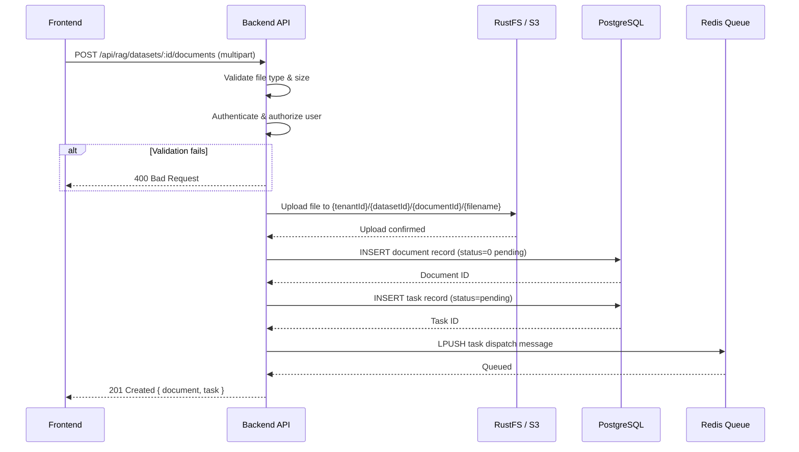
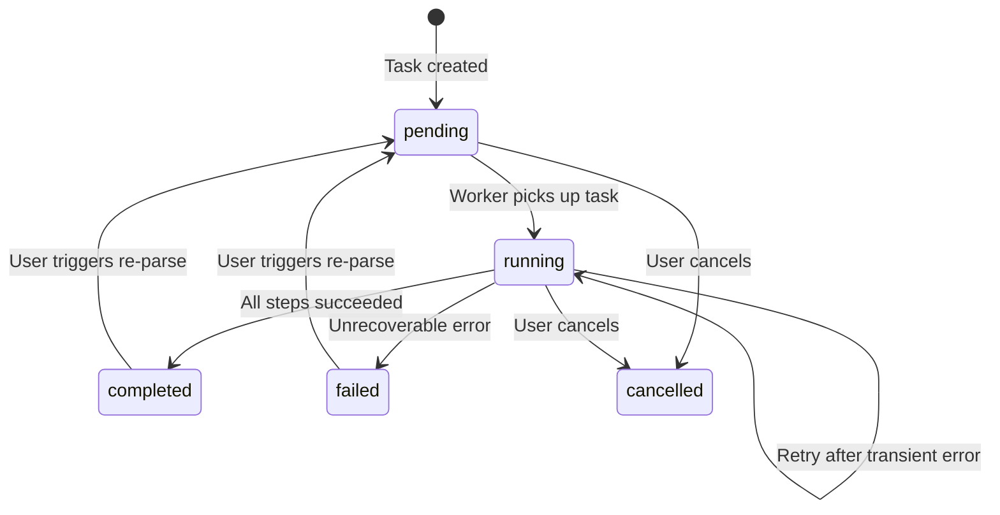
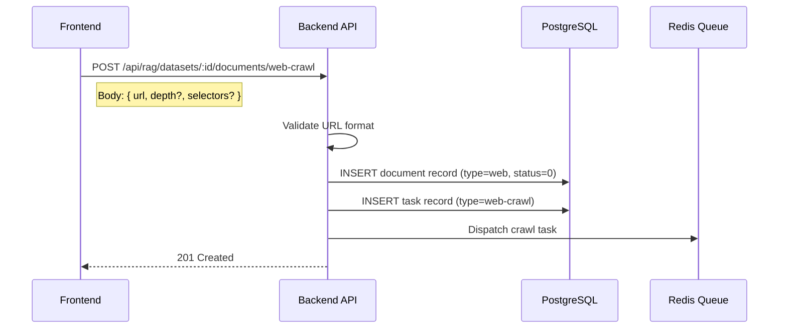

# RAG Step 1: Document Ingestion

## Overview

Document ingestion is the entry point of the RAG pipeline. It handles file upload, validation, S3 storage, database record creation, and task dispatch to the Redis processing queue.

## Ingestion Sequence Diagram



## File Type Detection

The backend detects file types using a combination of:

1. **MIME type** from the `Content-Type` header
2. **File extension** from the original filename
3. **Magic bytes** validation for binary formats (PDF, DOCX, images)

| Category | Extensions | Max Size |
|----------|-----------|----------|
| Documents | `.pdf`, `.docx`, `.pptx`, `.xlsx`, `.odt`, `.rtf` | 100 MB |
| Text | `.txt`, `.md`, `.html`, `.htm`, `.csv`, `.json`, `.xml` | 50 MB |
| Images | `.png`, `.jpg`, `.jpeg`, `.tiff`, `.bmp` | 20 MB |
| Audio | `.mp3`, `.wav`, `.m4a` | 200 MB |
| Code | `.py`, `.js`, `.ts`, `.java`, `.go`, `.rs` | 10 MB |
| Other | `.epub`, `.eml`, `.tex`, `.log` | 50 MB |

## S3 Storage Structure

Files are stored in RustFS (S3-compatible) with a deterministic path:

```
{tenantId}/{datasetId}/{documentId}/{filename}
```

Example:
```
a1b2c3d4/ds-5678/doc-9012/quarterly-report.pdf
```

This structure ensures:
- **Tenant isolation** at the top level
- **Dataset grouping** for bulk operations
- **Document-level** access for individual file retrieval
- **Original filename** preserved for user-facing display

## Document Record

| Field | Type | Description |
|-------|------|-------------|
| `id` | UUID | Primary key |
| `dataset_id` | UUID | Parent dataset reference |
| `name` | string | Original filename |
| `type` | string | File extension |
| `size` | integer | File size in bytes |
| `location` | string | S3 object key |
| `status` | integer | 0=pending, 1=parsing, 2=completed, 3=failed |
| `chunk_count` | integer | Number of chunks after parsing |
| `token_count` | integer | Total tokens across chunks |
| `parser_config` | JSONB | Parser and chunking settings |
| `process_begin_at` | timestamp | Processing start time |
| `process_duration` | float | Processing duration in seconds |
| `created_by` | UUID | Uploading user |
| `created_at` | timestamp | Upload timestamp |
| `updated_at` | timestamp | Last update |

## Task Record

| Field | Type | Description |
|-------|------|-------------|
| `id` | UUID | Primary key |
| `doc_id` | UUID | Associated document |
| `dataset_id` | UUID | Parent dataset |
| `type` | string | Task type (parse, enhance, reparse) |
| `status` | string | pending, running, completed, failed, cancelled |
| `progress` | float | 0.0 to 1.0 completion percentage |
| `progress_msg` | string | Human-readable progress message |
| `retry_count` | integer | Number of retry attempts |
| `error_message` | text | Error details if failed |
| `created_at` | timestamp | Task creation time |
| `updated_at` | timestamp | Last status update |

## Task State Machine



## Redis Queue Structure

Task dispatch uses a Redis list as a FIFO queue:

```
Queue key: rag:task:queue
Message format (JSON):
{
  "task_id": "uuid",
  "doc_id": "uuid",
  "dataset_id": "uuid",
  "tenant_id": "uuid",
  "type": "parse",
  "priority": 0,
  "created_at": "ISO-8601"
}
```

The Task Executor uses `BRPOP` for blocking dequeue, ensuring immediate pickup when tasks are available and efficient idle waiting.

## Web Crawl Alternative

Instead of file upload, documents can be ingested from web URLs:



The crawl task downloads the page HTML, extracts content using CSS selectors (or full-page extraction by default), and proceeds through the same parsing pipeline as uploaded files.

## Bulk Operations

| Operation | Endpoint | Description |
|-----------|----------|-------------|
| Bulk Parse | `POST /api/rag/datasets/:id/documents/bulk-parse` | Trigger parsing for multiple documents |
| Bulk Toggle | `POST /api/rag/datasets/:id/documents/bulk-toggle` | Enable or disable multiple documents |
| Bulk Delete | `POST /api/rag/datasets/:id/documents/bulk-delete` | Delete multiple documents and their chunks |

Bulk operations accept an array of document IDs in the request body:

```json
{
  "document_ids": ["uuid-1", "uuid-2", "uuid-3"]
}
```

Each bulk operation creates individual tasks per document, allowing independent progress tracking and failure isolation.
