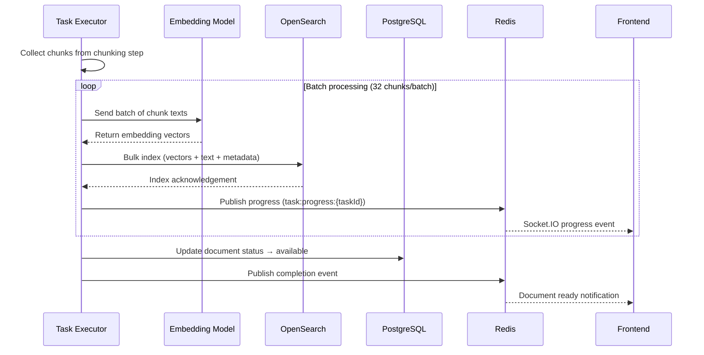
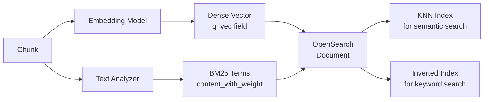
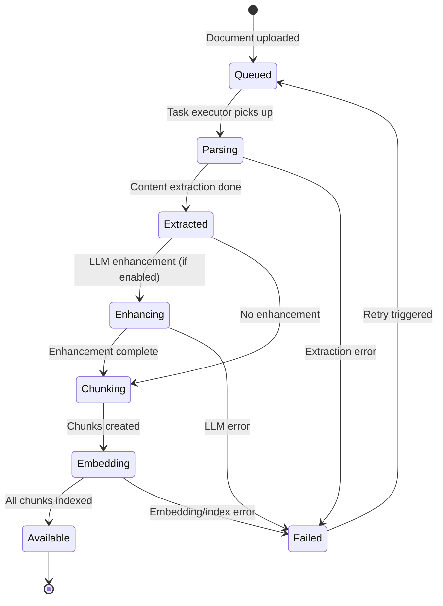

# RAG Step 6: Embedding & Indexing

## Overview

Embedding and indexing converts text chunks into vector representations and stores them in OpenSearch for hybrid retrieval. Each chunk is dual-indexed: as a dense vector for semantic (KNN) search and as analyzed text for BM25 keyword search.

## Embedding & Indexing Sequence



## Embedding Model Resolution

The embedding model is resolved using a priority chain:

1. **Dataset config** -- `parser_config.embedding_model` if explicitly set
2. **Tenant LLM** -- default embedding model configured in `tenant_llm` table
3. **System default** -- fallback model from system configuration

| Setting | Source | Example |
|---------|--------|---------|
| Model name | tenant_llm record | `text-embedding-3-small` |
| API endpoint | tenant_llm record | `https://api.openai.com/v1` |
| API key | tenant_llm record (encrypted) | `sk-...` |
| Dimensions | model metadata | 1536 |

## Batch Processing

Chunks are embedded in configurable batches to balance throughput and memory:

| Parameter | Default | Description |
|-----------|---------|-------------|
| Batch size | 32 | Chunks per embedding API call |
| Max retries | 3 | Retry count per failed batch |
| Retry delay | Exponential backoff | 1s, 2s, 4s between retries |
| Timeout | 60s | Per-batch API timeout |

For a 200-chunk document at batch size 32: 7 batches, ~7 API calls.

## OpenSearch Index Structure

Each tenant has a dedicated index: `knowledge_{tenantId}`

| Field | Type | Description |
|-------|------|-------------|
| `content_with_weight` | `text` | Chunk text with optional title prefix (BM25-indexed) |
| `q_vec` | `knn_vector` | Dense embedding vector (KNN-indexed) |
| `doc_id` | `keyword` | Parent document ID |
| `kb_id` | `keyword` | Knowledge base ID |
| `docnm_kwd` | `keyword` | Document filename |
| `page_num_int` | `integer` | Source page number |
| `important_kwd` | `text` | LLM-extracted keywords (30x boost) |
| `question_tks` | `text` | LLM-generated Q&A tokens (20x boost) |
| `title_tks` | `text` | Title/heading tokens (10x boost) |
| `pagerank_fea` | `float` | PageRank feature score |
| `available_int` | `integer` | Availability flag (1 = searchable) |
| `tenant_id` | `keyword` | Tenant identifier |

### Index Mapping Highlights

```
{
  "settings": {
    "index.knn": true,
    "index.knn.algo_param.ef_search": 512
  },
  "mappings": {
    "properties": {
      "q_vec": {
        "type": "knn_vector",
        "dimension": <model_dimensions>,
        "method": { "name": "hnsw", "engine": "nmslib" }
      },
      "content_with_weight": {
        "type": "text",
        "analyzer": "standard"
      }
    }
  }
}
```

## Dual Indexing

Each chunk is indexed in two ways simultaneously:



- **Vector (KNN)** -- HNSW graph index on `q_vec` for approximate nearest neighbor search
- **BM25 (Full-text)** -- inverted index on `content_with_weight`, `title_tks`, `important_kwd`, `question_tks`

At query time, both indexes are searched and scores are fused (see Search Execution Pipeline).

## Progress Tracking

Real-time progress flows from the worker to the frontend:


Progress messages include:

| Field | Description |
|-------|-------------|
| `taskId` | Task identifier |
| `progress` | 0.0 - 1.0 completion ratio |
| `message` | Human-readable status (e.g., "Embedding batch 3/7") |
| `stage` | Current stage (extracting, enhancing, chunking, embedding) |

## Document Status Transitions



| Status | `available_int` | Description |
|--------|-----------------|-------------|
| Queued | 0 | Waiting for processing |
| Parsing | 0 | Content extraction in progress |
| Extracted | 0 | Content extracted, not yet indexed |
| Enhancing | 0 | LLM enhancement in progress |
| Chunking | 0 | Splitting into chunks |
| Embedding | 0 | Generating vectors and indexing |
| Available | 1 | Fully indexed and searchable |
| Failed | 0 | Error occurred, can be retried |
