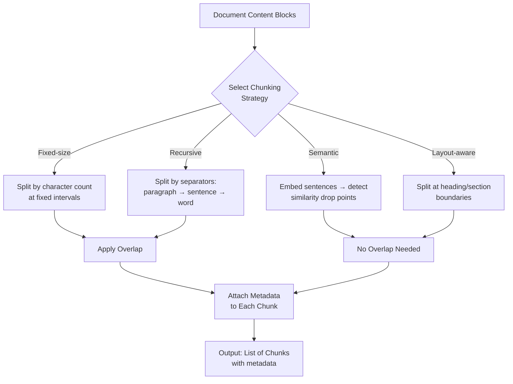
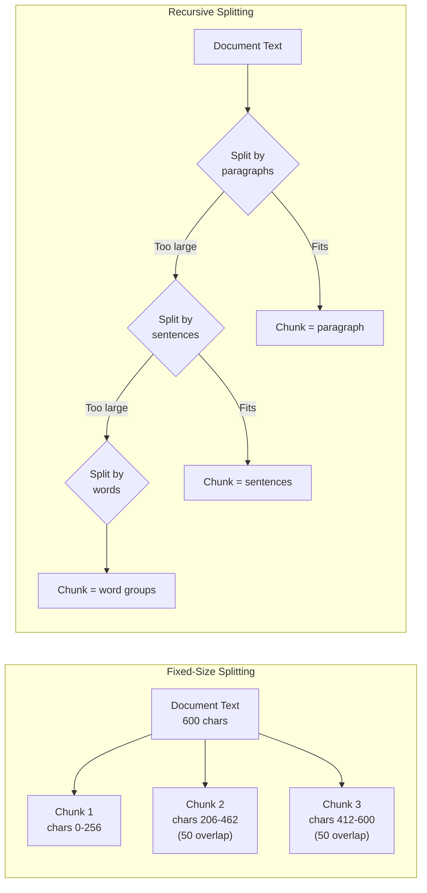

# RAG Step 5: Chunking

## Overview

Chunking splits extracted content into smaller segments optimized for embedding and retrieval. The strategy directly affects search quality -- chunks must be large enough to carry meaning but small enough for precise retrieval.

## Strategy Comparison

| Strategy | Description | Best For | Chunk Size Range | Overlap |
|----------|-------------|----------|-----------------|---------|
| **Fixed-size** | Split by character/token count at fixed intervals | Simple, uniform documents | 256-1024 chars | 50-200 chars |
| **Recursive** | Split by separators: paragraph > sentence > word | General purpose, most documents | 512-2048 chars | 100-500 chars |
| **Semantic** | Split where embedding similarity drops between sentences | Complex, topic-shifting docs | Variable | N/A |
| **Layout-aware** | Split by document structure (headings, sections) | Structured docs with clear hierarchy | Variable | N/A |

## Chunking Flow

## Fixed-Size vs Recursive Splitting

## Strategy Details

### Fixed-Size

Splits content at exact character boundaries regardless of content structure.

- **Pros** -- predictable chunk sizes, simple implementation, consistent token usage
- **Cons** -- may split mid-sentence or mid-word, no semantic awareness
- **Use when** -- uniform content without structure, or when consistent chunk size matters

### Recursive

Attempts to split at natural boundaries using a priority list of separators:

1. `\n\n` -- paragraph breaks (highest priority)
2. `\n` -- line breaks
3. `. ` -- sentence endings
4. ` ` -- word boundaries (lowest priority)

If a chunk exceeds `chunk_size`, the splitter tries the next finer separator.

- **Pros** -- respects natural text boundaries, good general-purpose results
- **Cons** -- chunk sizes vary, some chunks may be very small
- **Use when** -- default choice for most document types

### Semantic

Uses embedding similarity to find topic boundaries:

1. Embed each sentence independently
2. Compute cosine similarity between consecutive sentences
3. Split where similarity drops below a threshold
4. Adjacent similar sentences form a single chunk

- **Pros** -- topic-coherent chunks, best retrieval quality for complex docs
- **Cons** -- requires embedding calls during chunking, slower, higher cost
- **Use when** -- documents with shifting topics, technical documentation

### Layout-Aware

Uses document structure detected during extraction:

1. Split at heading boundaries (H1, H2, H3, etc.)
2. Each section becomes a chunk (or multiple if section exceeds max size)
3. Heading hierarchy preserved in chunk metadata

- **Pros** -- preserves document structure, natural topic boundaries
- **Cons** -- requires good layout detection, uneven chunk sizes
- **Use when** -- well-structured documents with clear headings

## Chunk Metadata

Each chunk carries metadata for retrieval and display:

| Field | Type | Description |
|-------|------|-------------|
| `chunk_id` | `string` | Unique identifier (UUID) |
| `doc_id` | `string` | Parent document reference |
| `kb_id` | `string` | Knowledge base reference |
| `page_num` | `number` | Source page number (1-indexed) |
| `position` | `number` | Chunk position within document |
| `token_count` | `number` | Estimated token count for the chunk |
| `heading_hierarchy` | `string[]` | Heading path (e.g., ["Chapter 1", "Section 1.2"]) |
| `content_with_weight` | `string` | Chunk text with optional title/heading prefix |
| `important_kwd` | `string[]` | Keywords from LLM enhancement (if enabled) |
| `question_tks` | `string` | Generated Q&A tokens (if enabled) |

## Configuration

Chunking settings are configured per dataset in `parser_config`:

| Parameter | Type | Default | Description |
|-----------|------|---------|-------------|
| `chunk_method` | `string` | `"recursive"` | Strategy: `fixed`, `recursive`, `semantic`, `layout` |
| `chunk_size` | `number` | `1024` | Target chunk size in characters |
| `chunk_overlap` | `number` | `128` | Overlap between consecutive chunks (fixed/recursive only) |
| `separators` | `string[]` | `["\n\n", "\n", ". ", " "]` | Separator priority list (recursive only) |
| `similarity_threshold` | `number` | `0.5` | Similarity drop threshold (semantic only) |
| `heading_level` | `number` | `2` | Max heading depth for splits (layout only) |
