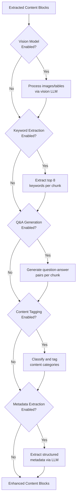
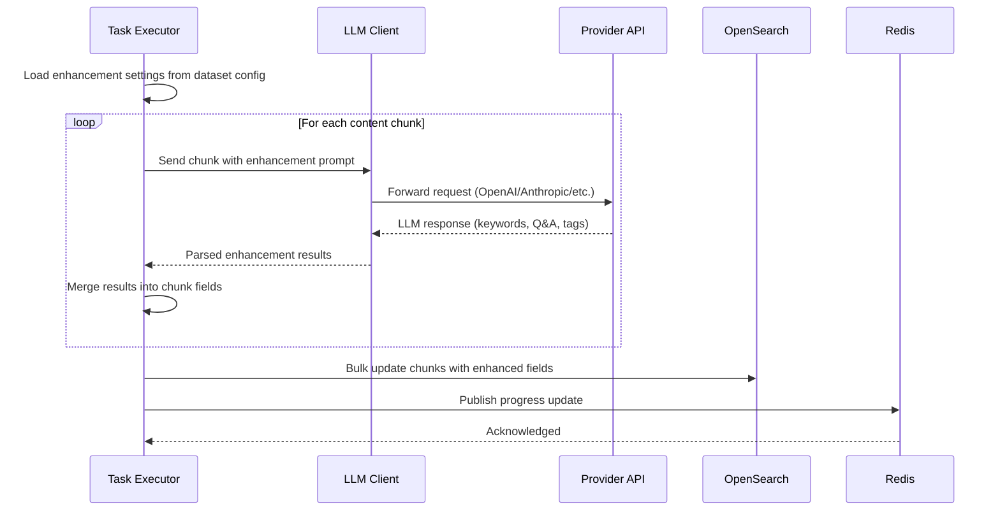

# RAG Step 4: LLM Enhancement

## Overview

LLM Enhancement is an optional post-extraction step that enriches content blocks using large language models. Each sub-step is independently toggleable via dataset settings, allowing fine-grained control over cost and quality trade-offs.

## Enhancement Pipeline



## Enhancement Sub-Steps

### 1. Vision Model Processing (Optional)

Converts images and complex tables into text descriptions using a multimodal LLM.

| Field | Value |
|-------|-------|
| **Input** | Image URLs from S3, table screenshots |
| **Output** | Natural language descriptions |
| **Storage** | Appended to content block text |
| **Model** | Configured vision-capable LLM (e.g., GPT-4o, Claude) |
| **Prompt** | Describe the content of this image/table in detail |

### 2. Keyword Extraction (Optional)

Extracts the most important keywords from each content chunk for boosted search.

| Field | Value |
|-------|-------|
| **Input** | Chunk text content |
| **Output** | Up to 8 keywords per chunk |
| **Storage** | `important_kwd` field in OpenSearch (30x boost) |
| **Prompt** | Extract the top 8 most important keywords from this text |

### 3. Q&A Generation (Optional)

Generates question-answer pairs that a user might ask about the chunk content.

| Field | Value |
|-------|-------|
| **Input** | Chunk text content |
| **Output** | Question-answer pairs |
| **Storage** | `question_tks` field in OpenSearch (20x boost) |
| **Prompt** | Generate questions a user might ask about this content, with answers |

### 4. Content Tagging (Optional)

Classifies content into categories and applies tags for filtering.

| Field | Value |
|-------|-------|
| **Input** | Chunk text content |
| **Output** | Category tags (e.g., "technical", "financial", "legal") |
| **Storage** | Chunk metadata, available for filtered search |
| **Prompt** | Classify this content into relevant categories |

### 5. Metadata Extraction (Optional)

Extracts structured metadata fields from document content.

| Field | Value |
|-------|-------|
| **Input** | Document-level content (first N chunks) |
| **Output** | Structured fields: author, date, version, title, summary |
| **Storage** | Document record metadata JSONB |
| **Prompt** | Extract structured metadata: author, date, title, version, summary |

## Execution Sequence



## Configuration

Enhancement settings are controlled at the dataset level in `parser_config`:

```
parser_config: {
  "use_vision": true,          // Enable vision model for images/tables
  "extract_keywords": true,    // Enable keyword extraction
  "generate_qa": true,         // Enable Q&A pair generation
  "tag_content": false,        // Enable content tagging
  "extract_metadata": false,   // Enable metadata extraction
  "llm_id": "tenant_llm_id"   // LLM model to use for enhancements
}
```

### Cost Considerations

Each enabled enhancement adds LLM API calls per chunk. For a 100-page document producing 200 chunks:

| Enhancement | Calls per Chunk | Total Calls (200 chunks) |
|-------------|-----------------|--------------------------|
| Vision model | 0-1 (only image/table chunks) | ~20-50 |
| Keyword extraction | 1 | 200 |
| Q&A generation | 1 | 200 |
| Content tagging | 1 | 200 |
| Metadata extraction | 1 (document-level) | 1 |

### Field Mapping to OpenSearch

| Enhancement | OpenSearch Field | Search Boost |
|-------------|-----------------|--------------|
| Keywords | `important_kwd` | 30x |
| Q&A pairs | `question_tks` | 20x |
| Tags | metadata fields | Filterable |
| Vision text | `content_with_weight` | 1x (standard) |
| Metadata | document record | N/A |
