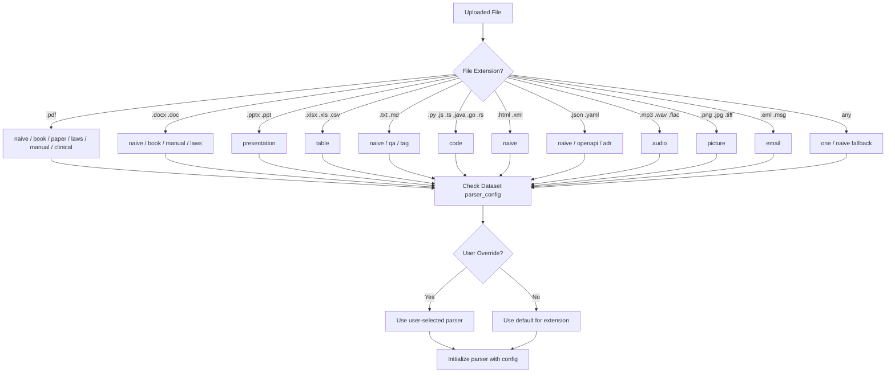
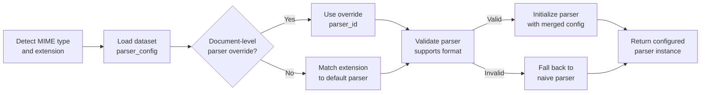

# RAG Step 2: Parser Selection

## Overview

Parser selection determines which extraction strategy processes each uploaded document. The system maps file extensions to parser types, respects user overrides, and initializes parsers with dataset-level configuration.

## File Extension to Parser Decision Tree

## Parser Registry

| Parser ID | Supported Formats | Description | Key Capabilities |
|-----------|-------------------|-------------|------------------|
| `naive` | pdf, docx, txt, html, md, xml | General-purpose text extraction | Basic OCR, paragraph splitting, heading detection |
| `code` | py, js, ts, java, go, rs, c, cpp, rb | Source code extraction | Language detection, syntax-aware splitting, comment extraction |
| `book` | pdf, docx, epub | Long-form book content | Chapter detection, TOC parsing, footnote handling |
| `paper` | pdf | Academic/research papers | Abstract/section extraction, citation parsing, figure references |
| `manual` | pdf, docx | Technical manuals/guides | Numbered section parsing, cross-references, warning/note blocks |
| `table` | xlsx, xls, csv, tsv | Tabular data | Sheet iteration, header detection, cell-type preservation |
| `qa` | txt, md, json | Question-answer pairs | Q&A pair detection, delimiter-based splitting |
| `resume` | pdf, docx | Resumes/CVs | Section detection (education, experience), entity extraction |
| `laws` | pdf, docx | Legal/regulatory documents | Article/clause numbering, cross-reference linking |
| `email` | eml, msg | Email messages | Header parsing, attachment extraction, thread handling |
| `audio` | mp3, wav, flac, ogg | Audio files | Speech-to-text transcription, speaker diarization |
| `clinical` | pdf | Clinical/medical documents | Medical entity recognition, section parsing (HPI, assessment) |
| `picture` | png, jpg, jpeg, tiff, bmp | Image files | OCR text extraction, vision model description |
| `presentation` | pptx, ppt | Slide decks | Slide-by-slide extraction, speaker notes, layout preservation |
| `adr` | json, yaml, md | Architecture Decision Records | ADR structure parsing (context, decision, consequences) |
| `openapi` | json, yaml | OpenAPI/Swagger specs | Endpoint extraction, schema parsing, description aggregation |
| `one` | any | Single-chunk mode | Treats entire document as one chunk, no splitting |
| `tag` | txt, md | Tag-delimited content | Splits content by tag markers, metadata per tag |

## Parser Configuration (parser_config JSONB)

Configuration is stored per dataset in the `parser_config` JSONB column:

| Option | Type | Default | Description |
|--------|------|---------|-------------|
| `pages` | `number[]` | `null` | Page range filter (e.g., `[1, 10]` for pages 1-10) |
| `ocr_enabled` | `boolean` | `true` | Enable OCR for scanned documents |
| `ocr_language` | `string` | `"eng"` | Tesseract language code for OCR |
| `layout_recognize` | `boolean` | `true` | Enable layout analysis (DeepDoc) |
| `raptor` | `object` | `null` | RAPTOR hierarchical summarization settings |
| `graphrag` | `object` | `null` | GraphRAG entity/relation extraction settings |
| `delimiter` | `string` | `null` | Custom chunk delimiter for naive parser |
| `entity_types` | `string[]` | `null` | Entity types for GraphRAG extraction |

## Parser Selection Flow

## Custom Parser Override

Users can override the default parser assignment per document:

1. **Dataset-level default** -- set `parser_id` on the dataset; all new documents inherit it
2. **Document-level override** -- set `parser_id` on an individual document record
3. **Resolution order** -- document override > dataset default > extension-based default
4. **Validation** -- the system checks that the selected parser can handle the file format; if not, it falls back to `naive`
5. **Re-parsing** -- changing a document's parser triggers re-processing: old chunks are deleted and the document is re-queued for extraction with the new parser
