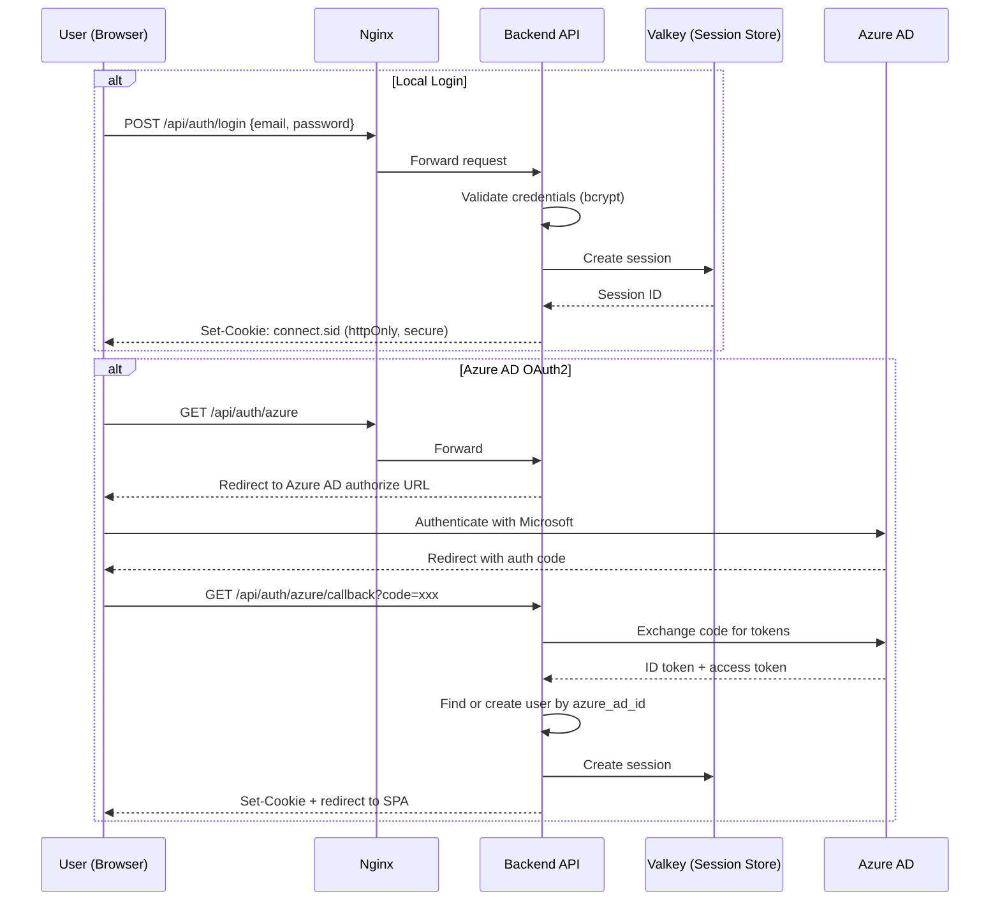
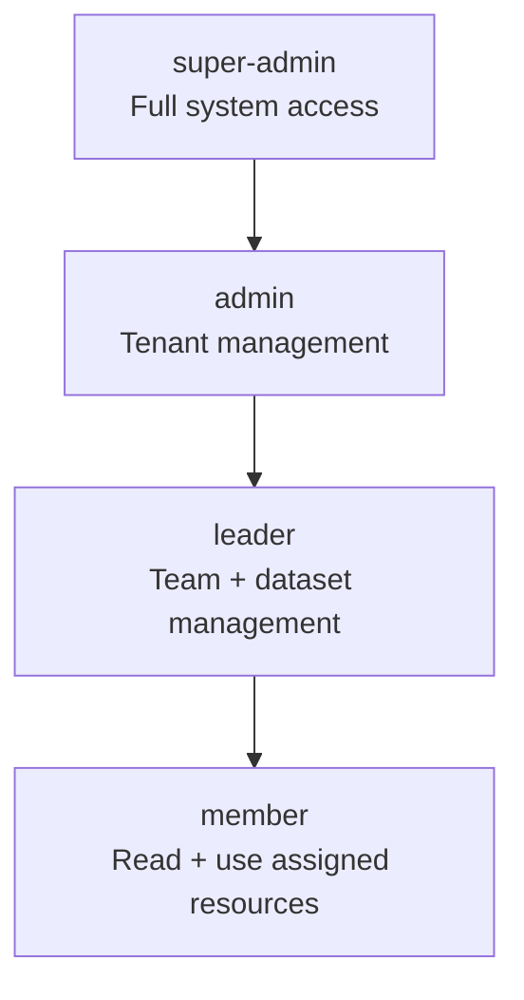
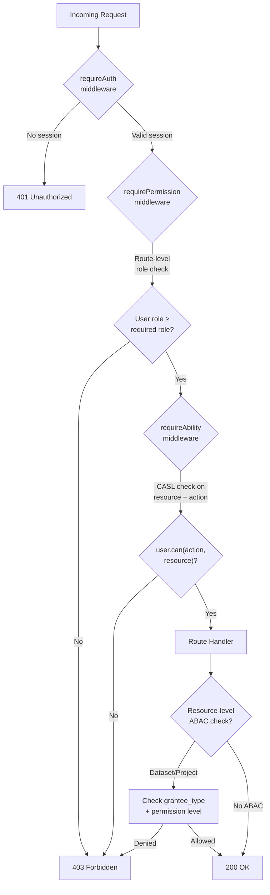
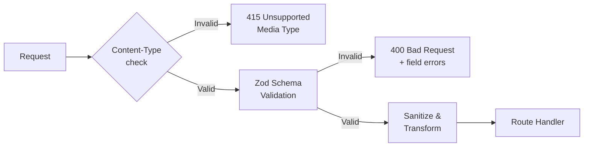

# Security Architecture

## Authentication Flow

## Authentication Methods

| Method | When Used | Details |
|--------|-----------|---------|
| Local login | Development, root admin | Email + bcrypt password; disabled in prod via `ENABLE_LOCAL_LOGIN=false` |
| Azure AD OAuth2 | Production SSO | OIDC flow with PKCE; auto-provisions users on first login |
| Session cookie | All authenticated requests | `connect.sid` with Valkey backing store |

## Authorization Model

B-Knowledge uses a dual authorization approach:

- **RBAC** (Role-Based): Global role hierarchy via CASL
- **ABAC** (Attribute-Based): Per-dataset and per-project permissions

### Role Hierarchy

Each higher role inherits all abilities of lower roles.

### Request Authorization Pipeline

### ABAC Permission Grants

Resources like datasets, chat assistants, and search apps use a grantee model:

| Field | Values | Description |
|-------|--------|-------------|
| `grantee_type` | `user`, `team` | Who receives the permission |
| `grantee_id` | UUID | User or team ID |
| `permission` | `view`, `edit`, `manage` | Access level granted |

## Security Headers

Configured via Helmet middleware:

| Header | Value | Purpose |
|--------|-------|---------|
| `Content-Security-Policy` | `frame-ancestors` relaxed | Allow embedding in customer sites via widgets |
| `X-Content-Type-Options` | `nosniff` | Prevent MIME-type sniffing |
| `X-Frame-Options` | Relaxed (for embeds) | Controlled framing for widget use cases |
| `Strict-Transport-Security` | `max-age=31536000` | Enforce HTTPS |
| `X-XSS-Protection` | `0` | Disabled (CSP preferred) |
| `Referrer-Policy` | `strict-origin-when-cross-origin` | Limit referrer leakage |

## Rate Limiting

| Scope | Limit | Window | Key |
|-------|-------|--------|-----|
| General API | 1000 requests | 15 minutes | IP address |
| Auth endpoints | 20 requests | 15 minutes | IP address |

Implemented via `express-rate-limit` with Valkey store for distributed counting.

## Session Configuration

| Property | Value | Purpose |
|----------|-------|---------|
| `httpOnly` | `true` | Prevent JavaScript access to cookie |
| `secure` | `true` (prod) | Cookie only sent over HTTPS |
| `sameSite` | `lax` | CSRF protection while allowing top-level navigations |
| `maxAge` | 7 days | Session TTL |
| `store` | Valkey (connect-redis) | Distributed session storage |
| `secret` | `SESSION_SECRET` env var | Must be strong random value in production |

## CORS Policy

- **Allowed origin**: Restricted to `FRONTEND_URL` environment variable
- **Credentials**: `true` (cookies sent cross-origin)
- **Methods**: `GET, POST, PUT, PATCH, DELETE, OPTIONS`
- **Exposed headers**: `Content-Disposition` (for file downloads)

## Input Validation

- All mutation endpoints (POST, PUT, PATCH, DELETE) use Zod schemas via `validate()` middleware
- Content-type enforcement prevents request smuggling
- Zod schemas strip unknown fields (`.strict()` or `.strip()`)
- Error responses include per-field validation details

## Security Checklist (Production)

- [ ] Set `ENABLE_LOCAL_LOGIN=false`
- [ ] Generate strong `SESSION_SECRET` (min 64 random characters)
- [ ] Change all default database/service passwords
- [ ] Configure TLS certificates (not self-signed)
- [ ] Restrict CORS to production frontend URL
- [ ] Enable Nginx rate limiting headers
- [ ] Review CSP `frame-ancestors` for embed domains
