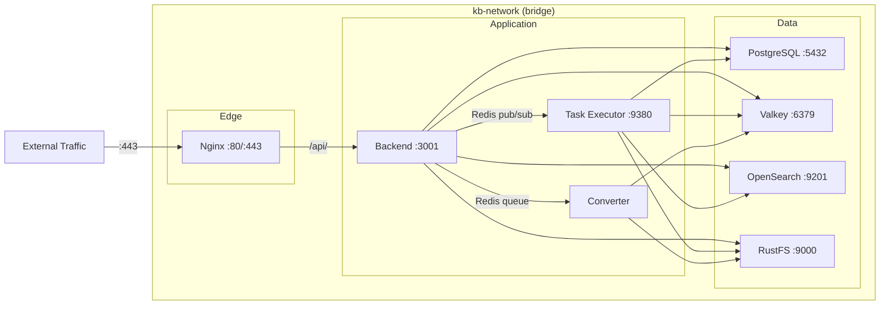
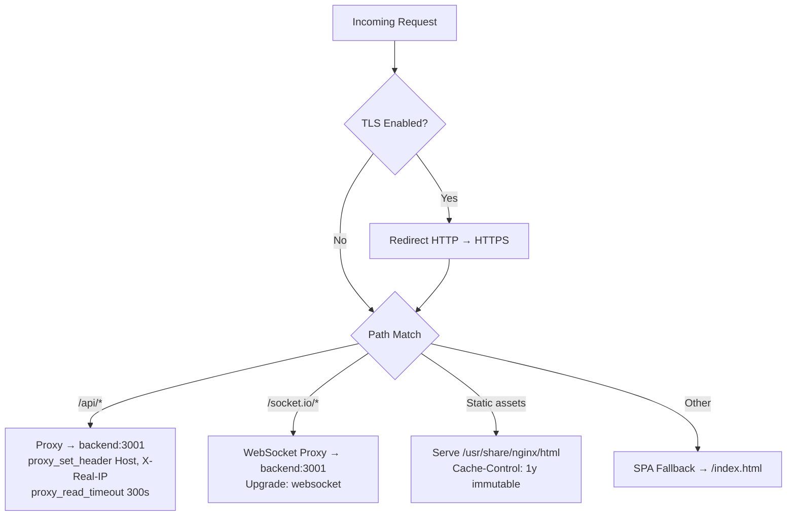
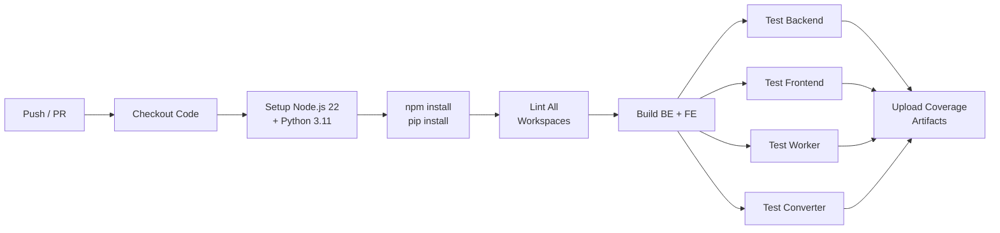

# Infrastructure & Deployment

## Docker Compose Topology

B-Knowledge uses layered Compose files for flexible deployment:

| File | Purpose | Services |
|------|---------|----------|
| `docker-compose-base.yml` | Infrastructure only | PostgreSQL, Valkey, OpenSearch, RustFS |
| `docker-compose.yml` | Application services | Backend, Task Executor, Converter, Nginx |
| `docker-compose-dev.yml` | Developer tools | pgAdmin, RedisInsight, OpenSearch Dashboards |
| `docker-compose-litellm.yml` | LLM proxy | LiteLLM gateway for multi-provider LLM routing |

```bash
# Development: infra only, run apps locally
docker compose -f docker-compose-base.yml up -d

# Production: full stack
docker compose -f docker-compose-base.yml -f docker-compose.yml up -d
```

## Service Inventory

| Service | Image | Port(s) | Purpose | Depends On |
|---------|-------|---------|---------|------------|
| `postgres` | `postgres:17-alpine` | 5432 | Primary relational database | -- |
| `valkey` | `valkey/valkey:8-alpine` | 6379 | Sessions, cache, queues, pub/sub | -- |
| `opensearch` | `opensearchproject/opensearch:3.5.0` | 9201 | Vector + full-text search | -- |
| `rustfs` | `rustfs/rustfs:latest` | 9000 (API), 9001 (Console) | S3-compatible object storage | -- |
| `backend` | Custom (Node.js 22) | 3001 | Express API server | postgres, valkey, opensearch, rustfs |
| `task-executor` | Custom (Python 3.11) | 9380 | RAG pipeline worker | postgres, valkey, opensearch, rustfs |
| `converter` | Custom (Python 3) | -- | Office-to-PDF via LibreOffice | valkey, rustfs |
| `nginx` | `nginx:alpine` | 80, 443 | Reverse proxy, TLS, static files | backend |

## Network Diagram



All services share the `kb-network` bridge network. Only Nginx exposes ports to the host.

## Volume Mappings

| Volume | Mount Point | Purpose |
|--------|-------------|---------|
| `postgres_data` | `/var/lib/postgresql/data` | Database persistence |
| `valkey_data` | `/data` | Cache/session persistence |
| `opensearch_data` | `/usr/share/opensearch/data` | Search index persistence |
| `rustfs_data` | `/data` | Object storage persistence |
| `app_logs` | `/app/logs` | Application log files |
| `./docker/config` | `/app/config` (read-only) | JSON configs mounted into backend |
| `./certs` | `/etc/nginx/certs` (read-only) | TLS certificates for Nginx |

## Nginx Configuration Overview



Key Nginx behaviors:
- Reverse proxy `/api/` to `backend:3001` with standard proxy headers
- WebSocket upgrade for `/socket.io/` connections
- Static asset serving with long-lived cache headers
- SPA fallback: all non-API, non-asset routes serve `index.html`
- `X-Frame-Options` relaxed for embed widget support

## CI/CD Pipeline



Pipeline stages (GitHub Actions):
1. **Checkout** -- clone repo with submodules
2. **Setup** -- Node.js 22, Python 3.11, npm/pip caches
3. **Install** -- `npm install` + Python dependencies
4. **Lint** -- ESLint (BE/FE), Ruff/Flake8 (Python)
5. **Build** -- `npm run build` for TypeScript compilation, Vite production build
6. **Test** -- parallel test jobs for each workspace
7. **Artifacts** -- coverage reports uploaded per workspace

## Health Check Pattern

All services implement health checks for Docker orchestration:

| Service | Endpoint / Command | Interval | Retries |
|---------|-------------------|----------|---------|
| PostgreSQL | `pg_isready -U postgres` | 10s | 5 |
| Valkey | `valkey-cli ping` | 10s | 5 |
| OpenSearch | `curl localhost:9201/_cluster/health` | 30s | 10 |
| RustFS | `curl localhost:9000/minio/health/live` | 15s | 5 |
| Backend | `GET /health` | 15s | 3 |
| Task Executor | `GET /health` | 15s | 3 |

The dev scripts (`npm run dev:worker`, `npm run dev:converter`) poll the backend health endpoint before starting, ensuring infrastructure is ready.
