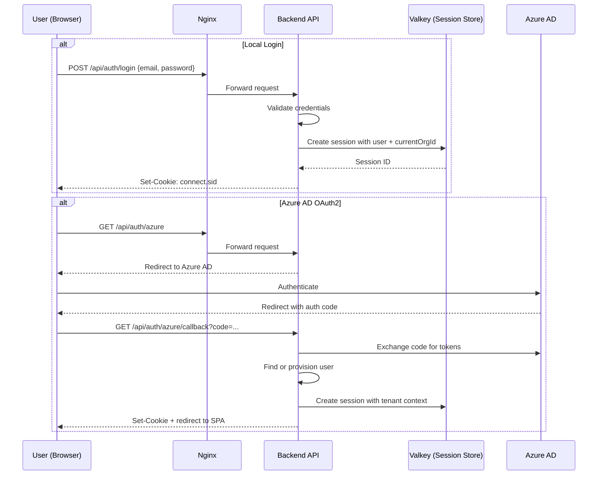
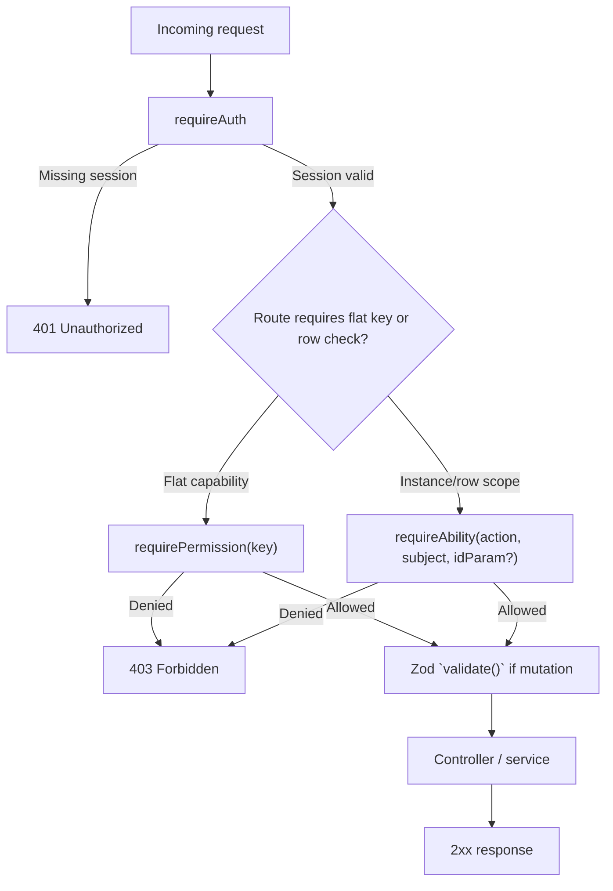

# Security Architecture

> Current authentication and authorization architecture for the registry-backed permission system.

## 1. Overview

B-Knowledge uses session-based authentication and a registry-backed authorization model. Authentication establishes the user and active tenant. Authorization is then enforced through a permission catalog synchronized from backend code into database tables, a CASL ability builder that composes role defaults, user overrides, and resource grants, and route middleware that distinguishes flat permission checks from row-scoped ability checks.

The current source-of-truth chain is:

1. Backend permission definitions in module `*.permissions.ts` files
2. Boot-time sync into the `permissions` catalog table
3. Tenant-scoped role and override tables (`role_permissions`, `user_permission_overrides`)
4. Row-scoped grant table (`resource_grants`)
5. Ability construction in [`be/src/shared/services/ability.service.ts`](/mnt/d/Project/b-solution/b-knowledge/be/src/shared/services/ability.service.ts)
6. Route enforcement via [`requirePermission`](/mnt/d/Project/b-solution/b-knowledge/be/src/shared/middleware/auth.middleware.ts) and [`requireAbility`](/mnt/d/Project/b-solution/b-knowledge/be/src/shared/middleware/auth.middleware.ts)
7. Frontend consumers via [`/api/auth/abilities`](/mnt/d/Project/b-solution/b-knowledge/be/src/modules/auth) and [`/api/permissions/catalog`](/mnt/d/Project/b-solution/b-knowledge/be/src/modules/permissions/routes/permissions.routes.ts)

`rbac.ts` remains in the codebase as a compatibility shim and helper surface. It is not the canonical permission definition layer.

## 2. Authentication Flow



## 3. Authorization Architecture

### 3.1 Registry-to-runtime pipeline

```mermaid
flowchart TD
    registry["Module permission definitions<br/>`*.permissions.ts`"] --> sync["Boot sync<br/>`syncPermissionsCatalog()`"]
    sync --> permissions["`permissions` catalog"]
    permissions --> rolePerms["`role_permissions`"]
    permissions --> overrides["`user_permission_overrides`"]
    permissions --> grants["`resource_grants`"]
    rolePerms --> ability["`buildAbilityFor()`"]
    overrides --> ability
    grants --> ability
    ability --> permMW["`requirePermission(key)`"]
    ability --> abilityMW["`requireAbility(action, subject, idParam?)`"]
    ability --> authAbilities["GET `/api/auth/abilities`"]
    permissions --> catalog["GET `/api/permissions/catalog`"]
    authAbilities --> feAbility["FE CASL provider / `<Can>`"]
    catalog --> feCatalog["FE PermissionCatalogProvider / `useHasPermission()`"]
```

### 3.2 Permission catalog and role model

The active tenant role set is:

| Role | Scope |
|------|-------|
| `super-admin` | Platform-wide unrestricted access |
| `admin` | Full tenant administration |
| `leader` | Tenant operator with narrower management scope |
| `user` | Baseline end-user access |

The live permission model is no longer a static route-to-role map. Instead:

- Backend features declare permissions with keys such as `permissions.view` or `knowledge_base.create`
- Startup runs `syncPermissionsCatalog()` to upsert the current registry into `permissions`
- `role_permissions` grants catalog keys to roles per tenant
- `user_permission_overrides` applies allow or deny exceptions for individual users
- `resource_grants` adds row-scoped access for `KnowledgeBase` and `DocumentCategory`

### 3.3 Ability construction

[`ability.service.ts`](/mnt/d/Project/b-solution/b-knowledge/be/src/shared/services/ability.service.ts) builds a tenant-scoped CASL ability using this order:

1. Super-admin shortcut
2. Role-default rules from `role_permissions`
3. Row-scoped resource grants from `resource_grants`
4. Knowledge-base to `DocumentCategory` read cascade where applicable
5. User-level allow overrides
6. ABAC policy overlay compatibility
7. User-level deny overrides last so deny wins

This keeps authorization data-driven while still supporting row-scoped checks for KB and category resources.

## 4. Enforcement Path

### 4.1 Middleware pipeline



### 4.2 `requirePermission` vs `requireAbility`

| Middleware | Use when | Input | Decision shape |
|------------|----------|-------|----------------|
| `requirePermission` | The route depends on a catalog key such as `permissions.manage` or `users.view` | Permission key | Resolves key to `(action, subject)` via the catalog and performs a class-level CASL check |
| `requireAbility` | The route must evaluate a specific resource instance | CASL action, subject, and optional route param id | Performs a row-scoped CASL check against an instance-shaped subject payload |

This distinction is important:

- `requirePermission` answers “does this user hold this feature capability in the current tenant?”
- `requireAbility` answers “can this user perform this action on this specific record?”

The permissions module uses `requirePermission` for catalog/administration APIs. Resource-facing modules use `requireAbility` when ownership, tenant scoping, or grant-derived access must be evaluated against a concrete id.

## 5. Frontend Security Consumers

The frontend consumes two backend contracts:

| Contract | Consumer | Purpose |
|----------|----------|---------|
| `GET /api/auth/abilities` | FE CASL provider in `fe/src/lib/ability.tsx` | Supplies serialized CASL rules for `<Can>` and row-scoped UI gating |
| `GET /api/permissions/catalog` | `PermissionCatalogProvider` in `fe/src/lib/permissions.tsx` | Hydrates key → `(action, subject)` mapping for `useHasPermission()` |

Frontend guidance:

- Use `useHasPermission(PERMISSION_KEYS.X)` for flat capability checks driven by a catalog key
- Use `<Can I="read" a="KnowledgeBase">` or the equivalent app ability hook for subject-aware checks
- Do not implement new UI gates by comparing role strings

## 6. Security Controls Around Authorization

### 6.1 Headers and transport

Helmet, CORS, secure cookies, and Nginx remain the outer security envelope:

| Control | Purpose |
|---------|---------|
| Helmet headers | Browser hardening and content policy defaults |
| `httpOnly` session cookie | Prevents client-side script access to session identifier |
| `sameSite=lax` | Reduces CSRF exposure for session cookie flows |
| Restricted CORS origins | Limits credentialed cross-origin access |
| Rate limiting | Protects general API and auth endpoints from abuse |

### 6.2 Validation and auditing

- Mutating routes use Zod-backed `validate()` middleware before controller execution
- Permission-denied mutations can emit audit records from authorization middleware
- Permission and grant admin mutations are also expected to be observable through audit logging and effective-access tooling

## 7. Compatibility Notes

- `rbac.ts` should be read as compatibility and helper infrastructure, not as the place to add or remove permissions
- Older route-role narratives are obsolete; current authorization depends on the catalog and ability engine
- Legacy ABAC concepts may still appear in selected code paths, but the active permission data model is `permissions` + `role_permissions` + `user_permission_overrides` + `resource_grants`

## 8. Related Docs

- [API Design Overview](/basic-design/component/api-design-overview)
- [API Endpoint Reference](/basic-design/component/api-design-endpoints)
- [Database Design: Core Tables](/basic-design/database/database-design-core)
- [Database Design: RAG Tables](/basic-design/database/database-design-rag)
