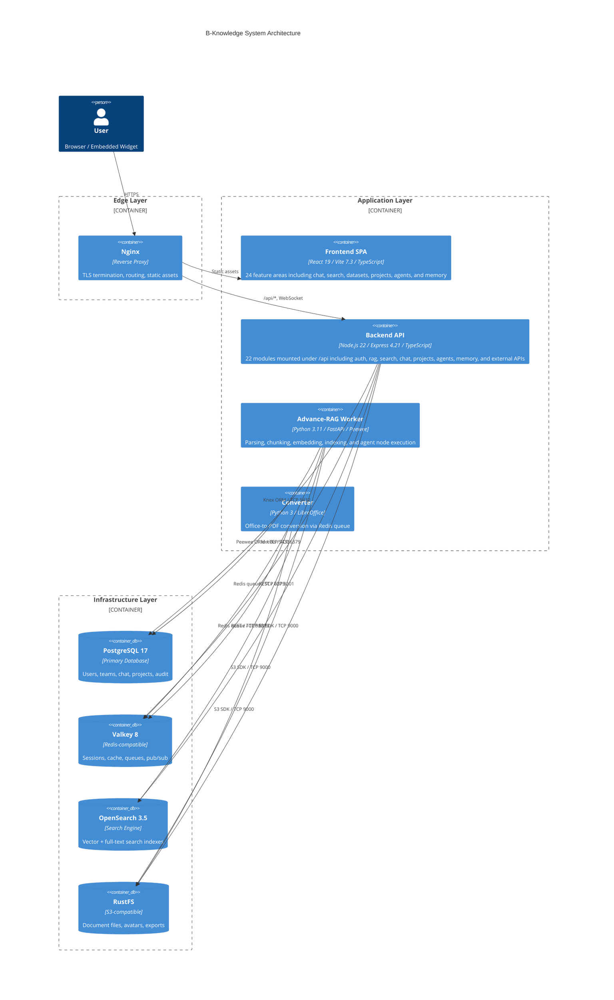
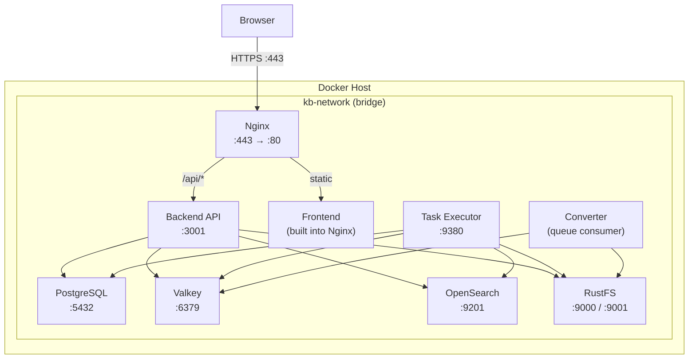

# System Architecture

> Source-aligned container view of the current monorepo as of 2026-03-25.

## C4 Container Diagram

## Service Communication Patterns

| Pattern | Usage | Direction |
|---------|-------|-----------|
| REST (HTTP/JSON) | Frontend to Backend API, Backend to OpenSearch and external services | Synchronous request/response |
| SSE | LLM token streaming to browser | Server to Client |
| Redis Pub/Sub | Backend to Task Executor coordination | Async event broadcast |
| Redis Queue / Streams | Document conversion jobs, RAG tasks, agent dispatch | Async job processing |
| S3 Protocol | File upload/download to RustFS | Direct from BE, Worker, Converter |

## Tech Stack Rationale

| Technology | Choice | Rationale |
|------------|--------|-----------|
| Node.js 22 / Express | Backend API | Non-blocking I/O for concurrent chat/search; mature middleware ecosystem |
| React 19 / Vite 7.3 | Frontend SPA | React Compiler eliminates manual memoization; Vite for fast HMR |
| TanStack Query 5 | Server state | Automatic cache invalidation, optimistic updates, dedup requests |
| Tailwind 3.4 / shadcn/ui | UI layer | Utility-first CSS with accessible, composable components |
| Python 3.11 / FastAPI | RAG Worker | Rich ML/NLP ecosystem; FastAPI async for embedding pipelines |
| PostgreSQL 17 | Primary DB | JSONB for flexible configs; robust ACID; mature extension ecosystem |
| Valkey 8 | Cache/Queue | Redis-compatible; sessions, rate limiting, pub/sub, job queues |
| OpenSearch 3.5 | Search engine | Vector search (k-NN) + BM25 full-text in one engine |
| RustFS | Object storage | S3-compatible; lightweight self-hosted alternative to MinIO |
| Knex | DB migrations/ORM | SQL query builder with migration lifecycle management |
| Peewee | Python ORM | Lightweight ORM for worker read/write; schema owned by Knex |
| Docker Compose | Orchestration | Single-command dev/prod deployment; service isolation |

## Deployment Diagram

## Key Architectural Decisions

1. **Monorepo with npm workspaces** -- shared tooling and coordinated BE/FE/Python changes.
2. **NX-style module boundaries** -- feature domains are isolated by module and barrel export.
3. **Session auth plus scoped public tokens** -- browser sessions for internal UX, token-based access for public chat/search/agent embeds, and API keys for external APIs.
4. **Node.js orchestration with Python workers** -- the API owns CRUD and orchestration, while Python handles ingestion-heavy and compute-heavy execution.
5. **OpenSearch-centered retrieval** -- the same search engine supports hybrid retrieval, SQL fallback, graph tasks, and memory search.
