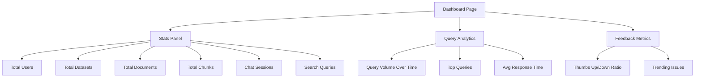
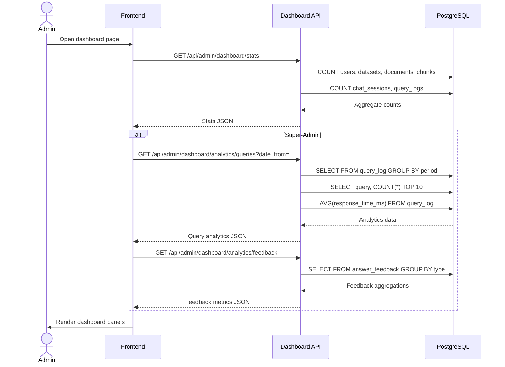

# Admin Dashboard & Analytics Detail Design

## Overview

The Admin Dashboard provides system-level statistics and analytics for monitoring B-Knowledge usage. Basic stats are available to admins and leaders; detailed query and feedback analytics require super-admin access.

## Component Architecture



## API Endpoints

### Stats (Admin / Leader)

| Method | Path | Description |
|--------|------|-------------|
| GET | `/api/admin/dashboard/stats` | Aggregate system statistics |

**Response:**

```json
{
  "users": 142,
  "datasets": 23,
  "documents": 1547,
  "chunks": 89432,
  "chatSessions": 3201,
  "searchQueries": 12044
}
```

### Query Analytics (Super-Admin Only)

| Method | Path | Description |
|--------|------|-------------|
| GET | `/api/admin/dashboard/analytics/queries` | Query volume and performance metrics |

**Query Parameters:** `date_from`, `date_to`, `granularity` (hour/day/week)

**Response:**

```json
{
  "volumeOverTime": [
    { "period": "2026-03-20", "count": 234 }
  ],
  "topQueries": [
    { "query": "deployment guide", "count": 45 }
  ],
  "avgResponseTimeMs": 1230
}
```

### Feedback Analytics (Super-Admin Only)

| Method | Path | Description |
|--------|------|-------------|
| GET | `/api/admin/dashboard/analytics/feedback` | User feedback aggregations |

**Response:**

```json
{
  "thumbsUp": 892,
  "thumbsDown": 67,
  "ratio": 0.93,
  "trendingIssues": [
    { "topic": "outdated content", "count": 12 }
  ]
}
```

## Data Flow



## Role Restrictions

| Endpoint | Required Role |
|----------|--------------|
| `/api/admin/dashboard/stats` | admin, leader |
| `/api/admin/dashboard/analytics/queries` | super-admin |
| `/api/admin/dashboard/analytics/feedback` | super-admin |

Non-authorized users receive `403 Forbidden`.

## Data Sources

| Metric | Source Table | Aggregation |
|--------|-------------|-------------|
| Users | `users` | COUNT |
| Datasets | `knowledgebase` | COUNT |
| Documents | `document` | COUNT |
| Chunks | `document_chunk` | COUNT |
| Chat Sessions | `chat_session` | COUNT |
| Search Queries | `query_log` | COUNT |
| Response Time | `query_log.response_time_ms` | AVG |
| Feedback | `answer_feedback` | COUNT by type |

## Key Files

| File | Purpose |
|------|---------|
| `be/src/modules/dashboard/` | Module root |
| `be/src/modules/dashboard/dashboard.controller.ts` | Route handlers |
| `be/src/modules/dashboard/dashboard.service.ts` | Aggregation queries |
| `fe/src/features/dashboard/` | Frontend feature |
