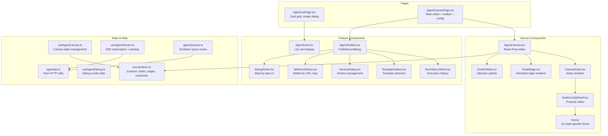
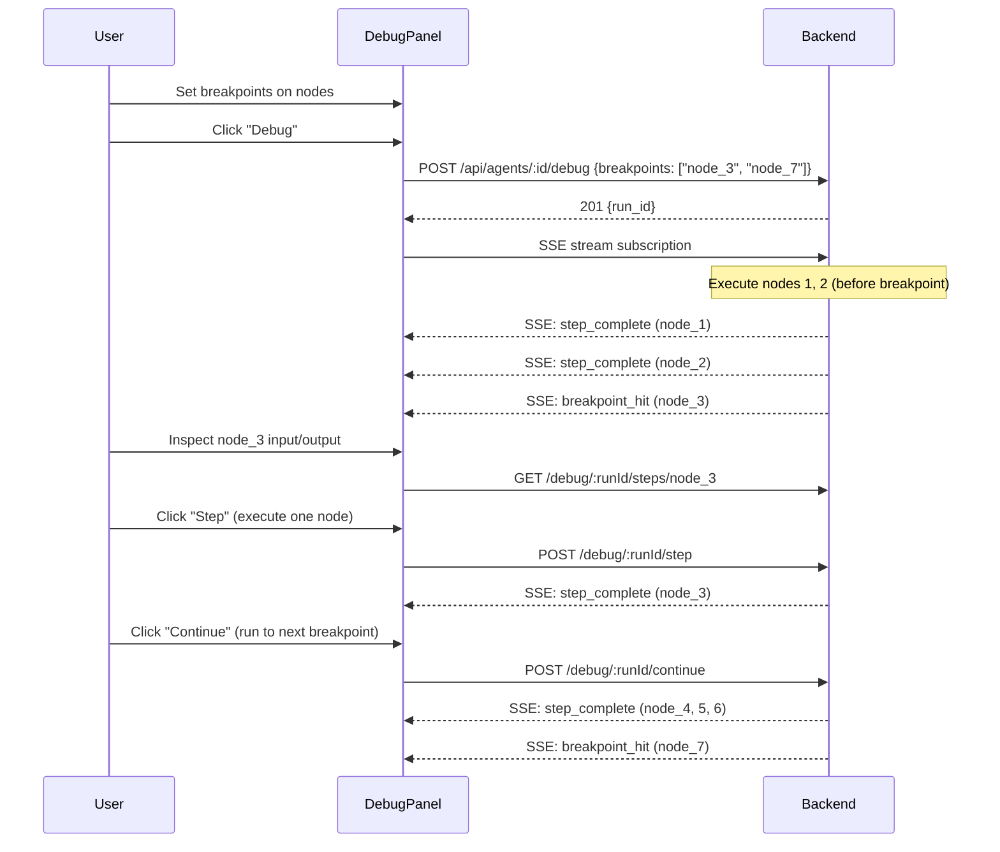

# Agent Canvas Editor & Frontend: Detail Design

## Overview

The Agent canvas editor is a React Flow-based infinite canvas that allows users to visually design AI workflows by dragging, connecting, and configuring operator nodes. The frontend manages canvas state via Zustand, communicates with the backend via TanStack Query hooks, and streams execution results via SSE.

## Frontend Architecture



## Module Structure

```
fe/src/features/agents/
├── api/
│   ├── agentApi.ts               — Raw HTTP calls (no hooks)
│   └── agentQueries.ts           — TanStack Query useQuery/useMutation
├── components/
│   ├── AgentCanvas.tsx           — Main React Flow editor
│   ├── AgentCard.tsx             — Card component for list grid
│   ├── AgentToolbar.tsx          — Publish, run, debug controls
│   ├── RunHistorySheet.tsx       — Execution history sidebar
│   ├── TemplateGallery.tsx       — Template selection dialog
│   ├── VersionDialog.tsx         — Version management UI
│   ├── WebhookSheet.tsx          — Webhook URL copy
│   ├── canvas/
│   │   ├── CanvasNode.tsx        — Node renderer (category color, icon)
│   │   ├── NodeConfigPanel.tsx   — Property editor (side panel)
│   │   ├── NodePalette.tsx       — Categorized operator palette (drag source)
│   │   ├── edges/
│   │   │   └── SmartEdge.tsx     — Animated edge with conditional routing
│   │   └── forms/                — 24 node-specific config forms
│   │       ├── GenerateForm.tsx
│   │       ├── RetrievalForm.tsx
│   │       ├── CodeForm.tsx
│   │       ├── SwitchForm.tsx
│   │       ├── ConditionForm.tsx
│   │       ├── LoopForm.tsx
│   │       ├── ApiForm.tsx
│   │       ├── MemoryForm.tsx    — memory_read / memory_write config
│   │       └── ... (24 forms total)
│   └── debug/
│       └── DebugPanel.tsx        — Breakpoint management, step controls
├── hooks/
│   ├── useAgentCanvas.ts         — Canvas state bridge to Zustand
│   ├── useAgentStream.ts         — SSE subscription + event parsing
│   └── useAgentDebug.ts          — Debug mode state (breakpoints, step)
├── pages/
│   ├── AgentListPage.tsx         — Agent list/search/create/empty state
│   └── AgentCanvasPage.tsx       — Main editor with toolbar + canvas + config
├── store/
│   └── canvasStore.ts            — Zustand: nodes, edges, history (undo/redo)
├── types/
│   └── agent.types.ts            — 55 OperatorType definitions + interfaces
└── index.ts                      — Barrel export
```

## Operator Type System

### All 55 Operators

```typescript
type OperatorType =
  // Input/Output (4)
  | 'begin' | 'answer' | 'message' | 'fillup'
  // LLM/AI (5)
  | 'generate' | 'categorize' | 'rewrite' | 'relevant' | 'agent_with_tools'
  // Retrieval (5)
  | 'retrieval' | 'wikipedia' | 'tavily' | 'pubmed' | 'memory_read'
  // Logic Flow (10)
  | 'switch' | 'condition' | 'loop' | 'loop_item'
  | 'iteration' | 'iteration_item' | 'exit_loop'
  | 'merge' | 'note' | 'concentrator'
  // Code/Tool (6)
  | 'code' | 'github' | 'sql' | 'api' | 'email' | 'invoke'
  // Data (25)
  | 'template' | 'keyword_extract'
  | 'baidu' | 'bing' | 'duckduckgo' | 'google'
  | 'google_scholar' | 'arxiv' | 'deepl' | 'qweather'
  | 'exesql' | 'crawler'
  | 'akshare' | 'yahoofinance' | 'jin10' | 'tushare' | 'wencai'
  | 'variable_assigner' | 'variable_aggregator'
  | 'data_operations' | 'list_operations' | 'string_transform'
  | 'docs_generator' | 'excel_processor'
  | 'memory_write'
```

### Category Colors (Light / Dark Theme)

| Category | Color (Light) | Color (Dark) | Count |
|----------|:---:|:---:|:---:|
| **Input/Output** | `#3b82f6` (Blue) | `#60a5fa` | 4 |
| **LLM/AI** | `#8b5cf6` (Purple) | `#a78bfa` | 5 |
| **Retrieval** | `#10b981` (Green) | `#34d399` | 5 |
| **Logic Flow** | `#f59e0b` (Amber) | `#fbbf24` | 10 |
| **Code/Tool** | `#ec4899` (Pink) | `#f472b6` | 6 |
| **Data** | `#06b6d4` (Cyan) | `#22d3ee` | 25 |

### Category Assignment (Notable)

| Operator | Category | Notes |
|----------|----------|-------|
| `fillup` | input-output | Form input (not data) |
| `memory_read` | retrieval | Read from memory pool |
| `memory_write` | data | Write to memory pool |
| `concentrator` | logic-flow | Merge point (not data) |
| `invoke` | code-tool | Call external workflow |

## DSL Schema (JSONB)

The workflow graph is stored as a JSONB column in the `agents` table:

```typescript
interface AgentDSL {
  nodes: Record<string, AgentNodeDef>
  edges: AgentEdgeDef[]
  variables: Record<string, AgentVariable>
  settings: {
    mode: 'agent' | 'pipeline'
    max_execution_time: number      // Seconds (default 300)
    retry_on_failure: boolean
  }
}

interface AgentNodeDef {
  id: string
  type: OperatorType                // One of 55 types
  position: { x: number; y: number }
  config: Record<string, unknown>   // Node-specific configuration
  label: string
}

interface AgentEdgeDef {
  source: string
  target: string
  sourceHandle?: string             // For switch branching
  condition?: string                // For conditional routing
}

interface AgentVariable {
  name: string
  type: 'string' | 'number' | 'boolean' | 'json'
  default_value?: string
}
```

## Canvas State Management (Zustand)

The `canvasStore` manages all canvas UI state using Zustand:

```typescript
// Core canvas state
const useCanvasStore = create<CanvasState>((set, get) => ({
  // React Flow data
  nodes: [],
  edges: [],
  onNodesChange: (changes) => { /* apply changes, push to history */ },
  onEdgesChange: (changes) => { /* apply changes, push to history */ },
  onConnect: (connection) => { /* add edge */ },

  // Selection
  selectedNodeId: null,
  selectNode: (id) => set({ selectedNodeId: id }),

  // Undo/Redo
  history: [],
  historyIndex: -1,
  undo: () => { /* restore previous state */ },
  redo: () => { /* restore next state */ },
}))
```

## TanStack Query Hooks

### Read Hooks

| Hook | Query Key | Purpose |
|------|-----------|---------|
| `useAgents(filters)` | `['agents', filters]` | Paginated agent list |
| `useAgent(id)` | `['agents', id]` | Single agent detail |
| `useAgentVersions(id)` | `['agents', id, 'versions']` | Version history |
| `useAgentRuns(agentId)` | `['agents', agentId, 'runs']` | Execution history |
| `useAgentTemplates()` | `['agent-templates']` | Template gallery |

### Mutation Hooks

| Hook | Invalidates | Purpose |
|------|------------|---------|
| `useCreateAgent()` | agents list | Create agent |
| `useUpdateAgent()` | agent detail + list | Update agent DSL/metadata |
| `useDeleteAgent()` | agents list | Delete agent |
| `useDuplicateAgent()` | agents list | Clone agent |
| `useSaveVersion()` | versions list | Save version snapshot |
| `useRestoreVersion()` | agent detail + versions | Restore from version |

## SSE Streaming Hook

`useAgentStream(runId, agentId)` manages the SSE connection lifecycle:

```typescript
const {
  isLoading,    // SSE connection active
  steps,        // AgentRunStep[] — accumulated step results
  output,       // Final run output string
  error,        // Error message if run failed
  status,       // Run status: pending | running | completed | failed | cancelled
} = useAgentStream(runId, agentId)
```

Internally:
1. Opens `EventSource` to `GET /api/agents/:id/run/:runId/stream`
2. Parses SSE events: `step_start`, `step_complete`, `step_error`, `done`, `error`
3. Accumulates step results into `steps` array
4. Updates `status` and `output` on completion
5. Closes EventSource on unmount or completion

## Debug Mode

### Debug Hook

```typescript
const {
  breakpoints,      // Set<string> — node IDs with breakpoints
  setBreakpoint,    // (nodeId) => void
  removeBreakpoint, // (nodeId) => void
  stepNext,         // () => Promise<void> — execute next node
  continueDebug,    // () => Promise<void> — run to next breakpoint
} = useAgentDebug(runId)
```

### Debug Flow



## Memory Node Forms

The `MemoryForm.tsx` component handles both `memory_read` and `memory_write` operator configurations:

### memory_read Configuration

| Field | Type | Default | Description |
|-------|------|---------|-------------|
| Memory Pool | Select (pool UUID) | — | Which memory pool to search |
| Top-K | Number (1-20) | 5 | Number of results to return |
| Vector Weight | Slider (0-1) | 0.7 | Weight for vector vs text search |

### memory_write Configuration

| Field | Type | Default | Description |
|-------|------|---------|-------------|
| Memory Pool | Select (pool UUID) | — | Which memory pool to write to |
| Message Type | Dropdown (1,2,4,8) | 1 (RAW) | Memory type bitmask value |

## Zod Validation Schemas

### Agent CRUD Schemas

| Schema | Fields | Constraints |
|--------|--------|-------------|
| `createAgentSchema` | name, description, mode, project_id, template_id | name: 1-255 chars, description: 0-2000, mode: agent\|pipeline |
| `updateAgentSchema` | All fields optional, plus dsl, status | status: draft\|published |
| `listAgentsQuerySchema` | mode, status, project_id, page, page_size, search | page_size: 1-100 (default 20) |

### Execution Schemas

| Schema | Fields | Constraints |
|--------|--------|-------------|
| `agentRunBodySchema` | input | 1-50,000 chars |
| `saveVersionSchema` | version_label, change_summary | label: 0-128, summary: 0-1000 |

### Credential Schemas

| Schema | Fields | Constraints |
|--------|--------|-------------|
| `createCredentialSchema` | tool_type, name, credentials, agent_id | tool_type: 1-100, name: 1-255, credentials: Record<string,string> |
| `updateCredentialSchema` | name, credentials | All optional |

## Key Files

| File | Purpose |
|------|---------|
| `fe/src/features/agents/components/AgentCanvas.tsx` | Main React Flow editor |
| `fe/src/features/agents/store/canvasStore.ts` | Zustand state (nodes, edges, undo/redo) |
| `fe/src/features/agents/hooks/useAgentStream.ts` | SSE subscription + event parsing |
| `fe/src/features/agents/types/agent.types.ts` | 55 operator types + entity interfaces |
| `fe/src/features/agents/api/agentQueries.ts` | TanStack Query hooks |
| `be/src/modules/agents/schemas/agent.schemas.ts` | Zod validation schemas |
