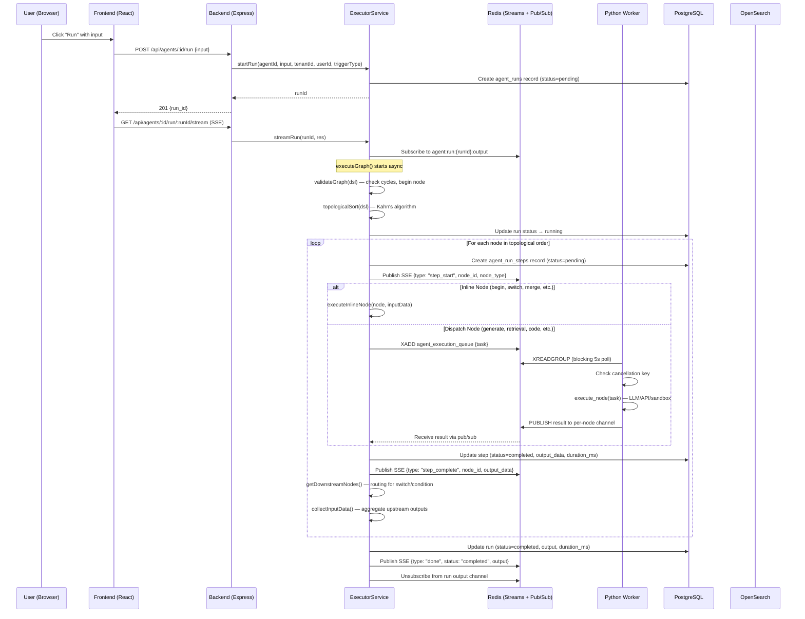
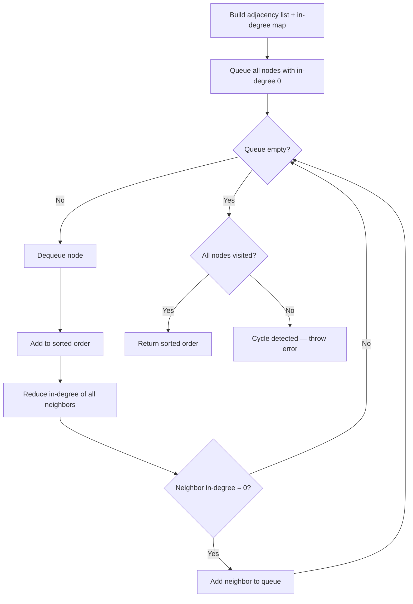
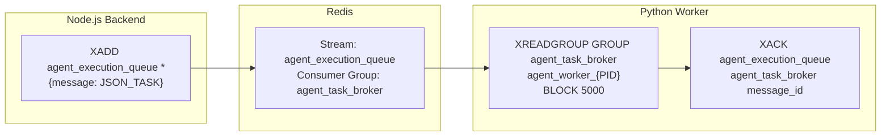
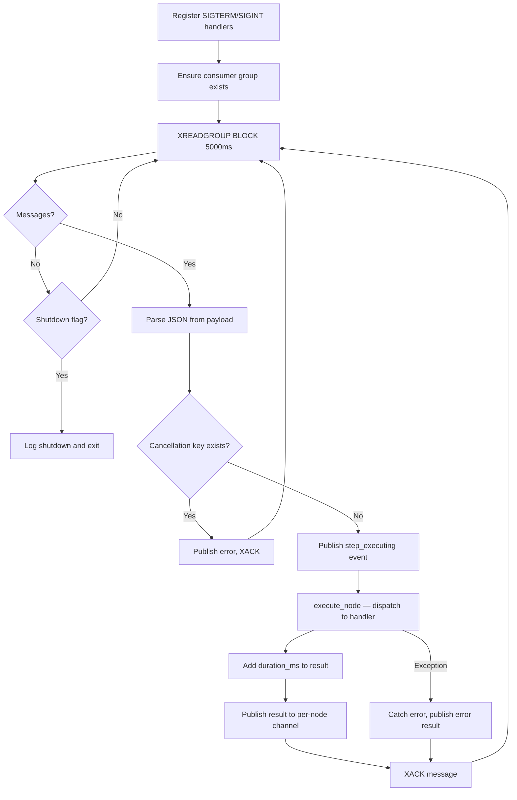

# Agent Execution Engine: Detail Design

## Overview

The execution engine is the core of the Agent system, responsible for graph orchestration, node dispatch, and real-time streaming. It implements Kahn's topological sort for correct dependency ordering and classifies nodes into inline (Node.js) and dispatch (Python worker) execution paths.

## Execution Architecture

### Full Execution Sequence



## ExecutorService API

### Public Methods

| Method | Signature | Returns | Purpose |
|--------|-----------|---------|---------|
| `startRun` | `(agentId, input, tenantId, userId, triggerType)` | `Promise<string>` (runId) | Create run record, initiate async execution |
| `streamRun` | `(runId, res)` | `Promise<void>` | SSE subscription for real-time updates |
| `cancelRun` | `(runId, tenantId)` | `Promise<void>` | Cancel in-progress run via Redis signal |
| `getRunStatus` | `(runId)` | `Promise<AgentRunStatusResult>` | Snapshot of run progress |

### Private Methods

| Method | Signature | Purpose |
|--------|-----------|---------|
| `executeGraph` | `(runId, dsl, tenantId, agentId, input)` | Main execution loop using Kahn's algorithm |
| `executeNode` | `(node, inputData, runId, stepId, tenantId, agentId)` | Dispatch to Python or execute inline |
| `executeInlineNode` | `(node, inputData)` | Lightweight logic in Node.js |
| `waitForNodeResult` | `(runId, nodeId, stepId)` | Wait for Python result via pub/sub |
| `collectInputData` | `(nodeId, edges, nodeOutputs, userInput, node)` | Aggregate upstream outputs for node |
| `getDownstreamNodes` | `(nodeId, node, result, edges, adjList)` | Determine routing after switch/condition |
| `validateGraph` | `(dsl)` | Check cycles, begin node exists |
| `topologicalSort` | `(dsl)` | Kahn's algorithm for execution order |

## Graph Validation

Before execution begins, `validateGraph()` performs structural checks:

1. **Begin node required**: DSL must contain exactly one `begin` node
2. **Cycle detection**: Topological sort must succeed (cyclic graphs fail)
3. **Edge integrity**: All edge source/target must reference existing nodes
4. **DSL version**: Must match expected schema version

Validation errors return HTTP 400 before any run record is created.

## Kahn's Topological Sort



The algorithm handles:
- **Standard DAG execution**: Nodes execute when all dependencies are resolved
- **Loop-back edges**: Special handling for `loop`/`iteration` nodes that create back-edges
- **Switch/condition branches**: `getDownstreamNodes()` determines which branch to follow based on node output

## Node Classification

### Inline Nodes (Node.js)

```typescript
const INLINE_NODE_TYPES = new Set([
  'begin', 'answer', 'message', 'switch', 'condition',
  'merge', 'note', 'concentrator', 'template', 'keyword_extract',
])
```

These nodes execute synchronously in the Node.js event loop. They perform pure logic with no external I/O:

| Node | Execution Logic |
|------|----------------|
| `begin` | Pass through user input as `{ output: userInput }` |
| `answer` | Collect final output from `inputData.content \|\| inputData.output` |
| `message` | Return static message from `node.config.content` |
| `switch` | Evaluate conditions (contains, equals, startsWith) and return matched branch |
| `condition` | Boolean evaluation, return `condition_result` |
| `merge` / `concentrator` | Pass-through merge, set `merged: true` |
| `template` | Interpolate `{{variable}}` syntax using upstream data |
| `keyword_extract` | Pass-through (actual extraction happens in Python) |
| `note` | No-op, passes data through |

### Dispatch Nodes (Python Worker)

```typescript
const DISPATCH_NODE_TYPES = new Set([
  'generate', 'categorize', 'rewrite', 'relevant',
  'retrieval', 'wikipedia', 'tavily', 'pubmed',
  'code', 'github', 'sql', 'api', 'email',
  'baidu', 'bing', 'duckduckgo', 'google',
  'google_scholar', 'arxiv', 'deepl', 'qweather',
  'exesql', 'crawler', 'invoke', 'akshare',
  'yahoofinance', 'jin10', 'tushare', 'wencai', 'loop',
])
```

These nodes are queued to the Python worker via Redis Streams for execution that requires LLM calls, network access, or sandbox isolation.

## Redis Communication Protocol

### Stream-Based Task Queue



### Queue Constants (Must Match Across Languages)

| Constant | Value | Used By |
|----------|-------|---------|
| `AGENT_QUEUE_NAME` | `agent_execution_queue` | Node.js XADD, Python XREADGROUP |
| `AGENT_CONSUMER_GROUP` | `agent_task_broker` | Consumer group name |
| `AGENT_RESULT_PREFIX` | `agent:run:` | Prefix for result/output channels |

### Task Payload (AgentNodeTask)

```typescript
interface AgentNodeTask {
  id: string                           // Step UUID (used for tracking)
  run_id: string                       // Agent run UUID
  agent_id: string                     // Agent UUID
  node_id: string                      // Node identifier from DSL
  node_type: string                    // Operator type (dispatch key)
  input_data: Record<string, unknown>  // Upstream data from dependencies
  config: Record<string, unknown>      // Node configuration from DSL
  tenant_id: string                    // Multi-tenant isolation
  task_type: 'agent_node_execute'      // Fixed discriminator
}
```

### Pub/Sub Channels

| Channel Pattern | Direction | Purpose |
|----------------|-----------|---------|
| `agent:run:{runId}:node:{nodeId}:result` | Worker → Backend | Per-node execution result |
| `agent:run:{runId}:output` | Backend → SSE Client | Step status updates for streaming |
| `agent:run:{runId}:cancel` (Redis key) | Backend → Worker | Cancellation signal (1-hour TTL) |

### Redis Service Methods

| Method | Purpose |
|--------|---------|
| `ensureConsumerGroup()` | Create consumer group with MKSTREAM (idempotent) |
| `queueNodeExecution(task)` | XADD task to stream as `{message: JSON.stringify(task)}` |
| `subscribeToRunOutput(runId, callback)` | Create duplicate Redis client for pub/sub subscription |
| `unsubscribeFromRunOutput(runId)` | Cleanup subscriber client from `subscribers` map |
| `publishNodeResult(runId, nodeId, result)` | Publish result to per-node channel |
| `publishRunOutput(runId, data)` | Publish step events for SSE streaming |
| `publishCancelSignal(runId)` | `SET agent:run:{runId}:cancel x EX 3600` |

## Python Worker Consumer

### Consumer Architecture



### Worker Configuration

```python
AGENT_QUEUE = 'agent_execution_queue'
CONSUMER_GROUP = 'agent_task_broker'
CONSUMER_NAME = f'agent_worker_{os.getpid()}'  # Per-process identity
```

### Node Executor Dispatch Table

The Python worker maintains a registry of 25+ tool singletons instantiated at module load:

| Tool Singleton | Node Types Handled |
|---------------|-------------------|
| `_retrieval_tool` | retrieval |
| `_tavily_tool` | tavily |
| `_wikipedia_tool` | wikipedia |
| `_arxiv_tool` | arxiv |
| `_pubmed_tool` | pubmed |
| `_bing_tool` | bing |
| `_google_tool` | google |
| `_google_scholar_tool` | google_scholar |
| `_duckduckgo_tool` | duckduckgo |
| `_github_tool` | github |
| `_crawler_tool` | crawler |
| `_code_exec_tool` | code |
| `_email_tool` | email |
| `_exesql_tool` | exesql, sql |
| `_deepl_tool` | deepl |
| `_qweather_tool` | qweather |
| `_akshare_tool` | akshare |
| `_yahoofinance_tool` | yahoofinance |
| `_jin10_tool` | jin10 |
| `_tushare_tool` | tushare |
| `_wencai_tool` | wencai |
| `_searxng_tool` | (reserved) |
| `_google_maps_tool` | (reserved) |

LLM-based nodes (`generate`, `categorize`, `rewrite`, `relevant`) use `_get_chat_model(tenant_id, config)` to instantiate an `LLMBundle` for the tenant's configured model.

## Timeout Configuration

| Timeout | Default | Location | Purpose |
|---------|---------|----------|---------|
| Graph execution | 300s (5 min) | `dsl.settings.max_execution_time` | Total run timeout |
| Per-node execution | 300s (5 min) | `waitForNodeResult()` | Individual node timeout |
| MCP tool call | 30s | `DEFAULT_TOOL_TIMEOUT_MS` | External tool server call |
| Code sandbox | 30s | `DEFAULT_TIMEOUT_MS` | Sandboxed code execution |
| Consumer group poll | 5s | `XREADGROUP BLOCK 5000` | Worker idle polling interval |
| Cancellation key | 1 hour | `EX 3600` on Redis key | TTL for cancel signal |

## Active Run Tracking

The executor maintains an in-memory map of active runs for cancellation support:

```typescript
private activeRuns = new Map<string, {
  cancelled: boolean
  timeoutId?: ReturnType<typeof setTimeout>
}>()
```

- Each run creates an entry on `startRun()`
- The `cancelled` flag is checked before each node execution
- `cancelRun()` sets the flag and publishes the Redis cancel signal
- Entries are cleaned up when the run completes/fails/is cancelled

## SSE Event Protocol

Events streamed to the frontend via Server-Sent Events:

| Event Type | Payload | When |
|-----------|---------|------|
| `step_start` | `{node_id, node_type, execution_order}` | Before node execution begins |
| `step_complete` | `{node_id, node_type, output_data, duration_ms}` | After node completes successfully |
| `step_error` | `{node_id, node_type, error}` | Node execution failed |
| `done` | `{status: "completed", output}` | All nodes completed |
| `error` | `{status: "failed", error}` | Run-level failure |
| `breakpoint_hit` | `{node_id}` | Debug mode: breakpoint reached |

## Error Handling Strategy

| Error Type | Handling |
|-----------|---------|
| Node execution failure | Step marked `failed`; run continues if `retry_on_failure` enabled in DSL settings |
| Python worker crash | Redis Streams retain unACKed messages for redelivery on worker restart |
| LLM provider error | Retry with exponential backoff in Python worker |
| Timeout exceeded (graph) | Run marked `failed` with timeout error message |
| Timeout exceeded (node) | Step marked `failed`; run may continue to other branches |
| Cancel request | Redis cancel signal checked before each node; running nodes complete but further nodes skip |
| Invalid DSL | Validation at run start returns HTTP 400 before execution begins |
| Redis connection failure | Run marked `failed` with connection error |

## Key Files

| File | Lines | Purpose |
|------|-------|---------|
| `be/src/modules/agents/services/agent-executor.service.ts` | ~900 | Core graph orchestration engine |
| `be/src/modules/agents/services/agent-redis.service.ts` | ~200 | Redis Streams + pub/sub communication |
| `advance-rag/rag/agent/agent_consumer.py` | ~150 | Python worker task consumer |
| `advance-rag/rag/agent/node_executor.py` | ~2000 | Node dispatch table + tool execution |
