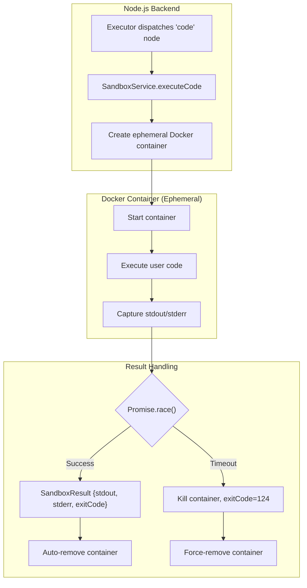
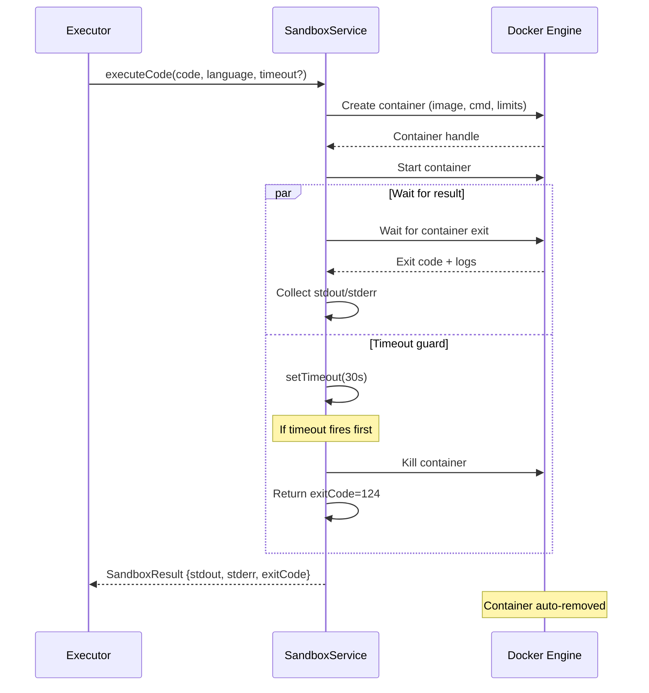
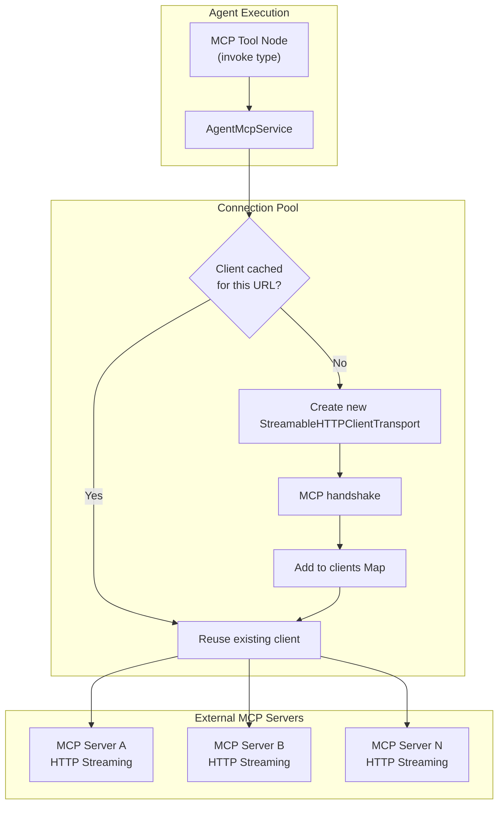
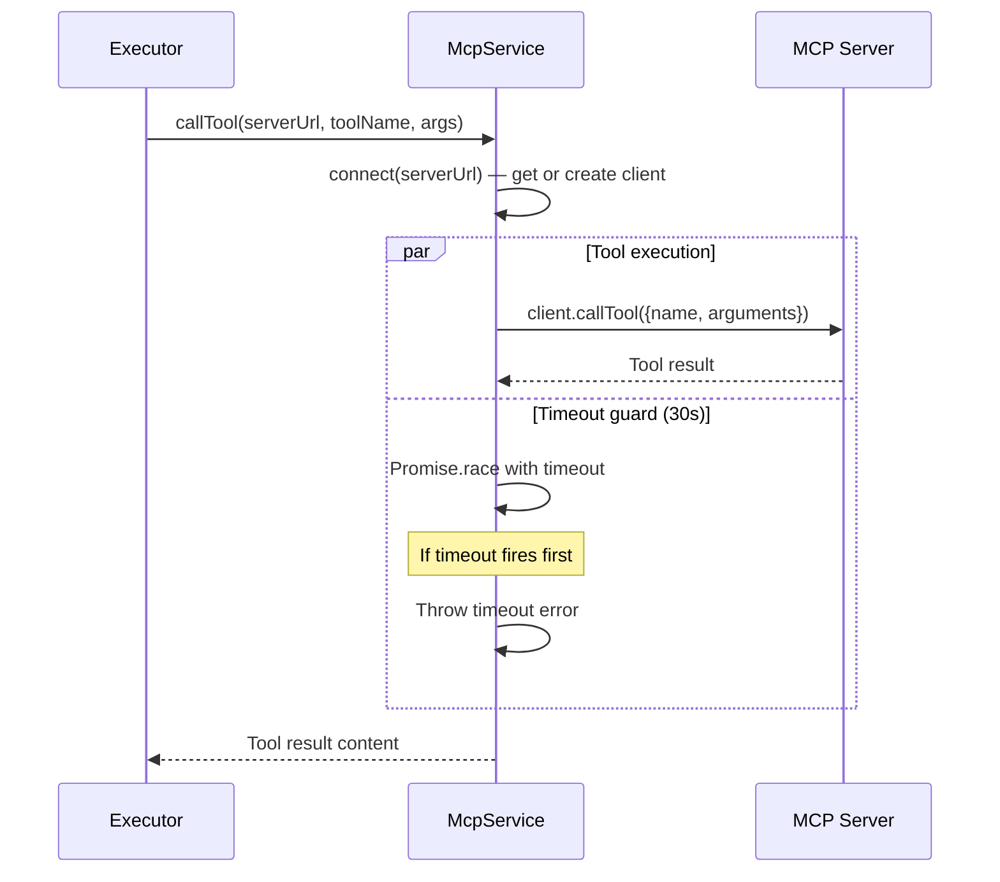

# Agent Sandbox & MCP Integration: Detail Design

## Overview

The Agent system supports two specialized execution environments: a Docker-based code sandbox for safe execution of user-provided code, and an MCP (Model Context Protocol) client for connecting to external tool servers. Both operate as backend services consumed by the agent execution engine.

## Code Sandbox

### Architecture



### Resource Limits

| Resource | Limit | Constant | Purpose |
|----------|-------|----------|---------|
| **Memory** | 256 MB | `MEMORY_LIMIT = 256 * 1024 * 1024` | Prevent memory exhaustion |
| **CPU** | 1 core | `CPU_LIMIT = 1e9` (NanoCPUs) | Prevent CPU monopolization |
| **Execution time** | 30 seconds | `DEFAULT_TIMEOUT_MS = 30_000` | Prevent infinite loops |
| **Temp filesystem** | 64 MB | `Tmpfs: {'/tmp': 'rw,noexec,nosuid,size=64m'}` | Writable scratch space |

### Security Constraints

Every sandbox container is created with strict isolation:

| Constraint | Value | Purpose |
|-----------|-------|---------|
| `NetworkMode` | `'none'` | No network access at Docker level |
| `NetworkDisabled` | `true` | Double-disabled at container level |
| `ReadonlyRootfs` | `true` | Read-only root filesystem |
| `AutoRemove` | `true` | Auto-cleanup on container exit |
| `Tmpfs /tmp` | `rw,noexec,nosuid,size=64m` | Writable temp (no exec, no suid) |

### Supported Languages

```typescript
const LANGUAGE_CONFIG = {
  python:     { image: 'python:3.11-slim',  cmd: ['python', '-c'] },
  javascript: { image: 'node:22-slim',      cmd: ['node', '-e'] },
  bash:       { image: 'ubuntu:24.04',      cmd: ['bash', '-c'] },
}

type SandboxLanguage = 'python' | 'javascript' | 'bash'
```

### Execution Flow



### SandboxResult Interface

```typescript
interface SandboxResult {
  stdout: string    // Standard output captured from container
  stderr: string    // Standard error captured from container
  exitCode: number  // 0=success, non-zero=error, 124=timeout
}
```

### Error Handling

| Scenario | Behavior |
|----------|----------|
| Code exits normally | Return stdout/stderr with exit code 0 |
| Code throws exception | Return stderr with non-zero exit code |
| Timeout exceeded | Kill container, return exit code 124 |
| Docker daemon unavailable | Throw error, step marked failed |
| Container creation fails | Throw error, step marked failed |
| Force-remove fails | Best-effort cleanup (logged, not thrown) |

## MCP Server Integration

### Architecture



### Connection Pool

```typescript
private clients = new Map<string, Client>()
```

MCP clients are cached by server URL. A single `Client` instance is reused for all tool calls to the same server, avoiding repeated handshakes.

### Client Metadata

```typescript
new Client({
  name: 'b-knowledge-agent',
  version: '1.0.0',
})
```

This identifies the B-Knowledge agent system when connecting to external MCP servers.

### Service Methods

| Method | Signature | Default Timeout | Purpose |
|--------|-----------|-----------------|---------|
| `connect` | `(serverUrl: string)` | — | Connect or retrieve cached MCP client |
| `listTools` | `(serverUrl: string)` | — | Get available tools from server |
| `callTool` | `(serverUrl, toolName, args, timeoutMs?)` | 30s | Execute tool with arguments |
| `disconnect` | `(serverUrl: string)` | — | Close connection and remove from pool |
| `disconnectAll` | `()` | — | Close all connections (graceful shutdown) |

### MCP Tool Interface

```typescript
interface McpTool {
  name: string
  description: string | undefined
  inputSchema: Record<string, unknown> | undefined
}
```

### Tool Call Flow



### Constants

```typescript
const DEFAULT_TOOL_TIMEOUT_MS = 30_000  // 30 seconds per tool call
```

### Error Handling

| Scenario | Behavior |
|----------|----------|
| Server unreachable | Connection error thrown, step marked failed |
| Tool not found | Error from MCP server, step marked failed |
| Tool execution timeout | Promise.race timeout, step marked failed |
| Server returns error | Error propagated to executor |
| Disconnect failure | Best-effort cleanup via `Promise.allSettled()` |

## Key Files

| File | Purpose |
|------|---------|
| `be/src/modules/agents/services/agent-sandbox.service.ts` | Docker sandbox execution (256MB, 1 CPU, no network) |
| `be/src/modules/agents/services/agent-mcp.service.ts` | MCP server client (connection pool, 30s timeout) |
