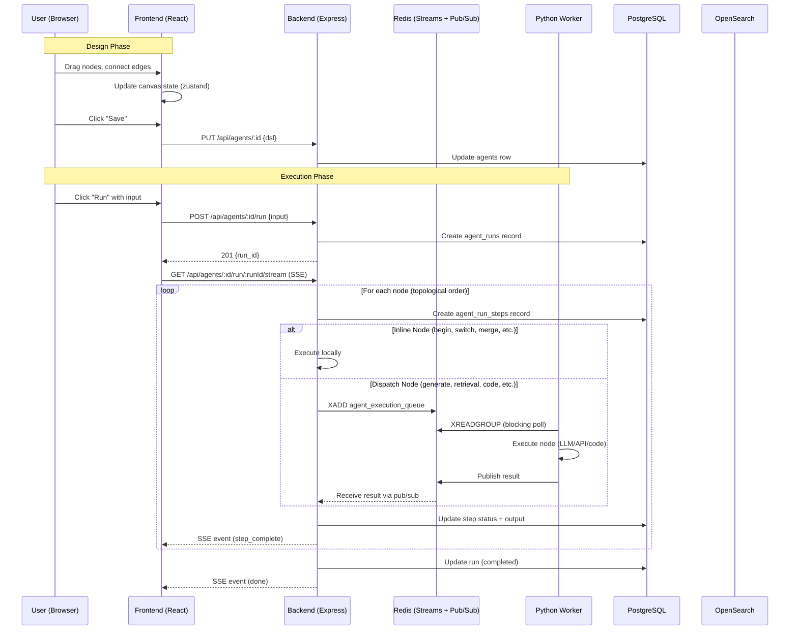
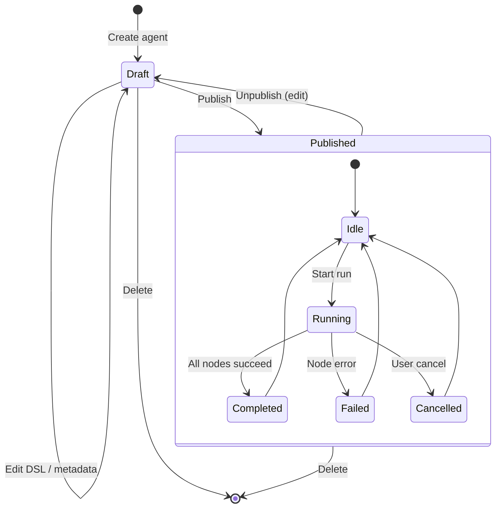
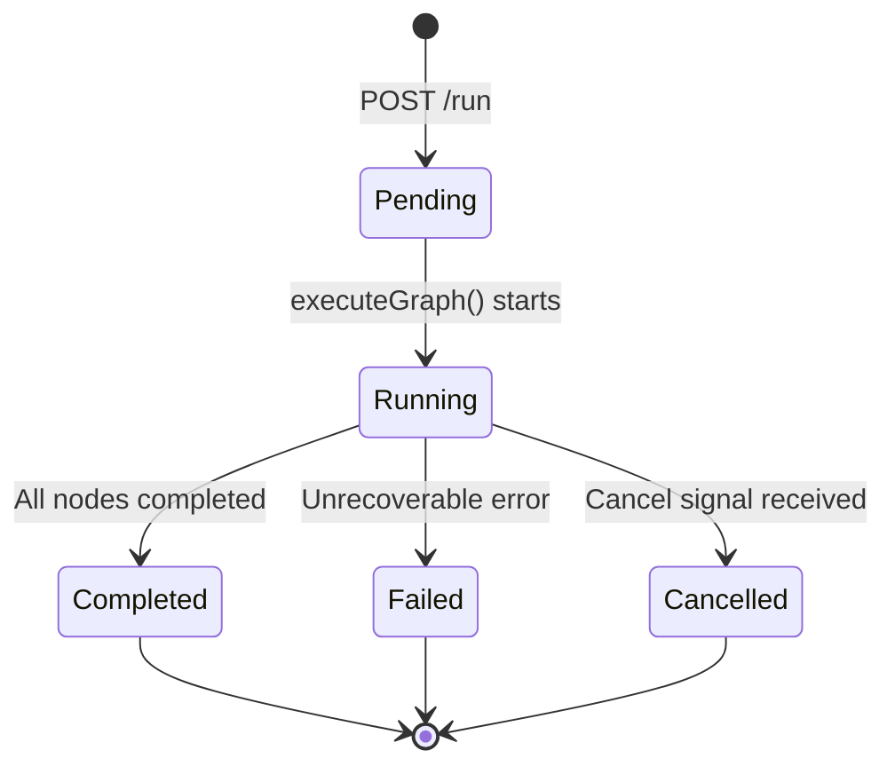
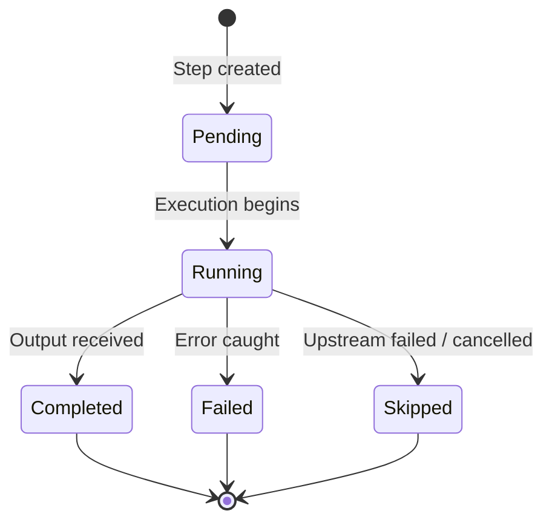
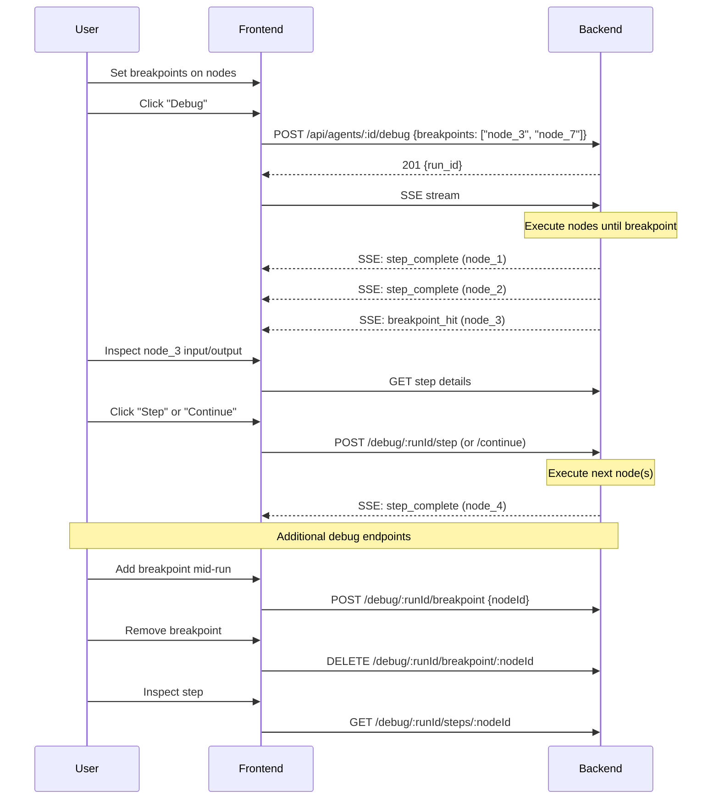

# Agent System: Detail Design Overview

## Architecture Summary

The Agent system is a visual workflow builder and execution engine comprising three layers:

1. **Frontend Canvas** — React Flow-based drag-and-drop editor with the current built-in operator set defined in the agent feature type layer
2. **Backend Orchestrator** — Graph traversal engine with topological sort and dual execution paths
3. **Python Worker** — Redis Streams consumer executing LLM, retrieval, and tool operations

## Component Interaction



## Key Design Decisions

### D-01: Version-as-Row Pattern

**Decision**: Store agent versions as rows in the same `agents` table rather than a separate `agent_versions` table.

**Rationale**:
- Single table schema simplifies queries
- Immutable snapshots (version rows never modified)
- Efficient pagination (filter `WHERE parent_id IS NULL` for root agents)
- No foreign key complexity between tables

**Structure**:
```
parent_id = NULL, version_number = 0   → Root agent (current working copy)
parent_id = root, version_number = 1   → Snapshot v1
parent_id = root, version_number = 2   → Snapshot v2
```

### D-02: Dual Execution Path (Inline vs Dispatch)

**Decision**: Classify nodes as inline (Node.js) or dispatch (Python) rather than sending all nodes to the worker.

**Rationale**:
- Inline nodes (switch, merge, variables) are pure logic — no need for Redis round-trip
- Reduces latency for control flow operations by 10-50ms per node
- Python worker focuses on compute-heavy operations (LLM, retrieval, code sandbox)
- Kahn's algorithm ensures correct dependency ordering regardless of execution path

### D-03: Redis Streams for Worker Communication

**Decision**: Use Redis Streams (XADD/XREADGROUP) instead of Redis Lists (LPUSH/BRPOP).

**Rationale**:
- Consumer groups enable multiple worker instances to share the queue
- Automatic acknowledgment tracking (XACK) prevents message loss
- Message retention for debugging and replay
- Blocking XREADGROUP with timeout for graceful shutdown

### D-04: SSE over WebSocket for Run Streaming

**Decision**: Use Server-Sent Events (SSE) instead of WebSocket for streaming run output.

**Rationale**:
- Unidirectional data flow (server→client only) matches the use case
- Simpler error handling and automatic reconnection
- No need for bidirectional communication during runs
- Works through HTTP proxies without upgrade negotiation

### D-05: AES-256-CBC for Tool Credentials

**Decision**: Encrypt tool credentials at rest using AES-256-CBC.

**Rationale**:
- Credentials contain sensitive API keys and tokens
- Decrypted only at dispatch time (never returned to frontend)
- Per-credential IV prevents pattern analysis across stored values
- Standard encryption algorithm with broad library support

## State Machine: Agent Lifecycle



## State Machine: Run Lifecycle



## State Machine: Step Lifecycle



## Debug Mode Flow



## Trigger Types

### Manual Trigger (UI)

1. User enters input in canvas editor
2. Frontend: `POST /api/agents/:id/run` with `{ input: "..." }`
3. Backend creates run record, starts graph execution async
4. Frontend subscribes to SSE stream for real-time updates

### Webhook Trigger (External)

1. External system: `POST /agents/webhook/:agentId` with `{ input: "query" }`
2. No authentication — public endpoint with rate limiting (100/15min per IP)
3. Agent must be in `published` status
4. Returns `{ run_id }` for status polling

### Embed Widget Trigger (Public)

1. Host page embeds iframe with token
2. Widget loads agent config via embed API
3. User submits input → embed run endpoint
4. Output streamed back via SSE

## Error Handling

| Error Type | Handling |
|-----------|---------|
| Node execution failure | Step marked `failed`, run continues if `retry_on_failure` enabled |
| Python worker crash | Redis Streams retain unACKed messages for redelivery |
| LLM provider error | Retry with exponential backoff in Python worker |
| Timeout exceeded | Run marked `failed` with timeout error |
| Cancel request | Redis cancel signal checked before each node execution |
| Invalid DSL | Validation at run start, 400 error before execution begins |

## Key Files

| File | Purpose |
|------|---------|
| `be/src/modules/agents/services/agent-executor.service.ts` | Core graph orchestration engine (~900 lines) |
| `be/src/modules/agents/services/agent-redis.service.ts` | Redis Streams + pub/sub communication |
| `be/src/modules/agents/services/agent.service.ts` | CRUD, versioning, duplication |
| `advance-rag/rag/agent/agent_consumer.py` | Python worker task consumer |
| `advance-rag/rag/agent/node_executor.py` | Node dispatch table (~2000 lines) |
| `fe/src/features/agents/components/AgentCanvas.tsx` | React Flow canvas editor |
| `fe/src/features/agents/types/agent.types.ts` | Canonical DSL, operator, run, and template type definitions |
